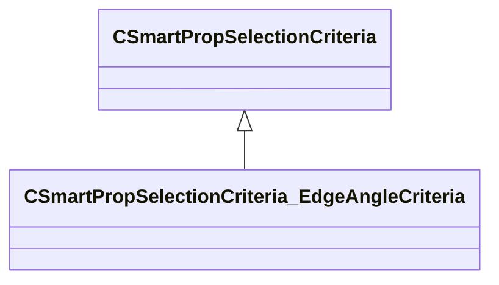

[Schemas](../../schemas.md) / [smartprops](../smartprops.md) / CSmartPropSelectionCriteria_EdgeAngleCriteria

# CSmartPropSelectionCriteria_EdgeAngleCriteria

> Source: **Build 25000182** · 2026-08-28 · `windows-x86_64` · schema `0.10.0`

**Kind:** class · **Size:** 264 bytes (`0x108`) · **Align:** 8 · **Module:** smartprops

**Inherits from:** [CSmartPropSelectionCriteria](../smartprops/CSmartPropSelectionCriteria.md)

**Metadata:** `MPropertyDescription`, `MPropertyFriendlyName Filter Edges by Angle`, `MVDataComponentValidGrandParents`

**Relationships:**

## Memory layout

4 fields (3 declared here, 1 inherited). Offsets are absolute from the object base.

| Offset | Field | Type | From | Annotations |
|--------|-------|------|------|-------------|
| `0x8` | `m_bEnabled` | CSmartPropAttributeBool | [CSmartPropSelectionCriteria](../smartprops/CSmartPropSelectionCriteria.md) | `MVDataEnableKey` |
| `0x48` | `m_flMinAngle` | CSmartPropAttributeFloat |  | `MPropertyDescription Angle at closed edge of face.` `MPropertyFriendlyName Min Angle` |
| `0x88` | `m_flMaxAngle` | CSmartPropAttributeFloat |  | `MPropertyDescription Angle at closed edge of face.` `MPropertyFriendlyName Max Angle` |
| `0xc8` | `m_bInvert` | CSmartPropAttributeBool |  | `MPropertyDescription When true, discard edges within the angle threshold.` `MPropertyFriendlyName Invert` |

KV3 class defaults

<pre>{
	&quot;_class&quot;: &quot;CSmartPropSelectionCriteria_EdgeAngleCriteria&quot;,
	&quot;m_bEnabled&quot;: true,
	&quot;m_flMinAngle&quot;: 0.000000,
	&quot;m_flMaxAngle&quot;: 0.000000,
	&quot;m_bInvert&quot;: false
}</pre>

