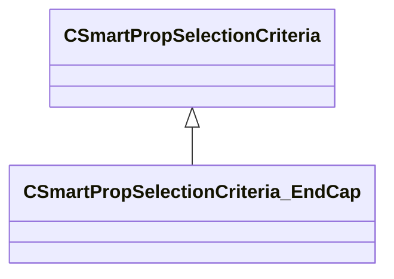

[Schemas](../../schemas.md) / [smartprops](../smartprops.md) / CSmartPropSelectionCriteria_EndCap

# CSmartPropSelectionCriteria_EndCap

**Kind:** class · **Size:** 200 bytes (`0xc8`) · **Align:** 8 · **Module:** smartprops

**Inherits from:** [CSmartPropSelectionCriteria](../smartprops/CSmartPropSelectionCriteria.md)

**Metadata:** `MPropertyDescription Specifies that this is a special part that should be used at the start or end of the line.`, `MPropertyFriendlyName End Cap Settings`, `MVDataComponentValidGrandParents`

**Relationships:**

## Memory layout

3 fields (2 declared here, 1 inherited). Offsets are absolute from the object base.

| Offset | Field | Type | From | Annotations |
|--------|-------|------|------|-------------|
| `0x8` | `m_bEnabled` | CSmartPropAttributeBool | [CSmartPropSelectionCriteria](../smartprops/CSmartPropSelectionCriteria.md) | `MVDataEnableKey` |
| `0x48` | `m_bStart` | CSmartPropAttributeBool |  | `MPropertyDescription Is this an element which should be placed at the start of the line.` |
| `0x88` | `m_bEnd` | CSmartPropAttributeBool |  | `MPropertyDescription Is this an element which should be placed at the end of the line.` |

KV3 class defaults

<pre>{
	&quot;_class&quot;: &quot;CSmartPropSelectionCriteria_EndCap&quot;,
	&quot;m_bEnabled&quot;: true,
	&quot;m_bStart&quot;: true,
	&quot;m_bEnd&quot;: true
}</pre>

