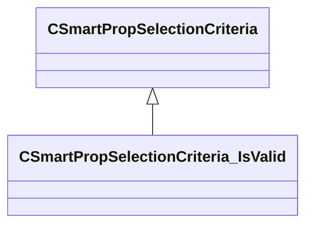

[Schemas](../../schemas.md) / [smartprops](../smartprops.md) / CSmartPropSelectionCriteria_IsValid

# CSmartPropSelectionCriteria_IsValid

> Source: **Build 25000182** · 2026-08-28 · `windows-x86_64` · schema `0.10.0`

**Kind:** class · **Size:** 80 bytes (`0x50`) · **Align:** 8 · **Module:** smartprops

**Inherits from:** [CSmartPropSelectionCriteria](../smartprops/CSmartPropSelectionCriteria.md)

**Metadata:** `MPropertyDescription Specifies if this element is currently valid choice.`, `MPropertyFriendlyName Is Valid`, `MVDataComponentValidGrandParents`

**Relationships:**

## Memory layout

2 fields (1 declared here, 1 inherited). Offsets are absolute from the object base.

| Offset | Field | Type | From | Annotations |
|--------|-------|------|------|-------------|
| `0x8` | `m_bEnabled` | CSmartPropAttributeBool | [CSmartPropSelectionCriteria](../smartprops/CSmartPropSelectionCriteria.md) | `MVDataEnableKey` |
| `0x48` | `m_Expression` | CUtlString |  | `MPropertyAttributeEditor SmartPropAttributeEditor(expression)` `MPropertyDescription Expression to evaluate to determine if this choice is currently valid.` `MPropertyFriendlyName Valid When` |

KV3 class defaults

<pre>{
	&quot;_class&quot;: &quot;CSmartPropSelectionCriteria_IsValid&quot;,
	&quot;m_bEnabled&quot;: true,
	&quot;m_Expression&quot;: &quot;&quot;
}</pre>

