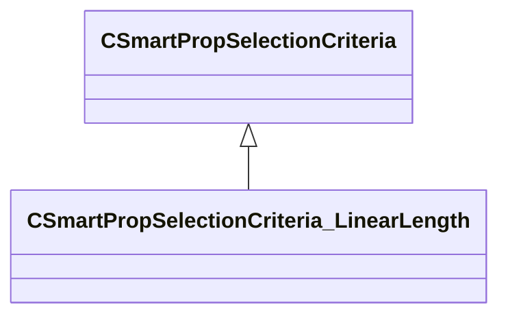

[Schemas](../../schemas.md) / [smartprops](../smartprops.md) / CSmartPropSelectionCriteria_LinearLength

# CSmartPropSelectionCriteria_LinearLength

> Source: **Build 25000182** · 2026-08-28 · `windows-x86_64` · schema `0.10.0`

**Kind:** class · **Size:** 328 bytes (`0x148`) · **Align:** 8 · **Module:** smartprops

**Inherits from:** [CSmartPropSelectionCriteria](../smartprops/CSmartPropSelectionCriteria.md)

**Metadata:** `MPropertyDescription Specifies the length of this element, used when fitting an element on to a line.`, `MPropertyFriendlyName Linear Length`, `MVDataComponentValidGrandParents`

**Relationships:**

## Memory layout

5 fields (4 declared here, 1 inherited). Offsets are absolute from the object base.

| Offset | Field | Type | From | Annotations |
|--------|-------|------|------|-------------|
| `0x8` | `m_bEnabled` | CSmartPropAttributeBool | [CSmartPropSelectionCriteria](../smartprops/CSmartPropSelectionCriteria.md) | `MVDataEnableKey` |
| `0x48` | `m_flLength` | CSmartPropAttributeFloat |  | `MPropertyDescription Specifies the length of the line that will be taken up if this element is selected.` |
| `0x88` | `m_bAllowScale` | CSmartPropAttributeBool |  | `MPropertyDescription Can this object be scaled. If enabled the minimum and maximum lengths must be set to specify the size range of allowable scale.` |
| `0xc8` | `m_flMinLength` | CSmartPropAttributeFloat |  | `MPropertyDescription Minimum allowable length for the object. Must be <= length. If length is 100 and minimum length is 20, then the object may be assigned a scale in the rage [ 0.2, 1.0 ].` `MPropertyFriendlyName Minimum length` `MPropertySuppressExpr m_bAllowScale == false` |
| `0x108` | `m_flMaxLength` | CSmartPropAttributeFloat |  | `MPropertyDescription Maximum allowable length for the object. Must be >= length. If length is 100 and maximum length is 160, then the object may be assigned a scale in the rage [ 1.0, 1.6 ].` `MPropertyFriendlyName Maximum length` `MPropertySuppressExpr m_bAllowScale == false` |

KV3 class defaults

<pre>{
	&quot;_class&quot;: &quot;CSmartPropSelectionCriteria_LinearLength&quot;,
	&quot;m_bEnabled&quot;: true,
	&quot;m_flLength&quot;: 1.000000,
	&quot;m_bAllowScale&quot;: false,
	&quot;m_flMinLength&quot;: 1.000000,
	&quot;m_flMaxLength&quot;: 1.000000
}</pre>

