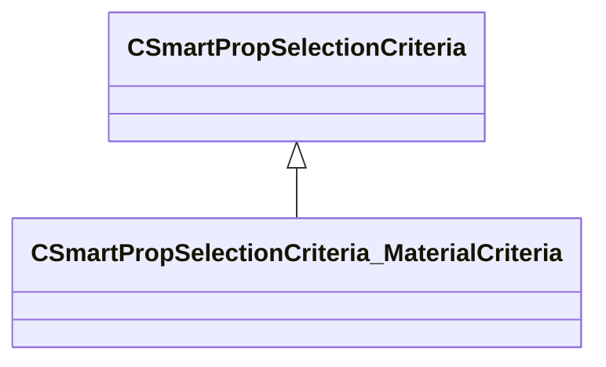

[Schemas](../../schemas.md) / [smartprops](../smartprops.md) / CSmartPropSelectionCriteria_MaterialCriteria

# CSmartPropSelectionCriteria_MaterialCriteria

**Kind:** class · **Size:** 200 bytes (`0xc8`) · **Align:** 8 · **Module:** smartprops

**Inherits from:** [CSmartPropSelectionCriteria](../smartprops/CSmartPropSelectionCriteria.md)

**Metadata:** `MPropertyDescription`, `MPropertyFriendlyName Filter Faces By Material`, `MVDataComponentValidGrandParents`

**Relationships:**

## Memory layout

3 fields (2 declared here, 1 inherited). Offsets are absolute from the object base.

| Offset | Field | Type | From | Annotations |
|--------|-------|------|------|-------------|
| `0x8` | `m_bEnabled` | CSmartPropAttributeBool | [CSmartPropSelectionCriteria](../smartprops/CSmartPropSelectionCriteria.md) | `MVDataEnableKey` |
| `0x48` | `m_material` | CSmartPropAttributeMaterialName |  | `MPropertyDescription Target material name.` `MPropertyFriendlyName Material` |
| `0x88` | `m_bInvert` | CSmartPropAttributeBool |  | `MPropertyDescription When true, discard faces with matching material.` `MPropertyFriendlyName Invert` |

KV3 class defaults

<pre>{
	&quot;_class&quot;: &quot;CSmartPropSelectionCriteria_MaterialCriteria&quot;,
	&quot;m_bEnabled&quot;: true,
	&quot;m_material&quot;: &quot;&quot;,
	&quot;m_bInvert&quot;: false
}</pre>

