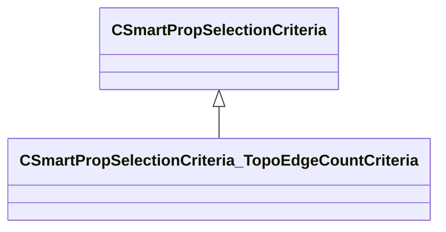

[Schemas](../../schemas.md) / [smartprops](../smartprops.md) / CSmartPropSelectionCriteria_TopoEdgeCountCriteria

# CSmartPropSelectionCriteria_TopoEdgeCountCriteria

> Source: **Build 25000182** · 2026-08-28 · `windows-x86_64` · schema `0.10.0`

**Kind:** class · **Size:** 264 bytes (`0x108`) · **Align:** 8 · **Module:** smartprops

**Inherits from:** [CSmartPropSelectionCriteria](../smartprops/CSmartPropSelectionCriteria.md)

**Metadata:** `MPropertyDescription`, `MPropertyFriendlyName Filter Faces By Open Edges`, `MVDataComponentValidGrandParents`

**Relationships:**

## Memory layout

4 fields (3 declared here, 1 inherited). Offsets are absolute from the object base.

| Offset | Field | Type | From | Annotations |
|--------|-------|------|------|-------------|
| `0x8` | `m_bEnabled` | CSmartPropAttributeBool | [CSmartPropSelectionCriteria](../smartprops/CSmartPropSelectionCriteria.md) | `MVDataEnableKey` |
| `0x48` | `m_nTargetOpenEdgeCount` | CSmartPropAttributeInt |  | `MPropertyDescription Iterate through faces with 'n' open edges (edges with only one neighboring face).` `MPropertyFriendlyName Edge Count` |
| `0x88` | `m_bInvert` | CSmartPropAttributeBool |  | `MPropertyDescription When true, we only consider closed edges (edges with exactly two neighboring faces).` `MPropertyFriendlyName Use Closed Edges` |
| `0xc8` | `m_bSharedVert` | CSmartPropAttributeBool |  | `MPropertyDescription When true, only consider open/closed edges that share a vert with another open/closed edge.` `MPropertyFriendlyName Enforce Shared Vert` |

KV3 class defaults

<pre>{
	&quot;_class&quot;: &quot;CSmartPropSelectionCriteria_TopoEdgeCountCriteria&quot;,
	&quot;m_bEnabled&quot;: true,
	&quot;m_nTargetOpenEdgeCount&quot;: 0,
	&quot;m_bInvert&quot;: false,
	&quot;m_bSharedVert&quot;: false
}</pre>

