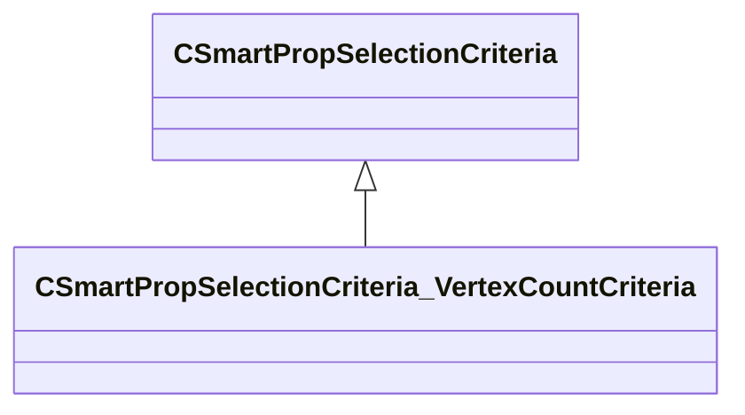

[Schemas](../../schemas.md) / [smartprops](../smartprops.md) / CSmartPropSelectionCriteria_VertexCountCriteria

# CSmartPropSelectionCriteria_VertexCountCriteria

**Kind:** class · **Size:** 136 bytes (`0x88`) · **Align:** 8 · **Module:** smartprops

**Inherits from:** [CSmartPropSelectionCriteria](../smartprops/CSmartPropSelectionCriteria.md)

**Metadata:** `MPropertyDescription`, `MPropertyFriendlyName Filter Faces By Vertex Count`, `MVDataComponentValidGrandParents`

**Relationships:**

## Memory layout

2 fields (1 declared here, 1 inherited). Offsets are absolute from the object base.

| Offset | Field | Type | From | Annotations |
|--------|-------|------|------|-------------|
| `0x8` | `m_bEnabled` | CSmartPropAttributeBool | [CSmartPropSelectionCriteria](../smartprops/CSmartPropSelectionCriteria.md) | `MVDataEnableKey` |
| `0x48` | `m_nTargetVertexCount` | CSmartPropAttributeInt |  | `MPropertyDescription Iterate through faces with target vertex count.` `MPropertyFriendlyName Target Vertex Count` |

KV3 class defaults

<pre>{
	&quot;_class&quot;: &quot;CSmartPropSelectionCriteria_VertexCountCriteria&quot;,
	&quot;m_bEnabled&quot;: true,
	&quot;m_nTargetVertexCount&quot;: 0
}</pre>

