[Schemas](../../schemas.md) / [smartprops](../smartprops.md) / CSmartPropTransformOperation

# CSmartPropTransformOperation

> Source: **Build 25000182** · 2026-08-28 · `windows-x86_64` · schema `0.10.0`

**Kind:** class · **Size:** 80 bytes (`0x50`) · **Align:** n/a (unspecified) · **Module:** smartprops

**Inherits from:** [CSmartPropOperation](../smartprops/CSmartPropOperation.md)

**Derived by:** [CSmartPropOperation_CreateLocator](../smartprops/CSmartPropOperation_CreateLocator.md), [CSmartPropOperation_CreateRotator](../smartprops/CSmartPropOperation_CreateRotator.md), [CSmartPropOperation_CreateSizer](../smartprops/CSmartPropOperation_CreateSizer.md), [CSmartPropOperation_RandomOffset](../smartprops/CSmartPropOperation_RandomOffset.md), [CSmartPropOperation_RandomRotation](../smartprops/CSmartPropOperation_RandomRotation.md), [CSmartPropOperation_RandomScale](../smartprops/CSmartPropOperation_RandomScale.md), [CSmartPropOperation_ResetRotation](../smartprops/CSmartPropOperation_ResetRotation.md), [CSmartPropOperation_ResetScale](../smartprops/CSmartPropOperation_ResetScale.md), [CSmartPropOperation_RigidDeformation](../smartprops/CSmartPropOperation_RigidDeformation.md), [CSmartPropOperation_Rotate](../smartprops/CSmartPropOperation_Rotate.md), [CSmartPropOperation_RotateTowards](../smartprops/CSmartPropOperation_RotateTowards.md), [CSmartPropOperation_Scale](../smartprops/CSmartPropOperation_Scale.md), [CSmartPropOperation_SetOrientation](../smartprops/CSmartPropOperation_SetOrientation.md), [CSmartPropOperation_SetPosition](../smartprops/CSmartPropOperation_SetPosition.md), [CSmartPropOperation_Trace](../smartprops/CSmartPropOperation_Trace.md), [CSmartPropOperation_Translate](../smartprops/CSmartPropOperation_Translate.md)

**Metadata:** `MVDataNodeTintColor`

**Relationships:**

```mermaid
classDiagram
    CSmartPropOperation <|-- CSmartPropTransformOperation
    CSmartPropModifier <|-- CSmartPropOperation
    CSmartPropTransformOperation <|-- CSmartPropOperation_CreateLocator
    CSmartPropTransformOperation <|-- CSmartPropOperation_CreateRotator
    CSmartPropTransformOperation <|-- CSmartPropOperation_CreateSizer
    CSmartPropTransformOperation <|-- CSmartPropOperation_RandomOffset
    CSmartPropTransformOperation <|-- CSmartPropOperation_RandomRotation
    CSmartPropTransformOperation <|-- CSmartPropOperation_RandomScale
    CSmartPropTransformOperation <|-- CSmartPropOperation_ResetRotation
    CSmartPropTransformOperation <|-- CSmartPropOperation_ResetScale
    CSmartPropTransformOperation <|-- CSmartPropOperation_RigidDeformation
    CSmartPropTransformOperation <|-- CSmartPropOperation_Rotate
    CSmartPropTransformOperation <|-- CSmartPropOperation_RotateTowards
    CSmartPropTransformOperation <|-- CSmartPropOperation_Scale
    CSmartPropTransformOperation <|-- CSmartPropOperation_SetOrientation
    CSmartPropTransformOperation <|-- CSmartPropOperation_SetPosition
    CSmartPropTransformOperation <|-- CSmartPropOperation_Trace
    CSmartPropTransformOperation <|-- CSmartPropOperation_Translate
```

## Memory layout

1 field (0 declared here, 1 inherited). Offsets are absolute from the object base.

| Offset | Field | Type | From | Annotations |
|--------|-------|------|------|-------------|
| `0x8` | `m_bEnabled` | CSmartPropAttributeBool | [CSmartPropModifier](../smartprops/CSmartPropModifier.md) | `MVDataEnableKey` |
