[Schemas](../../schemas.md) / [smartprops](../smartprops.md) / CSmartPropVariable

# CSmartPropVariable

> Source: **Build 25000182** · 2026-08-28 · `windows-x86_64` · schema `0.10.0`

**Kind:** class · **Size:** 56 bytes (`0x38`) · **Align:** n/a (unspecified) · **Module:** smartprops

**Inherits from:** [CSmartPropParameter](../smartprops/CSmartPropParameter.md)

**Derived by:** [CSmartPropVariable_Angles](../smartprops/CSmartPropVariable_Angles.md), [CSmartPropVariable_ApplyColorMode](../smartprops/CSmartPropVariable_ApplyColorMode.md), [CSmartPropVariable_Bool](../smartprops/CSmartPropVariable_Bool.md), [CSmartPropVariable_ChoiceSelectionMode](../smartprops/CSmartPropVariable_ChoiceSelectionMode.md), [CSmartPropVariable_Color](../smartprops/CSmartPropVariable_Color.md), [CSmartPropVariable_ColorSelectionMode](../smartprops/CSmartPropVariable_ColorSelectionMode.md), [CSmartPropVariable_CoordinateSpace](../smartprops/CSmartPropVariable_CoordinateSpace.md), [CSmartPropVariable_DirectionVector](../smartprops/CSmartPropVariable_DirectionVector.md), [CSmartPropVariable_DistributionMode](../smartprops/CSmartPropVariable_DistributionMode.md), [CSmartPropVariable_Float](../smartprops/CSmartPropVariable_Float.md), [CSmartPropVariable_GridOriginMode](../smartprops/CSmartPropVariable_GridOriginMode.md), [CSmartPropVariable_GridPlacementMode](../smartprops/CSmartPropVariable_GridPlacementMode.md), [CSmartPropVariable_Int](../smartprops/CSmartPropVariable_Int.md), [CSmartPropVariable_Material](../smartprops/CSmartPropVariable_Material.md), [CSmartPropVariable_MaterialGroup](../smartprops/CSmartPropVariable_MaterialGroup.md), [CSmartPropVariable_Model](../smartprops/CSmartPropVariable_Model.md), [CSmartPropVariable_OrientationMode](../smartprops/CSmartPropVariable_OrientationMode.md), [CSmartPropVariable_PathPositions](../smartprops/CSmartPropVariable_PathPositions.md), [CSmartPropVariable_PickMode](../smartprops/CSmartPropVariable_PickMode.md), [CSmartPropVariable_RadiusPlacementMode](../smartprops/CSmartPropVariable_RadiusPlacementMode.md), [CSmartPropVariable_ScaleMode](../smartprops/CSmartPropVariable_ScaleMode.md), [CSmartPropVariable_String](../smartprops/CSmartPropVariable_String.md), [CSmartPropVariable_SurfaceProperty](../smartprops/CSmartPropVariable_SurfaceProperty.md), [CSmartPropVariable_TraceNoHit](../smartprops/CSmartPropVariable_TraceNoHit.md), [CSmartPropVariable_Vector2D](../smartprops/CSmartPropVariable_Vector2D.md), [CSmartPropVariable_Vector3D](../smartprops/CSmartPropVariable_Vector3D.md), [CSmartPropVariable_Vector4D](../smartprops/CSmartPropVariable_Vector4D.md)

**Metadata:** `MVDataAnonymousNode`, `MVDataNodeType 1`, `MVDataOutlinerNameExpr m_VariableName`, `MVDataRoot`

**Relationships:**

```mermaid
classDiagram
    CSmartPropParameter <|-- CSmartPropVariable
    CSmartPropVariable <|-- CSmartPropVariable_Angles
    CSmartPropVariable <|-- CSmartPropVariable_ApplyColorMode
    CSmartPropVariable <|-- CSmartPropVariable_Bool
    CSmartPropVariable <|-- CSmartPropVariable_ChoiceSelectionMode
    CSmartPropVariable <|-- CSmartPropVariable_Color
    CSmartPropVariable <|-- CSmartPropVariable_ColorSelectionMode
    CSmartPropVariable <|-- CSmartPropVariable_CoordinateSpace
    CSmartPropVariable <|-- CSmartPropVariable_DirectionVector
    CSmartPropVariable <|-- CSmartPropVariable_DistributionMode
    CSmartPropVariable <|-- CSmartPropVariable_Float
    CSmartPropVariable <|-- CSmartPropVariable_GridOriginMode
    CSmartPropVariable <|-- CSmartPropVariable_GridPlacementMode
    CSmartPropVariable <|-- CSmartPropVariable_Int
    CSmartPropVariable <|-- CSmartPropVariable_Material
    CSmartPropVariable <|-- CSmartPropVariable_MaterialGroup
    CSmartPropVariable <|-- CSmartPropVariable_Model
    CSmartPropVariable <|-- CSmartPropVariable_OrientationMode
    CSmartPropVariable <|-- CSmartPropVariable_PathPositions
    CSmartPropVariable <|-- CSmartPropVariable_PickMode
    CSmartPropVariable <|-- CSmartPropVariable_RadiusPlacementMode
    CSmartPropVariable <|-- CSmartPropVariable_ScaleMode
    CSmartPropVariable <|-- CSmartPropVariable_String
    CSmartPropVariable <|-- CSmartPropVariable_SurfaceProperty
    CSmartPropVariable <|-- CSmartPropVariable_TraceNoHit
    CSmartPropVariable <|-- CSmartPropVariable_Vector2D
    CSmartPropVariable <|-- CSmartPropVariable_Vector3D
    CSmartPropVariable <|-- CSmartPropVariable_Vector4D
```

## Memory layout

6 fields (5 declared here, 1 inherited). Offsets are absolute from the object base.

| Offset | Field | Type | From | Annotations |
|--------|-------|------|------|-------------|
| `0x8` | `m_nElementID` | int32 | [CSmartPropParameter](../smartprops/CSmartPropParameter.md) | `MPropertySuppressField` `MVDataUniqueMonotonicInt _editor/next_element_id` |
| `0x10` | `m_VariableName` | CUtlString |  |  |
| `0x18` | `m_bExposeAsParameter` | bool |  | `MPropertyDescription If enabled, this value will be exposed as a parameter that can be set on the smart prop object in hammer.` `MPropertySortPriority -1` |
| `0x20` | `m_DisplayName` | CUtlString |  | `MPropertyDescription Name of the parameter which will appear as a property in the Hammer object properties ui when selecting an object using this smart prop.` `MPropertyFriendlyName Parameter Display Name` `MPropertyReadonlyExpr m_bExposeAsParameter == false` `MPropertySortPriority -1` |
| `0x28` | `m_HideExpression` | CUtlString |  | `MPropertyDescription Expression to evaluate to determine if this parameter should be hidden. Can be used to hide this parameter based on the state of other parameters.` `MPropertyReadonlyExpr m_bExposeAsParameter == false` `MPropertySortPriority -1` |
| `0x30` | `m_ReadOnlyExpression` | CUtlString |  | `MPropertyDescription Expression to evaluate to detemrine if this parameter should be read-only. Can be used to make this parameter read-only based on the state of other parameters.` `MPropertyReadonlyExpr m_bExposeAsParameter == false` `MPropertySortPriority -1` |
