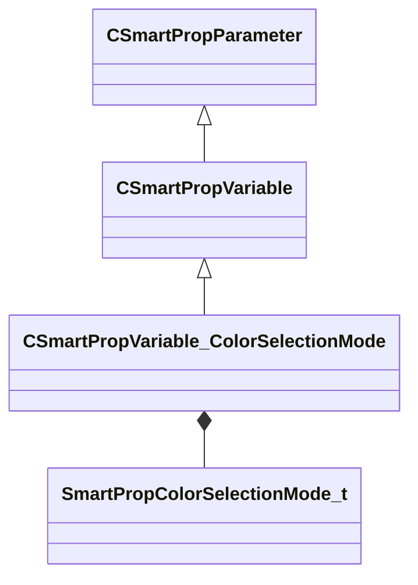

[Schemas](../../schemas.md) / [smartprops](../smartprops.md) / CSmartPropVariable_ColorSelectionMode

# CSmartPropVariable_ColorSelectionMode

**Kind:** class · **Size:** 64 bytes (`0x40`) · **Align:** 8 · **Module:** smartprops

**Inherits from:** [CSmartPropVariable](../smartprops/CSmartPropVariable.md)

**Metadata:** `MPropertyDescription Specifies the method by which a color selection is to be made.`, `MPropertyFriendlyName Color Selection mode`, `MVDataClassGroup Enumerator Types`

**Relationships:**

## Memory layout

7 fields (1 declared here, 6 inherited). Offsets are absolute from the object base.

| Offset | Field | Type | From | Annotations |
|--------|-------|------|------|-------------|
| `0x8` | `m_nElementID` | int32 | [CSmartPropParameter](../smartprops/CSmartPropParameter.md) | `MPropertySuppressField` `MVDataUniqueMonotonicInt _editor/next_element_id` |
| `0x10` | `m_VariableName` | CUtlString | [CSmartPropVariable](../smartprops/CSmartPropVariable.md) |  |
| `0x18` | `m_bExposeAsParameter` | bool | [CSmartPropVariable](../smartprops/CSmartPropVariable.md) | `MPropertyDescription If enabled, this value will be exposed as a parameter that can be set on the smart prop object in hammer.` `MPropertySortPriority -1` |
| `0x20` | `m_DisplayName` | CUtlString | [CSmartPropVariable](../smartprops/CSmartPropVariable.md) | `MPropertyDescription Name of the parameter which will appear as a property in the Hammer object properties ui when selecting an object using this smart prop.` `MPropertyFriendlyName Parameter Display Name` `MPropertyReadonlyExpr m_bExposeAsParameter == false` `MPropertySortPriority -1` |
| `0x28` | `m_HideExpression` | CUtlString | [CSmartPropVariable](../smartprops/CSmartPropVariable.md) | `MPropertyDescription Expression to evaluate to determine if this parameter should be hidden. Can be used to hide this parameter based on the state of other parameters.` `MPropertyReadonlyExpr m_bExposeAsParameter == false` `MPropertySortPriority -1` |
| `0x30` | `m_ReadOnlyExpression` | CUtlString | [CSmartPropVariable](../smartprops/CSmartPropVariable.md) | `MPropertyDescription Expression to evaluate to detemrine if this parameter should be read-only. Can be used to make this parameter read-only based on the state of other parameters.` `MPropertyReadonlyExpr m_bExposeAsParameter == false` `MPropertySortPriority -1` |
| `0x38` | `m_DefaultValue` | [SmartPropColorSelectionMode_t](../smartprops/SmartPropColorSelectionMode_t.md) |  |  |

KV3 class defaults

<pre>{
	&quot;_class&quot;: &quot;CSmartPropVariable_ColorSelectionMode&quot;,
	&quot;m_nElementID&quot;: -1,
	&quot;m_VariableName&quot;: &quot;&quot;,
	&quot;m_bExposeAsParameter&quot;: false,
	&quot;m_DisplayName&quot;: &quot;&quot;,
	&quot;m_HideExpression&quot;: &quot;&quot;,
	&quot;m_ReadOnlyExpression&quot;: &quot;&quot;,
	&quot;m_DefaultValue&quot;: &quot;SPECIFIC_COLOR&quot;
}</pre>

