# Module: sounddoc_lib

[📊 View UML Diagram](../diagrams/sounddoc_lib.md)

| Name | Kind | Bases | Fields |
|------|------|-------|--------|
| [CEffectsPreviewList](#ceffectspreviewlist) | class |  | 3 |
| [CFilterStage](#cfilterstage) | class |  | 6 |
| [CGraphEditorState](#cgrapheditorstate) | class |  | 1 |
| [CGraphPreviewList](#cgraphpreviewlist) | class |  | 2 |
| [CMixAmp](#cmixamp) | class | CMixPropertyBase | 1 |
| [CMixAudioMeter](#cmixaudiometer) | class | CMixPropertyBase | 4 |
| [CMixAutoFilter](#cmixautofilter) | class | CMixPropertyBase | 1 |
| [CMixBlendAudio](#cmixblendaudio) | class | CMixPropertyBase | 1 |
| [CMixBlendVsndsToImpulseResponse](#cmixblendvsndstoimpulseresponse) | class | CMixPropertyBase | 16 |
| [CMixBoxverb](#cmixboxverb) | class | CMixPropertyBase | 16 |
| [CMixBoxverb2](#cmixboxverb2) | class | CMixPropertyBase | 17 |
| [CMixControlAutomatic](#cmixcontrolautomatic) | class | CMixPropertyBase | 0 |
| [CMixControlCrossfade](#cmixcontrolcrossfade) | class | CMixPropertyBase | 2 |
| [CMixControlCurve](#cmixcontrolcurve) | class | CMixPropertyBase | 5 |
| [CMixControlInput](#cmixcontrolinput) | class | CMixPropertyBase | 4 |
| [CMixControlInputArray](#cmixcontrolinputarray) | class | CMixPropertyBase | 1 |
| [CMixControlListener](#cmixcontrollistener) | class | CMixPropertyBase | 0 |
| [CMixControlMax](#cmixcontrolmax) | class | CMixPropertyBase | 0 |
| [CMixControlMeter](#cmixcontrolmeter) | class | CMixPropertyBase | 1 |
| [CMixControlOutput](#cmixcontroloutput) | class | CMixPropertyBase | 1 |
| [CMixControlRemap](#cmixcontrolremap) | class | CMixPropertyBase | 5 |
| [CMixControlStackInput](#cmixcontrolstackinput) | class | CMixPropertyBase | 3 |
| [CMixControlTransientInput](#cmixcontroltransientinput) | class | CMixPropertyBase | 0 |
| [CMixConvolution](#cmixconvolution) | class | CMixPropertyBase | 1 |
| [CMixDelay](#cmixdelay) | class | CMixPropertyBase | 11 |
| [CMixDelayImpulseResponse](#cmixdelayimpulseresponse) | class | CMixPropertyBase | 1 |
| [CMixDiffusor](#cmixdiffusor) | class | CMixPropertyBase | 4 |
| [CMixDualCompressor](#cmixdualcompressor) | class | CMixPropertyBase | 2 |
| [CMixDynamics](#cmixdynamics) | class | CMixPropertyBase | 14 |
| [CMixDynamics3Band](#cmixdynamics3band) | class | CMixPropertyBase | 12 |
| [CMixDynamicsCompressor](#cmixdynamicscompressor) | class | CMixPropertyBase | 4 |
| [CMixEQ8](#cmixeq8) | class | CMixPropertyBase | 2 |
| [CMixEffectChain](#cmixeffectchain) | class | CMixPropertyBase | 3 |
| [CMixEffectName](#cmixeffectname) | class | CMixPropertyBase | 1 |
| [CMixEnvelope](#cmixenvelope) | class | CMixPropertyBase | 3 |
| [CMixEnvelopeTrigger](#cmixenvelopetrigger) | class | CMixPropertyBase | 5 |
| [CMixFilter](#cmixfilter) | class | CMixPropertyBase | 6 |
| [CMixFlanger](#cmixflanger) | class | CMixPropertyBase | 9 |
| [CMixFreeverb](#cmixfreeverb) | class | CMixPropertyBase | 4 |
| [CMixGroupBox](#cmixgroupbox) | class | CMixPropertyBase | 2 |
| [CMixImpulseResponseInput](#cmiximpulseresponseinput) | class | CMixPropertyBase | 1 |
| [CMixModDelay](#cmixmoddelay) | class | CMixPropertyBase | 12 |
| [CMixOsc](#cmixosc) | class | CMixPropertyBase | 1 |
| [CMixOutput](#cmixoutput) | class | CMixPropertyBase | 3 |
| [CMixPanner](#cmixpanner) | class | CMixPropertyBase | 2 |
| [CMixPitchShift](#cmixpitchshift) | class | CMixPropertyBase | 5 |
| [CMixPlateverb](#cmixplateverb) | class | CMixPropertyBase | 7 |
| [CMixPresetDSP](#cmixpresetdsp) | class | CMixPropertyBase | 3 |
| [CMixPropertyBase](#cmixpropertybase) | class |  | 5 |
| [CMixRemapVsndToImpulseResponse](#cmixremapvsndtoimpulseresponse) | class | CMixPropertyBase | 1 |
| [CMixShaper](#cmixshaper) | class | CMixPropertyBase | 1 |
| [CMixSplitter](#cmixsplitter) | class | CMixPropertyBase | 8 |
| [CMixSplitterBlend](#cmixsplitterblend) | class | CMixPropertyBase | 1 |
| [CMixSteamAudioDirect](#cmixsteamaudiodirect) | class | CMixPropertyBase | 12 |
| [CMixSteamAudioHybridReverb](#cmixsteamaudiohybridreverb) | class | CMixPropertyBase | 4 |
| [CMixSteamAudioPathing](#cmixsteamaudiopathing) | class | CMixPropertyBase | 4 |
| [CMixSteamAudioSource](#cmixsteamaudiosource) | class | CMixPropertyBase | 4 |
| [CMixStereoDelay](#cmixstereodelay) | class | CMixPropertyBase | 2 |
| [CMixSubgraph](#cmixsubgraph) | class | CMixPropertyBase | 2 |
| [CMixSubgraphSwitch](#cmixsubgraphswitch) | class | CMixPropertyBase | 7 |
| [CMixSum](#cmixsum) | class | CMixPropertyBase | 9 |
| [CMixTrack](#cmixtrack) | class | CMixPropertyBase | 7 |
| [CMixUtility](#cmixutility) | class | CMixPropertyBase | 1 |
| [CMixVocoder](#cmixvocoder) | class | CMixPropertyBase | 10 |
| [CMixVsndName](#cmixvsndname) | class | CMixPropertyBase | 1 |
| [CPreviewEntry](#cpreviewentry) | class |  | 3 |
| [CPreviewList](#cpreviewlist) | class |  | 2 |
| [CSelectableSubgraph](#cselectablesubgraph) | class |  | 2 |
| [CVMixEditorEdge](#cvmixeditoredge) | class |  | 2 |
| [CVMixEditorNode](#cvmixeditornode) | class |  | 6 |
| [CVMixToolEditorData](#cvmixtooleditordata) | class |  | 2 |
| [CVMixToolGraph](#cvmixtoolgraph) | class |  | 4 |
| [CVMixToolGraphEntry](#cvmixtoolgraphentry) | class |  | 3 |
| [SteamAudioHRTFInterpolationType_t](#steamaudiohrtfinterpolationtype_t) | enum |  | 2 |
| [SteamAudioOcclusionModeType_t](#steamaudioocclusionmodetype_t) | enum |  | 4 |

---

### CEffectsPreviewList

**Metadata:** `MGetKV3ClassDefaults {
	"m_previewGraphInput": "",
	"m_flMix": 1.000000,
	"m_previewList":
	{
		"m_sounds":
		[
		],
		"m_bPreviewInGame": false
	}
}`

**Relationships:**

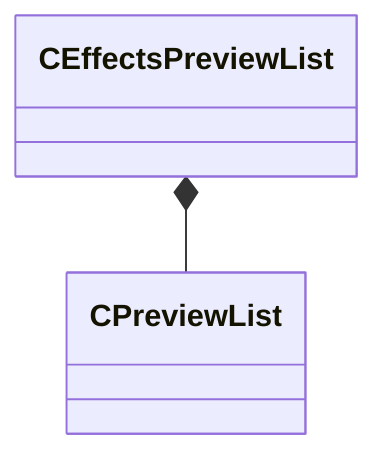

**Fields:**

| Name | Type | Annotations |
|------|------|-------------|
| `m_previewGraphInput` | CUtlString |  |
| `m_flMix` | float32 |  |
| `m_previewList` | [CPreviewList](../schemas/sounddoc_lib.md#cpreviewlist) |  |

### CFilterStage

**Metadata:** `MGetKV3ClassDefaults {
	"m_filterType": "FILTER_LOWPASS",
	"m_flFrequency": 11025.000000,
	"m_flQ": 0.707000,
	"m_fldbGain": 1.000000,
	"m_nFilterSlope": "FILTER_SLOPE_12dB",
	"m_bEnable": true
}`

**Relationships:**

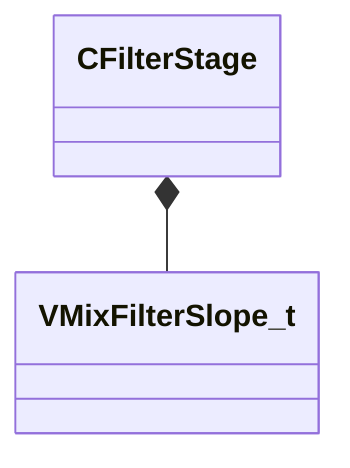

**Fields:**

| Name | Type | Annotations |
|------|------|-------------|
| `m_filterType` | CUtlString | `MPropertyFriendlyName "Filter Type"` `MPropertyAttributeChoiceName "filter_type"` |
| `m_flFrequency` | float32 | `MPropertyFriendlyName "Center Frequency (Hz)"` `MPropertyAttributeRange "biased 20 22000"` |
| `m_flQ` | float32 | `MPropertyFriendlyName "Q"` `MPropertyAttributeRange "0.1 12"` |
| `m_fldbGain` | float32 | `MPropertyFriendlyName "Gain (dB)"` `MPropertyAttributeRange "-24 24"` |
| `m_nFilterSlope` | [VMixFilterSlope_t](../schemas/soundsystem_lowlevel.md#vmixfilterslope_t) | `MPropertyFriendlyName "Slope"` |
| `m_bEnable` | bool | `MPropertyFriendlyName "Enabled"` |

### CGraphEditorState

**Metadata:** `MGetKV3ClassDefaults {
	"m_viewConfig":
	{
		"XAxis":
		{
			"pos": 0.000000,
			"scrollpos": 0,
			"min": 0.000000,
			"max": 1.000000,
			"scale": 1.000000
		},
		"YAxis":
		{
			"pos": 0.000000,
			"scrollpos": 0,
			"min": 0.000000,
			"max": 1.000000,
			"scale": 1.000000
		}
	}
}`

**Fields:**

| Name | Type | Annotations |
|------|------|-------------|
| `m_viewConfig` | CGraphEditorViewConfig |  |

### CGraphPreviewList

**Metadata:** `MGetKV3ClassDefaults {
	"m_flVolume": 1.000000,
	"m_previewList":
	{
		"m_sounds":
		[
		],
		"m_bPreviewInGame": false
	}
}`

**Relationships:**

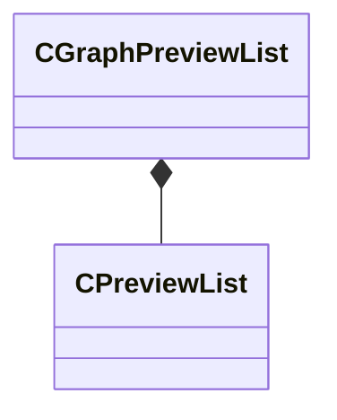

**Fields:**

| Name | Type | Annotations |
|------|------|-------------|
| `m_flVolume` | float32 |  |
| `m_previewList` | [CPreviewList](../schemas/sounddoc_lib.md#cpreviewlist) |  |

### CMixAmp

**Inherits from:** [CMixPropertyBase](sounddoc_lib.md#cmixpropertybase)

**Metadata:** `MGetKV3ClassDefaults {
	"_class": "CMixAmp",
	"m_name": "",
	"m_Comment": "",
	"m_bActive": true,
	"m_bSolo": false,
	"m_bEditProperties": false,
	"m_flVolume": 1.000000
}`, `MPropertyFriendlyName "Mix Amp"`, `MPropertyDescription "Adjust the volume of an audio track."`

**Relationships:**

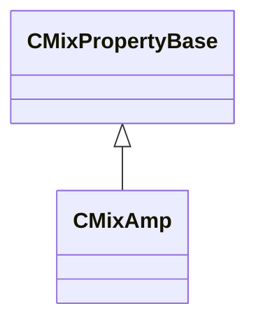

**Fields:**

| Name | Type | Annotations |
|------|------|-------------|
| `m_flVolume` | float32 | `MPropertyDescription "Default volume scale (0-1) if not automated by connecting the volume input."` |

### CMixAudioMeter

**Inherits from:** [CMixPropertyBase](sounddoc_lib.md#cmixpropertybase)

**Metadata:** `MGetKV3ClassDefaults {
	"_class": "CMixAudioMeter",
	"m_name": "",
	"m_Comment": "",
	"m_bActive": true,
	"m_bSolo": false,
	"m_bEditProperties": true,
	"m_flLeftLevel": 0.000000,
	"m_flLeftPeak": 0.000000,
	"m_flRightLevel": 0.000000,
	"m_flRightPeak": 0.000000
}`, `MPropertyFriendlyName "VMix Audio Meter Node"`, `MPropertyDescription "This lets you meter an audio signal in vmixtool."`

**Relationships:**


**Fields:**

| Name | Type | Annotations |
|------|------|-------------|
| `m_flLeftLevel` | float32 |  |
| `m_flLeftPeak` | float32 |  |
| `m_flRightLevel` | float32 |  |
| `m_flRightPeak` | float32 |  |

### CMixAutoFilter

**Inherits from:** [CMixPropertyBase](sounddoc_lib.md#cmixpropertybase)

**Metadata:** `MGetKV3ClassDefaults {
	"_class": "CMixAutoFilter",
	"m_name": "",
	"m_Comment": "",
	"m_bActive": true,
	"m_bSolo": false,
	"m_bEditProperties": false,
	"m_desc":
	{
		"m_flEnvelopeAmount": 0.000000,
		"m_flAttackTimeMS": 5.000000,
		"m_flReleaseTimeMS": 200.000000,
		"m_filter":
		{
			"m_nFilterType": "FILTER_LOWPASS",
			"m_nFilterSlope": "FILTER_SLOPE_12dB",
			"m_bEnabled": true,
			"m_fldbGain": 0.000000,
			"m_flCutoffFreq": 1000.000000,
			"m_flQ": 0.707107
		},
		"m_flLFOAmount": 0.000000,
		"m_flLFORate": 0.000000,
		"m_flPhase": 0.000000,
		"m_nLFOShape": "LFO_SHAPE_SINE"
	}
}`, `MPropertyFriendlyName "VMix Auto Filter Node"`, `MPropertyDescription "A continuously variable filter that can be driven by a built-in envelope follower and/or LFO.  Stereo channels can be processed differently by adjusting the phase parameter."`

**Relationships:**

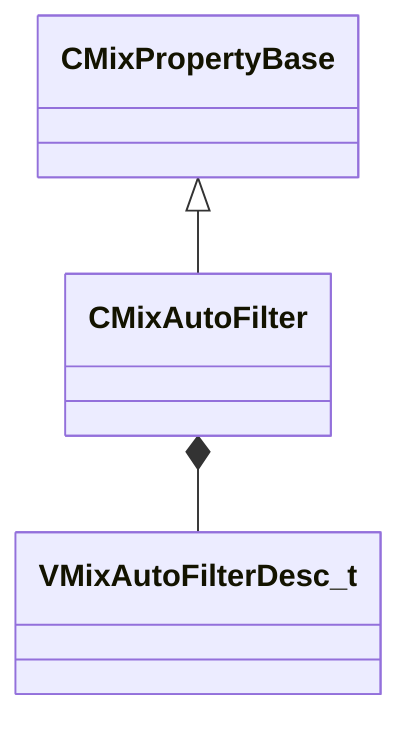

**Fields:**

| Name | Type | Annotations |
|------|------|-------------|
| `m_desc` | [VMixAutoFilterDesc_t](../schemas/soundsystem_lowlevel.md#vmixautofilterdesc_t) | `MPropertyAutoExpandSelf` |

### CMixBlendAudio

**Inherits from:** [CMixPropertyBase](sounddoc_lib.md#cmixpropertybase)

**Metadata:** `MGetKV3ClassDefaults {
	"_class": "CMixBlendAudio",
	"m_name": "",
	"m_Comment": "",
	"m_bActive": true,
	"m_bSolo": false,
	"m_bEditProperties": false,
	"m_flLockAmount": 0.000000
}`, `MPropertyFriendlyName "VMix Blend Audio Node"`, `MPropertyDescription "This node will do a pairwise blend through a set of audio signals.  It will blend through as many different signals as you connect.  A blend factor of 0.0 is 100% the first signal, and a blend factor of 1.0 is 100% the last signal."`

**Relationships:**

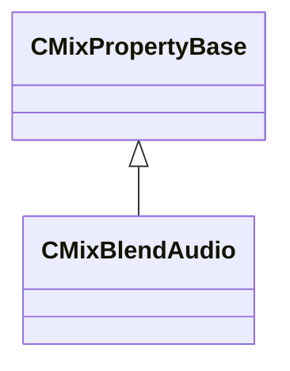

**Fields:**

| Name | Type | Annotations |
|------|------|-------------|
| `m_flLockAmount` | float32 | `MPropertyDescription "Lock to inputs.  This makes each input "sticky" instead of smoothly varying between each source it will stick to one for some range of the parameter space."` `MPropertyFriendlyName "Lock to input (0-1)"` |

### CMixBlendVsndsToImpulseResponse

**Inherits from:** [CMixPropertyBase](sounddoc_lib.md#cmixpropertybase)

**Metadata:** `MGetKV3ClassDefaults {
	"_class": "CMixBlendVsndsToImpulseResponse",
	"m_name": "",
	"m_Comment": "",
	"m_bActive": true,
	"m_bSolo": false,
	"m_bEditProperties": false,
	"m_flWeight0": 1.000000,
	"m_flWeight1": 1.000000,
	"m_flWeight2": 1.000000,
	"m_flWeight3": 1.000000,
	"m_flWeight4": 1.000000,
	"m_flWeight5": 1.000000,
	"m_flWeight6": 1.000000,
	"m_flWeight7": 1.000000,
	"m_flPreDelayMS0": 0.000000,
	"m_flPreDelayMS1": 0.000000,
	"m_flPreDelayMS2": 0.000000,
	"m_flPreDelayMS3": 0.000000,
	"m_flPreDelayMS4": 0.000000,
	"m_flPreDelayMS5": 0.000000,
	"m_flPreDelayMS6": 0.000000,
	"m_flPreDelayMS7": 0.000000
}`, `MPropertyFriendlyName "VMix Blend VSnds to Impulse Response Node"`, `MPropertyDescription "Blends up to 8 vsnds to an impulse response."`

**Relationships:**

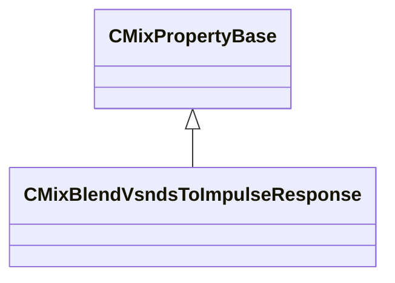

**Fields:**

| Name | Type | Annotations |
|------|------|-------------|
| `m_flWeight0` | float32 | `MPropertyFriendlyName "Weight:0"` |
| `m_flWeight1` | float32 | `MPropertyFriendlyName "Weight:1"` |
| `m_flWeight2` | float32 | `MPropertyFriendlyName "Weight:2"` |
| `m_flWeight3` | float32 | `MPropertyFriendlyName "Weight:3"` |
| `m_flWeight4` | float32 | `MPropertyFriendlyName "Weight:4"` |
| `m_flWeight5` | float32 | `MPropertyFriendlyName "Weight:5"` |
| `m_flWeight6` | float32 | `MPropertyFriendlyName "Weight:6"` |
| `m_flWeight7` | float32 | `MPropertyFriendlyName "Weight:7"` |
| `m_flPreDelayMS0` | float32 | `MPropertyFriendlyName "PreDelayMS:0"` |
| `m_flPreDelayMS1` | float32 | `MPropertyFriendlyName "PreDelayMS:1"` |
| `m_flPreDelayMS2` | float32 | `MPropertyFriendlyName "PreDelayMS:2"` |
| `m_flPreDelayMS3` | float32 | `MPropertyFriendlyName "PreDelayMS:3"` |
| `m_flPreDelayMS4` | float32 | `MPropertyFriendlyName "PreDelayMS:4"` |
| `m_flPreDelayMS5` | float32 | `MPropertyFriendlyName "PreDelayMS:5"` |
| `m_flPreDelayMS6` | float32 | `MPropertyFriendlyName "PreDelayMS:6"` |
| `m_flPreDelayMS7` | float32 | `MPropertyFriendlyName "PreDelayMS:7"` |

### CMixBoxverb

**Inherits from:** [CMixPropertyBase](sounddoc_lib.md#cmixpropertybase)

**Metadata:** `MGetKV3ClassDefaults {
	"_class": "CMixBoxverb",
	"m_name": "",
	"m_Comment": "",
	"m_bActive": true,
	"m_bSolo": false,
	"m_bEditProperties": false,
	"m_flSizeMax": 100.000000,
	"m_flSizeMin": 0.000000,
	"m_flComplexity": 4.000000,
	"m_flModDepth": 0.000000,
	"m_flModRate": 0.000000,
	"m_bParallel": false,
	"m_filterType":
	{
		"m_nFilterType": "FILTER_LOWPASS",
		"m_nFilterSlope": "FILTER_SLOPE_12dB",
		"m_bEnabled": true,
		"m_fldbGain": 0.000000,
		"m_flCutoffFreq": 1000.000000,
		"m_flQ": 0.707107
	},
	"m_flWidth": 20.000000,
	"m_flHeight": 23.000000,
	"m_flDepth": 27.000000,
	"m_flFeedbackScale": 0.150000,
	"m_flFeedbackWidth": 0.000000,
	"m_flFeedbackHeight": 0.000000,
	"m_flFeedbackDepth": 0.000000,
	"m_flOutputGain": 0.000000,
	"m_flTaps": 0.000000
}`, `MPropertyFriendlyName "Legacy VMix Shoebox Reverb Node"`, `MPropertyDescription "A simple reverb that approximates the reflections of a box-shaped room, copied from previous audio system."`

**Relationships:**

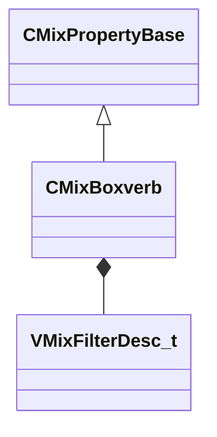

**Fields:**

| Name | Type | Annotations |
|------|------|-------------|
| `m_flSizeMax` | float32 | `MPropertyDescription "The reverb can be parameterized either by a delay range (min/max delay in milliseconds) OR by a delay size for each dimension of a box (width/height/depth).<br>If you set width, height, or depth to anything other than zero, these min/max fields will not be used."` `MPropertyFriendlyName "Max Size (milliseconds)"` `MPropertyAttributeRange "0.0 1000.0"` |
| `m_flSizeMin` | float32 | `MPropertyDescription "The reverb can be parameterized either by a delay range (min/max delay in milliseconds) OR by a delay size for each dimension of a box (width/height/depth).<br>If you set width, height, or depth to anything other than zero, these min/max fields will not be used."` `MPropertyFriendlyName "Min Size (milliseconds)"` `MPropertyAttributeRange "0.0 1000.0"` |
| `m_flComplexity` | float32 | `MPropertyDescription "The complexity is how many delays are spread along the total delay length.  Max is 12.  More delays will give your space more reflections (more geometric complexity)."` `MPropertyFriendlyName "Complexity"` `MPropertyAttributeRange "1.01 12.0"` |
| `m_flModDepth` | float32 | `MPropertyDescription "This is a percentage of the delay length to modulate. 100 means you will modulate between 0 and the max delay.  10 means the delay will modulate between 90 and 100 percent of max delay."` `MPropertyFriendlyName "Mod Depth (milliseconds)"` `MPropertyAttributeRange "0.0 100"` |
| `m_flModRate` | float32 | `MPropertyDescription "This is the rate at which the delay length changes.  1 means change the delay every delaytime milliseconds.  2 means change the delay after 2*delaytime milliseconds."` `MPropertyFriendlyName "Mod Rate (# of delay intervals before mod)"` `MPropertyAttributeRange "0.0 10.0"` |
| `m_bParallel` | bool | `MPropertyDescription "If true the filter is applied to the signal before output.  If false the filter is applied while feeding back into each delay line."` `MPropertyFriendlyName "Parallalelize Filter"` |
| `m_filterType` | [VMixFilterDesc_t](../schemas/soundsystem_lowlevel.md#vmixfilterdesc_t) | `MPropertyDescription "Configure the filter to apply to the delay output.  Usually this should be a lowpass filter."` `MPropertyFriendlyName "Filter Type"` `MPropertyGroupName "Filter"` |
| `m_flWidth` | float32 | `MPropertyDescription "If width, height, or depth is set min/max size will be ignored.  These dimensions are the size of the room in milliseconds to first reflection."` `MPropertyFriendlyName "Width (milliseconds)"` `MPropertyAttributeRange "0 1000.0"` |
| `m_flHeight` | float32 | `MPropertyDescription "If width, height, or depth is set min/max size will be ignored.  These dimensions are the size of the room in milliseconds to first reflection."` `MPropertyFriendlyName "Height (milliseconds)"` `MPropertyAttributeRange "0 1000.0"` |
| `m_flDepth` | float32 | `MPropertyDescription "If width, height, or depth is set min/max size will be ignored.  These dimensions are the size of the room in milliseconds to first reflection."` `MPropertyFriendlyName "Depth (milliseconds)"` `MPropertyAttributeRange "0 1000.0"` |
| `m_flFeedbackScale` | float32 | `MPropertyDescription "How much of the signal to send to the delay lines.  How loud the reflections are."` `MPropertyFriendlyName "Feedback Scale"` `MPropertyAttributeRange "0 1"` |
| `m_flFeedbackWidth` | float32 | `MPropertyDescription "Additional amp on the width dimension reflections.  Note negative numbers mean this feedback bypasses the filter (predelay)."` `MPropertyFriendlyName "Width Reflectivity"` `MPropertyAttributeRange "-1.0 1.0"` |
| `m_flFeedbackHeight` | float32 | `MPropertyDescription "Additional amp on the height dimension reflections.  Note negative numbers mean this feedback bypasses the filter (predelay)."` `MPropertyFriendlyName "Height Reflectivity"` `MPropertyAttributeRange "-1.0 1.0"` |
| `m_flFeedbackDepth` | float32 | `MPropertyDescription "Additional amp on the depth dimension reflections.  Note negative numbers mean this feedback bypasses the filter (predelay)."` `MPropertyFriendlyName "Depth  Reflectivity"` `MPropertyAttributeRange "-1.0 1.0"` |
| `m_flOutputGain` | float32 | `MPropertyDescription "Amplification at output in dB for tuning."` `MPropertyFriendlyName "Output Gain (dB)"` `MPropertyAttributeRange "-24.0 -0.1"` |
| `m_flTaps` | float32 | `MPropertyDescription "If zero there are no extra taps.  If non-zero there will be 3 extra taps and this value will adjust their relative phase."` `MPropertyFriendlyName "Extra Tap Scale"` `MPropertyAttributeRange "0 0.333"` |

### CMixBoxverb2

**Inherits from:** [CMixPropertyBase](sounddoc_lib.md#cmixpropertybase)

**Metadata:** `MGetKV3ClassDefaults {
	"_class": "CMixBoxverb2",
	"m_name": "",
	"m_Comment": "",
	"m_bActive": true,
	"m_bSolo": false,
	"m_bEditProperties": false,
	"m_flSizeMax": 100.000000,
	"m_flSizeMin": 0.000000,
	"m_flComplexity": 4.000000,
	"m_flModDepth": 0.000000,
	"m_flModRate": 0.000000,
	"m_bParallel": false,
	"m_filterType":
	{
		"m_nFilterType": "FILTER_LOWPASS",
		"m_nFilterSlope": "FILTER_SLOPE_12dB",
		"m_bEnabled": true,
		"m_fldbGain": 0.000000,
		"m_flCutoffFreq": 1000.000000,
		"m_flQ": 0.707107
	},
	"m_flWidth": 20.000000,
	"m_flHeight": 23.000000,
	"m_flDepth": 27.000000,
	"m_flFeedbackScale": 0.150000,
	"m_flFeedbackWidth": 0.000000,
	"m_flFeedbackHeight": 0.000000,
	"m_flFeedbackDepth": 0.000000,
	"m_flWetMix": 0.000000,
	"m_flOutputGain": 0.000000,
	"m_flTaps": 0.000000
}`, `MPropertyFriendlyName "VMix Shoebox Reverb Node v2"`, `MPropertyDescription "A simple reverb that approximates the reflections of a box-shaped room."`

**Relationships:**

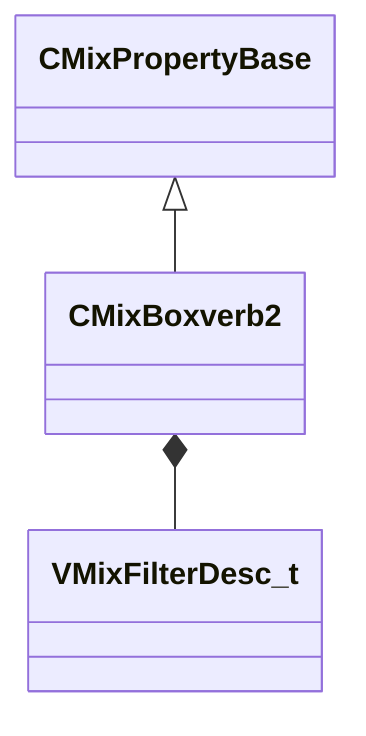

**Fields:**

| Name | Type | Annotations |
|------|------|-------------|
| `m_flSizeMax` | float32 | `MPropertyDescription "The reverb can be parameterized either by a delay range (min/max delay in milliseconds) OR by a delay size for each dimension of a box (width/height/depth).<br>If you set width, height, or depth to anything other than zero, these min/max fields will not be used."` `MPropertyFriendlyName "Max Size (milliseconds)"` `MPropertyAttributeRange "0.0 1000.0"` |
| `m_flSizeMin` | float32 | `MPropertyDescription "The reverb can be parameterized either by a delay range (min/max delay in milliseconds) OR by a delay size for each dimension of a box (width/height/depth).<br>If you set width, height, or depth to anything other than zero, these min/max fields will not be used."` `MPropertyFriendlyName "Min Size (milliseconds)"` `MPropertyAttributeRange "0.0 1000.0"` |
| `m_flComplexity` | float32 | `MPropertyDescription "The complexity is how many delays are spread along the total delay length.  Max is 12.  More delays will give your space more reflections (more geometric complexity)."` `MPropertyFriendlyName "Complexity"` `MPropertyAttributeRange "1.01 12.0"` |
| `m_flModDepth` | float32 | `MPropertyDescription "This is a percentage of the delay length to modulate. 100 means you will modulate between 0 and the max delay.  10 means the delay will modulate between 90 and 100 percent of max delay."` `MPropertyFriendlyName "Mod Depth (milliseconds)"` `MPropertyAttributeRange "0.0 100"` |
| `m_flModRate` | float32 | `MPropertyDescription "This is the rate at which the delay length changes.  1 means change the delay every delaytime milliseconds.  2 means change the delay after 2*delaytime milliseconds."` `MPropertyFriendlyName "Mod Rate (# of delay intervals before mod)"` `MPropertyAttributeRange "0.0 10.0"` |
| `m_bParallel` | bool | `MPropertyDescription "If true the filter is applied to the signal before output.  If false the filter is applied while feeding back into each delay line."` `MPropertyFriendlyName "Parallalelize Filter"` |
| `m_filterType` | [VMixFilterDesc_t](../schemas/soundsystem_lowlevel.md#vmixfilterdesc_t) | `MPropertyDescription "Configure the filter to apply to the delay output.  Usually this should be a lowpass filter."` `MPropertyFriendlyName "Filter Type"` `MPropertyGroupName "Filter"` |
| `m_flWidth` | float32 | `MPropertyDescription "If width, height, or depth is set min/max size will be ignored.  These dimensions are the size of the room in milliseconds to first reflection."` `MPropertyFriendlyName "Width (milliseconds)"` `MPropertyAttributeRange "0 1000.0"` |
| `m_flHeight` | float32 | `MPropertyDescription "If width, height, or depth is set min/max size will be ignored.  These dimensions are the size of the room in milliseconds to first reflection."` `MPropertyFriendlyName "Height (milliseconds)"` `MPropertyAttributeRange "0 1000.0"` |
| `m_flDepth` | float32 | `MPropertyDescription "If width, height, or depth is set min/max size will be ignored.  These dimensions are the size of the room in milliseconds to first reflection."` `MPropertyFriendlyName "Depth (milliseconds)"` `MPropertyAttributeRange "0 1000.0"` |
| `m_flFeedbackScale` | float32 | `MPropertyDescription "How much of the signal to send to the delay lines.  How loud the reflections are."` `MPropertyFriendlyName "Feedback Scale"` `MPropertyAttributeRange "0 1"` |
| `m_flFeedbackWidth` | float32 | `MPropertyDescription "Additional amp on the width dimension reflections.  Note negative numbers mean this feedback bypasses the filter (predelay)."` `MPropertyFriendlyName "Width Reflectivity"` `MPropertyAttributeRange "-1.0 1.0"` |
| `m_flFeedbackHeight` | float32 | `MPropertyDescription "Additional amp on the height dimension reflections.  Note negative numbers mean this feedback bypasses the filter (predelay)."` `MPropertyFriendlyName "Height Reflectivity"` `MPropertyAttributeRange "-1.0 1.0"` |
| `m_flFeedbackDepth` | float32 | `MPropertyDescription "Additional amp on the depth dimension reflections.  Note negative numbers mean this feedback bypasses the filter (predelay)."` `MPropertyFriendlyName "Depth  Reflectivity"` `MPropertyAttributeRange "-1.0 1.0"` |
| `m_flWetMix` | float32 | `MPropertyFriendlyName "Dry/Wet"` |
| `m_flOutputGain` | float32 | `MPropertyDescription "Amplification at output in dB for tuning, applied after Wet/Dry mix"` `MPropertyFriendlyName "Output Gain (dB)"` `MPropertyAttributeRange "-24.0 -0.1"` |
| `m_flTaps` | float32 | `MPropertyDescription "If zero there are no extra taps.  If non-zero there will be 3 extra taps and this value will adjust their relative phase."` `MPropertyFriendlyName "Extra Tap Scale"` `MPropertyAttributeRange "0 0.333"` |

### CMixControlAutomatic

**Inherits from:** [CMixPropertyBase](sounddoc_lib.md#cmixpropertybase)

**Metadata:** `MGetKV3ClassDefaults {
	"_class": "CMixControlAutomatic",
	"m_name": "",
	"m_Comment": "",
	"m_bActive": true,
	"m_bSolo": false,
	"m_bEditProperties": false
}`, `MPropertyFriendlyName "VMix Automatic Control Node"`, `MPropertyDescription "This will automatically forward a variable from the sound event that can be used to drive graph behavior."`

**Relationships:**

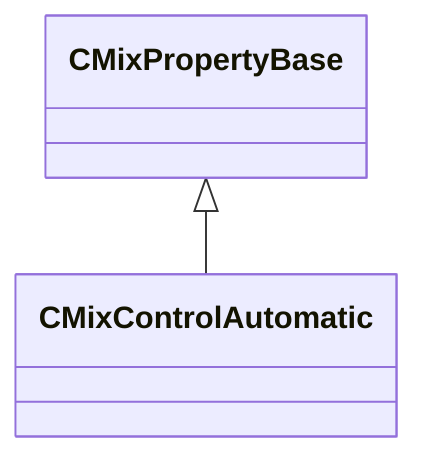

### CMixControlCrossfade

**Inherits from:** [CMixPropertyBase](sounddoc_lib.md#cmixpropertybase)

**Metadata:** `MGetKV3ClassDefaults {
	"_class": "CMixControlCrossfade",
	"m_name": "",
	"m_Comment": "",
	"m_bActive": true,
	"m_bSolo": false,
	"m_bEditProperties": false,
	"m_flFadeStart": 0.000000,
	"m_flFadeEnd": 1.000000
}`, `MPropertyFriendlyName "VMix Crossfade Control Node"`, `MPropertyDescription "Generates two control signals from a single input that can be used to drive an equal power volume crossfade."`

**Relationships:**

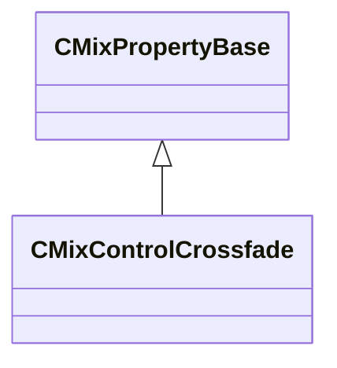

**Fields:**

| Name | Type | Annotations |
|------|------|-------------|
| `m_flFadeStart` | float32 | `MPropertyFriendlyName "Fade Start"` |
| `m_flFadeEnd` | float32 | `MPropertyFriendlyName "Fade End"` |

### CMixControlCurve

**Inherits from:** [CMixPropertyBase](sounddoc_lib.md#cmixpropertybase)

**Metadata:** `MGetKV3ClassDefaults {
	"_class": "CMixControlCurve",
	"m_name": "",
	"m_Comment": "",
	"m_bActive": true,
	"m_bSolo": false,
	"m_bEditProperties": false,
	"m_flInputMin": 0.000000,
	"m_flInputMax": 1.000000,
	"m_flOutputMin": 0.000000,
	"m_flOutputMax": 1.000000,
	"m_curve":
	{
		"m_spline":
		[
			{
				"x": 0.000000,
				"y": 0.000000,
				"m_flSlopeIncoming": 1.000000,
				"m_flSlopeOutgoing": 1.000000
			},
			{
				"x": 1.000000,
				"y": 1.000000,
				"m_flSlopeIncoming": 1.000000,
				"m_flSlopeOutgoing": 1.000000
			}
		],
		"m_tangents":
		[
			{
				"m_nIncomingTangent": "CURVE_TANGENT_SPLINE",
				"m_nOutgoingTangent": "CURVE_TANGENT_SPLINE"
			},
			{
				"m_nIncomingTangent": "CURVE_TANGENT_SPLINE",
				"m_nOutgoingTangent": "CURVE_TANGENT_SPLINE"
			}
		],
		"m_vDomainMins":
		[
			0.000000,
			0.000000
		],
		"m_vDomainMaxs":
		[
			0.000000,
			0.000000
		]
	}
}`, `MPropertyFriendlyName "VMix Control Curve Node"`, `MPropertyDescription "Remap a control variable through a curve that you define."`

**Relationships:**

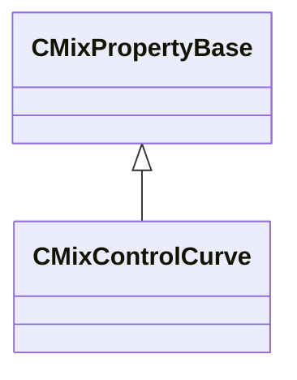

**Fields:**

| Name | Type | Annotations |
|------|------|-------------|
| `m_flInputMin` | float32 |  |
| `m_flInputMax` | float32 |  |
| `m_flOutputMin` | float32 |  |
| `m_flOutputMax` | float32 |  |
| `m_curve` | CPiecewiseCurve | `MPropertySuppressField` |

### CMixControlInput

**Inherits from:** [CMixPropertyBase](sounddoc_lib.md#cmixpropertybase)

**Metadata:** `MGetKV3ClassDefaults {
	"_class": "CMixControlInput",
	"m_name": "",
	"m_Comment": "",
	"m_bActive": true,
	"m_bSolo": false,
	"m_bEditProperties": false,
	"m_flDefaultValue": 1.000000,
	"m_flMinRange": 0.000000,
	"m_flMaxRange": 1.000000,
	"m_bUseDecibels": false
}`, `MPropertyFriendlyName "VMix Control Input Node"`, `MPropertyDescription "Define a control variable that can be set by code or an operator stack."`

**Relationships:**

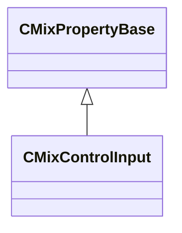

**Fields:**

| Name | Type | Annotations |
|------|------|-------------|
| `m_flDefaultValue` | float32 | `MPropertyFriendlyName "Default Value"` |
| `m_flMinRange` | float32 | `MPropertyFriendlyName "Preview Min Range"` |
| `m_flMaxRange` | float32 | `MPropertyFriendlyName "Preview Max Range"` |
| `m_bUseDecibels` | bool | `MPropertyFriendlyName "Convert From dB"` |

### CMixControlInputArray

**Inherits from:** [CMixPropertyBase](sounddoc_lib.md#cmixpropertybase)

**Metadata:** `MGetKV3ClassDefaults {
	"_class": "CMixControlInputArray",
	"m_name": "",
	"m_Comment": "",
	"m_bActive": true,
	"m_bSolo": false,
	"m_bEditProperties": false,
	"m_vflData":
	[
	]
}`, `MPropertyFriendlyName "VMix Control Array Input Node"`, `MPropertyDescription "Define a control array variable that can be set by code or an operator stack.  This can be used to control steamaudio pathing or steamaudio reverb for example."`

**Relationships:**

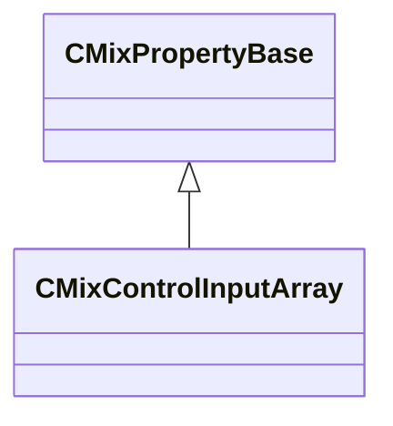

**Fields:**

| Name | Type | Annotations |
|------|------|-------------|
| `m_vflData` | CUtlVector<float32> | `MPropertyFriendlyName "Input Data"` `MPropertyAttributeRange "-1 1"` |

### CMixControlListener

**Inherits from:** [CMixPropertyBase](sounddoc_lib.md#cmixpropertybase)

**Metadata:** `MGetKV3ClassDefaults {
	"_class": "CMixControlListener",
	"m_name": "",
	"m_Comment": "",
	"m_bActive": true,
	"m_bSolo": false,
	"m_bEditProperties": false
}`, `MPropertyFriendlyName "VMix Control Listener Node"`, `MPropertyDescription "An automatic control input that gets a value from the listener of this mix (e.g. orientation values)."`

**Relationships:**

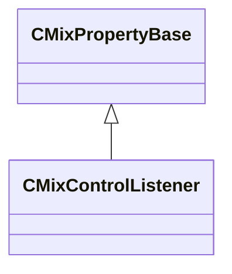

### CMixControlMax

**Inherits from:** [CMixPropertyBase](sounddoc_lib.md#cmixpropertybase)

**Metadata:** `MGetKV3ClassDefaults {
	"_class": "CMixControlMax",
	"m_name": "",
	"m_Comment": "",
	"m_bActive": true,
	"m_bSolo": false,
	"m_bEditProperties": false
}`, `MPropertyFriendlyName "VMix Control Max Node"`, `MPropertyDescription "Outputs the current max of up to six control inputs."`

**Relationships:**

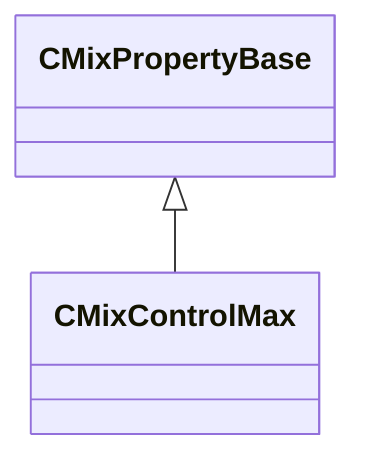

### CMixControlMeter

**Inherits from:** [CMixPropertyBase](sounddoc_lib.md#cmixpropertybase)

**Metadata:** `MGetKV3ClassDefaults {
	"_class": "CMixControlMeter",
	"m_name": "",
	"m_Comment": "",
	"m_bActive": true,
	"m_bSolo": false,
	"m_bEditProperties": false,
	"m_flValue": 0.000000
}`, `MPropertyFriendlyName "VMix Control Meter Node"`, `MPropertyDescription "Allows you to monitor a control value in real-time in vmixtool."`

**Relationships:**

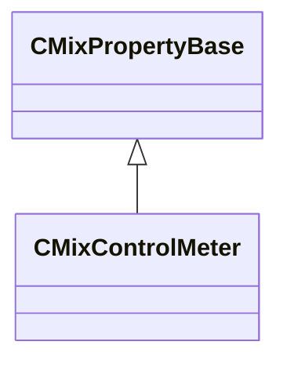

**Fields:**

| Name | Type | Annotations |
|------|------|-------------|
| `m_flValue` | float32 | `MPropertyFriendlyName "Value"` |

### CMixControlOutput

**Inherits from:** [CMixPropertyBase](sounddoc_lib.md#cmixpropertybase)

**Metadata:** `MGetKV3ClassDefaults {
	"_class": "CMixControlOutput",
	"m_name": "",
	"m_Comment": "",
	"m_bActive": true,
	"m_bSolo": false,
	"m_bEditProperties": false,
	"m_flDefaultValue": 1.000000
}`, `MPropertyFriendlyName "VMix Control Output Node"`, `MPropertyDescription "Save the results of a control value (e.g. envelope level) so that code/stack can query it by name."`

**Relationships:**

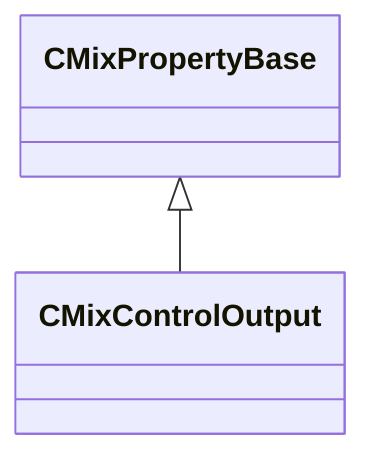

**Fields:**

| Name | Type | Annotations |
|------|------|-------------|
| `m_flDefaultValue` | float32 | `MPropertyFriendlyName "Default Value"` |

### CMixControlRemap

**Inherits from:** [CMixPropertyBase](sounddoc_lib.md#cmixpropertybase)

**Metadata:** `MGetKV3ClassDefaults {
	"_class": "CMixControlRemap",
	"m_name": "",
	"m_Comment": "",
	"m_bActive": true,
	"m_bSolo": false,
	"m_bEditProperties": false,
	"m_flInputMin": 0.000000,
	"m_flInputMax": 1.000000,
	"m_flOutputStart": 0.000000,
	"m_flOutputEnd": 1.000000,
	"m_flPower": 1.000000
}`, `MPropertyFriendlyName "VMix Control Remap Node"`, `MPropertyDescription "Remap a control value using a clamped linear range or clamped power curve.  Allows you to stretch and clip a control signal."`

**Relationships:**

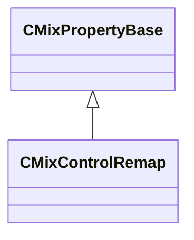

**Fields:**

| Name | Type | Annotations |
|------|------|-------------|
| `m_flInputMin` | float32 | `MPropertyFriendlyName "Input Min"` |
| `m_flInputMax` | float32 | `MPropertyFriendlyName "Input Max"` |
| `m_flOutputStart` | float32 | `MPropertyFriendlyName "Output Start"` |
| `m_flOutputEnd` | float32 | `MPropertyFriendlyName "Output End"` |
| `m_flPower` | float32 | `MPropertyFriendlyName "Nonlinear power (1.0 = linear)"` `MPropertyAttributeRange "biased 0.02 20"` |

### CMixControlStackInput

**Inherits from:** [CMixPropertyBase](sounddoc_lib.md#cmixpropertybase)

**Metadata:** `MGetKV3ClassDefaults {
	"_class": "CMixControlStackInput",
	"m_name": "",
	"m_Comment": "",
	"m_bActive": true,
	"m_bSolo": false,
	"m_bEditProperties": false,
	"m_flDefaultValue": 1.000000,
	"m_flMinRange": 0.000000,
	"m_flMaxRange": 1.000000
}`, `MPropertyFriendlyName "VMix Control Stack Input Node"`, `MPropertyDescription "This will copy a control value from this soundevent's operator stack.  Works with any stack/variable without modifying the stack itself."`

**Relationships:**

```mermaid
classDiagram
    CMixPropertyBase <|-- CMixControlStackInput
```

**Fields:**

| Name | Type | Annotations |
|------|------|-------------|
| `m_flDefaultValue` | float32 | `MPropertyFriendlyName "Default Value"` |
| `m_flMinRange` | float32 | `MPropertyFriendlyName "Preview Min Range"` |
| `m_flMaxRange` | float32 | `MPropertyFriendlyName "Preview Max Range"` |

### CMixControlTransientInput

**Inherits from:** [CMixPropertyBase](sounddoc_lib.md#cmixpropertybase)

**Metadata:** `MGetKV3ClassDefaults {
	"_class": "CMixControlTransientInput",
	"m_name": "",
	"m_Comment": "",
	"m_bActive": true,
	"m_bSolo": false,
	"m_bEditProperties": false
}`, `MPropertyFriendlyName "VMix Control Input Node"`, `MPropertyDescription "Define a control variable that triggers a one-time event."`

**Relationships:**

```mermaid
classDiagram
    CMixPropertyBase <|-- CMixControlTransientInput
```

### CMixConvolution

**Inherits from:** [CMixPropertyBase](sounddoc_lib.md#cmixpropertybase)

**Metadata:** `MGetKV3ClassDefaults {
	"_class": "CMixConvolution",
	"m_name": "",
	"m_Comment": "",
	"m_bActive": true,
	"m_bSolo": false,
	"m_bEditProperties": false,
	"m_desc":
	{
		"m_fldbGain": -12.000000,
		"m_flPreDelayMS": 0.000000,
		"m_flWetMix": 1.000000,
		"m_fldbLow": 0.000000,
		"m_fldbMid": 0.000000,
		"m_fldbHigh": 0.000000,
		"m_flLowCutoffFreq": 1500.000000,
		"m_flHighCutoffFreq": 7500.000000
	}
}`, `MPropertyFriendlyName "VMix Audio Convolution Node"`, `MPropertyDescription "Apply a vsnd as an impulse response (IR) to an audio signal via convolution."`

**Relationships:**

```mermaid
classDiagram
    CMixPropertyBase <|-- CMixConvolution
    CMixConvolution *-- VMixConvolutionDesc_t
```

**Fields:**

| Name | Type | Annotations |
|------|------|-------------|
| `m_desc` | [VMixConvolutionDesc_t](../schemas/soundsystem_lowlevel.md#vmixconvolutiondesc_t) | `MPropertyAutoExpandSelf` |

### CMixDelay

**Inherits from:** [CMixPropertyBase](sounddoc_lib.md#cmixpropertybase)

**Metadata:** `MGetKV3ClassDefaults {
	"_class": "CMixDelay",
	"m_name": "",
	"m_Comment": "",
	"m_bActive": true,
	"m_bSolo": false,
	"m_bEditProperties": true,
	"m_nChannels": -1,
	"m_flDelay": 500.000000,
	"m_fldbDirectGain": 0.000000,
	"m_fldbDelayGain": -3.000000,
	"m_fldbFeedbackGain": -3.000000,
	"m_flWidth": 0.000000,
	"m_bEnableFilter": false,
	"m_filterType": "FILTER_LOWPASS",
	"m_flFrequency": 2000.000000,
	"m_flQ": 0.707000,
	"m_fldbGain": 0.000000
}`, `MPropertyFriendlyName "VMix Delay Audio Node"`, `MPropertyDescription "Stereo delay with resonant filter on feedback."`

**Relationships:**

```mermaid
classDiagram
    CMixPropertyBase <|-- CMixDelay
```

**Fields:**

| Name | Type | Annotations |
|------|------|-------------|
| `m_nChannels` | int32 | `MPropertyFriendlyName "Channels"` `MPropertyAttributeChoiceName "processor_channels"` |
| `m_flDelay` | float32 | `MPropertyFriendlyName "Delay (ms)"` `MPropertyGroupName "+Delay"` `MPropertyAttributeRange "0 2000"` |
| `m_fldbDirectGain` | float32 | `MPropertyFriendlyName "DirectGain (dB)"` `MPropertyGroupName "Delay"` `MPropertyAttributeRange "-24 24"` |
| `m_fldbDelayGain` | float32 | `MPropertyFriendlyName "DelayGain (dB)"` `MPropertyGroupName "Delay"` `MPropertyAttributeRange "-24 24"` |
| `m_fldbFeedbackGain` | float32 | `MPropertyFriendlyName "FeedbackGain (dB)"` `MPropertyGroupName "Delay"` `MPropertyAttributeRange "-60 12"` |
| `m_flWidth` | float32 | `MPropertyFriendlyName "Width"` `MPropertyAttributeRange "0 1.0"` |
| `m_bEnableFilter` | bool | `MPropertyFriendlyName "EnableFilter"` `MPropertyGroupName "+Filter"` |
| `m_filterType` | CUtlString | `MPropertyFriendlyName "Filter Type"` `MPropertyGroupName "Filter"` `MPropertyAttributeChoiceName "filter_type"` |
| `m_flFrequency` | float32 | `MPropertyFriendlyName "Center Frequency (Hz)"` `MPropertyGroupName "Filter"` `MPropertyAttributeRange "biased 20 22000"` |
| `m_flQ` | float32 | `MPropertyFriendlyName "Q"` `MPropertyGroupName "Filter"` `MPropertyAttributeRange "0.1 12"` |
| `m_fldbGain` | float32 | `MPropertyFriendlyName "Filter Gain (dB)"` `MPropertyAttributeRange "-24 24"` |

### CMixDelayImpulseResponse

**Inherits from:** [CMixPropertyBase](sounddoc_lib.md#cmixpropertybase)

**Metadata:** `MGetKV3ClassDefaults {
	"_class": "CMixDelayImpulseResponse",
	"m_name": "",
	"m_Comment": "",
	"m_bActive": true,
	"m_bSolo": false,
	"m_bEditProperties": false,
	"m_flPreDelayMS": 0.000000
}`, `MPropertyFriendlyName "VMix Apply Pre-Delay to Impulse Response Node"`, `MPropertyDescription "Applies a pre-delay to an impulse response."`

**Relationships:**

```mermaid
classDiagram
    CMixPropertyBase <|-- CMixDelayImpulseResponse
```

**Fields:**

| Name | Type | Annotations |
|------|------|-------------|
| `m_flPreDelayMS` | float32 | `MPropertyFriendlyName "PreDelayMS"` |

### CMixDiffusor

**Inherits from:** [CMixPropertyBase](sounddoc_lib.md#cmixpropertybase)

**Metadata:** `MGetKV3ClassDefaults {
	"_class": "CMixDiffusor",
	"m_name": "",
	"m_Comment": "",
	"m_bActive": true,
	"m_bSolo": false,
	"m_bEditProperties": false,
	"m_flSize": 0.500000,
	"m_flComplexity": 2.000000,
	"m_flFeedback": -8.000000,
	"m_flOutputGain": 0.000000
}`, `MPropertyFriendlyName "VMix Diffusor Audio Node"`, `MPropertyDescription "Creates a dense field of delay/feedback/reflections.  This is basically a sequence of allpass filters and short delay lines.  Can be used to create part of a reverb effect."`

**Relationships:**

```mermaid
classDiagram
    CMixPropertyBase <|-- CMixDiffusor
```

**Fields:**

| Name | Type | Annotations |
|------|------|-------------|
| `m_flSize` | float32 | `MPropertyFriendlyName "Size"` `MPropertyAttributeRange "0.0 1.0"` |
| `m_flComplexity` | float32 | `MPropertyFriendlyName "Complexity"` `MPropertyAttributeRange "1.01 8.0"` |
| `m_flFeedback` | float32 | `MPropertyFriendlyName "Feedback (dB)"` `MPropertyAttributeRange "-24.0 -8.0"` |
| `m_flOutputGain` | float32 | `MPropertyFriendlyName "Output (dB)"` `MPropertyAttributeRange "-24.0 -0.1"` |

### CMixDualCompressor

**Inherits from:** [CMixPropertyBase](sounddoc_lib.md#cmixpropertybase)

**Metadata:** `MGetKV3ClassDefaults {
	"_class": "CMixDualCompressor",
	"m_name": "",
	"m_Comment": "",
	"m_bActive": true,
	"m_bSolo": false,
	"m_bEditProperties": false,
	"m_nChannels": -1,
	"m_desc":
	{
		"m_flRMSTimeMS": 300.000000,
		"m_fldbKneeWidth": 0.000000,
		"m_flWetMix": 1.000000,
		"m_bPeakMode": false,
		"m_bandDesc":
		{
			"m_fldbGainInput": 0.000000,
			"m_fldbGainOutput": 0.000000,
			"m_fldbThresholdBelow": -40.000000,
			"m_fldbThresholdAbove": -30.000000,
			"m_flRatioBelow": 12.000000,
			"m_flRatioAbove": 4.000000,
			"m_flAttackTimeMS": 50.000000,
			"m_flReleaseTimeMS": 200.000000,
			"m_bEnable": true,
			"m_bSolo": false
		}
	}
}`, `MPropertyFriendlyName "VMix Dual Compressor Node"`, `MPropertyDescription "Compress the dynamic range of both ends of a signal."`

**Relationships:**

```mermaid
classDiagram
    CMixPropertyBase <|-- CMixDualCompressor
    CMixDualCompressor *-- VMixDualCompressorDesc_t
```

**Fields:**

| Name | Type | Annotations |
|------|------|-------------|
| `m_nChannels` | int32 | `MPropertyFriendlyName "Channels"` `MPropertyAttributeChoiceName "processor_channels"` |
| `m_desc` | [VMixDualCompressorDesc_t](../schemas/soundsystem_lowlevel.md#vmixdualcompressordesc_t) | `MPropertyAutoExpandSelf` |

### CMixDynamics

**Inherits from:** [CMixPropertyBase](sounddoc_lib.md#cmixpropertybase)

**Metadata:** `MGetKV3ClassDefaults {
	"_class": "CMixDynamics",
	"m_name": "",
	"m_Comment": "",
	"m_bActive": true,
	"m_bSolo": false,
	"m_bEditProperties": false,
	"m_nChannels": -1,
	"m_fldbNoiseGateThreshold": -90.000000,
	"m_fldbGain": 0.000000,
	"m_fldbCompressionThreshold": -6.000000,
	"m_fldbLimiterThreshold": 0.000000,
	"m_fldbKneeWidth": 0.000000,
	"m_flRatio": 2.000000,
	"m_flLimiterRatio": 40.000000,
	"m_flAttackTime": 100.000000,
	"m_flReleaseTime": 200.000000,
	"m_flRMSTime": 200.000000,
	"m_flWetMix": 1.000000,
	"m_bPeakMode": false,
	"m_nUIPage": 0
}`, `MPropertyFriendlyName "VMix Dynamics Audio Node"`, `MPropertyDescription "A dynamics multiprocessor.  This is a single unit that switches between being a noise gate, compressor, or limiter as the signal moves through its dynamic range.  Useful in some specific cases, e.g. gate+compress or gate+limit usually.  Other cases may be more suited to using multiple compressors in series."`

**Relationships:**

```mermaid
classDiagram
    CMixPropertyBase <|-- CMixDynamics
```

**Fields:**

| Name | Type | Annotations |
|------|------|-------------|
| `m_nChannels` | int32 | `MPropertyFriendlyName "Channels"` `MPropertyAttributeChoiceName "processor_channels"` |
| `m_fldbNoiseGateThreshold` | float32 | `MPropertyFriendlyName "Noise Gate Threshold(dB)"` |
| `m_fldbGain` | float32 | `MPropertyFriendlyName "Gain (dB)"` |
| `m_fldbCompressionThreshold` | float32 | `MPropertyFriendlyName "Compression Threshold(dB)"` |
| `m_fldbLimiterThreshold` | float32 | `MPropertyFriendlyName "Limiter Threshold(dB)"` |
| `m_fldbKneeWidth` | float32 | `MPropertyFriendlyName "Knee width (dB) 0 = hard knee"` |
| `m_flRatio` | float32 | `MPropertyFriendlyName "Compression Ratio"` |
| `m_flLimiterRatio` | float32 | `MPropertyFriendlyName "Limiter Ratio"` |
| `m_flAttackTime` | float32 | `MPropertyFriendlyName "Attack time (ms)"` |
| `m_flReleaseTime` | float32 | `MPropertyFriendlyName "Release time (ms)"` |
| `m_flRMSTime` | float32 | `MPropertyFriendlyName "Threshold detection time (ms)"` |
| `m_flWetMix` | float32 | `MPropertyFriendlyName "Dry/Wet"` |
| `m_bPeakMode` | bool | `MPropertyFriendlyName "Peak Mode"` |
| `m_nUIPage` | int32 |  |

### CMixDynamics3Band

**Inherits from:** [CMixPropertyBase](sounddoc_lib.md#cmixpropertybase)

**Metadata:** `MGetKV3ClassDefaults {
	"_class": "CMixDynamics3Band",
	"m_name": "",
	"m_Comment": "",
	"m_bActive": true,
	"m_bSolo": false,
	"m_bEditProperties": false,
	"m_nChannels": -1,
	"m_fldbOutputGain": 0.000000,
	"m_flRMSTime": 500.000000,
	"m_flDepth": 1.000000,
	"m_flWetMix": 1.000000,
	"m_flTimeScale": 1.000000,
	"m_fldbKneeWidth": 5.000000,
	"m_flLowCutoffFreq": 88.300003,
	"m_flHighCutoffFreq": 2500.000000,
	"m_bPeakMode": false,
	"m_nSelectedPage": 0,
	"m_bands":
	[
		{
			"m_fldbGainInput": 5.200000,
			"m_fldbGainOutput": 8.000000,
			"m_fldbThresholdBelow": -40.799999,
			"m_fldbThresholdAbove": -33.799999,
			"m_flRatioBelow": 4.170000,
			"m_flRatioAbove": 39.000000,
			"m_flAttackTimeMS": 47.799999,
			"m_flReleaseTimeMS": 282.000000,
			"m_bEnable": true,
			"m_bSolo": false
		},
		{
			"m_fldbGainInput": 5.200000,
			"m_fldbGainOutput": 4.420000,
			"m_fldbThresholdBelow": -41.799999,
			"m_fldbThresholdAbove": -30.200001,
			"m_flRatioBelow": 4.170000,
			"m_flRatioAbove": 39.000000,
			"m_flAttackTimeMS": 22.400000,
			"m_flReleaseTimeMS": 282.000000,
			"m_bEnable": true,
			"m_bSolo": false
		},
		{
			"m_fldbGainInput": 5.200000,
			"m_fldbGainOutput": 8.000000,
			"m_fldbThresholdBelow": -40.799999,
			"m_fldbThresholdAbove": -35.500000,
			"m_flRatioBelow": 4.170000,
			"m_flRatioAbove": 80.000000,
			"m_flAttackTimeMS": 13.500000,
			"m_flReleaseTimeMS": 132.000000,
			"m_bEnable": true,
			"m_bSolo": false
		}
	]
}`, `MPropertyFriendlyName "VMix 3 Band Dynamics Node"`, `MPropertyDescription "This is a multi-band dynamics processor.  First the signal is split into low/mid/high bands, then each band is routed through two compressors providing upward and downward compression to each band.  Input & Output gain can also be adjusted."`

**Relationships:**

```mermaid
classDiagram
    CMixPropertyBase <|-- CMixDynamics3Band
    CMixDynamics3Band *-- VMixDynamicsBand_t
```

**Fields:**

| Name | Type | Annotations |
|------|------|-------------|
| `m_nChannels` | int32 | `MPropertyFriendlyName "Channels"` `MPropertyAttributeChoiceName "processor_channels"` |
| `m_fldbOutputGain` | float32 | `MPropertyFriendlyName "Output Gain (dB)"` `MPropertyAttributeRange "-18 18"` |
| `m_flRMSTime` | float32 | `MPropertyFriendlyName "Threshold detection time (ms)"` |
| `m_flDepth` | float32 | `MPropertyFriendlyName "Depth [0.0 - 1.0]"` `MPropertyAttributeRange "0 1"` |
| `m_flWetMix` | float32 | `MPropertyFriendlyName "Wet [0.0 - 1.0]"` `MPropertyAttributeRange "0 1"` |
| `m_flTimeScale` | float32 | `MPropertyFriendlyName "Time Scale [0.0 - 10.0]"` `MPropertyAttributeRange "0 10"` |
| `m_fldbKneeWidth` | float32 | `MPropertyFriendlyName "Knee width (dB) 0 = hard knee"` |
| `m_flLowCutoffFreq` | float32 | `MPropertyFriendlyName "Low Cutoff Freq (Hz)"` |
| `m_flHighCutoffFreq` | float32 | `MPropertyFriendlyName "High Cutoff Freq (Hz)"` |
| `m_bPeakMode` | bool | `MPropertyFriendlyName "Peak Mode"` |
| `m_nSelectedPage` | int32 | `MPropertyHideField` |
| `m_bands` | [VMixDynamicsBand_t](../schemas/soundsystem_lowlevel.md#vmixdynamicsband_t)[3] |  |

### CMixDynamicsCompressor

**Inherits from:** [CMixPropertyBase](sounddoc_lib.md#cmixpropertybase)

**Metadata:** `MGetKV3ClassDefaults {
	"_class": "CMixDynamicsCompressor",
	"m_name": "",
	"m_Comment": "",
	"m_bActive": true,
	"m_bSolo": false,
	"m_bEditProperties": false,
	"m_nChannels": -1,
	"m_desc":
	{
		"m_fldbOutputGain": 0.000000,
		"m_fldbCompressionThreshold": -6.000000,
		"m_fldbKneeWidth": 0.000000,
		"m_flCompressionRatio": 2.000000,
		"m_flAttackTimeMS": 100.000000,
		"m_flReleaseTimeMS": 400.000000,
		"m_flRMSTimeMS": 300.000000,
		"m_flWetMix": 1.000000,
		"m_bPeakMode": false
	},
	"m_nUIPage": 1,
	"m_bIsLimiter": false
}`, `MPropertyFriendlyName "VMix Compressor/Limiter Node"`, `MPropertyDescription "Compress the dynamic range of a signal when it is louder than some threshold."`

**Relationships:**

```mermaid
classDiagram
    CMixPropertyBase <|-- CMixDynamicsCompressor
    CMixDynamicsCompressor *-- VMixDynamicsCompressorDesc_t
```

**Fields:**

| Name | Type | Annotations |
|------|------|-------------|
| `m_nChannels` | int32 | `MPropertyFriendlyName "Channels"` `MPropertyAttributeChoiceName "processor_channels"` |
| `m_desc` | [VMixDynamicsCompressorDesc_t](../schemas/soundsystem_lowlevel.md#vmixdynamicscompressordesc_t) | `MPropertyAutoExpandSelf` |
| `m_nUIPage` | int32 |  |
| `m_bIsLimiter` | bool |  |

### CMixEQ8

**Inherits from:** [CMixPropertyBase](sounddoc_lib.md#cmixpropertybase)

**Metadata:** `MGetKV3ClassDefaults {
	"_class": "CMixEQ8",
	"m_name": "",
	"m_Comment": "",
	"m_bActive": true,
	"m_bSolo": false,
	"m_bEditProperties": false,
	"m_nChannels": -1,
	"m_stages":
	[
		{
			"m_filterType": "FILTER_LOW_SHELF",
			"m_flFrequency": 80.000000,
			"m_flQ": 1.000000,
			"m_fldbGain": 0.000000,
			"m_nFilterSlope": "FILTER_SLOPE_12dB",
			"m_bEnable": true
		},
		{
			"m_filterType": "FILTER_PEAKING_EQ",
			"m_flFrequency": 500.000000,
			"m_flQ": 3.000000,
			"m_fldbGain": 0.000000,
			"m_nFilterSlope": "FILTER_SLOPE_12dB",
			"m_bEnable": true
		},
		{
			"m_filterType": "FILTER_PEAKING_EQ",
			"m_flFrequency": 750.000000,
			"m_flQ": 3.000000,
			"m_fldbGain": 0.000000,
			"m_nFilterSlope": "FILTER_SLOPE_12dB",
			"m_bEnable": false
		},
		{
			"m_filterType": "FILTER_PEAKING_EQ",
			"m_flFrequency": 1200.000000,
			"m_flQ": 3.000000,
			"m_fldbGain": 0.000000,
			"m_nFilterSlope": "FILTER_SLOPE_12dB",
			"m_bEnable": true
		},
		{
			"m_filterType": "FILTER_PEAKING_EQ",
			"m_flFrequency": 2000.000000,
			"m_flQ": 3.000000,
			"m_fldbGain": 0.000000,
			"m_nFilterSlope": "FILTER_SLOPE_12dB",
			"m_bEnable": false
		},
		{
			"m_filterType": "FILTER_PEAKING_EQ",
			"m_flFrequency": 3000.000000,
			"m_flQ": 3.000000,
			"m_fldbGain": 0.000000,
			"m_nFilterSlope": "FILTER_SLOPE_12dB",
			"m_bEnable": true
		},
		{
			"m_filterType": "FILTER_PEAKING_EQ",
			"m_flFrequency": 5000.000000,
			"m_flQ": 3.000000,
			"m_fldbGain": 0.000000,
			"m_nFilterSlope": "FILTER_SLOPE_12dB",
			"m_bEnable": false
		},
		{
			"m_filterType": "FILTER_HIGH_SHELF",
			"m_flFrequency": 12000.000000,
			"m_flQ": 1.000000,
			"m_fldbGain": 0.000000,
			"m_nFilterSlope": "FILTER_SLOPE_12dB",
			"m_bEnable": true
		}
	]
}`, `MPropertyFriendlyName "VMix EQ8 Audio Node"`, `MPropertyDescription "Up to 8 bands of EQ.  Boost/cut up to 8 bands with adjustable Q.  Filters can also be configured as low/high pass or low/high shelf."`

**Relationships:**

```mermaid
classDiagram
    CMixPropertyBase <|-- CMixEQ8
    CMixEQ8 *-- CFilterStage
```

**Fields:**

| Name | Type | Annotations |
|------|------|-------------|
| `m_nChannels` | int32 | `MPropertyFriendlyName "Channels"` `MPropertyAttributeChoiceName "processor_channels"` |
| `m_stages` | [CFilterStage](../schemas/sounddoc_lib.md#cfilterstage)[8] | `MPropertyFriendlyName "EQ Stages"` |

### CMixEffectChain

**Inherits from:** [CMixPropertyBase](sounddoc_lib.md#cmixpropertybase)

**Metadata:** `MGetKV3ClassDefaults {
	"_class": "CMixEffectChain",
	"m_name": "",
	"m_Comment": "",
	"m_bActive": true,
	"m_bSolo": false,
	"m_bEditProperties": true,
	"m_nChannels": -1,
	"m_effectName": "core.null",
	"m_flXFade": 0.100000
}`, `MPropertyFriendlyName "VMix Effect Chain Audio Node"`, `MPropertyDescription "Allows you to swap between sub-graphs with a short crossfade.  Can be used to swap out processing algorithms/configurations, or to dynamically enable/disable optional processing stages."`

**Relationships:**

```mermaid
classDiagram
    CMixPropertyBase <|-- CMixEffectChain
```

**Fields:**

| Name | Type | Annotations |
|------|------|-------------|
| `m_nChannels` | int32 | `MPropertyFriendlyName "Channels"` `MPropertyAttributeChoiceName "processor_channels"` |
| `m_effectName` | CUtlString | `MPropertyFriendlyName "Effect Preset Name"` |
| `m_flXFade` | float32 | `MPropertyFriendlyName "Crossfade time (seconds)"` |

### CMixEffectName

**Inherits from:** [CMixPropertyBase](sounddoc_lib.md#cmixpropertybase)

**Metadata:** `MGetKV3ClassDefaults {
	"_class": "CMixEffectName",
	"m_name": "",
	"m_Comment": "",
	"m_bActive": true,
	"m_bSolo": false,
	"m_bEditProperties": false,
	"m_defaultValue": "core.null"
}`, `MPropertyFriendlyName "VMix Effect Name Node"`, `MPropertyDescription "Define an effect name variable that can be controlled by code/operator stack and used to drive processor/effectchain/subgraphswitch nodes."`

**Relationships:**

```mermaid
classDiagram
    CMixPropertyBase <|-- CMixEffectName
```

**Fields:**

| Name | Type | Annotations |
|------|------|-------------|
| `m_defaultValue` | CUtlString | `MPropertyFriendlyName "Default Value"` `MPropertyAttributeChoiceName "dsp_preset"` |

### CMixEnvelope

**Inherits from:** [CMixPropertyBase](sounddoc_lib.md#cmixpropertybase)

**Metadata:** `MGetKV3ClassDefaults {
	"_class": "CMixEnvelope",
	"m_name": "",
	"m_Comment": "",
	"m_bActive": true,
	"m_bSolo": false,
	"m_bEditProperties": false,
	"m_flAttackTime": 300.000000,
	"m_flHoldTime": 500.000000,
	"m_flReleaseTime": 300.000000
}`, `MPropertyFriendlyName "VMix Envelope Audio Node"`, `MPropertyDescription "Generate a control signal that represents the envelope/level of an audio track.  Think of this as behaving like a meter but driving some graph logic."`

**Relationships:**

```mermaid
classDiagram
    CMixPropertyBase <|-- CMixEnvelope
```

**Fields:**

| Name | Type | Annotations |
|------|------|-------------|
| `m_flAttackTime` | float32 | `MPropertyFriendlyName "Attack time (ms)"` |
| `m_flHoldTime` | float32 | `MPropertyFriendlyName "Hold time (ms)"` |
| `m_flReleaseTime` | float32 | `MPropertyFriendlyName "Release time (ms)"` |

### CMixEnvelopeTrigger

**Inherits from:** [CMixPropertyBase](sounddoc_lib.md#cmixpropertybase)

**Metadata:** `MGetKV3ClassDefaults {
	"_class": "CMixEnvelopeTrigger",
	"m_name": "",
	"m_Comment": "",
	"m_bActive": true,
	"m_bSolo": false,
	"m_bEditProperties": false,
	"m_flBaseValue": 0.000000,
	"m_flDestinationValue": 1.000000,
	"m_flAttackTime": 0.400000,
	"m_flHoldTime": 0.200000,
	"m_flReleaseTime": 0.400000
}`, `MPropertyFriendlyName "VMix Envelope Trigger Control Node"`, `MPropertyDescription "Used to create reverb effects based on a model of a reverb plate."`

**Relationships:**

```mermaid
classDiagram
    CMixPropertyBase <|-- CMixEnvelopeTrigger
```

**Fields:**

| Name | Type | Annotations |
|------|------|-------------|
| `m_flBaseValue` | float32 | `MPropertyFriendlyName "Base Value"` |
| `m_flDestinationValue` | float32 | `MPropertyFriendlyName "Destination Value"` |
| `m_flAttackTime` | float32 | `MPropertyFriendlyName "Attack Time (seconds)"` |
| `m_flHoldTime` | float32 | `MPropertyFriendlyName "Hold Time (seconds)"` |
| `m_flReleaseTime` | float32 | `MPropertyFriendlyName "Release Time (seconds)"` |

### CMixFilter

**Inherits from:** [CMixPropertyBase](sounddoc_lib.md#cmixpropertybase)

**Metadata:** `MGetKV3ClassDefaults {
	"_class": "CMixFilter",
	"m_name": "",
	"m_Comment": "",
	"m_bActive": true,
	"m_bSolo": false,
	"m_bEditProperties": false,
	"m_filterType": "FILTER_LOWPASS",
	"m_nChannels": -1,
	"m_flFrequency": 2000.000000,
	"m_flQ": 0.707000,
	"m_fldbGain": 0.000000,
	"m_nFilterSlope": "FILTER_SLOPE_12dB"
}`, `MPropertyFriendlyName "VMix Filter Audio Node"`, `MPropertyDescription "Resonant filter with adjustable slope. NOTE: This is a clean filter, not an analog model with distortion."`

**Relationships:**

```mermaid
classDiagram
    CMixPropertyBase <|-- CMixFilter
    CMixFilter *-- VMixFilterSlope_t
```

**Fields:**

| Name | Type | Annotations |
|------|------|-------------|
| `m_filterType` | CUtlString | `MPropertyFriendlyName "Filter Type"` `MPropertyAttributeChoiceName "filter_type"` |
| `m_nChannels` | int32 | `MPropertyFriendlyName "Channels"` `MPropertyAttributeChoiceName "processor_channels"` |
| `m_flFrequency` | float32 | `MPropertyFriendlyName "Center Frequency (Hz)"` `MPropertyAttributeRange "biased 20 22000"` |
| `m_flQ` | float32 | `MPropertyFriendlyName "Q"` `MPropertyAttributeRange "0.1 12"` |
| `m_fldbGain` | float32 | `MPropertyFriendlyName "Gain (dB)"` `MPropertyAttributeRange "-24 24"` |
| `m_nFilterSlope` | [VMixFilterSlope_t](../schemas/soundsystem_lowlevel.md#vmixfilterslope_t) | `MPropertyFriendlyName "Filter slope"` |

### CMixFlanger

**Inherits from:** [CMixPropertyBase](sounddoc_lib.md#cmixpropertybase)

**Metadata:** `MGetKV3ClassDefaults {
	"_class": "CMixFlanger",
	"m_name": "",
	"m_Comment": "",
	"m_bActive": true,
	"m_bSolo": false,
	"m_bEditProperties": false,
	"m_flDelay": 8.000000,
	"m_flFeedback": -40.000000,
	"m_flFeedfoward": 0.500000,
	"m_flModRate": 0.500000,
	"m_flModDepth": 0.500000,
	"m_bPhaseInvert": false,
	"m_flGlideTime": 150.000000,
	"m_bAntialiasing": false,
	"m_flGain": 0.000000
}`, `MPropertyFriendlyName "VMix Short timeModulating Delay Audio Node"`, `MPropertyDescription "A short time delay with modulation for flange and chorus effects."`

**Relationships:**

```mermaid
classDiagram
    CMixPropertyBase <|-- CMixFlanger
```

**Fields:**

| Name | Type | Annotations |
|------|------|-------------|
| `m_flDelay` | float32 | `MPropertyFriendlyName "Delay Time (ms)"` `MPropertyAttributeRange "0.5 14"` |
| `m_flFeedback` | float32 | `MPropertyFriendlyName "Feedback Gain (dB)"` `MPropertyAttributeRange "-40 -0.6"` |
| `m_flFeedfoward` | float32 | `MPropertyFriendlyName "Wet (linear)"` `MPropertyAttributeRange "0 1.0"` |
| `m_flModRate` | float32 | `MPropertyFriendlyName "Modulation Rate (Hz)"` `MPropertyAttributeRange "0 4"` |
| `m_flModDepth` | float32 | `MPropertyFriendlyName "Modulation Depth (linear)"` `MPropertyAttributeRange "0 1.0"` |
| `m_bPhaseInvert` | bool | `MPropertyFriendlyName "Invert Phase"` |
| `m_flGlideTime` | float32 | `MPropertyFriendlyName "Modulation Param Glide (ms)"` `MPropertyAttributeRange "0 2000"` |
| `m_bAntialiasing` | bool | `MPropertyFriendlyName "Apply Antialiasing"` |
| `m_flGain` | float32 | `MPropertyFriendlyName "Output Gain (dB)"` `MPropertyAttributeRange "-24 24"` |

### CMixFreeverb

**Inherits from:** [CMixPropertyBase](sounddoc_lib.md#cmixpropertybase)

**Metadata:** `MGetKV3ClassDefaults {
	"_class": "CMixFreeverb",
	"m_name": "",
	"m_Comment": "",
	"m_bActive": true,
	"m_bSolo": false,
	"m_bEditProperties": false,
	"m_flRoomSize": 0.500000,
	"m_flDamp": 0.500000,
	"m_flWidth": 0.500000,
	"m_flLateReflections": 1.000000
}`, `MPropertyFriendlyName "VMix Freeverb Audio Node"`, `MPropertyDescription "Used to create reverb effects based on a symmetrical room."`

**Relationships:**

```mermaid
classDiagram
    CMixPropertyBase <|-- CMixFreeverb
```

**Fields:**

| Name | Type | Annotations |
|------|------|-------------|
| `m_flRoomSize` | float32 | `MPropertyFriendlyName "Size"` `MPropertyAttributeRange "0.0 1.0"` |
| `m_flDamp` | float32 | `MPropertyFriendlyName "Dampening Factor"` `MPropertyAttributeRange "0.0 1.0"` |
| `m_flWidth` | float32 | `MPropertyFriendlyName "Width"` `MPropertyAttributeRange "0.0 1.0"` |
| `m_flLateReflections` | float32 | `MPropertyFriendlyName "Late Reflections"` `MPropertyAttributeRange "0.0 1.0"` |

### CMixGroupBox

**Inherits from:** [CMixPropertyBase](sounddoc_lib.md#cmixpropertybase)

**Metadata:** `MGetKV3ClassDefaults {
	"_class": "CMixGroupBox",
	"m_name": "",
	"m_Comment": "",
	"m_bActive": true,
	"m_bSolo": false,
	"m_bEditProperties": false,
	"m_color":
	[
		40,
		40,
		70,
		100
	],
	"m_bMovesNodes": true
}`, `MPropertyFriendlyName "VMix Group Box"`, `MPropertyDescription "Groups a set of nodes.  Comments/colors will get displayed in the graph and on node editors.  A group box allows the user to drag the entire group as one object."`

**Relationships:**

```mermaid
classDiagram
    CMixPropertyBase <|-- CMixGroupBox
```

**Fields:**

| Name | Type | Annotations |
|------|------|-------------|
| `m_color` | Color | `MPropertyFriendlyName "Background Color"` |
| `m_bMovesNodes` | bool | `MPropertyFriendlyName "Move contained nodes"` |

### CMixImpulseResponseInput

**Inherits from:** [CMixPropertyBase](sounddoc_lib.md#cmixpropertybase)

**Metadata:** `MGetKV3ClassDefaults {
	"_class": "CMixImpulseResponseInput",
	"m_name": "",
	"m_Comment": "",
	"m_bActive": true,
	"m_bSolo": false,
	"m_bEditProperties": false,
	"m_defaultValue": "sounds/ir/default.vsnd"
}`, `MPropertyFriendlyName "VMix Control Impulse Response Node"`, `MPropertyDescription "Define a control input that outputs a dynamic impulse response, which can be used by the Steam Audio hybrid reverb processor."`

**Relationships:**

```mermaid
classDiagram
    CMixPropertyBase <|-- CMixImpulseResponseInput
```

**Fields:**

| Name | Type | Annotations |
|------|------|-------------|
| `m_defaultValue` | CUtlString | `MPropertyFriendlyName "Default Value"` `MPropertyAttributeEditor "AssetBrowse( vsnd )"` |

### CMixModDelay

**Inherits from:** [CMixPropertyBase](sounddoc_lib.md#cmixpropertybase)

**Metadata:** `MGetKV3ClassDefaults {
	"_class": "CMixModDelay",
	"m_name": "",
	"m_Comment": "",
	"m_bActive": true,
	"m_bSolo": false,
	"m_bEditProperties": false,
	"m_bPhaseInvert": false,
	"m_flGlideTime": 150.000000,
	"m_flDelay": 500.000000,
	"m_flFeedback": -40.000000,
	"m_flGain": 0.000000,
	"m_flModRate": 0.000000,
	"m_flModDepth": 0.000000,
	"m_filterType": "FILTER_PASSTHROUGH",
	"m_flFrequency": 400.000000,
	"m_flQ": 0.700000,
	"m_flFilterGain": 0.000000,
	"m_bAntialiasing": true
}`, `MPropertyFriendlyName "VMix Modulating Delay Audio Node"`, `MPropertyDescription "A delay with a modulated delay time."`

**Relationships:**

```mermaid
classDiagram
    CMixPropertyBase <|-- CMixModDelay
    CMixModDelay *-- VMixFilterType_t
```

**Fields:**

| Name | Type | Annotations |
|------|------|-------------|
| `m_bPhaseInvert` | bool | `MPropertyFriendlyName "Invert Phase"` |
| `m_flGlideTime` | float32 | `MPropertyFriendlyName "Glide Time (ms)"` `MPropertyAttributeRange "0 2000"` |
| `m_flDelay` | float32 | `MPropertyFriendlyName "Delay Time (ms)"` `MPropertyGroupName "Delay"` `MPropertyAttributeRange "10 2000"` |
| `m_flFeedback` | float32 | `MPropertyFriendlyName "Feedback Gain (dB)"` `MPropertyAttributeRange "-24 -0.6"` |
| `m_flGain` | float32 | `MPropertyFriendlyName "Output Gain (dB)"` `MPropertyAttributeRange "-24 24"` |
| `m_flModRate` | float32 | `MPropertyFriendlyName "Modulation Rate (Hz)"` `MPropertyAttributeRange "0 20"` |
| `m_flModDepth` | float32 | `MPropertyFriendlyName "Modulation Depth (linear)"` `MPropertyAttributeRange "0 1.0"` |
| `m_filterType` | [VMixFilterType_t](../schemas/soundsystem_lowlevel.md#vmixfiltertype_t) | `MPropertyFriendlyName "Filter Type"` `MPropertyGroupName "Filter"` |
| `m_flFrequency` | float32 | `MPropertyFriendlyName "Center Frequency (Hz)"` `MPropertyGroupName "Filter"` `MPropertyAttributeRange "biased 20 22000"` |
| `m_flQ` | float32 | `MPropertyFriendlyName "Q"` `MPropertyGroupName "Filter"` `MPropertyAttributeRange "0.1 12"` |
| `m_flFilterGain` | float32 | `MPropertyFriendlyName "Filter Gain (dB)"` `MPropertyGroupName "Filter"` `MPropertyAttributeRange "-24 24"` |
| `m_bAntialiasing` | bool | `MPropertyFriendlyName "Apply Antialiasing"` |

### CMixOsc

**Inherits from:** [CMixPropertyBase](sounddoc_lib.md#cmixpropertybase)

**Metadata:** `MGetKV3ClassDefaults {
	"_class": "CMixOsc",
	"m_name": "",
	"m_Comment": "",
	"m_bActive": true,
	"m_bSolo": false,
	"m_bEditProperties": false,
	"m_desc":
	{
		"oscType": "LFO_SHAPE_SINE",
		"m_freq": 440.000000,
		"m_flPhase": 0.000000
	}
}`, `MPropertyFriendlyName "VMix Oscillator Audio Node"`, `MPropertyDescription "Generates a tone as an audio track."`

**Relationships:**

```mermaid
classDiagram
    CMixPropertyBase <|-- CMixOsc
    CMixOsc *-- VMixOscDesc_t
```

**Fields:**

| Name | Type | Annotations |
|------|------|-------------|
| `m_desc` | [VMixOscDesc_t](../schemas/soundsystem_lowlevel.md#vmixoscdesc_t) | `MPropertyAutoExpandSelf` |

### CMixOutput

**Inherits from:** [CMixPropertyBase](sounddoc_lib.md#cmixpropertybase)

**Metadata:** `MGetKV3ClassDefaults {
	"_class": "CMixOutput",
	"m_name": "",
	"m_Comment": "",
	"m_bActive": true,
	"m_bSolo": false,
	"m_bEditProperties": false,
	"m_flVolume1": 1.000000,
	"m_flVolume2": 1.000000,
	"m_sendTo": ""
}`, `MPropertyFriendlyName "VMix Output Node"`, `MPropertyDescription "This is where your audio is output from the graph"`

**Relationships:**

```mermaid
classDiagram
    CMixPropertyBase <|-- CMixOutput
```

**Fields:**

| Name | Type | Annotations |
|------|------|-------------|
| `m_flVolume1` | float32 | `MPropertyDescription "Volume for audio.Input1.<br>Range is 0 - 1"` |
| `m_flVolume2` | float32 | `MPropertyDescription "Volume for audio.Input2.<br>Range is 0 - 1"` |
| `m_sendTo` | CUtlString | `MPropertyDescription "Optional name of a send in your main mix graph.  When set this node's mix will be sent to the named track in your main mix graph.
Most voice graphs have a single output, that is routed by the sound operator stack.You should only use this for special cases where the vmix graph needs to route additional unique mixes to specific tracks.e.g.bypass HRTF andsend a different mix to the reverb send"` `MPropertyFriendlyName "Send To Track"` `MPropertyAttributeChoiceName "send_to_track"` |

### CMixPanner

**Inherits from:** [CMixPropertyBase](sounddoc_lib.md#cmixpropertybase)

**Metadata:** `MGetKV3ClassDefaults {
	"_class": "CMixPanner",
	"m_name": "",
	"m_Comment": "",
	"m_bActive": true,
	"m_bSolo": false,
	"m_bEditProperties": false,
	"m_type": "PANNER_TYPE_EQUAL_POWER",
	"m_flStrength": 1.000000
}`, `MPropertyFriendlyName "VMix Panner Audio Node"`, `MPropertyDescription "Adjust the stereo panning of an audio track."`

**Relationships:**

```mermaid
classDiagram
    CMixPropertyBase <|-- CMixPanner
    CMixPanner *-- VMixPannerType_t
```

**Fields:**

| Name | Type | Annotations |
|------|------|-------------|
| `m_type` | [VMixPannerType_t](../schemas/soundsystem_lowlevel.md#vmixpannertype_t) | `MPropertyFriendlyName "Type"` |
| `m_flStrength` | float32 | `MPropertyFriendlyName "Strength"` `MPropertyAttributeRange "0 1"` |

### CMixPitchShift

**Inherits from:** [CMixPropertyBase](sounddoc_lib.md#cmixpropertybase)

**Metadata:** `MGetKV3ClassDefaults {
	"_class": "CMixPitchShift",
	"m_name": "",
	"m_Comment": "",
	"m_bActive": true,
	"m_bSolo": false,
	"m_bEditProperties": false,
	"m_nChannels": -1,
	"m_flPitchScale": 1.000000,
	"m_flGrainMs": 100.000000,
	"m_nProcType": 0,
	"m_nQuality": 1
}`, `MPropertyFriendlyName "VMix Pitch Shift Audio Node"`, `MPropertyDescription "Adjust the pitch of an audio track.  This happens in real-time so the timing of the track is unaffected.  Generally the time domain processor will produce better results for small shifts downward.  For shifting upward it will alias where the frequency space shifter will apply anti-aliasing."`

**Relationships:**

```mermaid
classDiagram
    CMixPropertyBase <|-- CMixPitchShift
```

**Fields:**

| Name | Type | Annotations |
|------|------|-------------|
| `m_nChannels` | int32 | `MPropertyFriendlyName "Channels"` `MPropertyAttributeChoiceName "processor_channels"` |
| `m_flPitchScale` | float32 | `MPropertyFriendlyName "Pitch Scale"` `MPropertyAttributeRange "0.2 4.0"` |
| `m_flGrainMs` | float32 | `MPropertyFriendlyName "Grain Size (ms)"` `MPropertyAttributeRange "1 100"` |
| `m_nProcType` | int32 | `MPropertyFriendlyName "Type 0=time domain, 1 = freq domain"` `MPropertyAttributeRange "0 1"` |
| `m_nQuality` | int32 | `MPropertyFriendlyName "Quality level 1..4"` `MPropertyAttributeRange "1 4"` |

### CMixPlateverb

**Inherits from:** [CMixPropertyBase](sounddoc_lib.md#cmixpropertybase)

**Metadata:** `MGetKV3ClassDefaults {
	"_class": "CMixPlateverb",
	"m_name": "",
	"m_Comment": "",
	"m_bActive": true,
	"m_bSolo": false,
	"m_bEditProperties": false,
	"m_flPrefilter": 0.500000,
	"m_flInputDiffusion1": 0.500000,
	"m_flInputDiffusion2": 0.500000,
	"m_flDecay": 0.500000,
	"m_flDamp": 0.500000,
	"m_flFeedbackDiffusion1": 0.500000,
	"m_flFeedbackDiffusion2": 0.500000
}`, `MPropertyFriendlyName "VMix Plateverb Audio Node"`, `MPropertyDescription "Used to create reverb effects based on a model of a reverb plate."`

**Relationships:**

```mermaid
classDiagram
    CMixPropertyBase <|-- CMixPlateverb
```

**Fields:**

| Name | Type | Annotations |
|------|------|-------------|
| `m_flPrefilter` | float32 | `MPropertyFriendlyName "Prefilter"` `MPropertyAttributeRange "0.0 1.0"` |
| `m_flInputDiffusion1` | float32 | `MPropertyFriendlyName "Input Diffusion 1"` `MPropertyAttributeRange "0.0 1.0"` |
| `m_flInputDiffusion2` | float32 | `MPropertyFriendlyName "Input Diffusion 2"` `MPropertyAttributeRange "0.0 1.0"` |
| `m_flDecay` | float32 | `MPropertyFriendlyName "Decay"` `MPropertyAttributeRange "0.0 1.0"` |
| `m_flDamp` | float32 | `MPropertyFriendlyName "Dampening Factor"` `MPropertyAttributeRange "0.0 1.0"` |
| `m_flFeedbackDiffusion1` | float32 | `MPropertyFriendlyName "Feedback Diffusion 1"` `MPropertyAttributeRange "0.0 1.0"` |
| `m_flFeedbackDiffusion2` | float32 | `MPropertyFriendlyName "Feedback Diffusion 1"` `MPropertyAttributeRange "0.0 1.0"` |

### CMixPresetDSP

**Inherits from:** [CMixPropertyBase](sounddoc_lib.md#cmixpropertybase)

**Metadata:** `MGetKV3ClassDefaults {
	"_class": "CMixPresetDSP",
	"m_name": "",
	"m_Comment": "",
	"m_bActive": true,
	"m_bSolo": false,
	"m_bEditProperties": true,
	"m_nChannels": -1,
	"m_effectName": "core.null",
	"m_flXFade": 0.100000
}`, `MPropertyFriendlyName "VMix Preset DSP Audio Node"`, `MPropertyDescription "Applies an effects preset from the source1 DSP system."`

**Relationships:**

```mermaid
classDiagram
    CMixPropertyBase <|-- CMixPresetDSP
```

**Fields:**

| Name | Type | Annotations |
|------|------|-------------|
| `m_nChannels` | int32 | `MPropertyFriendlyName "Channels"` `MPropertyAttributeChoiceName "processor_channels"` |
| `m_effectName` | CUtlString | `MPropertyFriendlyName "Effect Preset Name"` `MPropertyAttributeChoiceName "dsp_preset"` |
| `m_flXFade` | float32 | `MPropertyFriendlyName "Crossfade time (seconds)"` |

### CMixPropertyBase

**Derived by:** [CMixAmp](sounddoc_lib.md#cmixamp), [CMixAudioMeter](sounddoc_lib.md#cmixaudiometer), [CMixAutoFilter](sounddoc_lib.md#cmixautofilter), [CMixBlendAudio](sounddoc_lib.md#cmixblendaudio), [CMixBlendVsndsToImpulseResponse](sounddoc_lib.md#cmixblendvsndstoimpulseresponse), [CMixBoxverb](sounddoc_lib.md#cmixboxverb), [CMixBoxverb2](sounddoc_lib.md#cmixboxverb2), [CMixControlAutomatic](sounddoc_lib.md#cmixcontrolautomatic), [CMixControlCrossfade](sounddoc_lib.md#cmixcontrolcrossfade), [CMixControlCurve](sounddoc_lib.md#cmixcontrolcurve), [CMixControlInput](sounddoc_lib.md#cmixcontrolinput), [CMixControlInputArray](sounddoc_lib.md#cmixcontrolinputarray), [CMixControlListener](sounddoc_lib.md#cmixcontrollistener), [CMixControlMax](sounddoc_lib.md#cmixcontrolmax), [CMixControlMeter](sounddoc_lib.md#cmixcontrolmeter), [CMixControlOutput](sounddoc_lib.md#cmixcontroloutput), [CMixControlRemap](sounddoc_lib.md#cmixcontrolremap), [CMixControlStackInput](sounddoc_lib.md#cmixcontrolstackinput), [CMixControlTransientInput](sounddoc_lib.md#cmixcontroltransientinput), [CMixConvolution](sounddoc_lib.md#cmixconvolution), [CMixDelay](sounddoc_lib.md#cmixdelay), [CMixDelayImpulseResponse](sounddoc_lib.md#cmixdelayimpulseresponse), [CMixDiffusor](sounddoc_lib.md#cmixdiffusor), [CMixDualCompressor](sounddoc_lib.md#cmixdualcompressor), [CMixDynamics](sounddoc_lib.md#cmixdynamics), [CMixDynamics3Band](sounddoc_lib.md#cmixdynamics3band), [CMixDynamicsCompressor](sounddoc_lib.md#cmixdynamicscompressor), [CMixEQ8](sounddoc_lib.md#cmixeq8), [CMixEffectChain](sounddoc_lib.md#cmixeffectchain), [CMixEffectName](sounddoc_lib.md#cmixeffectname), [CMixEnvelope](sounddoc_lib.md#cmixenvelope), [CMixEnvelopeTrigger](sounddoc_lib.md#cmixenvelopetrigger), [CMixFilter](sounddoc_lib.md#cmixfilter), [CMixFlanger](sounddoc_lib.md#cmixflanger), [CMixFreeverb](sounddoc_lib.md#cmixfreeverb), [CMixGroupBox](sounddoc_lib.md#cmixgroupbox), [CMixImpulseResponseInput](sounddoc_lib.md#cmiximpulseresponseinput), [CMixModDelay](sounddoc_lib.md#cmixmoddelay), [CMixOsc](sounddoc_lib.md#cmixosc), [CMixOutput](sounddoc_lib.md#cmixoutput), [CMixPanner](sounddoc_lib.md#cmixpanner), [CMixPitchShift](sounddoc_lib.md#cmixpitchshift), [CMixPlateverb](sounddoc_lib.md#cmixplateverb), [CMixPresetDSP](sounddoc_lib.md#cmixpresetdsp), [CMixRemapVsndToImpulseResponse](sounddoc_lib.md#cmixremapvsndtoimpulseresponse), [CMixShaper](sounddoc_lib.md#cmixshaper), [CMixSplitter](sounddoc_lib.md#cmixsplitter), [CMixSplitterBlend](sounddoc_lib.md#cmixsplitterblend), [CMixSteamAudioDirect](sounddoc_lib.md#cmixsteamaudiodirect), [CMixSteamAudioHybridReverb](sounddoc_lib.md#cmixsteamaudiohybridreverb), [CMixSteamAudioPathing](sounddoc_lib.md#cmixsteamaudiopathing), [CMixSteamAudioSource](sounddoc_lib.md#cmixsteamaudiosource), [CMixStereoDelay](sounddoc_lib.md#cmixstereodelay), [CMixSubgraph](sounddoc_lib.md#cmixsubgraph), [CMixSubgraphSwitch](sounddoc_lib.md#cmixsubgraphswitch), [CMixSum](sounddoc_lib.md#cmixsum), [CMixTrack](sounddoc_lib.md#cmixtrack), [CMixUtility](sounddoc_lib.md#cmixutility), [CMixVocoder](sounddoc_lib.md#cmixvocoder), [CMixVsndName](sounddoc_lib.md#cmixvsndname)

**Metadata:** `MGetKV3ClassDefaults {
	"_class": "CMixPropertyBase",
	"m_name": "",
	"m_Comment": "",
	"m_bActive": true,
	"m_bSolo": false,
	"m_bEditProperties": false
}`

**Relationships:**

```mermaid
classDiagram
    CMixPropertyBase <|-- CMixDelayImpulseResponse
    CMixPropertyBase <|-- CMixControlStackInput
    CMixPropertyBase <|-- CMixSum
    CMixPropertyBase <|-- CMixPlateverb
    CMixPropertyBase <|-- CMixSteamAudioHybridReverb
    CMixPropertyBase <|-- CMixControlCurve
    CMixPropertyBase <|-- CMixAutoFilter
    CMixPropertyBase <|-- CMixEffectChain
    CMixPropertyBase <|-- CMixStereoDelay
    CMixPropertyBase <|-- CMixImpulseResponseInput
    CMixPropertyBase <|-- CMixRemapVsndToImpulseResponse
    CMixPropertyBase <|-- CMixBlendVsndsToImpulseResponse
    CMixPropertyBase <|-- CMixFreeverb
    CMixPropertyBase <|-- CMixConvolution
    CMixPropertyBase <|-- CMixSubgraphSwitch
    CMixPropertyBase <|-- CMixGroupBox
    CMixPropertyBase <|-- CMixModDelay
    CMixPropertyBase <|-- CMixControlInputArray
    CMixPropertyBase <|-- CMixSplitter
    CMixPropertyBase <|-- CMixDelay
    CMixPropertyBase <|-- CMixBlendAudio
    CMixPropertyBase <|-- CMixPitchShift
    CMixPropertyBase <|-- CMixEnvelope
    CMixPropertyBase <|-- CMixDynamicsCompressor
    CMixPropertyBase <|-- CMixUtility
    CMixPropertyBase <|-- CMixTrack
    CMixPropertyBase <|-- CMixControlCrossfade
    CMixPropertyBase <|-- CMixOutput
    CMixPropertyBase <|-- CMixEnvelopeTrigger
    CMixPropertyBase <|-- CMixOsc
    CMixPropertyBase <|-- CMixBoxverb2
    CMixPropertyBase <|-- CMixControlAutomatic
    CMixPropertyBase <|-- CMixPresetDSP
    CMixPropertyBase <|-- CMixControlTransientInput
    CMixPropertyBase <|-- CMixControlListener
    CMixPropertyBase <|-- CMixControlMax
    CMixPropertyBase <|-- CMixShaper
    CMixPropertyBase <|-- CMixSubgraph
    CMixPropertyBase <|-- CMixFilter
    CMixPropertyBase <|-- CMixSteamAudioPathing
    CMixPropertyBase <|-- CMixAmp
    CMixPropertyBase <|-- CMixSteamAudioSource
    CMixPropertyBase <|-- CMixDynamics3Band
    CMixPropertyBase <|-- CMixEQ8
    CMixPropertyBase <|-- CMixDynamics
    CMixPropertyBase <|-- CMixSteamAudioDirect
    CMixPropertyBase <|-- CMixAudioMeter
    CMixPropertyBase <|-- CMixDiffusor
    CMixPropertyBase <|-- CMixBoxverb
    CMixPropertyBase <|-- CMixVsndName
    CMixPropertyBase <|-- CMixDualCompressor
    CMixPropertyBase <|-- CMixVocoder
    CMixPropertyBase <|-- CMixControlInput
    CMixPropertyBase <|-- CMixControlMeter
    CMixPropertyBase <|-- CMixSplitterBlend
    CMixPropertyBase <|-- CMixFlanger
    CMixPropertyBase <|-- CMixPanner
    CMixPropertyBase <|-- CMixControlRemap
    CMixPropertyBase <|-- CMixEffectName
    CMixPropertyBase <|-- CMixControlOutput
```

**Fields:**

| Name | Type | Annotations |
|------|------|-------------|
| `m_name` | CUtlString | `MPropertyDescription "Node name"` `MPropertyFriendlyName "Name"` `MPropertySortPriority 1` |
| `m_Comment` | CUtlString | `MPropertyDescription "Description of how this is used  the graph for people reading the graph"` `MPropertySortPriority -2` |
| `m_bActive` | bool | `MPropertySortPriority -1` `MPropertyHideField` |
| `m_bSolo` | bool | `MPropertySortPriority -1` `MPropertyHideField` |
| `m_bEditProperties` | bool | `MPropertySortPriority -1` `MPropertyHideField` |

### CMixRemapVsndToImpulseResponse

**Inherits from:** [CMixPropertyBase](sounddoc_lib.md#cmixpropertybase)

**Metadata:** `MGetKV3ClassDefaults {
	"_class": "CMixRemapVsndToImpulseResponse",
	"m_name": "",
	"m_Comment": "",
	"m_bActive": true,
	"m_bSolo": false,
	"m_bEditProperties": false,
	"m_flPreDelayMS": 0.000000
}`, `MPropertyFriendlyName "VMix Remap VSnd to Impulse Response Node"`, `MPropertyDescription "Remaps a vsnd to an impulse response."`

**Relationships:**

```mermaid
classDiagram
    CMixPropertyBase <|-- CMixRemapVsndToImpulseResponse
```

**Fields:**

| Name | Type | Annotations |
|------|------|-------------|
| `m_flPreDelayMS` | float32 | `MPropertyFriendlyName "PreDelayMS"` |

### CMixShaper

**Inherits from:** [CMixPropertyBase](sounddoc_lib.md#cmixpropertybase)

**Metadata:** `MGetKV3ClassDefaults {
	"_class": "CMixShaper",
	"m_name": "",
	"m_Comment": "",
	"m_bActive": true,
	"m_bSolo": false,
	"m_bEditProperties": false,
	"m_desc":
	{
		"m_nShape": 0,
		"m_fldbDrive": 0.000000,
		"m_fldbOutputGain": 0.000000,
		"m_flWetMix": 1.000000,
		"m_nOversampleFactor": 1
	}
}`, `MPropertyFriendlyName "VMix Shaper Audio Node"`, `MPropertyDescription "Apply waveshaping distortion to an audio track."`

**Relationships:**

```mermaid
classDiagram
    CMixPropertyBase <|-- CMixShaper
    CMixShaper *-- VMixShaperDesc_t
```

**Fields:**

| Name | Type | Annotations |
|------|------|-------------|
| `m_desc` | [VMixShaperDesc_t](../schemas/soundsystem_lowlevel.md#vmixshaperdesc_t) | `MPropertyAutoExpandSelf` |

### CMixSplitter

**Inherits from:** [CMixPropertyBase](sounddoc_lib.md#cmixpropertybase)

**Metadata:** `MGetKV3ClassDefaults {
	"_class": "CMixSplitter",
	"m_name": "",
	"m_Comment": "",
	"m_bActive": true,
	"m_bSolo": false,
	"m_bEditProperties": false,
	"m_flVolume1": 1.000000,
	"m_flVolume2": 1.000000,
	"m_flVolume3": 1.000000,
	"m_flVolume4": 1.000000,
	"m_flVolume5": 1.000000,
	"m_flVolume6": 1.000000,
	"m_flVolume7": 1.000000,
	"m_flVolume8": 1.000000
}`, `MPropertyFriendlyName "VMix Splitter Audio Node"`, `MPropertyDescription "Create multiple copies of a track at different volumes for processing or mixing separately."`

**Relationships:**

```mermaid
classDiagram
    CMixPropertyBase <|-- CMixSplitter
```

**Fields:**

| Name | Type | Annotations |
|------|------|-------------|
| `m_flVolume1` | float32 | `MPropertyFriendlyName "Volume1"` |
| `m_flVolume2` | float32 | `MPropertyFriendlyName "Volume2"` |
| `m_flVolume3` | float32 | `MPropertyFriendlyName "Volume3"` |
| `m_flVolume4` | float32 | `MPropertyFriendlyName "Volume4"` |
| `m_flVolume5` | float32 | `MPropertyFriendlyName "Volume5"` |
| `m_flVolume6` | float32 | `MPropertyFriendlyName "Volume6"` |
| `m_flVolume7` | float32 | `MPropertyFriendlyName "Volume7"` |
| `m_flVolume8` | float32 | `MPropertyFriendlyName "Volume8"` |

### CMixSplitterBlend

**Inherits from:** [CMixPropertyBase](sounddoc_lib.md#cmixpropertybase)

**Metadata:** `MGetKV3ClassDefaults {
	"_class": "CMixSplitterBlend",
	"m_name": "",
	"m_Comment": "",
	"m_bActive": true,
	"m_bSolo": false,
	"m_bEditProperties": false,
	"m_flLockAmount": 0.000000
}`, `MPropertyFriendlyName "VMix Splitter Blend Audio Node"`, `MPropertyDescription "Blends a single track to multiple outputs based on a single control input.  This works similarly to the blend node, but in reverse.  It will always be blending to a contiguous set of outputs.  The control value will move the signal along the list of outputs."`

**Relationships:**

```mermaid
classDiagram
    CMixPropertyBase <|-- CMixSplitterBlend
```

**Fields:**

| Name | Type | Annotations |
|------|------|-------------|
| `m_flLockAmount` | float32 | `MPropertyFriendlyName "Lock to output (0-1)"` |

### CMixSteamAudioDirect

**Inherits from:** [CMixPropertyBase](sounddoc_lib.md#cmixpropertybase)

**Metadata:** `MGetKV3ClassDefaults {
	"_class": "CMixSteamAudioDirect",
	"m_name": "",
	"m_Comment": "",
	"m_bActive": true,
	"m_bSolo": false,
	"m_bEditProperties": false,
	"m_bApplyDistanceAttenuation": false,
	"m_bApplyAirAbsorption": false,
	"m_bApplyDirectivity": false,
	"m_bApplyOcclusion": false,
	"m_bApplyTransmission": false,
	"m_flDipoleWeight": 1.000000,
	"m_flDipolePower": 1.000000,
	"m_flOcclusion": 1.000000,
	"m_flTransmissionLow": 0.000000,
	"m_flTransmissionMid": 0.000000,
	"m_flTransmissionHigh": 0.000000,
	"m_vecTransmission":
	[
	]
}`, `MPropertyFriendlyName "VMix Steam Audio Direct Node"`, `MPropertyDescription "Applies steam audio model for direct audio.  This includes modeling the loss due to transmission in air, directivity and occlusion effects."`

**Relationships:**

```mermaid
classDiagram
    CMixPropertyBase <|-- CMixSteamAudioDirect
```

**Fields:**

| Name | Type | Annotations |
|------|------|-------------|
| `m_bApplyDistanceAttenuation` | bool | `MPropertyFriendlyName "Apply Distance Attenuation"` |
| `m_bApplyAirAbsorption` | bool | `MPropertyFriendlyName "Apply Air Absorption"` |
| `m_bApplyDirectivity` | bool | `MPropertyFriendlyName "Apply Directivity"` |
| `m_bApplyOcclusion` | bool | `MPropertyFriendlyName "Apply Occlusion"` |
| `m_bApplyTransmission` | bool | `MPropertyFriendlyName "Apply Transmission"` |
| `m_flDipoleWeight` | float32 | `MPropertyFriendlyName "Dipole Weight"` `MPropertyAttributeRange "0.0 1.0"` |
| `m_flDipolePower` | float32 | `MPropertyFriendlyName "Dipole Power"` `MPropertyAttributeRange "0.0 4.0"` |
| `m_flOcclusion` | float32 | `MPropertyFriendlyName "Occlusion Value"` `MPropertyAttributeRange "0.0 1.0"` |
| `m_flTransmissionLow` | float32 | `MPropertyFriendlyName "Transmission Value (Low Freq)"` `MPropertyAttributeRange "0.0 1.0"` |
| `m_flTransmissionMid` | float32 | `MPropertyFriendlyName "Transmission Value (Mid Freq)"` `MPropertyAttributeRange "0.0 1.0"` |
| `m_flTransmissionHigh` | float32 | `MPropertyFriendlyName "Transmission Value (High Freq)"` `MPropertyAttributeRange "0.0 1.0"` |
| `m_vecTransmission` | CUtlVector<float32> | `MPropertyFriendlyName "Transmission Values"` `MPropertyAttributeRange "0.0 1.0"` |

### CMixSteamAudioHybridReverb

**Inherits from:** [CMixPropertyBase](sounddoc_lib.md#cmixpropertybase)

**Metadata:** `MGetKV3ClassDefaults {
	"_class": "CMixSteamAudioHybridReverb",
	"m_name": "",
	"m_Comment": "",
	"m_bActive": true,
	"m_bSolo": false,
	"m_bEditProperties": false,
	"m_flReverbTimeLow": 0.100000,
	"m_flReverbTimeMid": 0.100000,
	"m_flReverbTimeHigh": 0.100000,
	"m_vecReverbTime":
	[
	]
}`, `MPropertyFriendlyName "VMix Steam Audio Hybrid Reverb Node"`, `MPropertyDescription "Applies Steam Audio Hybrid Reverb."`

**Relationships:**

```mermaid
classDiagram
    CMixPropertyBase <|-- CMixSteamAudioHybridReverb
```

**Fields:**

| Name | Type | Annotations |
|------|------|-------------|
| `m_flReverbTimeLow` | float32 | `MPropertyFriendlyName "Reverb Time (RT60), Low Frequency"` `MPropertyAttributeRange "0.1 10.0"` |
| `m_flReverbTimeMid` | float32 | `MPropertyFriendlyName "Reverb Time (RT60), Mid Frequency"` `MPropertyAttributeRange "0.1 10.0"` |
| `m_flReverbTimeHigh` | float32 | `MPropertyFriendlyName "Reverb Time (RT60), High Frequency"` `MPropertyAttributeRange "0.1 10.0"` |
| `m_vecReverbTime` | CUtlVector<float32> | `MPropertyFriendlyName "Reverb Time"` `MPropertyAttributeRange "0.1 10.0"` |

### CMixSteamAudioPathing

**Inherits from:** [CMixPropertyBase](sounddoc_lib.md#cmixpropertybase)

**Metadata:** `MGetKV3ClassDefaults {
	"_class": "CMixSteamAudioPathing",
	"m_name": "",
	"m_Comment": "",
	"m_bActive": true,
	"m_bSolo": false,
	"m_bEditProperties": false,
	"m_flPathingMixLevel": 1.000000,
	"m_vPathingEQ":
	[
		1.000000,
		1.000000,
		1.000000
	],
	"m_vPathingCoeffs":
	[
	],
	"m_vecPathingEQ":
	[
	]
}`, `MPropertyFriendlyName "VMix Steam Audio Pathing Node"`, `MPropertyDescription "Applies steam audio model for pathing audio through space.  This pans the audio based on the openings that the audio is audible through by traversing a path through space from the source to the listener."`

**Relationships:**

```mermaid
classDiagram
    CMixPropertyBase <|-- CMixSteamAudioPathing
```

**Fields:**

| Name | Type | Annotations |
|------|------|-------------|
| `m_flPathingMixLevel` | float32 | `MPropertyFriendlyName "Pathing Mix Level"` `MPropertyAttributeRange "0 1"` |
| `m_vPathingEQ` | float32[3] | `MPropertyFriendlyName "Pathing EQ"` `MPropertyAttributeRange "0 1"` |
| `m_vPathingCoeffs` | CUtlVector<float32> | `MPropertyFriendlyName "Pathing Coefficients"` `MPropertyAttributeRange "-1 1"` |
| `m_vecPathingEQ` | CUtlVector<float32> | `MPropertyFriendlyName "Pathing EQ (N-band)"` `MPropertyAttributeRange "0.0 1.0"` |

### CMixSteamAudioSource

**Inherits from:** [CMixPropertyBase](sounddoc_lib.md#cmixpropertybase)

**Metadata:** `MGetKV3ClassDefaults {
	"_class": "CMixSteamAudioSource",
	"m_name": "",
	"m_Comment": "",
	"m_bActive": true,
	"m_bSolo": false,
	"m_bEditProperties": false,
	"m_nInterpolation": "SA_HRTFINTEROP_BILINEAR",
	"m_flDirectMixLevel": 1.000000,
	"m_bEnablePerspectiveCorrection": false,
	"m_bRelativePosition": false
}`, `MPropertyFriendlyName "VMix Steam Audio Source Node"`, `MPropertyDescription "Applies steam audio model for a 3d audio source.  This includes panning and HRTF (head-related transfer function)."`

**Relationships:**

```mermaid
classDiagram
    CMixPropertyBase <|-- CMixSteamAudioSource
    CMixSteamAudioSource *-- SteamAudioHRTFInterpolationType_t
```

**Fields:**

| Name | Type | Annotations |
|------|------|-------------|
| `m_nInterpolation` | [SteamAudioHRTFInterpolationType_t](../schemas/sounddoc_lib.md#steamaudiohrtfinterpolationtype_t) | `MPropertyFriendlyName "HRTF Interpolation"` |
| `m_flDirectMixLevel` | float32 | `MPropertyFriendlyName "Direct Mix Level"` `MPropertyAttributeRange "0 1"` |
| `m_bEnablePerspectiveCorrection` | bool | `MPropertyFriendlyName "Enable Perspective Correction"` `MPropertyDescription "If checked, enables perspective correction for spatialized sound sources. When perspective correction is enabled, instead of spatializing sounds from their world - space position relative to the listener, sounds are spatialized from their on - screen position relative to the user. This can improve perceived localization accuracy in 3D non - VR applications."` |
| `m_bRelativePosition` | bool | `MPropertyFriendlyName "Relative Input Position"` `MPropertyDescription "<b>Check</b> this if the input position is relative to the listener.<br /> <b>Don't check</b> this if the input position is aboslute world space coordinates."` |

### CMixStereoDelay

**Inherits from:** [CMixPropertyBase](sounddoc_lib.md#cmixpropertybase)

**Metadata:** `MGetKV3ClassDefaults {
	"_class": "CMixStereoDelay",
	"m_name": "",
	"m_Comment": "",
	"m_bActive": true,
	"m_bSolo": false,
	"m_bEditProperties": false,
	"m_flDelayLeft": 0.000000,
	"m_flDelayRight": 0.000000
}`, `MPropertyFriendlyName "VMix Stereo Delay Audio Node"`, `MPropertyDescription "A simple delay with separate left & right delay times."`

**Relationships:**

```mermaid
classDiagram
    CMixPropertyBase <|-- CMixStereoDelay
```

**Fields:**

| Name | Type | Annotations |
|------|------|-------------|
| `m_flDelayLeft` | float32 | `MPropertyFriendlyName "Left Channel Delay (in seconds)"` `MPropertyAttributeRange "0 100"` |
| `m_flDelayRight` | float32 | `MPropertyFriendlyName "Right Channel Delay (in seconds)"` `MPropertyAttributeRange "0 100"` |

### CMixSubgraph

**Inherits from:** [CMixPropertyBase](sounddoc_lib.md#cmixpropertybase)

**Metadata:** `MGetKV3ClassDefaults {
	"_class": "CMixSubgraph",
	"m_name": "",
	"m_Comment": "",
	"m_bActive": true,
	"m_bSolo": false,
	"m_bEditProperties": false,
	"subgraphFile": "soundstacks/subgraph_default.vmix",
	"subgraphName": ""
}`, `MPropertyFriendlyName "VMix Subgraph Node"`, `MPropertyDescription "Contains a refernce to a subroutine that is authored as a separate graph.  Used to collapse common functions into single blocks."`

**Relationships:**

```mermaid
classDiagram
    CMixPropertyBase <|-- CMixSubgraph
```

**Fields:**

| Name | Type | Annotations |
|------|------|-------------|
| `subgraphFile` | CUtlString | `MPropertyFriendlyName "File"` `MPropertyAttributeEditor "AssetBrowse( vmix )"` |
| `subgraphName` | CUtlString | `MPropertyFriendlyName "Name"` `MPropertyAttributeChoiceName "graph_names"` |

### CMixSubgraphSwitch

**Inherits from:** [CMixPropertyBase](sounddoc_lib.md#cmixpropertybase)

**Metadata:** `MGetKV3ClassDefaults {
	"_class": "CMixSubgraphSwitch",
	"m_name": "",
	"m_Comment": "",
	"m_bActive": true,
	"m_bSolo": false,
	"m_bEditProperties": false,
	"bUseDetailedPlugNames": false,
	"defaultSubgraph":
	{
		"_class": "CSelectableSubgraph",
		"file": "soundstacks/subgraph_default.vmix",
		"subgraphName": ""
	},
	"interpolationMode": "SUBGRAPH_INTERPOLATION_TEMPORAL_CROSSFADE",
	"bOnlyTailsOnFadeOut": false,
	"flTransitionTime": 0.500000,
	"nChannels": -1,
	"subgraphs":
	[
	]
}`, `MPropertyFriendlyName "VMix Subgraph Switch Audio Node"`, `MPropertyDescription "Allows you to swap between sub-graphs with a short crossfade.  Can be used to swap out processing algorithms/configurations, or to dynamically enable/disable optional processing stages.  This can also expose control parameters from the subgraphs so those can be connected to the outer graph."`

**Relationships:**

```mermaid
classDiagram
    CMixPropertyBase <|-- CMixSubgraphSwitch
    CMixSubgraphSwitch *-- CSelectableSubgraph
    CMixSubgraphSwitch *-- VMixSubgraphSwitchInterpolationType_t
```

**Fields:**

| Name | Type | Annotations |
|------|------|-------------|
| `bUseDetailedPlugNames` | bool | `MPropertyFriendlyName "Show Detailed Plug Names"` |
| `defaultSubgraph` | [CSelectableSubgraph](../schemas/sounddoc_lib.md#cselectablesubgraph) | `MPropertyFriendlyName "Default Subgraph"` |
| `interpolationMode` | [VMixSubgraphSwitchInterpolationType_t](../schemas/soundsystem_lowlevel.md#vmixsubgraphswitchinterpolationtype_t) | `MPropertyFriendlyName "Mode"` `MPropertyGroupName "+Transition Behavior"` |
| `bOnlyTailsOnFadeOut` | bool | `MPropertyFriendlyName "Only Let Effect Ring On Fadeout"` `MPropertyGroupName "Transition Behavior"` |
| `flTransitionTime` | float32 | `MPropertyFriendlyName "Transition time (seconds)"` `MPropertyGroupName "Transition Behavior"` |
| `nChannels` | int32 | `MPropertyFriendlyName "Channels"` `MPropertyAttributeChoiceName "processor_channels"` |
| `subgraphs` | CUtlVector<[CSelectableSubgraph](../schemas/sounddoc_lib.md#cselectablesubgraph)> |  |

### CMixSum

**Inherits from:** [CMixPropertyBase](sounddoc_lib.md#cmixpropertybase)

**Metadata:** `MGetKV3ClassDefaults {
	"_class": "CMixSum",
	"m_name": "",
	"m_Comment": "",
	"m_bActive": true,
	"m_bSolo": false,
	"m_bEditProperties": false,
	"m_flVolume1": 1.000000,
	"m_flVolume2": 1.000000,
	"m_flVolume3": 1.000000,
	"m_flVolume4": 1.000000,
	"m_flVolume5": 1.000000,
	"m_flVolume6": 1.000000,
	"m_flVolume7": 1.000000,
	"m_flVolume8": 1.000000,
	"m_channelName":
	[
		"Vol:1",
		"Vol:2",
		"Vol:3",
		"Vol:4",
		"Vol:5",
		"Vol:6",
		"Vol:7",
		"Vol:8"
	]
}`, `MPropertyFriendlyName "VMix Mixer Audio Node"`, `MPropertyDescription "Mixes audio tracks together into a single track.  Mix levels can be automated."`

**Relationships:**

```mermaid
classDiagram
    CMixPropertyBase <|-- CMixSum
```

**Fields:**

| Name | Type | Annotations |
|------|------|-------------|
| `m_flVolume1` | float32 | `MPropertyFriendlyName "Volume:1"` |
| `m_flVolume2` | float32 | `MPropertyFriendlyName "Volume:2"` |
| `m_flVolume3` | float32 | `MPropertyFriendlyName "Volume:3"` |
| `m_flVolume4` | float32 | `MPropertyFriendlyName "Volume:4"` |
| `m_flVolume5` | float32 | `MPropertyFriendlyName "Volume:5"` |
| `m_flVolume6` | float32 | `MPropertyFriendlyName "Volume:6"` |
| `m_flVolume7` | float32 | `MPropertyFriendlyName "Volume:7"` |
| `m_flVolume8` | float32 | `MPropertyFriendlyName "Volume:8"` |
| `m_channelName` | CUtlString[8] | `MPropertyFriendlyName "Channel Name"` |

### CMixTrack

**Inherits from:** [CMixPropertyBase](sounddoc_lib.md#cmixpropertybase)

**Metadata:** `MGetKV3ClassDefaults {
	"_class": "CMixTrack",
	"m_name": "",
	"m_Comment": "",
	"m_bActive": true,
	"m_bSolo": false,
	"m_bEditProperties": false,
	"m_nChannels": -1,
	"m_nMixDownRule": 0,
	"m_sendOperator": "SendVoiceWithNamedSend",
	"m_Send1": "",
	"m_Send2": "",
	"m_Send3": "",
	"m_Send4": ""
}`, `MPropertyFriendlyName "VMix Track Node"`, `MPropertyDescription "This node creates a track.Voices can be played on a track.  This is the source of audio for your graph."`

**Relationships:**

```mermaid
classDiagram
    CMixPropertyBase <|-- CMixTrack
```

**Fields:**

| Name | Type | Annotations |
|------|------|-------------|
| `m_nChannels` | int32 | `MPropertyDescription "Leave this as "Automatic" unless you are forcing mono/stereo for some reason.  That way each graph will get configured to match the incoming vsnd (for a voice graph) or the audio device (main mix graph)"` `MPropertyAttributeChoiceName "channel_count"` |
| `m_nMixDownRule` | int32 | `MPropertyDescription "This determines what happens when your incoming audio doesn't match the channel count for the track.  e.g. for a mono track, this is the rule for what happens to stereo audio"` `MPropertyFriendlyName "Mix Down Rule"` `MPropertyAttributeChoiceName "mix_down_rule"` |
| `m_sendOperator` | CUtlString | `MPropertyFriendlyName "Send These Voices"` `MPropertyAttributeChoiceName "send_operator"` `MPropertyDescription "<b>Main Graph Only</b><br>This refers to a piece of code in the sound engine that will select specific voices to be mixed into this track and at what mix level each voice will be mixed.<br>If you want to drive that with data, choose "By Named Send" and author a list of send names for this track.  Then any sound event can send to one of those names and the audio will be mixed here."` `MPropertyGroupName "MainGraph"` |
| `m_Send1` | CUtlString | `MPropertyGroupName "MainGraph"` `MPropertyFriendlyName "Send Name 1"` |
| `m_Send2` | CUtlString | `MPropertyGroupName "MainGraph"` `MPropertyFriendlyName "Send Name 2"` |
| `m_Send3` | CUtlString | `MPropertyGroupName "MainGraph"` `MPropertyFriendlyName "Send Name 3"` |
| `m_Send4` | CUtlString | `MPropertyGroupName "MainGraph"` `MPropertyFriendlyName "Send Name 4"` |

### CMixUtility

**Inherits from:** [CMixPropertyBase](sounddoc_lib.md#cmixpropertybase)

**Metadata:** `MGetKV3ClassDefaults {
	"_class": "CMixUtility",
	"m_name": "",
	"m_Comment": "",
	"m_bActive": true,
	"m_bSolo": false,
	"m_bEditProperties": false,
	"m_desc":
	{
		"m_nOp": "VMIX_CHAN_STEREO",
		"m_flInputPan": 0.000000,
		"m_flOutputBalance": 0.000000,
		"m_fldbOutputGain": 0.000000,
		"m_bBassMono": false,
		"m_flBassFreq": 120.000000
	}
}`, `MPropertyFriendlyName "VMix Utility Audio Node"`, `MPropertyDescription "Adjust the stereo spread/pan/balance of a signal or convert it to mono or mid/side."`

**Relationships:**

```mermaid
classDiagram
    CMixPropertyBase <|-- CMixUtility
    CMixUtility *-- VMixUtilityDesc_t
```

**Fields:**

| Name | Type | Annotations |
|------|------|-------------|
| `m_desc` | [VMixUtilityDesc_t](../schemas/soundsystem_lowlevel.md#vmixutilitydesc_t) | `MPropertyAutoExpandSelf` |

### CMixVocoder

**Inherits from:** [CMixPropertyBase](sounddoc_lib.md#cmixpropertybase)

**Metadata:** `MGetKV3ClassDefaults {
	"_class": "CMixVocoder",
	"m_name": "",
	"m_Comment": "",
	"m_bActive": true,
	"m_bSolo": false,
	"m_bEditProperties": false,
	"m_nBandCount": 6,
	"m_flBandwidth": 1.000000,
	"m_fldBModGain": 12.000000,
	"m_flAttackTime": 50.000000,
	"m_flReleaseTime": 100.000000,
	"m_flFreqRangeStart": 100.000000,
	"m_flFreqRangeEnd": 12000.000000,
	"m_fldBUnvoicedGain": 0.000000,
	"m_nDebugBand": -1,
	"m_bPeakMode": false
}`, `MPropertyFriendlyName "VMix Vocoder Audio Node"`, `MPropertyDescription "Applies multi-band modulation to a carrier signal, based on the multi-band envelope of a modulator signal.  Modulation bands can be configured to a certain number of bands or range of frequencies."`

**Relationships:**

```mermaid
classDiagram
    CMixPropertyBase <|-- CMixVocoder
```

**Fields:**

| Name | Type | Annotations |
|------|------|-------------|
| `m_nBandCount` | int32 | `MPropertyFriendlyName "Vocoder Band Count"` |
| `m_flBandwidth` | float32 | `MPropertyFriendlyName "Bandwidth"` `MPropertyAttributeRange "0.1 3.0"` |
| `m_fldBModGain` | float32 | `MPropertyFriendlyName "dB gain for modulation signal"` `MPropertyAttributeRange "-12 12"` |
| `m_flAttackTime` | float32 | `MPropertyFriendlyName "Attack time (ms)"` |
| `m_flReleaseTime` | float32 | `MPropertyFriendlyName "Release time (ms)"` |
| `m_flFreqRangeStart` | float32 | `MPropertyFriendlyName "Frequency Start"` `MPropertyAttributeRange "0 11025"` |
| `m_flFreqRangeEnd` | float32 | `MPropertyFriendlyName "Frequency End"` `MPropertyAttributeRange "100 22050"` |
| `m_fldBUnvoicedGain` | float32 | `MPropertyFriendlyName "Gain of Unvoiced"` `MPropertyAttributeRange "-12 12"` |
| `m_nDebugBand` | int32 |  |
| `m_bPeakMode` | bool |  |

### CMixVsndName

**Inherits from:** [CMixPropertyBase](sounddoc_lib.md#cmixpropertybase)

**Metadata:** `MGetKV3ClassDefaults {
	"_class": "CMixVsndName",
	"m_name": "",
	"m_Comment": "",
	"m_bActive": true,
	"m_bSolo": false,
	"m_bEditProperties": false,
	"m_defaultValue": "sounds/ir/default.vsnd"
}`, `MPropertyFriendlyName "VMix VSND Input Node"`, `MPropertyDescription "Create a variable that can contain the name of a vsnd file that can be modified by code/operator stack.  This can be used to select the IR for a convolution node."`

**Relationships:**

```mermaid
classDiagram
    CMixPropertyBase <|-- CMixVsndName
```

**Fields:**

| Name | Type | Annotations |
|------|------|-------------|
| `m_defaultValue` | CUtlString | `MPropertyFriendlyName "Default Value"` `MPropertyAttributeEditor "AssetBrowse( vsnd )"` |

### CPreviewEntry

**Metadata:** `MGetKV3ClassDefaults {
	"m_soundName": "",
	"m_trackName": "",
	"m_bIsSoundEvent": false
}`

**Fields:**

| Name | Type | Annotations |
|------|------|-------------|
| `m_soundName` | CUtlString |  |
| `m_trackName` | CUtlString |  |
| `m_bIsSoundEvent` | bool |  |

### CPreviewList

**Metadata:** `MGetKV3ClassDefaults {
	"m_sounds":
	[
	],
	"m_bPreviewInGame": false
}`

**Relationships:**

```mermaid
classDiagram
    CPreviewList *-- CPreviewEntry
```

**Fields:**

| Name | Type | Annotations |
|------|------|-------------|
| `m_sounds` | CUtlVector<[CPreviewEntry](../schemas/sounddoc_lib.md#cpreviewentry)> |  |
| `m_bPreviewInGame` | bool |  |

### CSelectableSubgraph

**Metadata:** `MGetKV3ClassDefaults {
	"_class": "CSelectableSubgraph",
	"file": "soundstacks/subgraph_default.vmix",
	"subgraphName": ""
}`

**Fields:**

| Name | Type | Annotations |
|------|------|-------------|
| `file` | CUtlString | `MPropertyFriendlyName "File"` `MPropertyAttributeEditor "AssetBrowse( vmix )"` |
| `subgraphName` | CUtlString | `MPropertyFriendlyName "Name"` `MPropertyAttributeChoiceName "graph_names"` |

### CVMixEditorEdge

**Metadata:** `MGetKV3ClassDefaults {
	"plug0": "",
	"plug1": ""
}`

**Fields:**

| Name | Type | Annotations |
|------|------|-------------|
| `m_plug0` | CUtlString | `MKV3TransferName "plug0"` |
| `m_plug1` | CUtlString | `MKV3TransferName "plug1"` |

### CVMixEditorNode

**Metadata:** `MGetKV3ClassDefaults {
	"name": "",
	"friendlyname": "",
	"type": "",
	"editor_pos":
	[
		0.000000,
		0.000000
	],
	"editor_size":
	[
		0.000000,
		0.000000
	],
	"properties": null
}`

**Fields:**

| Name | Type | Annotations |
|------|------|-------------|
| `m_name` | CUtlString | `MKV3TransferName "name"` |
| `m_friendlyName` | CUtlString | `MKV3TransferName "friendlyname"` |
| `m_type` | CUtlString | `MKV3TransferName "type"` |
| `m_vPos` | Vector2D | `MKV3TransferName "editor_pos"` |
| `m_vSize` | Vector2D | `MKV3TransferName "editor_size"` |
| `m_properties` | KeyValues3 | `MKV3TransferName "properties"` |

### CVMixToolEditorData

**Metadata:** `MGetKV3ClassDefaults {
	"SelectedGraph": -1,
	"m_nSelectedEffectPreset": -1
}`

**Fields:**

| Name | Type | Annotations |
|------|------|-------------|
| `m_nSelectedGraph` | int32 | `MKV3TransferName "SelectedGraph"` |
| `m_nSelectedEffectPreset` | int32 |  |

### CVMixToolGraph

**Metadata:** `MGetKV3ClassDefaults {
	"m_graphDescData":
	{
		"Name": "",
		"m_nGraphOutputChannels": -1,
		"m_bIsMainGraph": false
	},
	"m_editorNodes":
	[
	],
	"m_editorEdges":
	[
	],
	"m_nPreviewNode": 0
}`

**Relationships:**

```mermaid
classDiagram
    CVMixToolGraph *-- CVMixGraphDescData
    CVMixToolGraph *-- CVMixEditorNode
    CVMixToolGraph *-- CVMixEditorEdge
```

**Fields:**

| Name | Type | Annotations |
|------|------|-------------|
| `m_graphDescData` | [CVMixGraphDescData](../schemas/soundsystem_lowlevel.md#cvmixgraphdescdata) |  |
| `m_editorNodes` | CUtlVector<[CVMixEditorNode](../schemas/sounddoc_lib.md#cvmixeditornode)> |  |
| `m_editorEdges` | CUtlVector<[CVMixEditorEdge](../schemas/sounddoc_lib.md#cvmixeditoredge)> |  |
| `m_nPreviewNode` | int32 |  |

### CVMixToolGraphEntry

**Metadata:** `MGetKV3ClassDefaults {
	"m_graph":
	{
		"m_graphDescData":
		{
			"Name": "",
			"m_nGraphOutputChannels": -1,
			"m_bIsMainGraph": false
		},
		"m_editorNodes":
		[
		],
		"m_editorEdges":
		[
		],
		"m_nPreviewNode": 0
	},
	"m_editorState":
	{
		"m_viewConfig":
		{
			"XAxis":
			{
				"pos": 0.000000,
				"scrollpos": 0,
				"min": 0.000000,
				"max": 1.000000,
				"scale": 1.000000
			},
			"YAxis":
			{
				"pos": 0.000000,
				"scrollpos": 0,
				"min": 0.000000,
				"max": 1.000000,
				"scale": 1.000000
			}
		}
	},
	"m_graphPreview":
	{
		"m_flVolume": 1.000000,
		"m_previewList":
		{
			"m_sounds":
			[
			],
			"m_bPreviewInGame": false
		}
	}
}`

**Relationships:**

```mermaid
classDiagram
    CVMixToolGraphEntry *-- CVMixToolGraph
    CVMixToolGraphEntry *-- CGraphEditorState
    CVMixToolGraphEntry *-- CGraphPreviewList
```

**Fields:**

| Name | Type | Annotations |
|------|------|-------------|
| `m_graph` | [CVMixToolGraph](../schemas/sounddoc_lib.md#cvmixtoolgraph) |  |
| `m_editorState` | [CGraphEditorState](../schemas/sounddoc_lib.md#cgrapheditorstate) |  |
| `m_graphPreview` | [CGraphPreviewList](../schemas/sounddoc_lib.md#cgraphpreviewlist) |  |

### SteamAudioHRTFInterpolationType_t

**Values:**

| Name | Value | Description |
|------|-------|-------------|
| `SA_HRTFINTEROP_NEAREST` | 0 | Nearest |
| `SA_HRTFINTEROP_BILINEAR` | 1 | Bilinear |

### SteamAudioOcclusionModeType_t

**Values:**

| Name | Value | Description |
|------|-------|-------------|
| `SA_OCCLUSIONMODE_NONE` | 0 | Off |
| `SA_OCCLUSIONMODE_NOTRANSMISSION` | 1 | On, No Transmission |
| `SA_OCCLUSIONMODE_FREQINDEPENDENT` | 2 | On, Frequency Independent Transmission |
| `SA_OCCLUSIONMODE_FREQDEPENDENT` | 3 | On, Frequency Dependent Transmission |
