# Module: sounddoc_lib

[📊 View UML Diagram](../diagrams/sounddoc_lib.md)

| Name | Kind | Bases | Fields |
|------|------|-------|--------|
| [CAudioAmpNodeDesc](#caudioampnodedesc) | class | CVNodeTypeDesc | 0 |
| [CAudioAutoFilterNodeDesc](#caudioautofilternodedesc) | class | CVAudioNodeBaseDesc | 0 |
| [CAudioBlendDesc](#caudioblenddesc) | class | CVNodeTypeDesc | 0 |
| [CAudioBoxverb2NodeDesc](#caudioboxverb2nodedesc) | class | CVAudioNodeBaseDesc | 0 |
| [CAudioBoxverbNodeDesc](#caudioboxverbnodedesc) | class | CVAudioNodeBaseDesc | 0 |
| [CAudioConvolutionNodeDesc](#caudioconvolutionnodedesc) | class | CVAudioNodeBaseDesc | 0 |
| [CAudioDelayNodeDesc](#caudiodelaynodedesc) | class | CVAudioNodeBaseDesc | 0 |
| [CAudioDiffusorNodeDesc](#caudiodiffusornodedesc) | class | CVAudioNodeBaseDesc | 0 |
| [CAudioDualCompressorNodeDesc](#caudiodualcompressornodedesc) | class | CVNodeTypeDesc | 0 |
| [CAudioDynamics3BandNodeDesc](#caudiodynamics3bandnodedesc) | class | CVAudioNodeBaseDesc | 0 |
| [CAudioDynamicsCompressorNodeDesc](#caudiodynamicscompressornodedesc) | class | CVNodeTypeDesc | 0 |
| [CAudioDynamicsLimiterNodeDesc](#caudiodynamicslimiternodedesc) | class | CVNodeTypeDesc | 0 |
| [CAudioDynamicsNodeDesc](#caudiodynamicsnodedesc) | class | CVNodeTypeDesc | 0 |
| [CAudioEQ8NodeDesc](#caudioeq8nodedesc) | class | CVAudioNodeBaseDesc | 0 |
| [CAudioEffectChainNodeDesc](#caudioeffectchainnodedesc) | class | CVAudioNodeBaseDesc | 0 |
| [CAudioEnvelopeNodeDesc](#caudioenvelopenodedesc) | class | CVAudioNodeBaseDesc | 0 |
| [CAudioFilterNodeDesc](#caudiofilternodedesc) | class | CVAudioNodeBaseDesc | 0 |
| [CAudioFlangerNodeDesc](#caudioflangernodedesc) | class | CVAudioNodeBaseDesc | 0 |
| [CAudioFreeverbNodeDesc](#caudiofreeverbnodedesc) | class | CVAudioNodeBaseDesc | 0 |
| [CAudioMeterNodeDesc](#caudiometernodedesc) | class | CVAudioNodeBaseDesc | 0 |
| [CAudioMixerNodeDesc](#caudiomixernodedesc) | class | CVNodeTypeDesc | 0 |
| [CAudioModDelayNodeDesc](#caudiomoddelaynodedesc) | class | CVAudioNodeBaseDesc | 0 |
| [CAudioOscNodeDesc](#caudiooscnodedesc) | class | CVAudioNodeBaseDesc | 0 |
| [CAudioOutputNodeDesc](#caudiooutputnodedesc) | class | CVNodeTypeDesc | 0 |
| [CAudioPannerNodeDesc](#caudiopannernodedesc) | class | CVAudioNodeBaseDesc | 0 |
| [CAudioPitchShiftNodeDesc](#caudiopitchshiftnodedesc) | class | CVAudioNodeBaseDesc | 0 |
| [CAudioPlateverbNodeDesc](#caudioplateverbnodedesc) | class | CVAudioNodeBaseDesc | 0 |
| [CAudioProcessorNodeDesc](#caudioprocessornodedesc) | class | CVAudioNodeBaseDesc | 0 |
| [CAudioShaperNodeDesc](#caudioshapernodedesc) | class | CVAudioNodeBaseDesc | 0 |
| [CAudioSourceNodeDesc](#caudiosourcenodedesc) | class | CVAudioNodeBaseDesc | 0 |
| [CAudioSplitterBlendDesc](#caudiosplitterblenddesc) | class | CVAudioNodeBaseDesc | 0 |
| [CAudioSplitterNodeDesc](#caudiosplitternodedesc) | class | CVAudioNodeBaseDesc | 0 |
| [CAudioSteamAudioPathingNodeDesc](#caudiosteamaudiopathingnodedesc) | class | CVAudioNodeBaseDesc | 0 |
| [CAudioSteamAudioSourceNodeDesc](#caudiosteamaudiosourcenodedesc) | class | CVAudioNodeBaseDesc | 0 |
| [CAudioSubgraphNodeDesc](#caudiosubgraphnodedesc) | class | CVAudioNodeBaseDesc | 0 |
| [CAudioSubgraphSwitchNodeDesc](#caudiosubgraphswitchnodedesc) | class | CVAudioNodeBaseDesc | 0 |
| [CAudioTrackNodeDesc](#caudiotracknodedesc) | class | CVNodeTypeDesc | 0 |
| [CAudioUtilityNodeDesc](#caudioutilitynodedesc) | class | CVAudioNodeBaseDesc | 0 |
| [CAudioVocoderNodeDesc](#caudiovocodernodedesc) | class | CVAudioNodeBaseDesc | 0 |
| [CBlendVsndsToImpulseResponseNodeDesc](#cblendvsndstoimpulseresponsenodedesc) | class | CVNodeTypeDesc | 0 |
| [CControlAutomaticNodeDesc](#ccontrolautomaticnodedesc) | class | CVNodeTypeDesc | 0 |
| [CControlCrossfadeNodeDesc](#ccontrolcrossfadenodedesc) | class | CVControlNodeBaseDesc | 0 |
| [CControlCurveNodeDesc](#ccontrolcurvenodedesc) | class | CVNodeTypeDesc | 0 |
| [CControlInputArrayNodeDesc](#ccontrolinputarraynodedesc) | class | CVNodeTypeDesc | 0 |
| [CControlInputNodeDesc](#ccontrolinputnodedesc) | class | CVControlNodeBaseDesc | 0 |
| [CControlListenerNodeDesc](#ccontrollistenernodedesc) | class | CVNodeTypeDesc | 0 |
| [CControlMeterNodeDesc](#ccontrolmeternodedesc) | class | CVControlNodeBaseDesc | 1 |
| [CControlOutputNodeDesc](#ccontroloutputnodedesc) | class | CVControlNodeBaseDesc | 0 |
| [CControlRemapNodeDesc](#ccontrolremapnodedesc) | class | CVNodeTypeDesc | 0 |
| [CControlStackInputNodeDesc](#ccontrolstackinputnodedesc) | class | CVControlNodeBaseDesc | 0 |
| [CDelayImpulseResponseNodeDesc](#cdelayimpulseresponsenodedesc) | class | CVNodeTypeDesc | 0 |
| [CEffectNameInputNodeDesc](#ceffectnameinputnodedesc) | class | CVNodeTypeDesc | 0 |
| [CEffectsPreviewList](#ceffectspreviewlist) | class |  | 3 |
| [CFilterStage](#cfilterstage) | class |  | 6 |
| [CGraphEditorState](#cgrapheditorstate) | class |  | 1 |
| [CGraphPreviewList](#cgraphpreviewlist) | class |  | 2 |
| [CImpulseResponseInputNodeDesc](#cimpulseresponseinputnodedesc) | class | CVNodeTypeDesc | 0 |
| [CMixAmp](#cmixamp) | class | CMixPropertyBase | 1 |
| [CMixAudioMeter](#cmixaudiometer) | class | CMixPropertyBase | 4 |
| [CMixAudioSource](#cmixaudiosource) | class | CMixPropertyBase | 1 |
| [CMixAutoFilter](#cmixautofilter) | class | CMixPropertyBase | 1 |
| [CMixBlendAudio](#cmixblendaudio) | class | CMixPropertyBase | 1 |
| [CMixBlendVsndsToImpulseResponse](#cmixblendvsndstoimpulseresponse) | class | CMixPropertyBase | 16 |
| [CMixBoxverb](#cmixboxverb) | class | CMixPropertyBase | 16 |
| [CMixBoxverb2](#cmixboxverb2) | class | CMixPropertyBase | 17 |
| [CMixControlAutomatic](#cmixcontrolautomatic) | class | CMixPropertyBase | 0 |
| [CMixControlCrossfade](#cmixcontrolcrossfade) | class | CMixPropertyBase | 2 |
| [CMixControlCurve](#cmixcontrolcurve) | class | CMixPropertyBase | 5 |
| [CMixControlInput](#cmixcontrolinput) | class | CMixPropertyBase | 4 |
| [CMixControlInputArray](#cmixcontrolinputarray) | class | CMixPropertyBase | 1 |
| [CMixControlListener](#cmixcontrollistener) | class | CMixPropertyBase | 0 |
| [CMixControlMax](#cmixcontrolmax) | class | CMixPropertyBase | 0 |
| [CMixControlMaxNodeDesc](#cmixcontrolmaxnodedesc) | class | CVControlNodeBaseDesc | 0 |
| [CMixControlMeter](#cmixcontrolmeter) | class | CMixPropertyBase | 1 |
| [CMixControlOutput](#cmixcontroloutput) | class | CMixPropertyBase | 1 |
| [CMixControlRemap](#cmixcontrolremap) | class | CMixPropertyBase | 5 |
| [CMixControlStackInput](#cmixcontrolstackinput) | class | CMixPropertyBase | 3 |
| [CMixControlTransientInput](#cmixcontroltransientinput) | class | CMixPropertyBase | 0 |
| [CMixControlTransientInputDesc](#cmixcontroltransientinputdesc) | class | CVNodeTypeDesc | 0 |
| [CMixConvolution](#cmixconvolution) | class | CMixPropertyBase | 1 |
| [CMixDelay](#cmixdelay) | class | CMixPropertyBase | 11 |
| [CMixDelayImpulseResponse](#cmixdelayimpulseresponse) | class | CMixPropertyBase | 1 |
| [CMixDiffusor](#cmixdiffusor) | class | CMixPropertyBase | 4 |
| [CMixDualCompressor](#cmixdualcompressor) | class | CMixPropertyBase | 2 |
| [CMixDynamics](#cmixdynamics) | class | CMixPropertyBase | 14 |
| [CMixDynamics3Band](#cmixdynamics3band) | class | CMixPropertyBase | 12 |
| [CMixDynamicsCompressor](#cmixdynamicscompressor) | class | CMixPropertyBase | 4 |
| [CMixEQ8](#cmixeq8) | class | CMixPropertyBase | 2 |
| [CMixEffectChain](#cmixeffectchain) | class | CMixPropertyBase | 3 |
| [CMixEffectName](#cmixeffectname) | class | CMixPropertyBase | 1 |
| [CMixEnvelope](#cmixenvelope) | class | CMixPropertyBase | 3 |
| [CMixEnvelopeTrigger](#cmixenvelopetrigger) | class | CMixPropertyBase | 5 |
| [CMixEvelopeTriggerDesc](#cmixevelopetriggerdesc) | class | CVControlNodeBaseDesc | 0 |
| [CMixFilter](#cmixfilter) | class | CMixPropertyBase | 6 |
| [CMixFlanger](#cmixflanger) | class | CMixPropertyBase | 9 |
| [CMixFreeverb](#cmixfreeverb) | class | CMixPropertyBase | 4 |
| [CMixGroupBox](#cmixgroupbox) | class | CMixPropertyBase | 2 |
| [CMixGroupBoxDesc](#cmixgroupboxdesc) | class | CVNodeTypeDesc | 0 |
| [CMixImpulseResponseInput](#cmiximpulseresponseinput) | class | CMixPropertyBase | 1 |
| [CMixModDelay](#cmixmoddelay) | class | CMixPropertyBase | 12 |
| [CMixOsc](#cmixosc) | class | CMixPropertyBase | 1 |
| [CMixOutput](#cmixoutput) | class | CMixPropertyBase | 3 |
| [CMixPanner](#cmixpanner) | class | CMixPropertyBase | 2 |
| [CMixPitchShift](#cmixpitchshift) | class | CMixPropertyBase | 5 |
| [CMixPlateverb](#cmixplateverb) | class | CMixPropertyBase | 7 |
| [CMixPresetDSP](#cmixpresetdsp) | class | CMixPropertyBase | 3 |
| [CMixPropertyBase](#cmixpropertybase) | class |  | 5 |
| [CMixRemapVsndToImpulseResponse](#cmixremapvsndtoimpulseresponse) | class | CMixPropertyBase | 1 |
| [CMixShaper](#cmixshaper) | class | CMixPropertyBase | 1 |
| [CMixSplitter](#cmixsplitter) | class | CMixPropertyBase | 8 |
| [CMixSplitterBlend](#cmixsplitterblend) | class | CMixPropertyBase | 1 |
| [CMixSteamAudioDirect](#cmixsteamaudiodirect) | class | CMixPropertyBase | 12 |
| [CMixSteamAudioHybridReverb](#cmixsteamaudiohybridreverb) | class | CMixPropertyBase | 4 |
| [CMixSteamAudioPathing](#cmixsteamaudiopathing) | class | CMixPropertyBase | 4 |
| [CMixSteamAudioSource](#cmixsteamaudiosource) | class | CMixPropertyBase | 4 |
| [CMixStereoDelay](#cmixstereodelay) | class | CMixPropertyBase | 2 |
| [CMixSubgraph](#cmixsubgraph) | class | CMixPropertyBase | 2 |
| [CMixSubgraphSwitch](#cmixsubgraphswitch) | class | CMixPropertyBase | 7 |
| [CMixSum](#cmixsum) | class | CMixPropertyBase | 9 |
| [CMixTrack](#cmixtrack) | class | CMixPropertyBase | 7 |
| [CMixUtility](#cmixutility) | class | CMixPropertyBase | 1 |
| [CMixVocoder](#cmixvocoder) | class | CMixPropertyBase | 10 |
| [CMixVsndName](#cmixvsndname) | class | CMixPropertyBase | 1 |
| [CPreviewEntry](#cpreviewentry) | class |  | 3 |
| [CPreviewList](#cpreviewlist) | class |  | 2 |
| [CRemapVsndToImpulseResponseNodeDesc](#cremapvsndtoimpulseresponsenodedesc) | class | CVNodeTypeDesc | 0 |
| [CSelectableSubgraph](#cselectablesubgraph) | class |  | 2 |
| [CSteamAudioDirectNodeDesc](#csteamaudiodirectnodedesc) | class | CVAudioNodeBaseDesc | 0 |
| [CSteamAudioHybridReverbNodeDesc](#csteamaudiohybridreverbnodedesc) | class | CVAudioNodeBaseDesc | 0 |
| [CStereoDelayNodeDesc](#cstereodelaynodedesc) | class | CVAudioNodeBaseDesc | 0 |
| [CVAudioNodeBaseDesc](#cvaudionodebasedesc) | class | CVNodeTypeDesc | 0 |
| [CVControlNodeBaseDesc](#cvcontrolnodebasedesc) | class | CVNodeTypeDesc | 0 |
| [CVMixEditorEdge](#cvmixeditoredge) | class |  | 2 |
| [CVMixEditorNode](#cvmixeditornode) | class |  | 6 |
| [CVMixToolEditorData](#cvmixtooleditordata) | class |  | 2 |
| [CVMixToolGraph](#cvmixtoolgraph) | class |  | 4 |
| [CVMixToolGraphEntry](#cvmixtoolgraphentry) | class |  | 3 |
| [CVNodeTypeDesc](#cvnodetypedesc) | class |  | 15 |
| [CVsndInputNodeDesc](#cvsndinputnodedesc) | class | CVNodeTypeDesc | 0 |

---

### CAudioAmpNodeDesc

**Inherits from:** [CVNodeTypeDesc](sounddoc_lib.md#cvnodetypedesc)

**Relationships:**

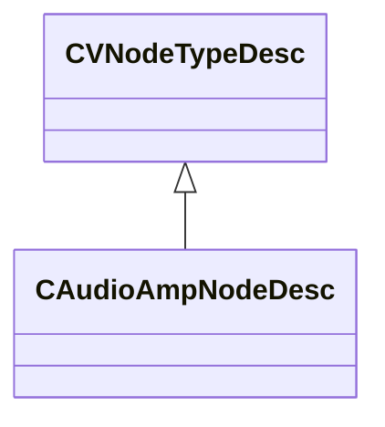
```mermaid
classDiagram
    CVNodeTypeDesc <|-- CAudioAmpNodeDesc
```

### CAudioAutoFilterNodeDesc

**Inherits from:** [CVAudioNodeBaseDesc](sounddoc_lib.md#cvaudionodebasedesc)

**Relationships:**

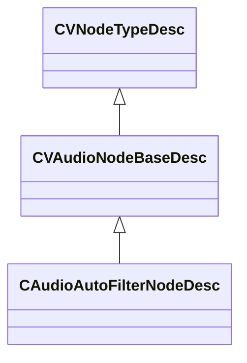
```mermaid
classDiagram
    CVAudioNodeBaseDesc <|-- CAudioAutoFilterNodeDesc
    CVNodeTypeDesc <|-- CVAudioNodeBaseDesc
```

### CAudioBlendDesc

**Inherits from:** [CVNodeTypeDesc](sounddoc_lib.md#cvnodetypedesc)

**Relationships:**

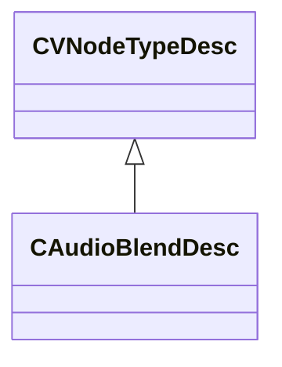
```mermaid
classDiagram
    CVNodeTypeDesc <|-- CAudioBlendDesc
```

### CAudioBoxverb2NodeDesc

**Inherits from:** [CVAudioNodeBaseDesc](sounddoc_lib.md#cvaudionodebasedesc)

**Relationships:**

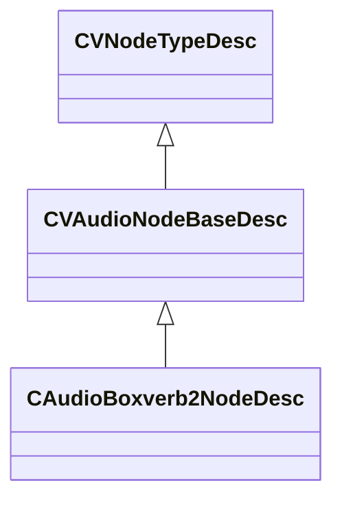
```mermaid
classDiagram
    CVAudioNodeBaseDesc <|-- CAudioBoxverb2NodeDesc
    CVNodeTypeDesc <|-- CVAudioNodeBaseDesc
```

### CAudioBoxverbNodeDesc

**Inherits from:** [CVAudioNodeBaseDesc](sounddoc_lib.md#cvaudionodebasedesc)

**Relationships:**

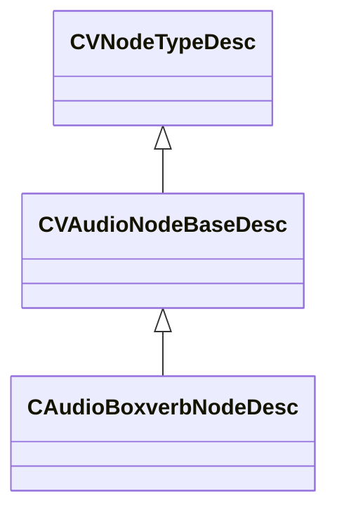
```mermaid
classDiagram
    CVAudioNodeBaseDesc <|-- CAudioBoxverbNodeDesc
    CVNodeTypeDesc <|-- CVAudioNodeBaseDesc
```

### CAudioConvolutionNodeDesc

**Inherits from:** [CVAudioNodeBaseDesc](sounddoc_lib.md#cvaudionodebasedesc)

**Relationships:**

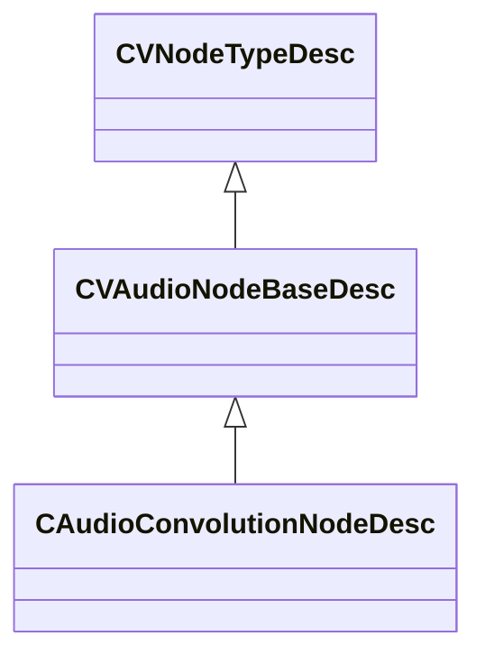
```mermaid
classDiagram
    CVAudioNodeBaseDesc <|-- CAudioConvolutionNodeDesc
    CVNodeTypeDesc <|-- CVAudioNodeBaseDesc
```

### CAudioDelayNodeDesc

**Inherits from:** [CVAudioNodeBaseDesc](sounddoc_lib.md#cvaudionodebasedesc)

**Relationships:**

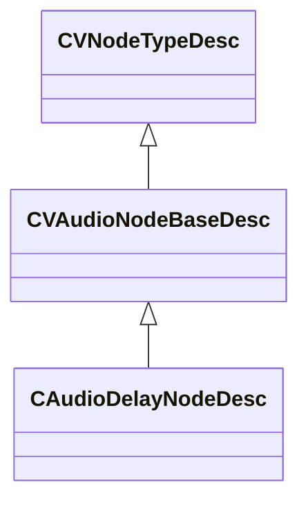
```mermaid
classDiagram
    CVAudioNodeBaseDesc <|-- CAudioDelayNodeDesc
    CVNodeTypeDesc <|-- CVAudioNodeBaseDesc
```

### CAudioDiffusorNodeDesc

**Inherits from:** [CVAudioNodeBaseDesc](sounddoc_lib.md#cvaudionodebasedesc)

**Relationships:**

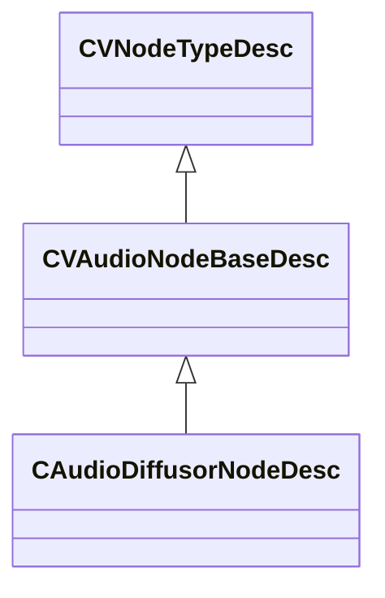
```mermaid
classDiagram
    CVAudioNodeBaseDesc <|-- CAudioDiffusorNodeDesc
    CVNodeTypeDesc <|-- CVAudioNodeBaseDesc
```

### CAudioDualCompressorNodeDesc

**Inherits from:** [CVNodeTypeDesc](sounddoc_lib.md#cvnodetypedesc)

**Relationships:**

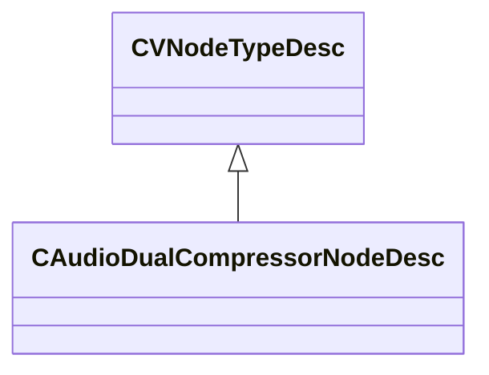
```mermaid
classDiagram
    CVNodeTypeDesc <|-- CAudioDualCompressorNodeDesc
```

### CAudioDynamics3BandNodeDesc

**Inherits from:** [CVAudioNodeBaseDesc](sounddoc_lib.md#cvaudionodebasedesc)

**Relationships:**

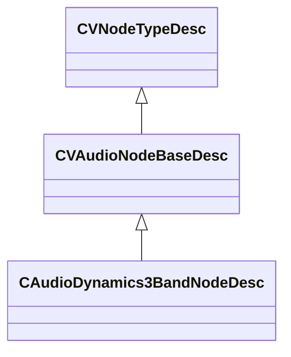
```mermaid
classDiagram
    CVAudioNodeBaseDesc <|-- CAudioDynamics3BandNodeDesc
    CVNodeTypeDesc <|-- CVAudioNodeBaseDesc
```

### CAudioDynamicsCompressorNodeDesc

**Inherits from:** [CVNodeTypeDesc](sounddoc_lib.md#cvnodetypedesc)

**Relationships:**

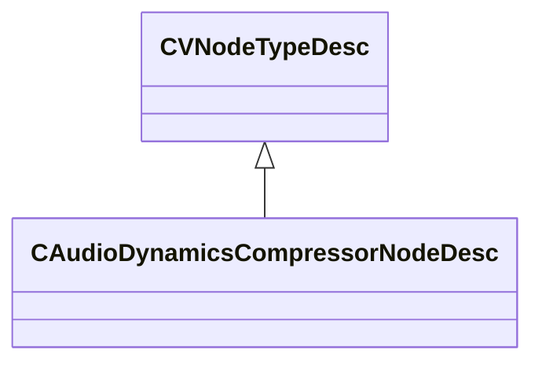
```mermaid
classDiagram
    CVNodeTypeDesc <|-- CAudioDynamicsCompressorNodeDesc
```

### CAudioDynamicsLimiterNodeDesc

**Inherits from:** [CVNodeTypeDesc](sounddoc_lib.md#cvnodetypedesc)

**Relationships:**

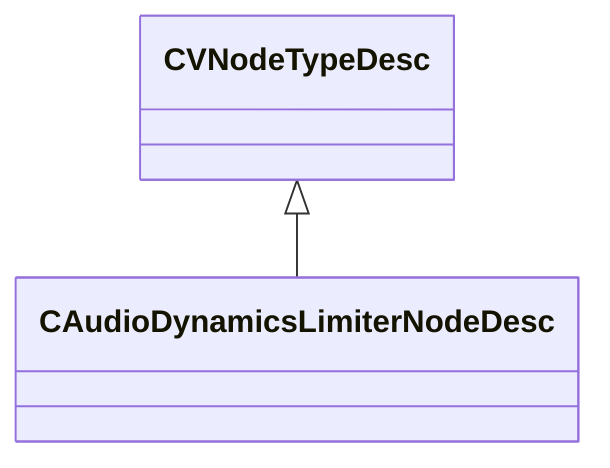
```mermaid
classDiagram
    CVNodeTypeDesc <|-- CAudioDynamicsLimiterNodeDesc
```

### CAudioDynamicsNodeDesc

**Inherits from:** [CVNodeTypeDesc](sounddoc_lib.md#cvnodetypedesc)

**Relationships:**

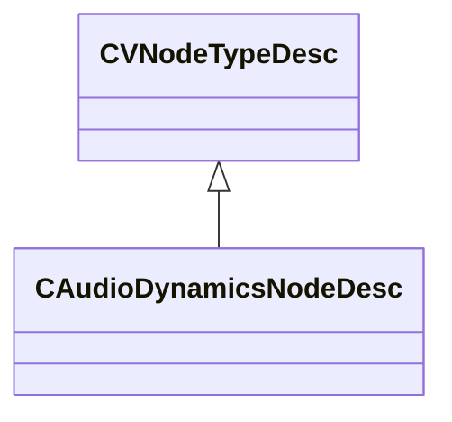
```mermaid
classDiagram
    CVNodeTypeDesc <|-- CAudioDynamicsNodeDesc
```

### CAudioEQ8NodeDesc

**Inherits from:** [CVAudioNodeBaseDesc](sounddoc_lib.md#cvaudionodebasedesc)

**Relationships:**

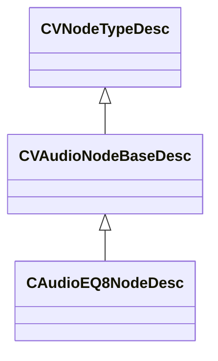
```mermaid
classDiagram
    CVAudioNodeBaseDesc <|-- CAudioEQ8NodeDesc
    CVNodeTypeDesc <|-- CVAudioNodeBaseDesc
```

### CAudioEffectChainNodeDesc

**Inherits from:** [CVAudioNodeBaseDesc](sounddoc_lib.md#cvaudionodebasedesc)

**Relationships:**

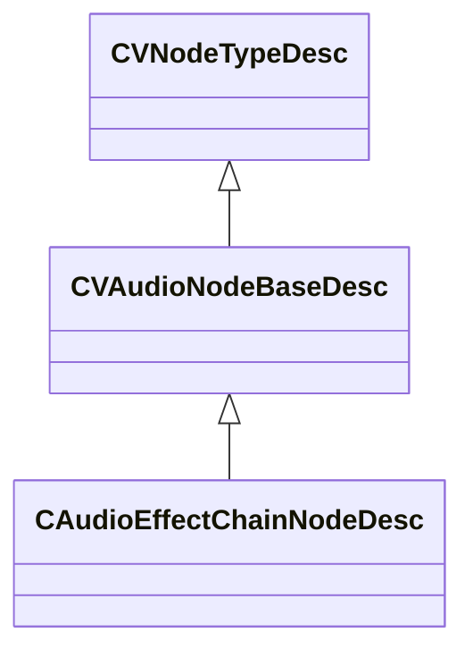
```mermaid
classDiagram
    CVAudioNodeBaseDesc <|-- CAudioEffectChainNodeDesc
    CVNodeTypeDesc <|-- CVAudioNodeBaseDesc
```

### CAudioEnvelopeNodeDesc

**Inherits from:** [CVAudioNodeBaseDesc](sounddoc_lib.md#cvaudionodebasedesc)

**Relationships:**

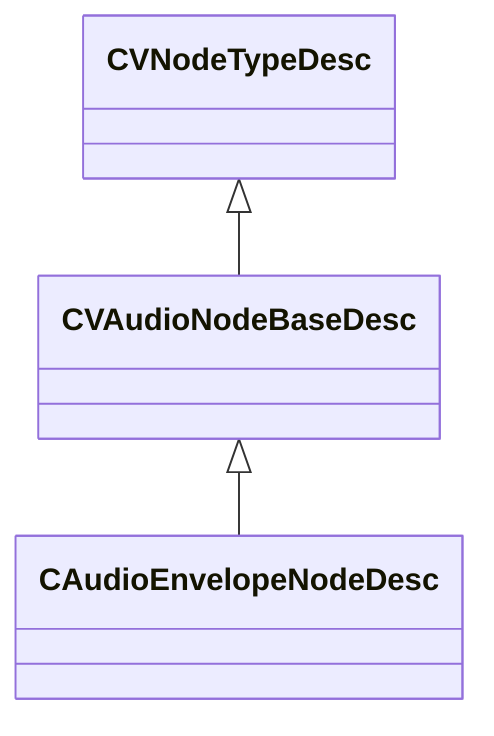
```mermaid
classDiagram
    CVAudioNodeBaseDesc <|-- CAudioEnvelopeNodeDesc
    CVNodeTypeDesc <|-- CVAudioNodeBaseDesc
```

### CAudioFilterNodeDesc

**Inherits from:** [CVAudioNodeBaseDesc](sounddoc_lib.md#cvaudionodebasedesc)

**Relationships:**

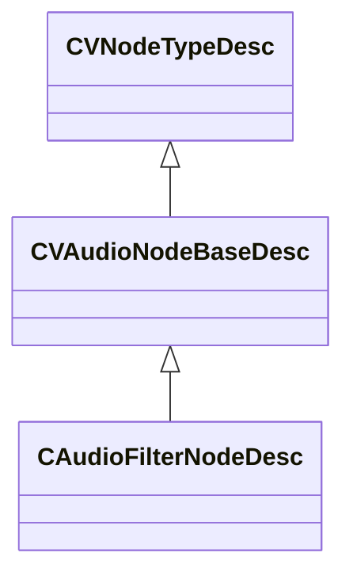
```mermaid
classDiagram
    CVAudioNodeBaseDesc <|-- CAudioFilterNodeDesc
    CVNodeTypeDesc <|-- CVAudioNodeBaseDesc
```

### CAudioFlangerNodeDesc

**Inherits from:** [CVAudioNodeBaseDesc](sounddoc_lib.md#cvaudionodebasedesc)

**Relationships:**

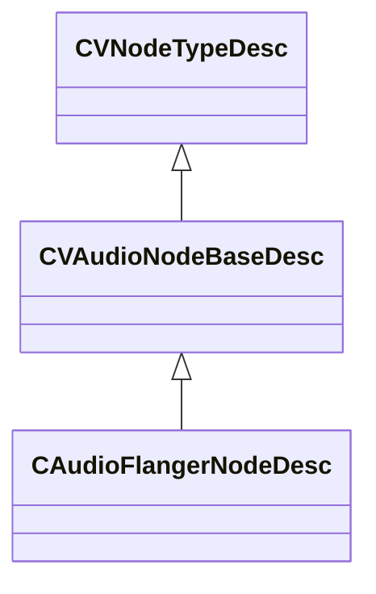
```mermaid
classDiagram
    CVAudioNodeBaseDesc <|-- CAudioFlangerNodeDesc
    CVNodeTypeDesc <|-- CVAudioNodeBaseDesc
```

### CAudioFreeverbNodeDesc

**Inherits from:** [CVAudioNodeBaseDesc](sounddoc_lib.md#cvaudionodebasedesc)

**Relationships:**

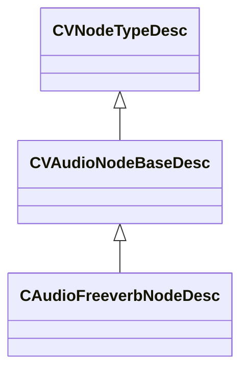
```mermaid
classDiagram
    CVAudioNodeBaseDesc <|-- CAudioFreeverbNodeDesc
    CVNodeTypeDesc <|-- CVAudioNodeBaseDesc
```

### CAudioMeterNodeDesc

**Inherits from:** [CVAudioNodeBaseDesc](sounddoc_lib.md#cvaudionodebasedesc)

**Relationships:**

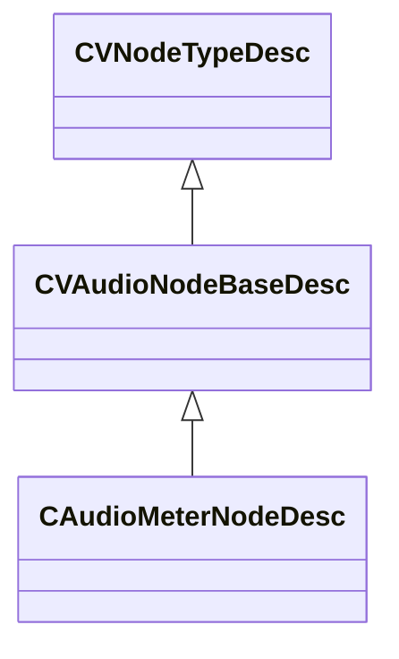
```mermaid
classDiagram
    CVAudioNodeBaseDesc <|-- CAudioMeterNodeDesc
    CVNodeTypeDesc <|-- CVAudioNodeBaseDesc
```

### CAudioMixerNodeDesc

**Inherits from:** [CVNodeTypeDesc](sounddoc_lib.md#cvnodetypedesc)

**Relationships:**

```mermaid
classDiagram
    CVNodeTypeDesc <|-- CAudioMixerNodeDesc
```

### CAudioModDelayNodeDesc

**Inherits from:** [CVAudioNodeBaseDesc](sounddoc_lib.md#cvaudionodebasedesc)

**Relationships:**

```mermaid
classDiagram
    CVAudioNodeBaseDesc <|-- CAudioModDelayNodeDesc
    CVNodeTypeDesc <|-- CVAudioNodeBaseDesc
```

### CAudioOscNodeDesc

**Inherits from:** [CVAudioNodeBaseDesc](sounddoc_lib.md#cvaudionodebasedesc)

**Relationships:**

```mermaid
classDiagram
    CVAudioNodeBaseDesc <|-- CAudioOscNodeDesc
    CVNodeTypeDesc <|-- CVAudioNodeBaseDesc
```

### CAudioOutputNodeDesc

**Inherits from:** [CVNodeTypeDesc](sounddoc_lib.md#cvnodetypedesc)

**Relationships:**

```mermaid
classDiagram
    CVNodeTypeDesc <|-- CAudioOutputNodeDesc
```

### CAudioPannerNodeDesc

**Inherits from:** [CVAudioNodeBaseDesc](sounddoc_lib.md#cvaudionodebasedesc)

**Relationships:**

```mermaid
classDiagram
    CVAudioNodeBaseDesc <|-- CAudioPannerNodeDesc
    CVNodeTypeDesc <|-- CVAudioNodeBaseDesc
```

### CAudioPitchShiftNodeDesc

**Inherits from:** [CVAudioNodeBaseDesc](sounddoc_lib.md#cvaudionodebasedesc)

**Relationships:**

```mermaid
classDiagram
    CVAudioNodeBaseDesc <|-- CAudioPitchShiftNodeDesc
    CVNodeTypeDesc <|-- CVAudioNodeBaseDesc
```

### CAudioPlateverbNodeDesc

**Inherits from:** [CVAudioNodeBaseDesc](sounddoc_lib.md#cvaudionodebasedesc)

**Relationships:**

```mermaid
classDiagram
    CVAudioNodeBaseDesc <|-- CAudioPlateverbNodeDesc
    CVNodeTypeDesc <|-- CVAudioNodeBaseDesc
```

### CAudioProcessorNodeDesc

**Inherits from:** [CVAudioNodeBaseDesc](sounddoc_lib.md#cvaudionodebasedesc)

**Relationships:**

```mermaid
classDiagram
    CVAudioNodeBaseDesc <|-- CAudioProcessorNodeDesc
    CVNodeTypeDesc <|-- CVAudioNodeBaseDesc
```

### CAudioShaperNodeDesc

**Inherits from:** [CVAudioNodeBaseDesc](sounddoc_lib.md#cvaudionodebasedesc)

**Relationships:**

```mermaid
classDiagram
    CVAudioNodeBaseDesc <|-- CAudioShaperNodeDesc
    CVNodeTypeDesc <|-- CVAudioNodeBaseDesc
```

### CAudioSourceNodeDesc

**Inherits from:** [CVAudioNodeBaseDesc](sounddoc_lib.md#cvaudionodebasedesc)

**Relationships:**

```mermaid
classDiagram
    CVAudioNodeBaseDesc <|-- CAudioSourceNodeDesc
    CVNodeTypeDesc <|-- CVAudioNodeBaseDesc
```

### CAudioSplitterBlendDesc

**Inherits from:** [CVAudioNodeBaseDesc](sounddoc_lib.md#cvaudionodebasedesc)

**Relationships:**

```mermaid
classDiagram
    CVAudioNodeBaseDesc <|-- CAudioSplitterBlendDesc
    CVNodeTypeDesc <|-- CVAudioNodeBaseDesc
```

### CAudioSplitterNodeDesc

**Inherits from:** [CVAudioNodeBaseDesc](sounddoc_lib.md#cvaudionodebasedesc)

**Relationships:**

```mermaid
classDiagram
    CVAudioNodeBaseDesc <|-- CAudioSplitterNodeDesc
    CVNodeTypeDesc <|-- CVAudioNodeBaseDesc
```

### CAudioSteamAudioPathingNodeDesc

**Inherits from:** [CVAudioNodeBaseDesc](sounddoc_lib.md#cvaudionodebasedesc)

**Relationships:**

```mermaid
classDiagram
    CVAudioNodeBaseDesc <|-- CAudioSteamAudioPathingNodeDesc
    CVNodeTypeDesc <|-- CVAudioNodeBaseDesc
```

### CAudioSteamAudioSourceNodeDesc

**Inherits from:** [CVAudioNodeBaseDesc](sounddoc_lib.md#cvaudionodebasedesc)

**Relationships:**

```mermaid
classDiagram
    CVAudioNodeBaseDesc <|-- CAudioSteamAudioSourceNodeDesc
    CVNodeTypeDesc <|-- CVAudioNodeBaseDesc
```

### CAudioSubgraphNodeDesc

**Inherits from:** [CVAudioNodeBaseDesc](sounddoc_lib.md#cvaudionodebasedesc)

**Relationships:**

```mermaid
classDiagram
    CVAudioNodeBaseDesc <|-- CAudioSubgraphNodeDesc
    CVNodeTypeDesc <|-- CVAudioNodeBaseDesc
```

### CAudioSubgraphSwitchNodeDesc

**Inherits from:** [CVAudioNodeBaseDesc](sounddoc_lib.md#cvaudionodebasedesc)

**Relationships:**

```mermaid
classDiagram
    CVAudioNodeBaseDesc <|-- CAudioSubgraphSwitchNodeDesc
    CVNodeTypeDesc <|-- CVAudioNodeBaseDesc
```

### CAudioTrackNodeDesc

**Inherits from:** [CVNodeTypeDesc](sounddoc_lib.md#cvnodetypedesc)

**Relationships:**

```mermaid
classDiagram
    CVNodeTypeDesc <|-- CAudioTrackNodeDesc
```

### CAudioUtilityNodeDesc

**Inherits from:** [CVAudioNodeBaseDesc](sounddoc_lib.md#cvaudionodebasedesc)

**Relationships:**

```mermaid
classDiagram
    CVAudioNodeBaseDesc <|-- CAudioUtilityNodeDesc
    CVNodeTypeDesc <|-- CVAudioNodeBaseDesc
```

### CAudioVocoderNodeDesc

**Inherits from:** [CVAudioNodeBaseDesc](sounddoc_lib.md#cvaudionodebasedesc)

**Relationships:**

```mermaid
classDiagram
    CVAudioNodeBaseDesc <|-- CAudioVocoderNodeDesc
    CVNodeTypeDesc <|-- CVAudioNodeBaseDesc
```

### CBlendVsndsToImpulseResponseNodeDesc

**Inherits from:** [CVNodeTypeDesc](sounddoc_lib.md#cvnodetypedesc)

**Relationships:**

```mermaid
classDiagram
    CVNodeTypeDesc <|-- CBlendVsndsToImpulseResponseNodeDesc
```

### CControlAutomaticNodeDesc

**Inherits from:** [CVNodeTypeDesc](sounddoc_lib.md#cvnodetypedesc)

**Relationships:**

```mermaid
classDiagram
    CVNodeTypeDesc <|-- CControlAutomaticNodeDesc
```

### CControlCrossfadeNodeDesc

**Inherits from:** [CVControlNodeBaseDesc](sounddoc_lib.md#cvcontrolnodebasedesc)

**Relationships:**

```mermaid
classDiagram
    CVControlNodeBaseDesc <|-- CControlCrossfadeNodeDesc
    CVNodeTypeDesc <|-- CVControlNodeBaseDesc
```

### CControlCurveNodeDesc

**Inherits from:** [CVNodeTypeDesc](sounddoc_lib.md#cvnodetypedesc)

**Relationships:**

```mermaid
classDiagram
    CVNodeTypeDesc <|-- CControlCurveNodeDesc
```

### CControlInputArrayNodeDesc

**Inherits from:** [CVNodeTypeDesc](sounddoc_lib.md#cvnodetypedesc)

**Relationships:**

```mermaid
classDiagram
    CVNodeTypeDesc <|-- CControlInputArrayNodeDesc
```

### CControlInputNodeDesc

**Inherits from:** [CVControlNodeBaseDesc](sounddoc_lib.md#cvcontrolnodebasedesc)

**Relationships:**

```mermaid
classDiagram
    CVControlNodeBaseDesc <|-- CControlInputNodeDesc
    CVNodeTypeDesc <|-- CVControlNodeBaseDesc
```

### CControlListenerNodeDesc

**Inherits from:** [CVNodeTypeDesc](sounddoc_lib.md#cvnodetypedesc)

**Relationships:**

```mermaid
classDiagram
    CVNodeTypeDesc <|-- CControlListenerNodeDesc
```

### CControlMeterNodeDesc

**Inherits from:** [CVControlNodeBaseDesc](sounddoc_lib.md#cvcontrolnodebasedesc)

**Relationships:**

```mermaid
classDiagram
    CVControlNodeBaseDesc <|-- CControlMeterNodeDesc
    CVNodeTypeDesc <|-- CVControlNodeBaseDesc
```

**Fields:**

| Name | Type | Annotations |
|------|------|-------------|
| `m_bIsSubgraph` | bool |  |

### CControlOutputNodeDesc

**Inherits from:** [CVControlNodeBaseDesc](sounddoc_lib.md#cvcontrolnodebasedesc)

**Relationships:**

```mermaid
classDiagram
    CVControlNodeBaseDesc <|-- CControlOutputNodeDesc
    CVNodeTypeDesc <|-- CVControlNodeBaseDesc
```

### CControlRemapNodeDesc

**Inherits from:** [CVNodeTypeDesc](sounddoc_lib.md#cvnodetypedesc)

**Relationships:**

```mermaid
classDiagram
    CVNodeTypeDesc <|-- CControlRemapNodeDesc
```

### CControlStackInputNodeDesc

**Inherits from:** [CVControlNodeBaseDesc](sounddoc_lib.md#cvcontrolnodebasedesc)

**Relationships:**

```mermaid
classDiagram
    CVControlNodeBaseDesc <|-- CControlStackInputNodeDesc
    CVNodeTypeDesc <|-- CVControlNodeBaseDesc
```

### CDelayImpulseResponseNodeDesc

**Inherits from:** [CVNodeTypeDesc](sounddoc_lib.md#cvnodetypedesc)

**Relationships:**

```mermaid
classDiagram
    CVNodeTypeDesc <|-- CDelayImpulseResponseNodeDesc
```

### CEffectNameInputNodeDesc

**Inherits from:** [CVNodeTypeDesc](sounddoc_lib.md#cvnodetypedesc)

**Relationships:**

```mermaid
classDiagram
    CVNodeTypeDesc <|-- CEffectNameInputNodeDesc
```

### CEffectsPreviewList

**Metadata:** `MGetKV3ClassDefaults {
	"m_previewGraphInput": "",
	"m_flMix": 1.000000,
	"m_previewList":
	{
		"m_sounds":
		[
		],
		"m_bPreviewInGame": false
	}
}`

**Relationships:**

```mermaid
classDiagram
    CEffectsPreviewList *-- CPreviewList
```

**Fields:**

| Name | Type | Annotations |
|------|------|-------------|
| `m_previewGraphInput` | CUtlString |  |
| `m_flMix` | float32 |  |
| `m_previewList` | [CPreviewList](../schemas/sounddoc_lib.md#cpreviewlist) |  |

### CFilterStage

**Metadata:** `MGetKV3ClassDefaults {
	"m_filterType": "FILTER_LOWPASS",
	"m_flFrequency": 11025.000000,
	"m_flQ": 0.707000,
	"m_fldbGain": 1.000000,
	"m_nFilterSlope": "FILTER_SLOPE_12dB",
	"m_bEnable": true
}`

**Relationships:**

```mermaid
classDiagram
    CFilterStage *-- VMixFilterSlope_t
```

**Fields:**

| Name | Type | Annotations |
|------|------|-------------|
| `m_filterType` | CUtlString | `MPropertyAttributeChoiceName filter_type` `MPropertyFriendlyName Filter Type` |
| `m_flFrequency` | float32 | `MPropertyAttributeRange biased 20 22000` `MPropertyFriendlyName Center Frequency (Hz)` |
| `m_flQ` | float32 | `MPropertyAttributeRange 0.1 12` `MPropertyFriendlyName Q` |
| `m_fldbGain` | float32 | `MPropertyAttributeRange -24 24` `MPropertyFriendlyName Gain (dB)` |
| `m_nFilterSlope` | [VMixFilterSlope_t](../schemas/!GlobalTypes.md#vmixfilterslope_t) | `MPropertyFriendlyName Slope` |
| `m_bEnable` | bool | `MPropertyFriendlyName Enabled` |

### CGraphEditorState

**Metadata:** `MGetKV3ClassDefaults {
	"m_viewConfig":
	{
		"XAxis":
		{
			"pos": 0.000000,
			"scrollpos": 0,
			"min": 0.000000,
			"max": 1.000000,
			"scale": 1.000000
		},
		"YAxis":
		{
			"pos": 0.000000,
			"scrollpos": 0,
			"min": 0.000000,
			"max": 1.000000,
			"scale": 1.000000
		}
	}
}`

**Fields:**

| Name | Type | Annotations |
|------|------|-------------|
| `m_viewConfig` | CGraphEditorViewConfig |  |

### CGraphPreviewList

**Metadata:** `MGetKV3ClassDefaults {
	"m_flVolume": 1.000000,
	"m_previewList":
	{
		"m_sounds":
		[
		],
		"m_bPreviewInGame": false
	}
}`

**Relationships:**

```mermaid
classDiagram
    CGraphPreviewList *-- CPreviewList
```

**Fields:**

| Name | Type | Annotations |
|------|------|-------------|
| `m_flVolume` | float32 |  |
| `m_previewList` | [CPreviewList](../schemas/sounddoc_lib.md#cpreviewlist) |  |

### CImpulseResponseInputNodeDesc

**Inherits from:** [CVNodeTypeDesc](sounddoc_lib.md#cvnodetypedesc)

**Relationships:**

```mermaid
classDiagram
    CVNodeTypeDesc <|-- CImpulseResponseInputNodeDesc
```

### CMixAmp

**Inherits from:** [CMixPropertyBase](sounddoc_lib.md#cmixpropertybase)

**Metadata:** `MGetKV3ClassDefaults {
	"_class": "CMixAmp",
	"m_name": "",
	"m_Comment": "",
	"m_bActive": true,
	"m_bSolo": false,
	"m_bEditProperties": false,
	"m_flVolume": 1.000000
}`, `MPropertyDescription Adjust the volume of an audio track.`, `MPropertyFriendlyName Mix Amp`

**Relationships:**

```mermaid
classDiagram
    CMixPropertyBase <|-- CMixAmp
```

**Fields:**

| Name | Type | Annotations |
|------|------|-------------|
| `m_flVolume` | float32 | `MPropertyDescription Default volume scale (0-1) if not automated by connecting the volume input.` |

### CMixAudioMeter

**Inherits from:** [CMixPropertyBase](sounddoc_lib.md#cmixpropertybase)

**Metadata:** `MGetKV3ClassDefaults {
	"_class": "CMixAudioMeter",
	"m_name": "",
	"m_Comment": "",
	"m_bActive": true,
	"m_bSolo": false,
	"m_bEditProperties": true,
	"m_flLeftLevel": 0.000000,
	"m_flLeftPeak": 0.000000,
	"m_flRightLevel": 0.000000,
	"m_flRightPeak": 0.000000
}`, `MPropertyDescription This lets you meter an audio signal in vmixtool.`, `MPropertyFriendlyName VMix Audio Meter Node`

**Relationships:**

```mermaid
classDiagram
    CMixPropertyBase <|-- CMixAudioMeter
```

**Fields:**

| Name | Type | Annotations |
|------|------|-------------|
| `m_flLeftLevel` | float32 |  |
| `m_flLeftPeak` | float32 |  |
| `m_flRightLevel` | float32 |  |
| `m_flRightPeak` | float32 |  |

### CMixAudioSource

**Inherits from:** [CMixPropertyBase](sounddoc_lib.md#cmixpropertybase)

**Metadata:** `MGetKV3ClassDefaults {
	"_class": "CMixAudioSource",
	"m_name": "",
	"m_Comment": "",
	"m_bActive": true,
	"m_bSolo": false,
	"m_bEditProperties": false,
	"m_kvContainer":
	{
		"_class": "CVoiceContainerLoopTrigger",
		"m_flFadeTime": 0.750000,
		"m_flRetriggerTimeMin": 1.000000,
		"m_flRetriggerTimeMax": 3.000000,
		"m_bCrossFade": false,
		"m_sound":
		{
			"m_bUseReference": true,
			"m_sound": "sounds/_devonly/weapons/ak47/ak47_mech_04.vsnd"
		}
	}
}`, `MPropertyDescription Plays a vsnd container.`, `MPropertyFriendlyName VMix Source Audio Node`

**Relationships:**

```mermaid
classDiagram
    CMixPropertyBase <|-- CMixAudioSource
```

**Fields:**

| Name | Type | Annotations |
|------|------|-------------|
| `m_kvContainer` | KeyValues3 |  |

### CMixAutoFilter

**Inherits from:** [CMixPropertyBase](sounddoc_lib.md#cmixpropertybase)

**Metadata:** `MGetKV3ClassDefaults {
	"_class": "CMixAutoFilter",
	"m_name": "",
	"m_Comment": "",
	"m_bActive": true,
	"m_bSolo": false,
	"m_bEditProperties": false,
	"m_desc":
	{
		"m_flEnvelopeAmount": 0.000000,
		"m_flAttackTimeMS": 5.000000,
		"m_flReleaseTimeMS": 200.000000,
		"m_filter":
		{
			"m_nFilterType": "FILTER_LOWPASS",
			"m_nFilterSlope": "FILTER_SLOPE_12dB",
			"m_bEnabled": true,
			"m_fldbGain": 0.000000,
			"m_flCutoffFreq": 1000.000000,
			"m_flQ": 0.707107
		},
		"m_flLFOAmount": 0.000000,
		"m_flLFORate": 0.000000,
		"m_flPhase": 0.000000,
		"m_nLFOShape": "LFO_SHAPE_SINE"
	}
}`, `MPropertyDescription A continuously variable filter that can be driven by a built-in envelope follower and/or LFO.  Stereo channels can be processed differently by adjusting the phase parameter.`, `MPropertyFriendlyName VMix Auto Filter Node`

**Relationships:**

```mermaid
classDiagram
    CMixPropertyBase <|-- CMixAutoFilter
    CMixAutoFilter *-- VMixAutoFilterDesc_t
```

**Fields:**

| Name | Type | Annotations |
|------|------|-------------|
| `m_desc` | [VMixAutoFilterDesc_t](../schemas/soundsystem_lowlevel.md#vmixautofilterdesc_t) | `MPropertyAutoExpandSelf` |

### CMixBlendAudio

**Inherits from:** [CMixPropertyBase](sounddoc_lib.md#cmixpropertybase)

**Metadata:** `MGetKV3ClassDefaults {
	"_class": "CMixBlendAudio",
	"m_name": "",
	"m_Comment": "",
	"m_bActive": true,
	"m_bSolo": false,
	"m_bEditProperties": false,
	"m_flLockAmount": 0.000000
}`, `MPropertyDescription This node will do a pairwise blend through a set of audio signals.  It will blend through as many different signals as you connect.  A blend factor of 0.0 is 100% the first signal, and a blend factor of 1.0 is 100% the last signal.`, `MPropertyFriendlyName VMix Blend Audio Node`

**Relationships:**

```mermaid
classDiagram
    CMixPropertyBase <|-- CMixBlendAudio
```

**Fields:**

| Name | Type | Annotations |
|------|------|-------------|
| `m_flLockAmount` | float32 | `MPropertyDescription Lock to inputs.  This makes each input "sticky" instead of smoothly varying between each source it will stick to one for some range of the parameter space.` `MPropertyFriendlyName Lock to input (0-1)` |

### CMixBlendVsndsToImpulseResponse

**Inherits from:** [CMixPropertyBase](sounddoc_lib.md#cmixpropertybase)

**Metadata:** `MGetKV3ClassDefaults {
	"_class": "CMixBlendVsndsToImpulseResponse",
	"m_name": "",
	"m_Comment": "",
	"m_bActive": true,
	"m_bSolo": false,
	"m_bEditProperties": false,
	"m_flWeight0": 1.000000,
	"m_flWeight1": 1.000000,
	"m_flWeight2": 1.000000,
	"m_flWeight3": 1.000000,
	"m_flWeight4": 1.000000,
	"m_flWeight5": 1.000000,
	"m_flWeight6": 1.000000,
	"m_flWeight7": 1.000000,
	"m_flPreDelayMS0": 0.000000,
	"m_flPreDelayMS1": 0.000000,
	"m_flPreDelayMS2": 0.000000,
	"m_flPreDelayMS3": 0.000000,
	"m_flPreDelayMS4": 0.000000,
	"m_flPreDelayMS5": 0.000000,
	"m_flPreDelayMS6": 0.000000,
	"m_flPreDelayMS7": 0.000000
}`, `MPropertyDescription Blends up to 8 vsnds to an impulse response.`, `MPropertyFriendlyName VMix Blend VSnds to Impulse Response Node`

**Relationships:**

```mermaid
classDiagram
    CMixPropertyBase <|-- CMixBlendVsndsToImpulseResponse
```

**Fields:**

| Name | Type | Annotations |
|------|------|-------------|
| `m_flWeight0` | float32 | `MPropertyFriendlyName Weight:0` |
| `m_flWeight1` | float32 | `MPropertyFriendlyName Weight:1` |
| `m_flWeight2` | float32 | `MPropertyFriendlyName Weight:2` |
| `m_flWeight3` | float32 | `MPropertyFriendlyName Weight:3` |
| `m_flWeight4` | float32 | `MPropertyFriendlyName Weight:4` |
| `m_flWeight5` | float32 | `MPropertyFriendlyName Weight:5` |
| `m_flWeight6` | float32 | `MPropertyFriendlyName Weight:6` |
| `m_flWeight7` | float32 | `MPropertyFriendlyName Weight:7` |
| `m_flPreDelayMS0` | float32 | `MPropertyFriendlyName PreDelayMS:0` |
| `m_flPreDelayMS1` | float32 | `MPropertyFriendlyName PreDelayMS:1` |
| `m_flPreDelayMS2` | float32 | `MPropertyFriendlyName PreDelayMS:2` |
| `m_flPreDelayMS3` | float32 | `MPropertyFriendlyName PreDelayMS:3` |
| `m_flPreDelayMS4` | float32 | `MPropertyFriendlyName PreDelayMS:4` |
| `m_flPreDelayMS5` | float32 | `MPropertyFriendlyName PreDelayMS:5` |
| `m_flPreDelayMS6` | float32 | `MPropertyFriendlyName PreDelayMS:6` |
| `m_flPreDelayMS7` | float32 | `MPropertyFriendlyName PreDelayMS:7` |

### CMixBoxverb

**Inherits from:** [CMixPropertyBase](sounddoc_lib.md#cmixpropertybase)

**Metadata:** `MGetKV3ClassDefaults {
	"_class": "CMixBoxverb",
	"m_name": "",
	"m_Comment": "",
	"m_bActive": true,
	"m_bSolo": false,
	"m_bEditProperties": false,
	"m_flSizeMax": 100.000000,
	"m_flSizeMin": 0.000000,
	"m_flComplexity": 4.000000,
	"m_flModDepth": 0.000000,
	"m_flModRate": 0.000000,
	"m_bParallel": false,
	"m_filterType":
	{
		"m_nFilterType": "FILTER_LOWPASS",
		"m_nFilterSlope": "FILTER_SLOPE_12dB",
		"m_bEnabled": true,
		"m_fldbGain": 0.000000,
		"m_flCutoffFreq": 1000.000000,
		"m_flQ": 0.707107
	},
	"m_flWidth": 20.000000,
	"m_flHeight": 23.000000,
	"m_flDepth": 27.000000,
	"m_flFeedbackScale": 0.150000,
	"m_flFeedbackWidth": 0.000000,
	"m_flFeedbackHeight": 0.000000,
	"m_flFeedbackDepth": 0.000000,
	"m_flOutputGain": 0.000000,
	"m_flTaps": 0.000000
}`, `MPropertyDescription A simple reverb that approximates the reflections of a box-shaped room, copied from previous audio system.`, `MPropertyFriendlyName Legacy VMix Shoebox Reverb Node`

**Relationships:**

```mermaid
classDiagram
    CMixPropertyBase <|-- CMixBoxverb
    CMixBoxverb *-- VMixFilterDesc_t
```

**Fields:**

| Name | Type | Annotations |
|------|------|-------------|
| `m_flSizeMax` | float32 | `MPropertyAttributeRange 0.0 1000.0` `MPropertyDescription The reverb can be parameterized either by a delay range (min/max delay in milliseconds) OR by a delay size for each dimension of a box (width/height/depth). If you set width, height, or depth to anything other than zero, these min/max fields will not be used.` `MPropertyFriendlyName Max Size (milliseconds)` |
| `m_flSizeMin` | float32 | `MPropertyAttributeRange 0.0 1000.0` `MPropertyDescription The reverb can be parameterized either by a delay range (min/max delay in milliseconds) OR by a delay size for each dimension of a box (width/height/depth). If you set width, height, or depth to anything other than zero, these min/max fields will not be used.` `MPropertyFriendlyName Min Size (milliseconds)` |
| `m_flComplexity` | float32 | `MPropertyAttributeRange 1.01 12.0` `MPropertyDescription The complexity is how many delays are spread along the total delay length.  Max is 12.  More delays will give your space more reflections (more geometric complexity).` `MPropertyFriendlyName Complexity` |
| `m_flModDepth` | float32 | `MPropertyAttributeRange 0.0 100` `MPropertyDescription This is a percentage of the delay length to modulate. 100 means you will modulate between 0 and the max delay.  10 means the delay will modulate between 90 and 100 percent of max delay.` `MPropertyFriendlyName Mod Depth (milliseconds)` |
| `m_flModRate` | float32 | `MPropertyAttributeRange 0.0 10.0` `MPropertyDescription This is the rate at which the delay length changes.  1 means change the delay every delaytime milliseconds.  2 means change the delay after 2*delaytime milliseconds.` `MPropertyFriendlyName Mod Rate (# of delay intervals before mod)` |
| `m_bParallel` | bool | `MPropertyDescription If true the filter is applied to the signal before output.  If false the filter is applied while feeding back into each delay line.` `MPropertyFriendlyName Parallalelize Filter` |
| `m_filterType` | [VMixFilterDesc_t](../schemas/soundsystem_lowlevel.md#vmixfilterdesc_t) | `MPropertyDescription Configure the filter to apply to the delay output.  Usually this should be a lowpass filter.` `MPropertyFriendlyName Filter Type` `MPropertyGroupName Filter` |
| `m_flWidth` | float32 | `MPropertyAttributeRange 0 1000.0` `MPropertyDescription If width, height, or depth is set min/max size will be ignored.  These dimensions are the size of the room in milliseconds to first reflection.` `MPropertyFriendlyName Width (milliseconds)` |
| `m_flHeight` | float32 | `MPropertyAttributeRange 0 1000.0` `MPropertyDescription If width, height, or depth is set min/max size will be ignored.  These dimensions are the size of the room in milliseconds to first reflection.` `MPropertyFriendlyName Height (milliseconds)` |
| `m_flDepth` | float32 | `MPropertyAttributeRange 0 1000.0` `MPropertyDescription If width, height, or depth is set min/max size will be ignored.  These dimensions are the size of the room in milliseconds to first reflection.` `MPropertyFriendlyName Depth (milliseconds)` |
| `m_flFeedbackScale` | float32 | `MPropertyAttributeRange 0 1` `MPropertyDescription How much of the signal to send to the delay lines.  How loud the reflections are.` `MPropertyFriendlyName Feedback Scale` |
| `m_flFeedbackWidth` | float32 | `MPropertyAttributeRange -1.0 1.0` `MPropertyDescription Additional amp on the width dimension reflections.  Note negative numbers mean this feedback bypasses the filter (predelay).` `MPropertyFriendlyName Width Reflectivity` |
| `m_flFeedbackHeight` | float32 | `MPropertyAttributeRange -1.0 1.0` `MPropertyDescription Additional amp on the height dimension reflections.  Note negative numbers mean this feedback bypasses the filter (predelay).` `MPropertyFriendlyName Height Reflectivity` |
| `m_flFeedbackDepth` | float32 | `MPropertyAttributeRange -1.0 1.0` `MPropertyDescription Additional amp on the depth dimension reflections.  Note negative numbers mean this feedback bypasses the filter (predelay).` `MPropertyFriendlyName Depth  Reflectivity` |
| `m_flOutputGain` | float32 | `MPropertyAttributeRange -24.0 -0.1` `MPropertyDescription Amplification at output in dB for tuning.` `MPropertyFriendlyName Output Gain (dB)` |
| `m_flTaps` | float32 | `MPropertyAttributeRange 0 0.333` `MPropertyDescription If zero there are no extra taps.  If non-zero there will be 3 extra taps and this value will adjust their relative phase.` `MPropertyFriendlyName Extra Tap Scale` |

### CMixBoxverb2

**Inherits from:** [CMixPropertyBase](sounddoc_lib.md#cmixpropertybase)

**Metadata:** `MGetKV3ClassDefaults {
	"_class": "CMixBoxverb2",
	"m_name": "",
	"m_Comment": "",
	"m_bActive": true,
	"m_bSolo": false,
	"m_bEditProperties": false,
	"m_flSizeMax": 100.000000,
	"m_flSizeMin": 0.000000,
	"m_flComplexity": 4.000000,
	"m_flModDepth": 0.000000,
	"m_flModRate": 0.000000,
	"m_bParallel": false,
	"m_filterType":
	{
		"m_nFilterType": "FILTER_LOWPASS",
		"m_nFilterSlope": "FILTER_SLOPE_12dB",
		"m_bEnabled": true,
		"m_fldbGain": 0.000000,
		"m_flCutoffFreq": 1000.000000,
		"m_flQ": 0.707107
	},
	"m_flWidth": 20.000000,
	"m_flHeight": 23.000000,
	"m_flDepth": 27.000000,
	"m_flFeedbackScale": 0.150000,
	"m_flFeedbackWidth": 0.000000,
	"m_flFeedbackHeight": 0.000000,
	"m_flFeedbackDepth": 0.000000,
	"m_flWetMix": 0.000000,
	"m_flOutputGain": 0.000000,
	"m_flTaps": 0.000000
}`, `MPropertyDescription A simple reverb that approximates the reflections of a box-shaped room.`, `MPropertyFriendlyName VMix Shoebox Reverb Node v2`

**Relationships:**

```mermaid
classDiagram
    CMixPropertyBase <|-- CMixBoxverb2
    CMixBoxverb2 *-- VMixFilterDesc_t
```

**Fields:**

| Name | Type | Annotations |
|------|------|-------------|
| `m_flSizeMax` | float32 | `MPropertyAttributeRange 0.0 1000.0` `MPropertyDescription The reverb can be parameterized either by a delay range (min/max delay in milliseconds) OR by a delay size for each dimension of a box (width/height/depth). If you set width, height, or depth to anything other than zero, these min/max fields will not be used.` `MPropertyFriendlyName Max Size (milliseconds)` |
| `m_flSizeMin` | float32 | `MPropertyAttributeRange 0.0 1000.0` `MPropertyDescription The reverb can be parameterized either by a delay range (min/max delay in milliseconds) OR by a delay size for each dimension of a box (width/height/depth). If you set width, height, or depth to anything other than zero, these min/max fields will not be used.` `MPropertyFriendlyName Min Size (milliseconds)` |
| `m_flComplexity` | float32 | `MPropertyAttributeRange 1.01 12.0` `MPropertyDescription The complexity is how many delays are spread along the total delay length.  Max is 12.  More delays will give your space more reflections (more geometric complexity).` `MPropertyFriendlyName Complexity` |
| `m_flModDepth` | float32 | `MPropertyAttributeRange 0.0 100` `MPropertyDescription This is a percentage of the delay length to modulate. 100 means you will modulate between 0 and the max delay.  10 means the delay will modulate between 90 and 100 percent of max delay.` `MPropertyFriendlyName Mod Depth (milliseconds)` |
| `m_flModRate` | float32 | `MPropertyAttributeRange 0.0 10.0` `MPropertyDescription This is the rate at which the delay length changes.  1 means change the delay every delaytime milliseconds.  2 means change the delay after 2*delaytime milliseconds.` `MPropertyFriendlyName Mod Rate (# of delay intervals before mod)` |
| `m_bParallel` | bool | `MPropertyDescription If true the filter is applied to the signal before output.  If false the filter is applied while feeding back into each delay line.` `MPropertyFriendlyName Parallalelize Filter` |
| `m_filterType` | [VMixFilterDesc_t](../schemas/soundsystem_lowlevel.md#vmixfilterdesc_t) | `MPropertyDescription Configure the filter to apply to the delay output.  Usually this should be a lowpass filter.` `MPropertyFriendlyName Filter Type` `MPropertyGroupName Filter` |
| `m_flWidth` | float32 | `MPropertyAttributeRange 0 1000.0` `MPropertyDescription If width, height, or depth is set min/max size will be ignored.  These dimensions are the size of the room in milliseconds to first reflection.` `MPropertyFriendlyName Width (milliseconds)` |
| `m_flHeight` | float32 | `MPropertyAttributeRange 0 1000.0` `MPropertyDescription If width, height, or depth is set min/max size will be ignored.  These dimensions are the size of the room in milliseconds to first reflection.` `MPropertyFriendlyName Height (milliseconds)` |
| `m_flDepth` | float32 | `MPropertyAttributeRange 0 1000.0` `MPropertyDescription If width, height, or depth is set min/max size will be ignored.  These dimensions are the size of the room in milliseconds to first reflection.` `MPropertyFriendlyName Depth (milliseconds)` |
| `m_flFeedbackScale` | float32 | `MPropertyAttributeRange 0 1` `MPropertyDescription How much of the signal to send to the delay lines.  How loud the reflections are.` `MPropertyFriendlyName Feedback Scale` |
| `m_flFeedbackWidth` | float32 | `MPropertyAttributeRange -1.0 1.0` `MPropertyDescription Additional amp on the width dimension reflections.  Note negative numbers mean this feedback bypasses the filter (predelay).` `MPropertyFriendlyName Width Reflectivity` |
| `m_flFeedbackHeight` | float32 | `MPropertyAttributeRange -1.0 1.0` `MPropertyDescription Additional amp on the height dimension reflections.  Note negative numbers mean this feedback bypasses the filter (predelay).` `MPropertyFriendlyName Height Reflectivity` |
| `m_flFeedbackDepth` | float32 | `MPropertyAttributeRange -1.0 1.0` `MPropertyDescription Additional amp on the depth dimension reflections.  Note negative numbers mean this feedback bypasses the filter (predelay).` `MPropertyFriendlyName Depth  Reflectivity` |
| `m_flWetMix` | float32 | `MPropertyFriendlyName Dry/Wet` |
| `m_flOutputGain` | float32 | `MPropertyAttributeRange -24.0 -0.1` `MPropertyDescription Amplification at output in dB for tuning, applied after Wet/Dry mix` `MPropertyFriendlyName Output Gain (dB)` |
| `m_flTaps` | float32 | `MPropertyAttributeRange 0 0.333` `MPropertyDescription If zero there are no extra taps.  If non-zero there will be 3 extra taps and this value will adjust their relative phase.` `MPropertyFriendlyName Extra Tap Scale` |

### CMixControlAutomatic

**Inherits from:** [CMixPropertyBase](sounddoc_lib.md#cmixpropertybase)

**Metadata:** `MGetKV3ClassDefaults {
	"_class": "CMixControlAutomatic",
	"m_name": "",
	"m_Comment": "",
	"m_bActive": true,
	"m_bSolo": false,
	"m_bEditProperties": false
}`, `MPropertyDescription This will automatically forward a variable from the sound event that can be used to drive graph behavior.`, `MPropertyFriendlyName VMix Automatic Control Node`

**Relationships:**

```mermaid
classDiagram
    CMixPropertyBase <|-- CMixControlAutomatic
```

### CMixControlCrossfade

**Inherits from:** [CMixPropertyBase](sounddoc_lib.md#cmixpropertybase)

**Metadata:** `MGetKV3ClassDefaults {
	"_class": "CMixControlCrossfade",
	"m_name": "",
	"m_Comment": "",
	"m_bActive": true,
	"m_bSolo": false,
	"m_bEditProperties": false,
	"m_flFadeStart": 0.000000,
	"m_flFadeEnd": 1.000000
}`, `MPropertyDescription Generates two control signals from a single input that can be used to drive an equal power volume crossfade.`, `MPropertyFriendlyName VMix Crossfade Control Node`

**Relationships:**

```mermaid
classDiagram
    CMixPropertyBase <|-- CMixControlCrossfade
```

**Fields:**

| Name | Type | Annotations |
|------|------|-------------|
| `m_flFadeStart` | float32 | `MPropertyFriendlyName Fade Start` |
| `m_flFadeEnd` | float32 | `MPropertyFriendlyName Fade End` |

### CMixControlCurve

**Inherits from:** [CMixPropertyBase](sounddoc_lib.md#cmixpropertybase)

**Metadata:** `MGetKV3ClassDefaults {
	"_class": "CMixControlCurve",
	"m_name": "",
	"m_Comment": "",
	"m_bActive": true,
	"m_bSolo": false,
	"m_bEditProperties": false,
	"m_flInputMin": 0.000000,
	"m_flInputMax": 1.000000,
	"m_flOutputMin": 0.000000,
	"m_flOutputMax": 1.000000,
	"m_curve":
	{
		"m_spline":
		[
			{
				"x": 0.000000,
				"y": 0.000000,
				"m_flSlopeIncoming": 1.000000,
				"m_flSlopeOutgoing": 1.000000
			},
			{
				"x": 1.000000,
				"y": 1.000000,
				"m_flSlopeIncoming": 1.000000,
				"m_flSlopeOutgoing": 1.000000
			}
		],
		"m_tangents":
		[
			{
				"m_nIncomingTangent": "CURVE_TANGENT_SPLINE",
				"m_nOutgoingTangent": "CURVE_TANGENT_SPLINE"
			},
			{
				"m_nIncomingTangent": "CURVE_TANGENT_SPLINE",
				"m_nOutgoingTangent": "CURVE_TANGENT_SPLINE"
			}
		],
		"m_vDomainMins":
		[
			0.000000,
			0.000000
		],
		"m_vDomainMaxs":
		[
			0.000000,
			0.000000
		]
	}
}`, `MPropertyDescription Remap a control variable through a curve that you define.`, `MPropertyFriendlyName VMix Control Curve Node`

**Relationships:**

```mermaid
classDiagram
    CMixPropertyBase <|-- CMixControlCurve
```

**Fields:**

| Name | Type | Annotations |
|------|------|-------------|
| `m_flInputMin` | float32 |  |
| `m_flInputMax` | float32 |  |
| `m_flOutputMin` | float32 |  |
| `m_flOutputMax` | float32 |  |
| `m_curve` | CPiecewiseCurve | `MPropertySuppressField` |

### CMixControlInput

**Inherits from:** [CMixPropertyBase](sounddoc_lib.md#cmixpropertybase)

**Metadata:** `MGetKV3ClassDefaults {
	"_class": "CMixControlInput",
	"m_name": "",
	"m_Comment": "",
	"m_bActive": true,
	"m_bSolo": false,
	"m_bEditProperties": false,
	"m_flDefaultValue": 1.000000,
	"m_flMinRange": 0.000000,
	"m_flMaxRange": 1.000000,
	"m_bUseDecibels": false
}`, `MPropertyDescription Define a control variable that can be set by code or an operator stack.`, `MPropertyFriendlyName VMix Control Input Node`

**Relationships:**

```mermaid
classDiagram
    CMixPropertyBase <|-- CMixControlInput
```

**Fields:**

| Name | Type | Annotations |
|------|------|-------------|
| `m_flDefaultValue` | float32 | `MPropertyFriendlyName Default Value` |
| `m_flMinRange` | float32 | `MPropertyFriendlyName Preview Min Range` |
| `m_flMaxRange` | float32 | `MPropertyFriendlyName Preview Max Range` |
| `m_bUseDecibels` | bool | `MPropertyFriendlyName Convert From dB` |

### CMixControlInputArray

**Inherits from:** [CMixPropertyBase](sounddoc_lib.md#cmixpropertybase)

**Metadata:** `MGetKV3ClassDefaults {
	"_class": "CMixControlInputArray",
	"m_name": "",
	"m_Comment": "",
	"m_bActive": true,
	"m_bSolo": false,
	"m_bEditProperties": false,
	"m_vflData":
	[
	]
}`, `MPropertyDescription Define a control array variable that can be set by code or an operator stack.  This can be used to control steamaudio pathing or steamaudio reverb for example.`, `MPropertyFriendlyName VMix Control Array Input Node`

**Relationships:**

```mermaid
classDiagram
    CMixPropertyBase <|-- CMixControlInputArray
```

**Fields:**

| Name | Type | Annotations |
|------|------|-------------|
| `m_vflData` | CUtlVector< float32 > | `MPropertyAttributeRange -1 1` `MPropertyFriendlyName Input Data` |

### CMixControlListener

**Inherits from:** [CMixPropertyBase](sounddoc_lib.md#cmixpropertybase)

**Metadata:** `MGetKV3ClassDefaults {
	"_class": "CMixControlListener",
	"m_name": "",
	"m_Comment": "",
	"m_bActive": true,
	"m_bSolo": false,
	"m_bEditProperties": false
}`, `MPropertyDescription An automatic control input that gets a value from the listener of this mix (e.g. orientation values).`, `MPropertyFriendlyName VMix Control Listener Node`

**Relationships:**

```mermaid
classDiagram
    CMixPropertyBase <|-- CMixControlListener
```

### CMixControlMax

**Inherits from:** [CMixPropertyBase](sounddoc_lib.md#cmixpropertybase)

**Metadata:** `MGetKV3ClassDefaults {
	"_class": "CMixControlMax",
	"m_name": "",
	"m_Comment": "",
	"m_bActive": true,
	"m_bSolo": false,
	"m_bEditProperties": false
}`, `MPropertyDescription Outputs the current max of up to six control inputs.`, `MPropertyFriendlyName VMix Control Max Node`

**Relationships:**

```mermaid
classDiagram
    CMixPropertyBase <|-- CMixControlMax
```

### CMixControlMaxNodeDesc

**Inherits from:** [CVControlNodeBaseDesc](sounddoc_lib.md#cvcontrolnodebasedesc)

**Relationships:**

```mermaid
classDiagram
    CVControlNodeBaseDesc <|-- CMixControlMaxNodeDesc
    CVNodeTypeDesc <|-- CVControlNodeBaseDesc
```

### CMixControlMeter

**Inherits from:** [CMixPropertyBase](sounddoc_lib.md#cmixpropertybase)

**Metadata:** `MGetKV3ClassDefaults {
	"_class": "CMixControlMeter",
	"m_name": "",
	"m_Comment": "",
	"m_bActive": true,
	"m_bSolo": false,
	"m_bEditProperties": false,
	"m_flValue": 0.000000
}`, `MPropertyDescription Allows you to monitor a control value in real-time in vmixtool.`, `MPropertyFriendlyName VMix Control Meter Node`

**Relationships:**

```mermaid
classDiagram
    CMixPropertyBase <|-- CMixControlMeter
```

**Fields:**

| Name | Type | Annotations |
|------|------|-------------|
| `m_flValue` | float32 | `MPropertyFriendlyName Value` |

### CMixControlOutput

**Inherits from:** [CMixPropertyBase](sounddoc_lib.md#cmixpropertybase)

**Metadata:** `MGetKV3ClassDefaults {
	"_class": "CMixControlOutput",
	"m_name": "",
	"m_Comment": "",
	"m_bActive": true,
	"m_bSolo": false,
	"m_bEditProperties": false,
	"m_flDefaultValue": 1.000000
}`, `MPropertyDescription Save the results of a control value (e.g. envelope level) so that code/stack can query it by name.`, `MPropertyFriendlyName VMix Control Output Node`

**Relationships:**

```mermaid
classDiagram
    CMixPropertyBase <|-- CMixControlOutput
```

**Fields:**

| Name | Type | Annotations |
|------|------|-------------|
| `m_flDefaultValue` | float32 | `MPropertyFriendlyName Default Value` |

### CMixControlRemap

**Inherits from:** [CMixPropertyBase](sounddoc_lib.md#cmixpropertybase)

**Metadata:** `MGetKV3ClassDefaults {
	"_class": "CMixControlRemap",
	"m_name": "",
	"m_Comment": "",
	"m_bActive": true,
	"m_bSolo": false,
	"m_bEditProperties": false,
	"m_flInputMin": 0.000000,
	"m_flInputMax": 1.000000,
	"m_flOutputStart": 0.000000,
	"m_flOutputEnd": 1.000000,
	"m_flPower": 1.000000
}`, `MPropertyDescription Remap a control value using a clamped linear range or clamped power curve.  Allows you to stretch and clip a control signal.`, `MPropertyFriendlyName VMix Control Remap Node`

**Relationships:**

```mermaid
classDiagram
    CMixPropertyBase <|-- CMixControlRemap
```

**Fields:**

| Name | Type | Annotations |
|------|------|-------------|
| `m_flInputMin` | float32 | `MPropertyFriendlyName Input Min` |
| `m_flInputMax` | float32 | `MPropertyFriendlyName Input Max` |
| `m_flOutputStart` | float32 | `MPropertyFriendlyName Output Start` |
| `m_flOutputEnd` | float32 | `MPropertyFriendlyName Output End` |
| `m_flPower` | float32 | `MPropertyAttributeRange biased 0.02 20` `MPropertyFriendlyName Nonlinear power (1.0 = linear)` |

### CMixControlStackInput

**Inherits from:** [CMixPropertyBase](sounddoc_lib.md#cmixpropertybase)

**Metadata:** `MGetKV3ClassDefaults {
	"_class": "CMixControlStackInput",
	"m_name": "",
	"m_Comment": "",
	"m_bActive": true,
	"m_bSolo": false,
	"m_bEditProperties": false,
	"m_flDefaultValue": 1.000000,
	"m_flMinRange": 0.000000,
	"m_flMaxRange": 1.000000
}`, `MPropertyDescription This will copy a control value from this soundevent's operator stack.  Works with any stack/variable without modifying the stack itself.`, `MPropertyFriendlyName VMix Control Stack Input Node`

**Relationships:**

```mermaid
classDiagram
    CMixPropertyBase <|-- CMixControlStackInput
```

**Fields:**

| Name | Type | Annotations |
|------|------|-------------|
| `m_flDefaultValue` | float32 | `MPropertyFriendlyName Default Value` |
| `m_flMinRange` | float32 | `MPropertyFriendlyName Preview Min Range` |
| `m_flMaxRange` | float32 | `MPropertyFriendlyName Preview Max Range` |

### CMixControlTransientInput

**Inherits from:** [CMixPropertyBase](sounddoc_lib.md#cmixpropertybase)

**Metadata:** `MGetKV3ClassDefaults {
	"_class": "CMixControlTransientInput",
	"m_name": "",
	"m_Comment": "",
	"m_bActive": true,
	"m_bSolo": false,
	"m_bEditProperties": false
}`, `MPropertyDescription Define a control variable that triggers a one-time event.`, `MPropertyFriendlyName VMix Control Input Node`

**Relationships:**

```mermaid
classDiagram
    CMixPropertyBase <|-- CMixControlTransientInput
```

### CMixControlTransientInputDesc

**Inherits from:** [CVNodeTypeDesc](sounddoc_lib.md#cvnodetypedesc)

**Relationships:**

```mermaid
classDiagram
    CVNodeTypeDesc <|-- CMixControlTransientInputDesc
```

### CMixConvolution

**Inherits from:** [CMixPropertyBase](sounddoc_lib.md#cmixpropertybase)

**Metadata:** `MGetKV3ClassDefaults {
	"_class": "CMixConvolution",
	"m_name": "",
	"m_Comment": "",
	"m_bActive": true,
	"m_bSolo": false,
	"m_bEditProperties": false,
	"m_desc":
	{
		"m_fldbGain": -12.000000,
		"m_flPreDelayMS": 0.000000,
		"m_flWetMix": 1.000000,
		"m_fldbLow": 0.000000,
		"m_fldbMid": 0.000000,
		"m_fldbHigh": 0.000000,
		"m_flLowCutoffFreq": 1500.000000,
		"m_flHighCutoffFreq": 7500.000000
	}
}`, `MPropertyDescription Apply a vsnd as an impulse response (IR) to an audio signal via convolution.`, `MPropertyFriendlyName VMix Audio Convolution Node`

**Relationships:**

```mermaid
classDiagram
    CMixPropertyBase <|-- CMixConvolution
    CMixConvolution *-- VMixConvolutionDesc_t
```

**Fields:**

| Name | Type | Annotations |
|------|------|-------------|
| `m_desc` | [VMixConvolutionDesc_t](../schemas/soundsystem_lowlevel.md#vmixconvolutiondesc_t) | `MPropertyAutoExpandSelf` |

### CMixDelay

**Inherits from:** [CMixPropertyBase](sounddoc_lib.md#cmixpropertybase)

**Metadata:** `MGetKV3ClassDefaults {
	"_class": "CMixDelay",
	"m_name": "",
	"m_Comment": "",
	"m_bActive": true,
	"m_bSolo": false,
	"m_bEditProperties": true,
	"m_nChannels": -1,
	"m_flDelay": 500.000000,
	"m_fldbDirectGain": 0.000000,
	"m_fldbDelayGain": -3.000000,
	"m_fldbFeedbackGain": -3.000000,
	"m_flWidth": 0.000000,
	"m_bEnableFilter": false,
	"m_filterType": "FILTER_LOWPASS",
	"m_flFrequency": 2000.000000,
	"m_flQ": 0.707000,
	"m_fldbGain": 0.000000
}`, `MPropertyDescription Stereo delay with resonant filter on feedback.`, `MPropertyFriendlyName VMix Delay Audio Node`

**Relationships:**

```mermaid
classDiagram
    CMixPropertyBase <|-- CMixDelay
```

**Fields:**

| Name | Type | Annotations |
|------|------|-------------|
| `m_nChannels` | int32 | `MPropertyAttributeChoiceName processor_channels` `MPropertyFriendlyName Channels` |
| `m_flDelay` | float32 | `MPropertyAttributeRange 0 2000` `MPropertyFriendlyName Delay (ms)` `MPropertyGroupName +Delay` |
| `m_fldbDirectGain` | float32 | `MPropertyAttributeRange -24 24` `MPropertyFriendlyName DirectGain (dB)` `MPropertyGroupName Delay` |
| `m_fldbDelayGain` | float32 | `MPropertyAttributeRange -24 24` `MPropertyFriendlyName DelayGain (dB)` `MPropertyGroupName Delay` |
| `m_fldbFeedbackGain` | float32 | `MPropertyAttributeRange -60 12` `MPropertyFriendlyName FeedbackGain (dB)` `MPropertyGroupName Delay` |
| `m_flWidth` | float32 | `MPropertyAttributeRange 0 1.0` `MPropertyFriendlyName Width` |
| `m_bEnableFilter` | bool | `MPropertyFriendlyName EnableFilter` `MPropertyGroupName +Filter` |
| `m_filterType` | CUtlString | `MPropertyAttributeChoiceName filter_type` `MPropertyFriendlyName Filter Type` `MPropertyGroupName Filter` |
| `m_flFrequency` | float32 | `MPropertyAttributeRange biased 20 22000` `MPropertyFriendlyName Center Frequency (Hz)` `MPropertyGroupName Filter` |
| `m_flQ` | float32 | `MPropertyAttributeRange 0.1 12` `MPropertyFriendlyName Q` `MPropertyGroupName Filter` |
| `m_fldbGain` | float32 | `MPropertyAttributeRange -24 24` `MPropertyFriendlyName Filter Gain (dB)` |

### CMixDelayImpulseResponse

**Inherits from:** [CMixPropertyBase](sounddoc_lib.md#cmixpropertybase)

**Metadata:** `MGetKV3ClassDefaults {
	"_class": "CMixDelayImpulseResponse",
	"m_name": "",
	"m_Comment": "",
	"m_bActive": true,
	"m_bSolo": false,
	"m_bEditProperties": false,
	"m_flPreDelayMS": 0.000000
}`, `MPropertyDescription Applies a pre-delay to an impulse response.`, `MPropertyFriendlyName VMix Apply Pre-Delay to Impulse Response Node`

**Relationships:**

```mermaid
classDiagram
    CMixPropertyBase <|-- CMixDelayImpulseResponse
```

**Fields:**

| Name | Type | Annotations |
|------|------|-------------|
| `m_flPreDelayMS` | float32 | `MPropertyFriendlyName PreDelayMS` |

### CMixDiffusor

**Inherits from:** [CMixPropertyBase](sounddoc_lib.md#cmixpropertybase)

**Metadata:** `MGetKV3ClassDefaults {
	"_class": "CMixDiffusor",
	"m_name": "",
	"m_Comment": "",
	"m_bActive": true,
	"m_bSolo": false,
	"m_bEditProperties": false,
	"m_flSize": 0.500000,
	"m_flComplexity": 2.000000,
	"m_flFeedback": -8.000000,
	"m_flOutputGain": 0.000000
}`, `MPropertyDescription Creates a dense field of delay/feedback/reflections.  This is basically a sequence of allpass filters and short delay lines.  Can be used to create part of a reverb effect.`, `MPropertyFriendlyName VMix Diffusor Audio Node`

**Relationships:**

```mermaid
classDiagram
    CMixPropertyBase <|-- CMixDiffusor
```

**Fields:**

| Name | Type | Annotations |
|------|------|-------------|
| `m_flSize` | float32 | `MPropertyAttributeRange 0.0 1.0` `MPropertyFriendlyName Size` |
| `m_flComplexity` | float32 | `MPropertyAttributeRange 1.01 8.0` `MPropertyFriendlyName Complexity` |
| `m_flFeedback` | float32 | `MPropertyAttributeRange -24.0 -8.0` `MPropertyFriendlyName Feedback (dB)` |
| `m_flOutputGain` | float32 | `MPropertyAttributeRange -24.0 -0.1` `MPropertyFriendlyName Output (dB)` |

### CMixDualCompressor

**Inherits from:** [CMixPropertyBase](sounddoc_lib.md#cmixpropertybase)

**Metadata:** `MGetKV3ClassDefaults {
	"_class": "CMixDualCompressor",
	"m_name": "",
	"m_Comment": "",
	"m_bActive": true,
	"m_bSolo": false,
	"m_bEditProperties": false,
	"m_nChannels": -1,
	"m_desc":
	{
		"m_flRMSTimeMS": 300.000000,
		"m_fldbKneeWidth": 0.000000,
		"m_flWetMix": 1.000000,
		"m_bPeakMode": false,
		"m_bandDesc":
		{
			"m_fldbGainInput": 0.000000,
			"m_fldbGainOutput": 0.000000,
			"m_fldbThresholdBelow": -40.000000,
			"m_fldbThresholdAbove": -30.000000,
			"m_flRatioBelow": 12.000000,
			"m_flRatioAbove": 4.000000,
			"m_flAttackTimeMS": 50.000000,
			"m_flReleaseTimeMS": 200.000000,
			"m_bEnable": true,
			"m_bSolo": false
		}
	}
}`, `MPropertyDescription Compress the dynamic range of both ends of a signal.`, `MPropertyFriendlyName VMix Dual Compressor Node`

**Relationships:**

```mermaid
classDiagram
    CMixPropertyBase <|-- CMixDualCompressor
    CMixDualCompressor *-- VMixDualCompressorDesc_t
```

**Fields:**

| Name | Type | Annotations |
|------|------|-------------|
| `m_nChannels` | int32 | `MPropertyAttributeChoiceName processor_channels` `MPropertyFriendlyName Channels` |
| `m_desc` | [VMixDualCompressorDesc_t](../schemas/soundsystem_lowlevel.md#vmixdualcompressordesc_t) | `MPropertyAutoExpandSelf` |

### CMixDynamics

**Inherits from:** [CMixPropertyBase](sounddoc_lib.md#cmixpropertybase)

**Metadata:** `MGetKV3ClassDefaults {
	"_class": "CMixDynamics",
	"m_name": "",
	"m_Comment": "",
	"m_bActive": true,
	"m_bSolo": false,
	"m_bEditProperties": false,
	"m_nChannels": -1,
	"m_fldbNoiseGateThreshold": -90.000000,
	"m_fldbGain": 0.000000,
	"m_fldbCompressionThreshold": -6.000000,
	"m_fldbLimiterThreshold": 0.000000,
	"m_fldbKneeWidth": 0.000000,
	"m_flRatio": 2.000000,
	"m_flLimiterRatio": 40.000000,
	"m_flAttackTime": 100.000000,
	"m_flReleaseTime": 200.000000,
	"m_flRMSTime": 200.000000,
	"m_flWetMix": 1.000000,
	"m_bPeakMode": false,
	"m_nUIPage": 0
}`, `MPropertyDescription A dynamics multiprocessor.  This is a single unit that switches between being a noise gate, compressor, or limiter as the signal moves through its dynamic range.  Useful in some specific cases, e.g. gate+compress or gate+limit usually.  Other cases may be more suited to using multiple compressors in series.`, `MPropertyFriendlyName VMix Dynamics Audio Node`

**Relationships:**

```mermaid
classDiagram
    CMixPropertyBase <|-- CMixDynamics
```

**Fields:**

| Name | Type | Annotations |
|------|------|-------------|
| `m_nChannels` | int32 | `MPropertyAttributeChoiceName processor_channels` `MPropertyFriendlyName Channels` |
| `m_fldbNoiseGateThreshold` | float32 | `MPropertyFriendlyName Noise Gate Threshold(dB)` |
| `m_fldbGain` | float32 | `MPropertyFriendlyName Gain (dB)` |
| `m_fldbCompressionThreshold` | float32 | `MPropertyFriendlyName Compression Threshold(dB)` |
| `m_fldbLimiterThreshold` | float32 | `MPropertyFriendlyName Limiter Threshold(dB)` |
| `m_fldbKneeWidth` | float32 | `MPropertyFriendlyName Knee width (dB) 0 = hard knee` |
| `m_flRatio` | float32 | `MPropertyFriendlyName Compression Ratio` |
| `m_flLimiterRatio` | float32 | `MPropertyFriendlyName Limiter Ratio` |
| `m_flAttackTime` | float32 | `MPropertyFriendlyName Attack time (ms)` |
| `m_flReleaseTime` | float32 | `MPropertyFriendlyName Release time (ms)` |
| `m_flRMSTime` | float32 | `MPropertyFriendlyName Threshold detection time (ms)` |
| `m_flWetMix` | float32 | `MPropertyFriendlyName Dry/Wet` |
| `m_bPeakMode` | bool | `MPropertyFriendlyName Peak Mode` |
| `m_nUIPage` | int32 |  |

### CMixDynamics3Band

**Inherits from:** [CMixPropertyBase](sounddoc_lib.md#cmixpropertybase)

**Metadata:** `MGetKV3ClassDefaults {
	"_class": "CMixDynamics3Band",
	"m_name": "",
	"m_Comment": "",
	"m_bActive": true,
	"m_bSolo": false,
	"m_bEditProperties": false,
	"m_nChannels": -1,
	"m_fldbOutputGain": 0.000000,
	"m_flRMSTime": 500.000000,
	"m_flDepth": 1.000000,
	"m_flWetMix": 1.000000,
	"m_flTimeScale": 1.000000,
	"m_fldbKneeWidth": 5.000000,
	"m_flLowCutoffFreq": 88.300003,
	"m_flHighCutoffFreq": 2500.000000,
	"m_bPeakMode": false,
	"m_nSelectedPage": 0,
	"m_bands":
	[
		{
			"m_fldbGainInput": 5.200000,
			"m_fldbGainOutput": 8.000000,
			"m_fldbThresholdBelow": -40.799999,
			"m_fldbThresholdAbove": -33.799999,
			"m_flRatioBelow": 4.170000,
			"m_flRatioAbove": 39.000000,
			"m_flAttackTimeMS": 47.799999,
			"m_flReleaseTimeMS": 282.000000,
			"m_bEnable": true,
			"m_bSolo": false
		},
		{
			"m_fldbGainInput": 5.200000,
			"m_fldbGainOutput": 4.420000,
			"m_fldbThresholdBelow": -41.799999,
			"m_fldbThresholdAbove": -30.200001,
			"m_flRatioBelow": 4.170000,
			"m_flRatioAbove": 39.000000,
			"m_flAttackTimeMS": 22.400000,
			"m_flReleaseTimeMS": 282.000000,
			"m_bEnable": true,
			"m_bSolo": false
		},
		{
			"m_fldbGainInput": 5.200000,
			"m_fldbGainOutput": 8.000000,
			"m_fldbThresholdBelow": -40.799999,
			"m_fldbThresholdAbove": -35.500000,
			"m_flRatioBelow": 4.170000,
			"m_flRatioAbove": 80.000000,
			"m_flAttackTimeMS": 13.500000,
			"m_flReleaseTimeMS": 132.000000,
			"m_bEnable": true,
			"m_bSolo": false
		}
	]
}`, `MPropertyDescription This is a multi-band dynamics processor.  First the signal is split into low/mid/high bands, then each band is routed through two compressors providing upward and downward compression to each band.  Input & Output gain can also be adjusted.`, `MPropertyFriendlyName VMix 3 Band Dynamics Node`

**Relationships:**

```mermaid
classDiagram
    CMixPropertyBase <|-- CMixDynamics3Band
    CMixDynamics3Band *-- VMixDynamicsBand_t
```

**Fields:**

| Name | Type | Annotations |
|------|------|-------------|
| `m_nChannels` | int32 | `MPropertyAttributeChoiceName processor_channels` `MPropertyFriendlyName Channels` |
| `m_fldbOutputGain` | float32 | `MPropertyAttributeRange -18 18` `MPropertyFriendlyName Output Gain (dB)` |
| `m_flRMSTime` | float32 | `MPropertyFriendlyName Threshold detection time (ms)` |
| `m_flDepth` | float32 | `MPropertyAttributeRange 0 1` `MPropertyFriendlyName Depth [0.0 - 1.0]` |
| `m_flWetMix` | float32 | `MPropertyAttributeRange 0 1` `MPropertyFriendlyName Wet [0.0 - 1.0]` |
| `m_flTimeScale` | float32 | `MPropertyAttributeRange 0 10` `MPropertyFriendlyName Time Scale [0.0 - 10.0]` |
| `m_fldbKneeWidth` | float32 | `MPropertyFriendlyName Knee width (dB) 0 = hard knee` |
| `m_flLowCutoffFreq` | float32 | `MPropertyFriendlyName Low Cutoff Freq (Hz)` |
| `m_flHighCutoffFreq` | float32 | `MPropertyFriendlyName High Cutoff Freq (Hz)` |
| `m_bPeakMode` | bool | `MPropertyFriendlyName Peak Mode` |
| `m_nSelectedPage` | int32 | `MPropertyHideField` |
| `m_bands` | [VMixDynamicsBand_t](../schemas/soundsystem_lowlevel.md#vmixdynamicsband_t)[3] |  |

### CMixDynamicsCompressor

**Inherits from:** [CMixPropertyBase](sounddoc_lib.md#cmixpropertybase)

**Metadata:** `MGetKV3ClassDefaults {
	"_class": "CMixDynamicsCompressor",
	"m_name": "",
	"m_Comment": "",
	"m_bActive": true,
	"m_bSolo": false,
	"m_bEditProperties": false,
	"m_nChannels": -1,
	"m_desc":
	{
		"m_fldbOutputGain": 0.000000,
		"m_fldbCompressionThreshold": -6.000000,
		"m_fldbKneeWidth": 0.000000,
		"m_flCompressionRatio": 2.000000,
		"m_flAttackTimeMS": 100.000000,
		"m_flReleaseTimeMS": 400.000000,
		"m_flRMSTimeMS": 300.000000,
		"m_flWetMix": 1.000000,
		"m_bPeakMode": false
	},
	"m_nUIPage": 1,
	"m_bIsLimiter": false
}`, `MPropertyDescription Compress the dynamic range of a signal when it is louder than some threshold.`, `MPropertyFriendlyName VMix Compressor/Limiter Node`

**Relationships:**

```mermaid
classDiagram
    CMixPropertyBase <|-- CMixDynamicsCompressor
    CMixDynamicsCompressor *-- VMixDynamicsCompressorDesc_t
```

**Fields:**

| Name | Type | Annotations |
|------|------|-------------|
| `m_nChannels` | int32 | `MPropertyAttributeChoiceName processor_channels` `MPropertyFriendlyName Channels` |
| `m_desc` | [VMixDynamicsCompressorDesc_t](../schemas/soundsystem_lowlevel.md#vmixdynamicscompressordesc_t) | `MPropertyAutoExpandSelf` |
| `m_nUIPage` | int32 |  |
| `m_bIsLimiter` | bool |  |

### CMixEQ8

**Inherits from:** [CMixPropertyBase](sounddoc_lib.md#cmixpropertybase)

**Metadata:** `MGetKV3ClassDefaults {
	"_class": "CMixEQ8",
	"m_name": "",
	"m_Comment": "",
	"m_bActive": true,
	"m_bSolo": false,
	"m_bEditProperties": false,
	"m_nChannels": -1,
	"m_stages":
	[
		{
			"m_filterType": "FILTER_LOW_SHELF",
			"m_flFrequency": 80.000000,
			"m_flQ": 1.000000,
			"m_fldbGain": 0.000000,
			"m_nFilterSlope": "FILTER_SLOPE_12dB",
			"m_bEnable": true
		},
		{
			"m_filterType": "FILTER_PEAKING_EQ",
			"m_flFrequency": 500.000000,
			"m_flQ": 3.000000,
			"m_fldbGain": 0.000000,
			"m_nFilterSlope": "FILTER_SLOPE_12dB",
			"m_bEnable": true
		},
		{
			"m_filterType": "FILTER_PEAKING_EQ",
			"m_flFrequency": 750.000000,
			"m_flQ": 3.000000,
			"m_fldbGain": 0.000000,
			"m_nFilterSlope": "FILTER_SLOPE_12dB",
			"m_bEnable": false
		},
		{
			"m_filterType": "FILTER_PEAKING_EQ",
			"m_flFrequency": 1200.000000,
			"m_flQ": 3.000000,
			"m_fldbGain": 0.000000,
			"m_nFilterSlope": "FILTER_SLOPE_12dB",
			"m_bEnable": true
		},
		{
			"m_filterType": "FILTER_PEAKING_EQ",
			"m_flFrequency": 2000.000000,
			"m_flQ": 3.000000,
			"m_fldbGain": 0.000000,
			"m_nFilterSlope": "FILTER_SLOPE_12dB",
			"m_bEnable": false
		},
		{
			"m_filterType": "FILTER_PEAKING_EQ",
			"m_flFrequency": 3000.000000,
			"m_flQ": 3.000000,
			"m_fldbGain": 0.000000,
			"m_nFilterSlope": "FILTER_SLOPE_12dB",
			"m_bEnable": true
		},
		{
			"m_filterType": "FILTER_PEAKING_EQ",
			"m_flFrequency": 5000.000000,
			"m_flQ": 3.000000,
			"m_fldbGain": 0.000000,
			"m_nFilterSlope": "FILTER_SLOPE_12dB",
			"m_bEnable": false
		},
		{
			"m_filterType": "FILTER_HIGH_SHELF",
			"m_flFrequency": 12000.000000,
			"m_flQ": 1.000000,
			"m_fldbGain": 0.000000,
			"m_nFilterSlope": "FILTER_SLOPE_12dB",
			"m_bEnable": true
		}
	]
}`, `MPropertyDescription Up to 8 bands of EQ.  Boost/cut up to 8 bands with adjustable Q.  Filters can also be configured as low/high pass or low/high shelf.`, `MPropertyFriendlyName VMix EQ8 Audio Node`

**Relationships:**

```mermaid
classDiagram
    CMixPropertyBase <|-- CMixEQ8
    CMixEQ8 *-- CFilterStage
```

**Fields:**

| Name | Type | Annotations |
|------|------|-------------|
| `m_nChannels` | int32 | `MPropertyAttributeChoiceName processor_channels` `MPropertyFriendlyName Channels` |
| `m_stages` | [CFilterStage](../schemas/sounddoc_lib.md#cfilterstage)[8] | `MPropertyFriendlyName EQ Stages` |

### CMixEffectChain

**Inherits from:** [CMixPropertyBase](sounddoc_lib.md#cmixpropertybase)

**Metadata:** `MGetKV3ClassDefaults {
	"_class": "CMixEffectChain",
	"m_name": "",
	"m_Comment": "",
	"m_bActive": true,
	"m_bSolo": false,
	"m_bEditProperties": true,
	"m_nChannels": -1,
	"m_effectName": "core.null",
	"m_flXFade": 0.100000
}`, `MPropertyDescription Allows you to swap between sub-graphs with a short crossfade.  Can be used to swap out processing algorithms/configurations, or to dynamically enable/disable optional processing stages.`, `MPropertyFriendlyName VMix Effect Chain Audio Node`

**Relationships:**

```mermaid
classDiagram
    CMixPropertyBase <|-- CMixEffectChain
```

**Fields:**

| Name | Type | Annotations |
|------|------|-------------|
| `m_nChannels` | int32 | `MPropertyAttributeChoiceName processor_channels` `MPropertyFriendlyName Channels` |
| `m_effectName` | CUtlString | `MPropertyFriendlyName Effect Preset Name` |
| `m_flXFade` | float32 | `MPropertyFriendlyName Crossfade time (seconds)` |

### CMixEffectName

**Inherits from:** [CMixPropertyBase](sounddoc_lib.md#cmixpropertybase)

**Metadata:** `MGetKV3ClassDefaults {
	"_class": "CMixEffectName",
	"m_name": "",
	"m_Comment": "",
	"m_bActive": true,
	"m_bSolo": false,
	"m_bEditProperties": false,
	"m_defaultValue": "core.null"
}`, `MPropertyDescription Define an effect name variable that can be controlled by code/operator stack and used to drive processor/effectchain/subgraphswitch nodes.`, `MPropertyFriendlyName VMix Effect Name Node`

**Relationships:**

```mermaid
classDiagram
    CMixPropertyBase <|-- CMixEffectName
```

**Fields:**

| Name | Type | Annotations |
|------|------|-------------|
| `m_defaultValue` | CUtlString | `MPropertyAttributeChoiceName dsp_preset` `MPropertyFriendlyName Default Value` |

### CMixEnvelope

**Inherits from:** [CMixPropertyBase](sounddoc_lib.md#cmixpropertybase)

**Metadata:** `MGetKV3ClassDefaults {
	"_class": "CMixEnvelope",
	"m_name": "",
	"m_Comment": "",
	"m_bActive": true,
	"m_bSolo": false,
	"m_bEditProperties": false,
	"m_flAttackTime": 300.000000,
	"m_flHoldTime": 500.000000,
	"m_flReleaseTime": 300.000000
}`, `MPropertyDescription Generate a control signal that represents the envelope/level of an audio track.  Think of this as behaving like a meter but driving some graph logic.`, `MPropertyFriendlyName VMix Envelope Audio Node`

**Relationships:**

```mermaid
classDiagram
    CMixPropertyBase <|-- CMixEnvelope
```

**Fields:**

| Name | Type | Annotations |
|------|------|-------------|
| `m_flAttackTime` | float32 | `MPropertyFriendlyName Attack time (ms)` |
| `m_flHoldTime` | float32 | `MPropertyFriendlyName Hold time (ms)` |
| `m_flReleaseTime` | float32 | `MPropertyFriendlyName Release time (ms)` |

### CMixEnvelopeTrigger

**Inherits from:** [CMixPropertyBase](sounddoc_lib.md#cmixpropertybase)

**Metadata:** `MGetKV3ClassDefaults {
	"_class": "CMixEnvelopeTrigger",
	"m_name": "",
	"m_Comment": "",
	"m_bActive": true,
	"m_bSolo": false,
	"m_bEditProperties": false,
	"m_flBaseValue": 0.000000,
	"m_flDestinationValue": 1.000000,
	"m_flAttackTime": 0.400000,
	"m_flHoldTime": 0.200000,
	"m_flReleaseTime": 0.400000
}`, `MPropertyDescription Used to create reverb effects based on a model of a reverb plate.`, `MPropertyFriendlyName VMix Envelope Trigger Control Node`

**Relationships:**

```mermaid
classDiagram
    CMixPropertyBase <|-- CMixEnvelopeTrigger
```

**Fields:**

| Name | Type | Annotations |
|------|------|-------------|
| `m_flBaseValue` | float32 | `MPropertyFriendlyName Base Value` |
| `m_flDestinationValue` | float32 | `MPropertyFriendlyName Destination Value` |
| `m_flAttackTime` | float32 | `MPropertyFriendlyName Attack Time (seconds)` |
| `m_flHoldTime` | float32 | `MPropertyFriendlyName Hold Time (seconds)` |
| `m_flReleaseTime` | float32 | `MPropertyFriendlyName Release Time (seconds)` |

### CMixEvelopeTriggerDesc

**Inherits from:** [CVControlNodeBaseDesc](sounddoc_lib.md#cvcontrolnodebasedesc)

**Relationships:**

```mermaid
classDiagram
    CVControlNodeBaseDesc <|-- CMixEvelopeTriggerDesc
    CVNodeTypeDesc <|-- CVControlNodeBaseDesc
```

### CMixFilter

**Inherits from:** [CMixPropertyBase](sounddoc_lib.md#cmixpropertybase)

**Metadata:** `MGetKV3ClassDefaults {
	"_class": "CMixFilter",
	"m_name": "",
	"m_Comment": "",
	"m_bActive": true,
	"m_bSolo": false,
	"m_bEditProperties": false,
	"m_filterType": "FILTER_LOWPASS",
	"m_nChannels": -1,
	"m_flFrequency": 2000.000000,
	"m_flQ": 0.707000,
	"m_fldbGain": 0.000000,
	"m_nFilterSlope": "FILTER_SLOPE_12dB"
}`, `MPropertyDescription Resonant filter with adjustable slope. NOTE: This is a clean filter, not an analog model with distortion.`, `MPropertyFriendlyName VMix Filter Audio Node`

**Relationships:**

```mermaid
classDiagram
    CMixPropertyBase <|-- CMixFilter
    CMixFilter *-- VMixFilterSlope_t
```

**Fields:**

| Name | Type | Annotations |
|------|------|-------------|
| `m_filterType` | CUtlString | `MPropertyAttributeChoiceName filter_type` `MPropertyFriendlyName Filter Type` |
| `m_nChannels` | int32 | `MPropertyAttributeChoiceName processor_channels` `MPropertyFriendlyName Channels` |
| `m_flFrequency` | float32 | `MPropertyAttributeRange biased 20 22000` `MPropertyFriendlyName Center Frequency (Hz)` |
| `m_flQ` | float32 | `MPropertyAttributeRange 0.1 12` `MPropertyFriendlyName Q` |
| `m_fldbGain` | float32 | `MPropertyAttributeRange -24 24` `MPropertyFriendlyName Gain (dB)` |
| `m_nFilterSlope` | [VMixFilterSlope_t](../schemas/!GlobalTypes.md#vmixfilterslope_t) | `MPropertyFriendlyName Filter slope` |

### CMixFlanger

**Inherits from:** [CMixPropertyBase](sounddoc_lib.md#cmixpropertybase)

**Metadata:** `MGetKV3ClassDefaults {
	"_class": "CMixFlanger",
	"m_name": "",
	"m_Comment": "",
	"m_bActive": true,
	"m_bSolo": false,
	"m_bEditProperties": false,
	"m_flDelay": 8.000000,
	"m_flFeedback": -40.000000,
	"m_flFeedfoward": 0.500000,
	"m_flModRate": 0.500000,
	"m_flModDepth": 0.500000,
	"m_bPhaseInvert": false,
	"m_flGlideTime": 150.000000,
	"m_bAntialiasing": false,
	"m_flGain": 0.000000
}`, `MPropertyDescription A short time delay with modulation for flange and chorus effects.`, `MPropertyFriendlyName VMix Short timeModulating Delay Audio Node`

**Relationships:**

```mermaid
classDiagram
    CMixPropertyBase <|-- CMixFlanger
```

**Fields:**

| Name | Type | Annotations |
|------|------|-------------|
| `m_flDelay` | float32 | `MPropertyAttributeRange 0.5 14` `MPropertyFriendlyName Delay Time (ms)` |
| `m_flFeedback` | float32 | `MPropertyAttributeRange -40 -0.6` `MPropertyFriendlyName Feedback Gain (dB)` |
| `m_flFeedfoward` | float32 | `MPropertyAttributeRange 0 1.0` `MPropertyFriendlyName Wet (linear)` |
| `m_flModRate` | float32 | `MPropertyAttributeRange 0 4` `MPropertyFriendlyName Modulation Rate (Hz)` |
| `m_flModDepth` | float32 | `MPropertyAttributeRange 0 1.0` `MPropertyFriendlyName Modulation Depth (linear)` |
| `m_bPhaseInvert` | bool | `MPropertyFriendlyName Invert Phase` |
| `m_flGlideTime` | float32 | `MPropertyAttributeRange 0 2000` `MPropertyFriendlyName Modulation Param Glide (ms)` |
| `m_bAntialiasing` | bool | `MPropertyFriendlyName Apply Antialiasing` |
| `m_flGain` | float32 | `MPropertyAttributeRange -24 24` `MPropertyFriendlyName Output Gain (dB)` |

### CMixFreeverb

**Inherits from:** [CMixPropertyBase](sounddoc_lib.md#cmixpropertybase)

**Metadata:** `MGetKV3ClassDefaults {
	"_class": "CMixFreeverb",
	"m_name": "",
	"m_Comment": "",
	"m_bActive": true,
	"m_bSolo": false,
	"m_bEditProperties": false,
	"m_flRoomSize": 0.500000,
	"m_flDamp": 0.500000,
	"m_flWidth": 0.500000,
	"m_flLateReflections": 1.000000
}`, `MPropertyDescription Used to create reverb effects based on a symmetrical room.`, `MPropertyFriendlyName VMix Freeverb Audio Node`

**Relationships:**

```mermaid
classDiagram
    CMixPropertyBase <|-- CMixFreeverb
```

**Fields:**

| Name | Type | Annotations |
|------|------|-------------|
| `m_flRoomSize` | float32 | `MPropertyAttributeRange 0.0 1.0` `MPropertyFriendlyName Size` |
| `m_flDamp` | float32 | `MPropertyAttributeRange 0.0 1.0` `MPropertyFriendlyName Dampening Factor` |
| `m_flWidth` | float32 | `MPropertyAttributeRange 0.0 1.0` `MPropertyFriendlyName Width` |
| `m_flLateReflections` | float32 | `MPropertyAttributeRange 0.0 1.0` `MPropertyFriendlyName Late Reflections` |

### CMixGroupBox

**Inherits from:** [CMixPropertyBase](sounddoc_lib.md#cmixpropertybase)

**Metadata:** `MGetKV3ClassDefaults {
	"_class": "CMixGroupBox",
	"m_name": "",
	"m_Comment": "",
	"m_bActive": true,
	"m_bSolo": false,
	"m_bEditProperties": false,
	"m_color":
	[
		40,
		40,
		70,
		100
	],
	"m_bMovesNodes": true
}`, `MPropertyDescription Groups a set of nodes.  Comments/colors will get displayed in the graph and on node editors.  A group box allows the user to drag the entire group as one object.`, `MPropertyFriendlyName VMix Group Box`

**Relationships:**

```mermaid
classDiagram
    CMixPropertyBase <|-- CMixGroupBox
```

**Fields:**

| Name | Type | Annotations |
|------|------|-------------|
| `m_color` | Color | `MPropertyFriendlyName Background Color` |
| `m_bMovesNodes` | bool | `MPropertyFriendlyName Move contained nodes` |

### CMixGroupBoxDesc

**Inherits from:** [CVNodeTypeDesc](sounddoc_lib.md#cvnodetypedesc)

**Relationships:**

```mermaid
classDiagram
    CVNodeTypeDesc <|-- CMixGroupBoxDesc
```

### CMixImpulseResponseInput

**Inherits from:** [CMixPropertyBase](sounddoc_lib.md#cmixpropertybase)

**Metadata:** `MGetKV3ClassDefaults {
	"_class": "CMixImpulseResponseInput",
	"m_name": "",
	"m_Comment": "",
	"m_bActive": true,
	"m_bSolo": false,
	"m_bEditProperties": false,
	"m_defaultValue": "sounds/ir/default.vsnd"
}`, `MPropertyDescription Define a control input that outputs a dynamic impulse response, which can be used by the Steam Audio hybrid reverb processor.`, `MPropertyFriendlyName VMix Control Impulse Response Node`

**Relationships:**

```mermaid
classDiagram
    CMixPropertyBase <|-- CMixImpulseResponseInput
```

**Fields:**

| Name | Type | Annotations |
|------|------|-------------|
| `m_defaultValue` | CUtlString | `MPropertyAttributeEditor AssetBrowse( vsnd )` `MPropertyFriendlyName Default Value` |

### CMixModDelay

**Inherits from:** [CMixPropertyBase](sounddoc_lib.md#cmixpropertybase)

**Metadata:** `MGetKV3ClassDefaults {
	"_class": "CMixModDelay",
	"m_name": "",
	"m_Comment": "",
	"m_bActive": true,
	"m_bSolo": false,
	"m_bEditProperties": false,
	"m_bPhaseInvert": false,
	"m_flGlideTime": 150.000000,
	"m_flDelay": 500.000000,
	"m_flFeedback": -40.000000,
	"m_flGain": 0.000000,
	"m_flModRate": 0.000000,
	"m_flModDepth": 0.000000,
	"m_filterType": "FILTER_PASSTHROUGH",
	"m_flFrequency": 400.000000,
	"m_flQ": 0.700000,
	"m_flFilterGain": 0.000000,
	"m_bAntialiasing": true
}`, `MPropertyDescription A delay with a modulated delay time.`, `MPropertyFriendlyName VMix Modulating Delay Audio Node`

**Relationships:**

```mermaid
classDiagram
    CMixPropertyBase <|-- CMixModDelay
    CMixModDelay *-- VMixFilterType_t
```

**Fields:**

| Name | Type | Annotations |
|------|------|-------------|
| `m_bPhaseInvert` | bool | `MPropertyFriendlyName Invert Phase` |
| `m_flGlideTime` | float32 | `MPropertyAttributeRange 0 2000` `MPropertyFriendlyName Glide Time (ms)` |
| `m_flDelay` | float32 | `MPropertyAttributeRange 10 2000` `MPropertyFriendlyName Delay Time (ms)` `MPropertyGroupName Delay` |
| `m_flFeedback` | float32 | `MPropertyAttributeRange -24 -0.6` `MPropertyFriendlyName Feedback Gain (dB)` |
| `m_flGain` | float32 | `MPropertyAttributeRange -24 24` `MPropertyFriendlyName Output Gain (dB)` |
| `m_flModRate` | float32 | `MPropertyAttributeRange 0 20` `MPropertyFriendlyName Modulation Rate (Hz)` |
| `m_flModDepth` | float32 | `MPropertyAttributeRange 0 1.0` `MPropertyFriendlyName Modulation Depth (linear)` |
| `m_filterType` | [VMixFilterType_t](../schemas/!GlobalTypes.md#vmixfiltertype_t) | `MPropertyFriendlyName Filter Type` `MPropertyGroupName Filter` |
| `m_flFrequency` | float32 | `MPropertyAttributeRange biased 20 22000` `MPropertyFriendlyName Center Frequency (Hz)` `MPropertyGroupName Filter` |
| `m_flQ` | float32 | `MPropertyAttributeRange 0.1 12` `MPropertyFriendlyName Q` `MPropertyGroupName Filter` |
| `m_flFilterGain` | float32 | `MPropertyAttributeRange -24 24` `MPropertyFriendlyName Filter Gain (dB)` `MPropertyGroupName Filter` |
| `m_bAntialiasing` | bool | `MPropertyFriendlyName Apply Antialiasing` |

### CMixOsc

**Inherits from:** [CMixPropertyBase](sounddoc_lib.md#cmixpropertybase)

**Metadata:** `MGetKV3ClassDefaults {
	"_class": "CMixOsc",
	"m_name": "",
	"m_Comment": "",
	"m_bActive": true,
	"m_bSolo": false,
	"m_bEditProperties": false,
	"m_desc":
	{
		"oscType": "LFO_SHAPE_SINE",
		"m_freq": 440.000000,
		"m_flPhase": 0.000000
	}
}`, `MPropertyDescription Generates a tone as an audio track.`, `MPropertyFriendlyName VMix Oscillator Audio Node`

**Relationships:**

```mermaid
classDiagram
    CMixPropertyBase <|-- CMixOsc
    CMixOsc *-- VMixOscDesc_t
```

**Fields:**

| Name | Type | Annotations |
|------|------|-------------|
| `m_desc` | [VMixOscDesc_t](../schemas/soundsystem_lowlevel.md#vmixoscdesc_t) | `MPropertyAutoExpandSelf` |

### CMixOutput

**Inherits from:** [CMixPropertyBase](sounddoc_lib.md#cmixpropertybase)

**Metadata:** `MGetKV3ClassDefaults {
	"_class": "CMixOutput",
	"m_name": "",
	"m_Comment": "",
	"m_bActive": true,
	"m_bSolo": false,
	"m_bEditProperties": false,
	"m_flVolume1": 1.000000,
	"m_flVolume2": 1.000000,
	"m_sendTo": ""
}`, `MPropertyDescription This is where your audio is output from the graph`, `MPropertyFriendlyName VMix Output Node`

**Relationships:**

```mermaid
classDiagram
    CMixPropertyBase <|-- CMixOutput
```

**Fields:**

| Name | Type | Annotations |
|------|------|-------------|
| `m_flVolume1` | float32 | `MPropertyDescription Volume for audio.Input1. Range is 0 - 1` |
| `m_flVolume2` | float32 | `MPropertyDescription Volume for audio.Input2. Range is 0 - 1` |
| `m_sendTo` | CUtlString | `MPropertyAttributeChoiceName send_to_track` `MPropertyDescription Optional name of a send in your main mix graph.  When set this node's mix will be sent to the named track in your main mix graph.
Most voice graphs have a single output, that is routed by the sound operator stack.You should only use this for special cases where the vmix graph needs to route additional unique mixes to specific tracks.e.g.bypass HRTF andsend a different mix to the reverb send` `MPropertyFriendlyName Send To Track` |

### CMixPanner

**Inherits from:** [CMixPropertyBase](sounddoc_lib.md#cmixpropertybase)

**Metadata:** `MGetKV3ClassDefaults {
	"_class": "CMixPanner",
	"m_name": "",
	"m_Comment": "",
	"m_bActive": true,
	"m_bSolo": false,
	"m_bEditProperties": false,
	"m_type": "PANNER_TYPE_EQUAL_POWER",
	"m_flStrength": 1.000000
}`, `MPropertyDescription Adjust the stereo panning of an audio track.`, `MPropertyFriendlyName VMix Panner Audio Node`

**Relationships:**

```mermaid
classDiagram
    CMixPropertyBase <|-- CMixPanner
    CMixPanner *-- VMixPannerType_t
```

**Fields:**

| Name | Type | Annotations |
|------|------|-------------|
| `m_type` | [VMixPannerType_t](../schemas/!GlobalTypes.md#vmixpannertype_t) | `MPropertyFriendlyName Type` |
| `m_flStrength` | float32 | `MPropertyAttributeRange 0 1` `MPropertyFriendlyName Strength` |

### CMixPitchShift

**Inherits from:** [CMixPropertyBase](sounddoc_lib.md#cmixpropertybase)

**Metadata:** `MGetKV3ClassDefaults {
	"_class": "CMixPitchShift",
	"m_name": "",
	"m_Comment": "",
	"m_bActive": true,
	"m_bSolo": false,
	"m_bEditProperties": false,
	"m_nChannels": -1,
	"m_flPitchScale": 1.000000,
	"m_flGrainMs": 100.000000,
	"m_nProcType": 0,
	"m_nQuality": 1
}`, `MPropertyDescription Adjust the pitch of an audio track.  This happens in real-time so the timing of the track is unaffected.  Generally the time domain processor will produce better results for small shifts downward.  For shifting upward it will alias where the frequency space shifter will apply anti-aliasing.`, `MPropertyFriendlyName VMix Pitch Shift Audio Node`

**Relationships:**

```mermaid
classDiagram
    CMixPropertyBase <|-- CMixPitchShift
```

**Fields:**

| Name | Type | Annotations |
|------|------|-------------|
| `m_nChannels` | int32 | `MPropertyAttributeChoiceName processor_channels` `MPropertyFriendlyName Channels` |
| `m_flPitchScale` | float32 | `MPropertyAttributeRange 0.2 4.0` `MPropertyFriendlyName Pitch Scale` |
| `m_flGrainMs` | float32 | `MPropertyAttributeRange 1 100` `MPropertyFriendlyName Grain Size (ms)` |
| `m_nProcType` | int32 | `MPropertyAttributeRange 0 1` `MPropertyFriendlyName Type 0=time domain, 1 = freq domain` |
| `m_nQuality` | int32 | `MPropertyAttributeRange 1 4` `MPropertyFriendlyName Quality level 1..4` |

### CMixPlateverb

**Inherits from:** [CMixPropertyBase](sounddoc_lib.md#cmixpropertybase)

**Metadata:** `MGetKV3ClassDefaults {
	"_class": "CMixPlateverb",
	"m_name": "",
	"m_Comment": "",
	"m_bActive": true,
	"m_bSolo": false,
	"m_bEditProperties": false,
	"m_flPrefilter": 0.500000,
	"m_flInputDiffusion1": 0.500000,
	"m_flInputDiffusion2": 0.500000,
	"m_flDecay": 0.500000,
	"m_flDamp": 0.500000,
	"m_flFeedbackDiffusion1": 0.500000,
	"m_flFeedbackDiffusion2": 0.500000
}`, `MPropertyDescription Used to create reverb effects based on a model of a reverb plate.`, `MPropertyFriendlyName VMix Plateverb Audio Node`

**Relationships:**

```mermaid
classDiagram
    CMixPropertyBase <|-- CMixPlateverb
```

**Fields:**

| Name | Type | Annotations |
|------|------|-------------|
| `m_flPrefilter` | float32 | `MPropertyAttributeRange 0.0 1.0` `MPropertyFriendlyName Prefilter` |
| `m_flInputDiffusion1` | float32 | `MPropertyAttributeRange 0.0 1.0` `MPropertyFriendlyName Input Diffusion 1` |
| `m_flInputDiffusion2` | float32 | `MPropertyAttributeRange 0.0 1.0` `MPropertyFriendlyName Input Diffusion 2` |
| `m_flDecay` | float32 | `MPropertyAttributeRange 0.0 1.0` `MPropertyFriendlyName Decay` |
| `m_flDamp` | float32 | `MPropertyAttributeRange 0.0 1.0` `MPropertyFriendlyName Dampening Factor` |
| `m_flFeedbackDiffusion1` | float32 | `MPropertyAttributeRange 0.0 1.0` `MPropertyFriendlyName Feedback Diffusion 1` |
| `m_flFeedbackDiffusion2` | float32 | `MPropertyAttributeRange 0.0 1.0` `MPropertyFriendlyName Feedback Diffusion 1` |

### CMixPresetDSP

**Inherits from:** [CMixPropertyBase](sounddoc_lib.md#cmixpropertybase)

**Metadata:** `MGetKV3ClassDefaults {
	"_class": "CMixPresetDSP",
	"m_name": "",
	"m_Comment": "",
	"m_bActive": true,
	"m_bSolo": false,
	"m_bEditProperties": true,
	"m_nChannels": -1,
	"m_effectName": "core.null",
	"m_flXFade": 0.100000
}`, `MPropertyDescription Applies an effects preset from the source1 DSP system.`, `MPropertyFriendlyName VMix Preset DSP Audio Node`

**Relationships:**

```mermaid
classDiagram
    CMixPropertyBase <|-- CMixPresetDSP
```

**Fields:**

| Name | Type | Annotations |
|------|------|-------------|
| `m_nChannels` | int32 | `MPropertyAttributeChoiceName processor_channels` `MPropertyFriendlyName Channels` |
| `m_effectName` | CUtlString | `MPropertyAttributeChoiceName dsp_preset` `MPropertyFriendlyName Effect Preset Name` |
| `m_flXFade` | float32 | `MPropertyFriendlyName Crossfade time (seconds)` |

### CMixPropertyBase

**Derived by:** [CMixAmp](sounddoc_lib.md#cmixamp), [CMixAudioMeter](sounddoc_lib.md#cmixaudiometer), [CMixAudioSource](sounddoc_lib.md#cmixaudiosource), [CMixAutoFilter](sounddoc_lib.md#cmixautofilter), [CMixBlendAudio](sounddoc_lib.md#cmixblendaudio), [CMixBlendVsndsToImpulseResponse](sounddoc_lib.md#cmixblendvsndstoimpulseresponse), [CMixBoxverb](sounddoc_lib.md#cmixboxverb), [CMixBoxverb2](sounddoc_lib.md#cmixboxverb2), [CMixControlAutomatic](sounddoc_lib.md#cmixcontrolautomatic), [CMixControlCrossfade](sounddoc_lib.md#cmixcontrolcrossfade), [CMixControlCurve](sounddoc_lib.md#cmixcontrolcurve), [CMixControlInput](sounddoc_lib.md#cmixcontrolinput), [CMixControlInputArray](sounddoc_lib.md#cmixcontrolinputarray), [CMixControlListener](sounddoc_lib.md#cmixcontrollistener), [CMixControlMax](sounddoc_lib.md#cmixcontrolmax), [CMixControlMeter](sounddoc_lib.md#cmixcontrolmeter), [CMixControlOutput](sounddoc_lib.md#cmixcontroloutput), [CMixControlRemap](sounddoc_lib.md#cmixcontrolremap), [CMixControlStackInput](sounddoc_lib.md#cmixcontrolstackinput), [CMixControlTransientInput](sounddoc_lib.md#cmixcontroltransientinput), [CMixConvolution](sounddoc_lib.md#cmixconvolution), [CMixDelay](sounddoc_lib.md#cmixdelay), [CMixDelayImpulseResponse](sounddoc_lib.md#cmixdelayimpulseresponse), [CMixDiffusor](sounddoc_lib.md#cmixdiffusor), [CMixDualCompressor](sounddoc_lib.md#cmixdualcompressor), [CMixDynamics](sounddoc_lib.md#cmixdynamics), [CMixDynamics3Band](sounddoc_lib.md#cmixdynamics3band), [CMixDynamicsCompressor](sounddoc_lib.md#cmixdynamicscompressor), [CMixEQ8](sounddoc_lib.md#cmixeq8), [CMixEffectChain](sounddoc_lib.md#cmixeffectchain), [CMixEffectName](sounddoc_lib.md#cmixeffectname), [CMixEnvelope](sounddoc_lib.md#cmixenvelope), [CMixEnvelopeTrigger](sounddoc_lib.md#cmixenvelopetrigger), [CMixFilter](sounddoc_lib.md#cmixfilter), [CMixFlanger](sounddoc_lib.md#cmixflanger), [CMixFreeverb](sounddoc_lib.md#cmixfreeverb), [CMixGroupBox](sounddoc_lib.md#cmixgroupbox), [CMixImpulseResponseInput](sounddoc_lib.md#cmiximpulseresponseinput), [CMixModDelay](sounddoc_lib.md#cmixmoddelay), [CMixOsc](sounddoc_lib.md#cmixosc), [CMixOutput](sounddoc_lib.md#cmixoutput), [CMixPanner](sounddoc_lib.md#cmixpanner), [CMixPitchShift](sounddoc_lib.md#cmixpitchshift), [CMixPlateverb](sounddoc_lib.md#cmixplateverb), [CMixPresetDSP](sounddoc_lib.md#cmixpresetdsp), [CMixRemapVsndToImpulseResponse](sounddoc_lib.md#cmixremapvsndtoimpulseresponse), [CMixShaper](sounddoc_lib.md#cmixshaper), [CMixSplitter](sounddoc_lib.md#cmixsplitter), [CMixSplitterBlend](sounddoc_lib.md#cmixsplitterblend), [CMixSteamAudioDirect](sounddoc_lib.md#cmixsteamaudiodirect), [CMixSteamAudioHybridReverb](sounddoc_lib.md#cmixsteamaudiohybridreverb), [CMixSteamAudioPathing](sounddoc_lib.md#cmixsteamaudiopathing), [CMixSteamAudioSource](sounddoc_lib.md#cmixsteamaudiosource), [CMixStereoDelay](sounddoc_lib.md#cmixstereodelay), [CMixSubgraph](sounddoc_lib.md#cmixsubgraph), [CMixSubgraphSwitch](sounddoc_lib.md#cmixsubgraphswitch), [CMixSum](sounddoc_lib.md#cmixsum), [CMixTrack](sounddoc_lib.md#cmixtrack), [CMixUtility](sounddoc_lib.md#cmixutility), [CMixVocoder](sounddoc_lib.md#cmixvocoder), [CMixVsndName](sounddoc_lib.md#cmixvsndname)

**Metadata:** `MGetKV3ClassDefaults {
	"_class": "CMixPropertyBase",
	"m_name": "",
	"m_Comment": "",
	"m_bActive": true,
	"m_bSolo": false,
	"m_bEditProperties": false
}`

**Relationships:**

```mermaid
classDiagram
    CMixPropertyBase <|-- CMixAmp
    CMixPropertyBase <|-- CMixAudioMeter
    CMixPropertyBase <|-- CMixAudioSource
    CMixPropertyBase <|-- CMixAutoFilter
    CMixPropertyBase <|-- CMixBlendAudio
    CMixPropertyBase <|-- CMixBlendVsndsToImpulseResponse
    CMixPropertyBase <|-- CMixBoxverb
    CMixPropertyBase <|-- CMixBoxverb2
    CMixPropertyBase <|-- CMixControlAutomatic
    CMixPropertyBase <|-- CMixControlCrossfade
    CMixPropertyBase <|-- CMixControlCurve
    CMixPropertyBase <|-- CMixControlInput
    CMixPropertyBase <|-- CMixControlInputArray
    CMixPropertyBase <|-- CMixControlListener
    CMixPropertyBase <|-- CMixControlMax
    CMixPropertyBase <|-- CMixControlMeter
    CMixPropertyBase <|-- CMixControlOutput
    CMixPropertyBase <|-- CMixControlRemap
    CMixPropertyBase <|-- CMixControlStackInput
    CMixPropertyBase <|-- CMixControlTransientInput
    CMixPropertyBase <|-- CMixConvolution
    CMixPropertyBase <|-- CMixDelay
    CMixPropertyBase <|-- CMixDelayImpulseResponse
    CMixPropertyBase <|-- CMixDiffusor
    CMixPropertyBase <|-- CMixDualCompressor
    CMixPropertyBase <|-- CMixDynamics
    CMixPropertyBase <|-- CMixDynamics3Band
    CMixPropertyBase <|-- CMixDynamicsCompressor
    CMixPropertyBase <|-- CMixEQ8
    CMixPropertyBase <|-- CMixEffectChain
    CMixPropertyBase <|-- CMixEffectName
    CMixPropertyBase <|-- CMixEnvelope
    CMixPropertyBase <|-- CMixEnvelopeTrigger
    CMixPropertyBase <|-- CMixFilter
    CMixPropertyBase <|-- CMixFlanger
    CMixPropertyBase <|-- CMixFreeverb
    CMixPropertyBase <|-- CMixGroupBox
    CMixPropertyBase <|-- CMixImpulseResponseInput
    CMixPropertyBase <|-- CMixModDelay
    CMixPropertyBase <|-- CMixOsc
    CMixPropertyBase <|-- CMixOutput
    CMixPropertyBase <|-- CMixPanner
    CMixPropertyBase <|-- CMixPitchShift
    CMixPropertyBase <|-- CMixPlateverb
    CMixPropertyBase <|-- CMixPresetDSP
    CMixPropertyBase <|-- CMixRemapVsndToImpulseResponse
    CMixPropertyBase <|-- CMixShaper
    CMixPropertyBase <|-- CMixSplitter
    CMixPropertyBase <|-- CMixSplitterBlend
    CMixPropertyBase <|-- CMixSteamAudioDirect
    CMixPropertyBase <|-- CMixSteamAudioHybridReverb
    CMixPropertyBase <|-- CMixSteamAudioPathing
    CMixPropertyBase <|-- CMixSteamAudioSource
    CMixPropertyBase <|-- CMixStereoDelay
    CMixPropertyBase <|-- CMixSubgraph
    CMixPropertyBase <|-- CMixSubgraphSwitch
    CMixPropertyBase <|-- CMixSum
    CMixPropertyBase <|-- CMixTrack
    CMixPropertyBase <|-- CMixUtility
    CMixPropertyBase <|-- CMixVocoder
    CMixPropertyBase <|-- CMixVsndName
```

**Fields:**

| Name | Type | Annotations |
|------|------|-------------|
| `m_name` | CUtlString | `MPropertyDescription Node name` `MPropertyFriendlyName Name` `MPropertySortPriority 1` |
| `m_Comment` | CUtlString | `MPropertyDescription Description of how this is used  the graph for people reading the graph` `MPropertySortPriority -2` |
| `m_bActive` | bool | `MPropertyHideField` `MPropertySortPriority -1` |
| `m_bSolo` | bool | `MPropertyHideField` `MPropertySortPriority -1` |
| `m_bEditProperties` | bool | `MPropertyHideField` `MPropertySortPriority -1` |

### CMixRemapVsndToImpulseResponse

**Inherits from:** [CMixPropertyBase](sounddoc_lib.md#cmixpropertybase)

**Metadata:** `MGetKV3ClassDefaults {
	"_class": "CMixRemapVsndToImpulseResponse",
	"m_name": "",
	"m_Comment": "",
	"m_bActive": true,
	"m_bSolo": false,
	"m_bEditProperties": false,
	"m_flPreDelayMS": 0.000000
}`, `MPropertyDescription Remaps a vsnd to an impulse response.`, `MPropertyFriendlyName VMix Remap VSnd to Impulse Response Node`

**Relationships:**

```mermaid
classDiagram
    CMixPropertyBase <|-- CMixRemapVsndToImpulseResponse
```

**Fields:**

| Name | Type | Annotations |
|------|------|-------------|
| `m_flPreDelayMS` | float32 | `MPropertyFriendlyName PreDelayMS` |

### CMixShaper

**Inherits from:** [CMixPropertyBase](sounddoc_lib.md#cmixpropertybase)

**Metadata:** `MGetKV3ClassDefaults {
	"_class": "CMixShaper",
	"m_name": "",
	"m_Comment": "",
	"m_bActive": true,
	"m_bSolo": false,
	"m_bEditProperties": false,
	"m_desc":
	{
		"m_nShape": 0,
		"m_fldbDrive": 0.000000,
		"m_fldbOutputGain": 0.000000,
		"m_flWetMix": 1.000000,
		"m_nOversampleFactor": 1
	}
}`, `MPropertyDescription Apply waveshaping distortion to an audio track.`, `MPropertyFriendlyName VMix Shaper Audio Node`

**Relationships:**

```mermaid
classDiagram
    CMixPropertyBase <|-- CMixShaper
    CMixShaper *-- VMixShaperDesc_t
```

**Fields:**

| Name | Type | Annotations |
|------|------|-------------|
| `m_desc` | [VMixShaperDesc_t](../schemas/soundsystem_lowlevel.md#vmixshaperdesc_t) | `MPropertyAutoExpandSelf` |

### CMixSplitter

**Inherits from:** [CMixPropertyBase](sounddoc_lib.md#cmixpropertybase)

**Metadata:** `MGetKV3ClassDefaults {
	"_class": "CMixSplitter",
	"m_name": "",
	"m_Comment": "",
	"m_bActive": true,
	"m_bSolo": false,
	"m_bEditProperties": false,
	"m_flVolume1": 1.000000,
	"m_flVolume2": 1.000000,
	"m_flVolume3": 1.000000,
	"m_flVolume4": 1.000000,
	"m_flVolume5": 1.000000,
	"m_flVolume6": 1.000000,
	"m_flVolume7": 1.000000,
	"m_flVolume8": 1.000000
}`, `MPropertyDescription Create multiple copies of a track at different volumes for processing or mixing separately.`, `MPropertyFriendlyName VMix Splitter Audio Node`

**Relationships:**

```mermaid
classDiagram
    CMixPropertyBase <|-- CMixSplitter
```

**Fields:**

| Name | Type | Annotations |
|------|------|-------------|
| `m_flVolume1` | float32 | `MPropertyFriendlyName Volume1` |
| `m_flVolume2` | float32 | `MPropertyFriendlyName Volume2` |
| `m_flVolume3` | float32 | `MPropertyFriendlyName Volume3` |
| `m_flVolume4` | float32 | `MPropertyFriendlyName Volume4` |
| `m_flVolume5` | float32 | `MPropertyFriendlyName Volume5` |
| `m_flVolume6` | float32 | `MPropertyFriendlyName Volume6` |
| `m_flVolume7` | float32 | `MPropertyFriendlyName Volume7` |
| `m_flVolume8` | float32 | `MPropertyFriendlyName Volume8` |

### CMixSplitterBlend

**Inherits from:** [CMixPropertyBase](sounddoc_lib.md#cmixpropertybase)

**Metadata:** `MGetKV3ClassDefaults {
	"_class": "CMixSplitterBlend",
	"m_name": "",
	"m_Comment": "",
	"m_bActive": true,
	"m_bSolo": false,
	"m_bEditProperties": false,
	"m_flLockAmount": 0.000000
}`, `MPropertyDescription Blends a single track to multiple outputs based on a single control input.  This works similarly to the blend node, but in reverse.  It will always be blending to a contiguous set of outputs.  The control value will move the signal along the list of outputs.`, `MPropertyFriendlyName VMix Splitter Blend Audio Node`

**Relationships:**

```mermaid
classDiagram
    CMixPropertyBase <|-- CMixSplitterBlend
```

**Fields:**

| Name | Type | Annotations |
|------|------|-------------|
| `m_flLockAmount` | float32 | `MPropertyFriendlyName Lock to output (0-1)` |

### CMixSteamAudioDirect

**Inherits from:** [CMixPropertyBase](sounddoc_lib.md#cmixpropertybase)

**Metadata:** `MGetKV3ClassDefaults {
	"_class": "CMixSteamAudioDirect",
	"m_name": "",
	"m_Comment": "",
	"m_bActive": true,
	"m_bSolo": false,
	"m_bEditProperties": false,
	"m_bApplyDistanceAttenuation": false,
	"m_bApplyAirAbsorption": false,
	"m_bApplyDirectivity": false,
	"m_bApplyOcclusion": false,
	"m_bApplyTransmission": false,
	"m_flDipoleWeight": 1.000000,
	"m_flDipolePower": 1.000000,
	"m_flOcclusion": 1.000000,
	"m_flTransmissionLow": 0.000000,
	"m_flTransmissionMid": 0.000000,
	"m_flTransmissionHigh": 0.000000,
	"m_vecTransmission":
	[
	]
}`, `MPropertyDescription Applies steam audio model for direct audio.  This includes modeling the loss due to transmission in air, directivity and occlusion effects.`, `MPropertyFriendlyName VMix Steam Audio Direct Node`

**Relationships:**

```mermaid
classDiagram
    CMixPropertyBase <|-- CMixSteamAudioDirect
```

**Fields:**

| Name | Type | Annotations |
|------|------|-------------|
| `m_bApplyDistanceAttenuation` | bool | `MPropertyFriendlyName Apply Distance Attenuation` |
| `m_bApplyAirAbsorption` | bool | `MPropertyFriendlyName Apply Air Absorption` |
| `m_bApplyDirectivity` | bool | `MPropertyFriendlyName Apply Directivity` |
| `m_bApplyOcclusion` | bool | `MPropertyFriendlyName Apply Occlusion` |
| `m_bApplyTransmission` | bool | `MPropertyFriendlyName Apply Transmission` |
| `m_flDipoleWeight` | float32 | `MPropertyAttributeRange 0.0 1.0` `MPropertyFriendlyName Dipole Weight` |
| `m_flDipolePower` | float32 | `MPropertyAttributeRange 0.0 4.0` `MPropertyFriendlyName Dipole Power` |
| `m_flOcclusion` | float32 | `MPropertyAttributeRange 0.0 1.0` `MPropertyFriendlyName Occlusion Value` |
| `m_flTransmissionLow` | float32 | `MPropertyAttributeRange 0.0 1.0` `MPropertyFriendlyName Transmission Value (Low Freq)` |
| `m_flTransmissionMid` | float32 | `MPropertyAttributeRange 0.0 1.0` `MPropertyFriendlyName Transmission Value (Mid Freq)` |
| `m_flTransmissionHigh` | float32 | `MPropertyAttributeRange 0.0 1.0` `MPropertyFriendlyName Transmission Value (High Freq)` |
| `m_vecTransmission` | CUtlVector< float32 > | `MPropertyAttributeRange 0.0 1.0` `MPropertyFriendlyName Transmission Values` |

### CMixSteamAudioHybridReverb

**Inherits from:** [CMixPropertyBase](sounddoc_lib.md#cmixpropertybase)

**Metadata:** `MGetKV3ClassDefaults {
	"_class": "CMixSteamAudioHybridReverb",
	"m_name": "",
	"m_Comment": "",
	"m_bActive": true,
	"m_bSolo": false,
	"m_bEditProperties": false,
	"m_flReverbTimeLow": 0.100000,
	"m_flReverbTimeMid": 0.100000,
	"m_flReverbTimeHigh": 0.100000,
	"m_vecReverbTime":
	[
	]
}`, `MPropertyDescription Applies Steam Audio Hybrid Reverb.`, `MPropertyFriendlyName VMix Steam Audio Hybrid Reverb Node`

**Relationships:**

```mermaid
classDiagram
    CMixPropertyBase <|-- CMixSteamAudioHybridReverb
```

**Fields:**

| Name | Type | Annotations |
|------|------|-------------|
| `m_flReverbTimeLow` | float32 | `MPropertyAttributeRange 0.1 10.0` `MPropertyFriendlyName Reverb Time (RT60), Low Frequency` |
| `m_flReverbTimeMid` | float32 | `MPropertyAttributeRange 0.1 10.0` `MPropertyFriendlyName Reverb Time (RT60), Mid Frequency` |
| `m_flReverbTimeHigh` | float32 | `MPropertyAttributeRange 0.1 10.0` `MPropertyFriendlyName Reverb Time (RT60), High Frequency` |
| `m_vecReverbTime` | CUtlVector< float32 > | `MPropertyAttributeRange 0.1 10.0` `MPropertyFriendlyName Reverb Time` |

### CMixSteamAudioPathing

**Inherits from:** [CMixPropertyBase](sounddoc_lib.md#cmixpropertybase)

**Metadata:** `MGetKV3ClassDefaults {
	"_class": "CMixSteamAudioPathing",
	"m_name": "",
	"m_Comment": "",
	"m_bActive": true,
	"m_bSolo": false,
	"m_bEditProperties": false,
	"m_flPathingMixLevel": 1.000000,
	"m_vPathingEQ":
	[
		1.000000,
		1.000000,
		1.000000
	],
	"m_vPathingCoeffs":
	[
	],
	"m_vecPathingEQ":
	[
	]
}`, `MPropertyDescription Applies steam audio model for pathing audio through space.  This pans the audio based on the openings that the audio is audible through by traversing a path through space from the source to the listener.`, `MPropertyFriendlyName VMix Steam Audio Pathing Node`

**Relationships:**

```mermaid
classDiagram
    CMixPropertyBase <|-- CMixSteamAudioPathing
```

**Fields:**

| Name | Type | Annotations |
|------|------|-------------|
| `m_flPathingMixLevel` | float32 | `MPropertyAttributeRange 0 1` `MPropertyFriendlyName Pathing Mix Level` |
| `m_vPathingEQ` | float32[3] | `MPropertyAttributeRange 0 1` `MPropertyFriendlyName Pathing EQ` |
| `m_vPathingCoeffs` | CUtlVector< float32 > | `MPropertyAttributeRange -1 1` `MPropertyFriendlyName Pathing Coefficients` |
| `m_vecPathingEQ` | CUtlVector< float32 > | `MPropertyAttributeRange 0.0 1.0` `MPropertyFriendlyName Pathing EQ (N-band)` |

### CMixSteamAudioSource

**Inherits from:** [CMixPropertyBase](sounddoc_lib.md#cmixpropertybase)

**Metadata:** `MGetKV3ClassDefaults {
	"_class": "CMixSteamAudioSource",
	"m_name": "",
	"m_Comment": "",
	"m_bActive": true,
	"m_bSolo": false,
	"m_bEditProperties": false,
	"m_nInterpolation": "SA_HRTFINTEROP_BILINEAR",
	"m_flDirectMixLevel": 1.000000,
	"m_bEnablePerspectiveCorrection": false,
	"m_bRelativePosition": false
}`, `MPropertyDescription Applies steam audio model for a 3d audio source.  This includes panning and HRTF (head-related transfer function).`, `MPropertyFriendlyName VMix Steam Audio Source Node`

**Relationships:**

```mermaid
classDiagram
    CMixPropertyBase <|-- CMixSteamAudioSource
    CMixSteamAudioSource *-- SteamAudioHRTFInterpolationType_t
```

**Fields:**

| Name | Type | Annotations |
|------|------|-------------|
| `m_nInterpolation` | [SteamAudioHRTFInterpolationType_t](../schemas/!GlobalTypes.md#steamaudiohrtfinterpolationtype_t) | `MPropertyFriendlyName HRTF Interpolation` |
| `m_flDirectMixLevel` | float32 | `MPropertyAttributeRange 0 1` `MPropertyFriendlyName Direct Mix Level` |
| `m_bEnablePerspectiveCorrection` | bool | `MPropertyDescription If checked, enables perspective correction for spatialized sound sources. When perspective correction is enabled, instead of spatializing sounds from their world - space position relative to the listener, sounds are spatialized from their on - screen position relative to the user. This can improve perceived localization accuracy in 3D non - VR applications.` `MPropertyFriendlyName Enable Perspective Correction` |
| `m_bRelativePosition` | bool | `MPropertyDescription <b>Check</b> this if the input position is relative to the listener.  <b>Don't check</b> this if the input position is aboslute world space coordinates.` `MPropertyFriendlyName Relative Input Position` |

### CMixStereoDelay

**Inherits from:** [CMixPropertyBase](sounddoc_lib.md#cmixpropertybase)

**Metadata:** `MGetKV3ClassDefaults {
	"_class": "CMixStereoDelay",
	"m_name": "",
	"m_Comment": "",
	"m_bActive": true,
	"m_bSolo": false,
	"m_bEditProperties": false,
	"m_flDelayLeft": 0.000000,
	"m_flDelayRight": 0.000000
}`, `MPropertyDescription A simple delay with separate left & right delay times.`, `MPropertyFriendlyName VMix Stereo Delay Audio Node`

**Relationships:**

```mermaid
classDiagram
    CMixPropertyBase <|-- CMixStereoDelay
```

**Fields:**

| Name | Type | Annotations |
|------|------|-------------|
| `m_flDelayLeft` | float32 | `MPropertyAttributeRange 0 100` `MPropertyFriendlyName Left Channel Delay (in seconds)` |
| `m_flDelayRight` | float32 | `MPropertyAttributeRange 0 100` `MPropertyFriendlyName Right Channel Delay (in seconds)` |

### CMixSubgraph

**Inherits from:** [CMixPropertyBase](sounddoc_lib.md#cmixpropertybase)

**Metadata:** `MGetKV3ClassDefaults {
	"_class": "CMixSubgraph",
	"m_name": "",
	"m_Comment": "",
	"m_bActive": true,
	"m_bSolo": false,
	"m_bEditProperties": false,
	"subgraphFile": "soundstacks/subgraph_default.vmix",
	"subgraphName": ""
}`, `MPropertyDescription Contains a refernce to a subroutine that is authored as a separate graph.  Used to collapse common functions into single blocks.`, `MPropertyFriendlyName VMix Subgraph Node`

**Relationships:**

```mermaid
classDiagram
    CMixPropertyBase <|-- CMixSubgraph
```

**Fields:**

| Name | Type | Annotations |
|------|------|-------------|
| `subgraphFile` | CUtlString | `MPropertyAttributeEditor AssetBrowse( vmix )` `MPropertyFriendlyName File` |
| `subgraphName` | CUtlString | `MPropertyAttributeChoiceName graph_names` `MPropertyFriendlyName Name` |

### CMixSubgraphSwitch

**Inherits from:** [CMixPropertyBase](sounddoc_lib.md#cmixpropertybase)

**Metadata:** `MGetKV3ClassDefaults {
	"_class": "CMixSubgraphSwitch",
	"m_name": "",
	"m_Comment": "",
	"m_bActive": true,
	"m_bSolo": false,
	"m_bEditProperties": false,
	"bUseDetailedPlugNames": false,
	"defaultSubgraph":
	{
		"_class": "CSelectableSubgraph",
		"file": "soundstacks/subgraph_default.vmix",
		"subgraphName": ""
	},
	"interpolationMode": "SUBGRAPH_INTERPOLATION_TEMPORAL_CROSSFADE",
	"bOnlyTailsOnFadeOut": false,
	"flTransitionTime": 0.500000,
	"nChannels": -1,
	"subgraphs":
	[
	]
}`, `MPropertyDescription Allows you to swap between sub-graphs with a short crossfade.  Can be used to swap out processing algorithms/configurations, or to dynamically enable/disable optional processing stages.  This can also expose control parameters from the subgraphs so those can be connected to the outer graph.`, `MPropertyFriendlyName VMix Subgraph Switch Audio Node`

**Relationships:**

```mermaid
classDiagram
    CMixPropertyBase <|-- CMixSubgraphSwitch
    CMixSubgraphSwitch *-- CSelectableSubgraph
    CMixSubgraphSwitch *-- VMixSubgraphSwitchInterpolationType_t
```

**Fields:**

| Name | Type | Annotations |
|------|------|-------------|
| `bUseDetailedPlugNames` | bool | `MPropertyFriendlyName Show Detailed Plug Names` |
| `defaultSubgraph` | [CSelectableSubgraph](../schemas/sounddoc_lib.md#cselectablesubgraph) | `MPropertyFriendlyName Default Subgraph` |
| `interpolationMode` | [VMixSubgraphSwitchInterpolationType_t](../schemas/!GlobalTypes.md#vmixsubgraphswitchinterpolationtype_t) | `MPropertyFriendlyName Mode` `MPropertyGroupName +Transition Behavior` |
| `bOnlyTailsOnFadeOut` | bool | `MPropertyFriendlyName Only Let Effect Ring On Fadeout` `MPropertyGroupName Transition Behavior` |
| `flTransitionTime` | float32 | `MPropertyFriendlyName Transition time (seconds)` `MPropertyGroupName Transition Behavior` |
| `nChannels` | int32 | `MPropertyAttributeChoiceName processor_channels` `MPropertyFriendlyName Channels` |
| `subgraphs` | CUtlVector< [CSelectableSubgraph](../schemas/sounddoc_lib.md#cselectablesubgraph) > |  |

### CMixSum

**Inherits from:** [CMixPropertyBase](sounddoc_lib.md#cmixpropertybase)

**Metadata:** `MGetKV3ClassDefaults {
	"_class": "CMixSum",
	"m_name": "",
	"m_Comment": "",
	"m_bActive": true,
	"m_bSolo": false,
	"m_bEditProperties": false,
	"m_flVolume1": 1.000000,
	"m_flVolume2": 1.000000,
	"m_flVolume3": 1.000000,
	"m_flVolume4": 1.000000,
	"m_flVolume5": 1.000000,
	"m_flVolume6": 1.000000,
	"m_flVolume7": 1.000000,
	"m_flVolume8": 1.000000,
	"m_channelName":
	[
		"Vol:1",
		"Vol:2",
		"Vol:3",
		"Vol:4",
		"Vol:5",
		"Vol:6",
		"Vol:7",
		"Vol:8"
	]
}`, `MPropertyDescription Mixes audio tracks together into a single track.  Mix levels can be automated.`, `MPropertyFriendlyName VMix Mixer Audio Node`

**Relationships:**

```mermaid
classDiagram
    CMixPropertyBase <|-- CMixSum
```

**Fields:**

| Name | Type | Annotations |
|------|------|-------------|
| `m_flVolume1` | float32 | `MPropertyFriendlyName Volume:1` |
| `m_flVolume2` | float32 | `MPropertyFriendlyName Volume:2` |
| `m_flVolume3` | float32 | `MPropertyFriendlyName Volume:3` |
| `m_flVolume4` | float32 | `MPropertyFriendlyName Volume:4` |
| `m_flVolume5` | float32 | `MPropertyFriendlyName Volume:5` |
| `m_flVolume6` | float32 | `MPropertyFriendlyName Volume:6` |
| `m_flVolume7` | float32 | `MPropertyFriendlyName Volume:7` |
| `m_flVolume8` | float32 | `MPropertyFriendlyName Volume:8` |
| `m_channelName` | CUtlString[8] | `MPropertyFriendlyName Channel Name` |

### CMixTrack

**Inherits from:** [CMixPropertyBase](sounddoc_lib.md#cmixpropertybase)

**Metadata:** `MGetKV3ClassDefaults {
	"_class": "CMixTrack",
	"m_name": "",
	"m_Comment": "",
	"m_bActive": true,
	"m_bSolo": false,
	"m_bEditProperties": false,
	"m_nChannels": -1,
	"m_nMixDownRule": 0,
	"m_sendOperator": "SendVoiceWithNamedSend",
	"m_Send1": "",
	"m_Send2": "",
	"m_Send3": "",
	"m_Send4": ""
}`, `MPropertyDescription This node creates a track.Voices can be played on a track.  This is the source of audio for your graph.`, `MPropertyFriendlyName VMix Track Node`

**Relationships:**

```mermaid
classDiagram
    CMixPropertyBase <|-- CMixTrack
```

**Fields:**

| Name | Type | Annotations |
|------|------|-------------|
| `m_nChannels` | int32 | `MPropertyAttributeChoiceName channel_count` `MPropertyDescription Leave this as "Automatic" unless you are forcing mono/stereo for some reason.  That way each graph will get configured to match the incoming vsnd (for a voice graph) or the audio device (main mix graph)` |
| `m_nMixDownRule` | int32 | `MPropertyAttributeChoiceName mix_down_rule` `MPropertyDescription This determines what happens when your incoming audio doesn't match the channel count for the track.  e.g. for a mono track, this is the rule for what happens to stereo audio` `MPropertyFriendlyName Mix Down Rule` |
| `m_sendOperator` | CUtlString | `MPropertyAttributeChoiceName send_operator` `MPropertyDescription <b>Main Graph Only</b> This refers to a piece of code in the sound engine that will select specific voices to be mixed into this track and at what mix level each voice will be mixed. If you want to drive that with data, choose "By Named Send" and author a list of send names for this track.  Then any sound event can send to one of those names and the audio will be mixed here.` `MPropertyFriendlyName Send These Voices` `MPropertyGroupName MainGraph` |
| `m_Send1` | CUtlString | `MPropertyFriendlyName Send Name 1` `MPropertyGroupName MainGraph` |
| `m_Send2` | CUtlString | `MPropertyFriendlyName Send Name 2` `MPropertyGroupName MainGraph` |
| `m_Send3` | CUtlString | `MPropertyFriendlyName Send Name 3` `MPropertyGroupName MainGraph` |
| `m_Send4` | CUtlString | `MPropertyFriendlyName Send Name 4` `MPropertyGroupName MainGraph` |

### CMixUtility

**Inherits from:** [CMixPropertyBase](sounddoc_lib.md#cmixpropertybase)

**Metadata:** `MGetKV3ClassDefaults {
	"_class": "CMixUtility",
	"m_name": "",
	"m_Comment": "",
	"m_bActive": true,
	"m_bSolo": false,
	"m_bEditProperties": false,
	"m_desc":
	{
		"m_nOp": "VMIX_CHAN_STEREO",
		"m_flInputPan": 0.000000,
		"m_flOutputBalance": 0.000000,
		"m_fldbOutputGain": 0.000000,
		"m_bBassMono": false,
		"m_flBassFreq": 120.000000
	}
}`, `MPropertyDescription Adjust the stereo spread/pan/balance of a signal or convert it to mono or mid/side.`, `MPropertyFriendlyName VMix Utility Audio Node`

**Relationships:**

```mermaid
classDiagram
    CMixPropertyBase <|-- CMixUtility
    CMixUtility *-- VMixUtilityDesc_t
```

**Fields:**

| Name | Type | Annotations |
|------|------|-------------|
| `m_desc` | [VMixUtilityDesc_t](../schemas/soundsystem_lowlevel.md#vmixutilitydesc_t) | `MPropertyAutoExpandSelf` |

### CMixVocoder

**Inherits from:** [CMixPropertyBase](sounddoc_lib.md#cmixpropertybase)

**Metadata:** `MGetKV3ClassDefaults {
	"_class": "CMixVocoder",
	"m_name": "",
	"m_Comment": "",
	"m_bActive": true,
	"m_bSolo": false,
	"m_bEditProperties": false,
	"m_nBandCount": 6,
	"m_flBandwidth": 1.000000,
	"m_fldBModGain": 12.000000,
	"m_flAttackTime": 50.000000,
	"m_flReleaseTime": 100.000000,
	"m_flFreqRangeStart": 100.000000,
	"m_flFreqRangeEnd": 12000.000000,
	"m_fldBUnvoicedGain": 0.000000,
	"m_nDebugBand": -1,
	"m_bPeakMode": false
}`, `MPropertyDescription Applies multi-band modulation to a carrier signal, based on the multi-band envelope of a modulator signal.  Modulation bands can be configured to a certain number of bands or range of frequencies.`, `MPropertyFriendlyName VMix Vocoder Audio Node`

**Relationships:**

```mermaid
classDiagram
    CMixPropertyBase <|-- CMixVocoder
```

**Fields:**

| Name | Type | Annotations |
|------|------|-------------|
| `m_nBandCount` | int32 | `MPropertyFriendlyName Vocoder Band Count` |
| `m_flBandwidth` | float32 | `MPropertyAttributeRange 0.1 3.0` `MPropertyFriendlyName Bandwidth` |
| `m_fldBModGain` | float32 | `MPropertyAttributeRange -12 12` `MPropertyFriendlyName dB gain for modulation signal` |
| `m_flAttackTime` | float32 | `MPropertyFriendlyName Attack time (ms)` |
| `m_flReleaseTime` | float32 | `MPropertyFriendlyName Release time (ms)` |
| `m_flFreqRangeStart` | float32 | `MPropertyAttributeRange 0 11025` `MPropertyFriendlyName Frequency Start` |
| `m_flFreqRangeEnd` | float32 | `MPropertyAttributeRange 100 22050` `MPropertyFriendlyName Frequency End` |
| `m_fldBUnvoicedGain` | float32 | `MPropertyAttributeRange -12 12` `MPropertyFriendlyName Gain of Unvoiced` |
| `m_nDebugBand` | int32 |  |
| `m_bPeakMode` | bool |  |

### CMixVsndName

**Inherits from:** [CMixPropertyBase](sounddoc_lib.md#cmixpropertybase)

**Metadata:** `MGetKV3ClassDefaults {
	"_class": "CMixVsndName",
	"m_name": "",
	"m_Comment": "",
	"m_bActive": true,
	"m_bSolo": false,
	"m_bEditProperties": false,
	"m_defaultValue": "sounds/ir/default.vsnd"
}`, `MPropertyDescription Create a variable that can contain the name of a vsnd file that can be modified by code/operator stack.  This can be used to select the IR for a convolution node.`, `MPropertyFriendlyName VMix VSND Input Node`

**Relationships:**

```mermaid
classDiagram
    CMixPropertyBase <|-- CMixVsndName
```

**Fields:**

| Name | Type | Annotations |
|------|------|-------------|
| `m_defaultValue` | CUtlString | `MPropertyAttributeEditor AssetBrowse( vsnd )` `MPropertyFriendlyName Default Value` |

### CPreviewEntry

**Metadata:** `MGetKV3ClassDefaults {
	"m_soundName": "",
	"m_trackName": "",
	"m_bIsSoundEvent": false
}`

**Fields:**

| Name | Type | Annotations |
|------|------|-------------|
| `m_soundName` | CUtlString |  |
| `m_trackName` | CUtlString |  |
| `m_bIsSoundEvent` | bool |  |

### CPreviewList

**Metadata:** `MGetKV3ClassDefaults {
	"m_sounds":
	[
	],
	"m_bPreviewInGame": false
}`

**Relationships:**

```mermaid
classDiagram
    CPreviewList *-- CPreviewEntry
```

**Fields:**

| Name | Type | Annotations |
|------|------|-------------|
| `m_sounds` | CUtlVector< [CPreviewEntry](../schemas/sounddoc_lib.md#cpreviewentry) > |  |
| `m_bPreviewInGame` | bool |  |

### CRemapVsndToImpulseResponseNodeDesc

**Inherits from:** [CVNodeTypeDesc](sounddoc_lib.md#cvnodetypedesc)

**Relationships:**

```mermaid
classDiagram
    CVNodeTypeDesc <|-- CRemapVsndToImpulseResponseNodeDesc
```

### CSelectableSubgraph

**Metadata:** `MGetKV3ClassDefaults {
	"_class": "CSelectableSubgraph",
	"file": "soundstacks/subgraph_default.vmix",
	"subgraphName": ""
}`

**Fields:**

| Name | Type | Annotations |
|------|------|-------------|
| `file` | CUtlString | `MPropertyAttributeEditor AssetBrowse( vmix )` `MPropertyFriendlyName File` |
| `subgraphName` | CUtlString | `MPropertyAttributeChoiceName graph_names` `MPropertyFriendlyName Name` |

### CSteamAudioDirectNodeDesc

**Inherits from:** [CVAudioNodeBaseDesc](sounddoc_lib.md#cvaudionodebasedesc)

**Relationships:**

```mermaid
classDiagram
    CVAudioNodeBaseDesc <|-- CSteamAudioDirectNodeDesc
    CVNodeTypeDesc <|-- CVAudioNodeBaseDesc
```

### CSteamAudioHybridReverbNodeDesc

**Inherits from:** [CVAudioNodeBaseDesc](sounddoc_lib.md#cvaudionodebasedesc)

**Relationships:**

```mermaid
classDiagram
    CVAudioNodeBaseDesc <|-- CSteamAudioHybridReverbNodeDesc
    CVNodeTypeDesc <|-- CVAudioNodeBaseDesc
```

### CStereoDelayNodeDesc

**Inherits from:** [CVAudioNodeBaseDesc](sounddoc_lib.md#cvaudionodebasedesc)

**Relationships:**

```mermaid
classDiagram
    CVAudioNodeBaseDesc <|-- CStereoDelayNodeDesc
    CVNodeTypeDesc <|-- CVAudioNodeBaseDesc
```

### CVAudioNodeBaseDesc

**Inherits from:** [CVNodeTypeDesc](sounddoc_lib.md#cvnodetypedesc)

**Derived by:** [CAudioAutoFilterNodeDesc](sounddoc_lib.md#caudioautofilternodedesc), [CAudioBoxverb2NodeDesc](sounddoc_lib.md#caudioboxverb2nodedesc), [CAudioBoxverbNodeDesc](sounddoc_lib.md#caudioboxverbnodedesc), [CAudioConvolutionNodeDesc](sounddoc_lib.md#caudioconvolutionnodedesc), [CAudioDelayNodeDesc](sounddoc_lib.md#caudiodelaynodedesc), [CAudioDiffusorNodeDesc](sounddoc_lib.md#caudiodiffusornodedesc), [CAudioDynamics3BandNodeDesc](sounddoc_lib.md#caudiodynamics3bandnodedesc), [CAudioEQ8NodeDesc](sounddoc_lib.md#caudioeq8nodedesc), [CAudioEffectChainNodeDesc](sounddoc_lib.md#caudioeffectchainnodedesc), [CAudioEnvelopeNodeDesc](sounddoc_lib.md#caudioenvelopenodedesc), [CAudioFilterNodeDesc](sounddoc_lib.md#caudiofilternodedesc), [CAudioFlangerNodeDesc](sounddoc_lib.md#caudioflangernodedesc), [CAudioFreeverbNodeDesc](sounddoc_lib.md#caudiofreeverbnodedesc), [CAudioMeterNodeDesc](sounddoc_lib.md#caudiometernodedesc), [CAudioModDelayNodeDesc](sounddoc_lib.md#caudiomoddelaynodedesc), [CAudioOscNodeDesc](sounddoc_lib.md#caudiooscnodedesc), [CAudioPannerNodeDesc](sounddoc_lib.md#caudiopannernodedesc), [CAudioPitchShiftNodeDesc](sounddoc_lib.md#caudiopitchshiftnodedesc), [CAudioPlateverbNodeDesc](sounddoc_lib.md#caudioplateverbnodedesc), [CAudioProcessorNodeDesc](sounddoc_lib.md#caudioprocessornodedesc), [CAudioShaperNodeDesc](sounddoc_lib.md#caudioshapernodedesc), [CAudioSourceNodeDesc](sounddoc_lib.md#caudiosourcenodedesc), [CAudioSplitterBlendDesc](sounddoc_lib.md#caudiosplitterblenddesc), [CAudioSplitterNodeDesc](sounddoc_lib.md#caudiosplitternodedesc), [CAudioSteamAudioPathingNodeDesc](sounddoc_lib.md#caudiosteamaudiopathingnodedesc), [CAudioSteamAudioSourceNodeDesc](sounddoc_lib.md#caudiosteamaudiosourcenodedesc), [CAudioSubgraphNodeDesc](sounddoc_lib.md#caudiosubgraphnodedesc), [CAudioSubgraphSwitchNodeDesc](sounddoc_lib.md#caudiosubgraphswitchnodedesc), [CAudioUtilityNodeDesc](sounddoc_lib.md#caudioutilitynodedesc), [CAudioVocoderNodeDesc](sounddoc_lib.md#caudiovocodernodedesc), [CSteamAudioDirectNodeDesc](sounddoc_lib.md#csteamaudiodirectnodedesc), [CSteamAudioHybridReverbNodeDesc](sounddoc_lib.md#csteamaudiohybridreverbnodedesc), [CStereoDelayNodeDesc](sounddoc_lib.md#cstereodelaynodedesc)

**Relationships:**

```mermaid
classDiagram
    CVNodeTypeDesc <|-- CVAudioNodeBaseDesc
    CVAudioNodeBaseDesc <|-- CAudioAutoFilterNodeDesc
    CVAudioNodeBaseDesc <|-- CAudioBoxverb2NodeDesc
    CVAudioNodeBaseDesc <|-- CAudioBoxverbNodeDesc
    CVAudioNodeBaseDesc <|-- CAudioConvolutionNodeDesc
    CVAudioNodeBaseDesc <|-- CAudioDelayNodeDesc
    CVAudioNodeBaseDesc <|-- CAudioDiffusorNodeDesc
    CVAudioNodeBaseDesc <|-- CAudioDynamics3BandNodeDesc
    CVAudioNodeBaseDesc <|-- CAudioEQ8NodeDesc
    CVAudioNodeBaseDesc <|-- CAudioEffectChainNodeDesc
    CVAudioNodeBaseDesc <|-- CAudioEnvelopeNodeDesc
    CVAudioNodeBaseDesc <|-- CAudioFilterNodeDesc
    CVAudioNodeBaseDesc <|-- CAudioFlangerNodeDesc
    CVAudioNodeBaseDesc <|-- CAudioFreeverbNodeDesc
    CVAudioNodeBaseDesc <|-- CAudioMeterNodeDesc
    CVAudioNodeBaseDesc <|-- CAudioModDelayNodeDesc
    CVAudioNodeBaseDesc <|-- CAudioOscNodeDesc
    CVAudioNodeBaseDesc <|-- CAudioPannerNodeDesc
    CVAudioNodeBaseDesc <|-- CAudioPitchShiftNodeDesc
    CVAudioNodeBaseDesc <|-- CAudioPlateverbNodeDesc
    CVAudioNodeBaseDesc <|-- CAudioProcessorNodeDesc
    CVAudioNodeBaseDesc <|-- CAudioShaperNodeDesc
    CVAudioNodeBaseDesc <|-- CAudioSourceNodeDesc
    CVAudioNodeBaseDesc <|-- CAudioSplitterBlendDesc
    CVAudioNodeBaseDesc <|-- CAudioSplitterNodeDesc
    CVAudioNodeBaseDesc <|-- CAudioSteamAudioPathingNodeDesc
    CVAudioNodeBaseDesc <|-- CAudioSteamAudioSourceNodeDesc
    CVAudioNodeBaseDesc <|-- CAudioSubgraphNodeDesc
    CVAudioNodeBaseDesc <|-- CAudioSubgraphSwitchNodeDesc
    CVAudioNodeBaseDesc <|-- CAudioUtilityNodeDesc
    CVAudioNodeBaseDesc <|-- CAudioVocoderNodeDesc
    CVAudioNodeBaseDesc <|-- CSteamAudioDirectNodeDesc
    CVAudioNodeBaseDesc <|-- CSteamAudioHybridReverbNodeDesc
    CVAudioNodeBaseDesc <|-- CStereoDelayNodeDesc
```

### CVControlNodeBaseDesc

**Inherits from:** [CVNodeTypeDesc](sounddoc_lib.md#cvnodetypedesc)

**Derived by:** [CControlCrossfadeNodeDesc](sounddoc_lib.md#ccontrolcrossfadenodedesc), [CControlInputNodeDesc](sounddoc_lib.md#ccontrolinputnodedesc), [CControlMeterNodeDesc](sounddoc_lib.md#ccontrolmeternodedesc), [CControlOutputNodeDesc](sounddoc_lib.md#ccontroloutputnodedesc), [CControlStackInputNodeDesc](sounddoc_lib.md#ccontrolstackinputnodedesc), [CMixControlMaxNodeDesc](sounddoc_lib.md#cmixcontrolmaxnodedesc), [CMixEvelopeTriggerDesc](sounddoc_lib.md#cmixevelopetriggerdesc)

**Relationships:**

```mermaid
classDiagram
    CVNodeTypeDesc <|-- CVControlNodeBaseDesc
    CVControlNodeBaseDesc <|-- CControlCrossfadeNodeDesc
    CVControlNodeBaseDesc <|-- CControlInputNodeDesc
    CVControlNodeBaseDesc <|-- CControlMeterNodeDesc
    CVControlNodeBaseDesc <|-- CControlOutputNodeDesc
    CVControlNodeBaseDesc <|-- CControlStackInputNodeDesc
    CVControlNodeBaseDesc <|-- CMixControlMaxNodeDesc
    CVControlNodeBaseDesc <|-- CMixEvelopeTriggerDesc
```

### CVMixEditorEdge

**Metadata:** `MGetKV3ClassDefaults {
	"plug0": "",
	"plug1": ""
}`

**Fields:**

| Name | Type | Annotations |
|------|------|-------------|
| `m_plug0` | CUtlString | `MKV3TransferName plug0` |
| `m_plug1` | CUtlString | `MKV3TransferName plug1` |

### CVMixEditorNode

**Metadata:** `MGetKV3ClassDefaults {
	"name": "",
	"friendlyname": "",
	"type": "",
	"editor_pos":
	[
		0.000000,
		0.000000
	],
	"editor_size":
	[
		0.000000,
		0.000000
	],
	"properties": null
}`

**Fields:**

| Name | Type | Annotations |
|------|------|-------------|
| `m_name` | CUtlString | `MKV3TransferName name` |
| `m_friendlyName` | CUtlString | `MKV3TransferName friendlyname` |
| `m_type` | CUtlString | `MKV3TransferName type` |
| `m_vPos` | Vector2D | `MKV3TransferName editor_pos` |
| `m_vSize` | Vector2D | `MKV3TransferName editor_size` |
| `m_properties` | KeyValues3 | `MKV3TransferName properties` |

### CVMixToolEditorData

**Metadata:** `MGetKV3ClassDefaults {
	"SelectedGraph": -1,
	"m_nSelectedEffectPreset": -1
}`

**Fields:**

| Name | Type | Annotations |
|------|------|-------------|
| `m_nSelectedGraph` | int32 | `MKV3TransferName SelectedGraph` |
| `m_nSelectedEffectPreset` | int32 |  |

### CVMixToolGraph

**Metadata:** `MGetKV3ClassDefaults {
	"m_graphDescData":
	{
		"Name": "",
		"m_nGraphOutputChannels": -1,
		"m_bIsMainGraph": false
	},
	"m_editorNodes":
	[
	],
	"m_editorEdges":
	[
	],
	"m_nPreviewNode": 0
}`

**Relationships:**

```mermaid
classDiagram
    CVMixToolGraph *-- CVMixGraphDescData
    CVMixToolGraph *-- CVMixEditorNode
    CVMixToolGraph *-- CVMixEditorEdge
```

**Fields:**

| Name | Type | Annotations |
|------|------|-------------|
| `m_graphDescData` | [CVMixGraphDescData](../schemas/soundsystem_lowlevel.md#cvmixgraphdescdata) |  |
| `m_editorNodes` | CUtlVector< [CVMixEditorNode](../schemas/sounddoc_lib.md#cvmixeditornode) > |  |
| `m_editorEdges` | CUtlVector< [CVMixEditorEdge](../schemas/sounddoc_lib.md#cvmixeditoredge) > |  |
| `m_nPreviewNode` | int32 |  |

### CVMixToolGraphEntry

**Metadata:** `MGetKV3ClassDefaults {
	"m_graph":
	{
		"m_graphDescData":
		{
			"Name": "",
			"m_nGraphOutputChannels": -1,
			"m_bIsMainGraph": false
		},
		"m_editorNodes":
		[
		],
		"m_editorEdges":
		[
		],
		"m_nPreviewNode": 0
	},
	"m_editorState":
	{
		"m_viewConfig":
		{
			"XAxis":
			{
				"pos": 0.000000,
				"scrollpos": 0,
				"min": 0.000000,
				"max": 1.000000,
				"scale": 1.000000
			},
			"YAxis":
			{
				"pos": 0.000000,
				"scrollpos": 0,
				"min": 0.000000,
				"max": 1.000000,
				"scale": 1.000000
			}
		}
	},
	"m_graphPreview":
	{
		"m_flVolume": 1.000000,
		"m_previewList":
		{
			"m_sounds":
			[
			],
			"m_bPreviewInGame": false
		}
	}
}`

**Relationships:**

```mermaid
classDiagram
    CVMixToolGraphEntry *-- CVMixToolGraph
    CVMixToolGraphEntry *-- CGraphEditorState
    CVMixToolGraphEntry *-- CGraphPreviewList
```

**Fields:**

| Name | Type | Annotations |
|------|------|-------------|
| `m_graph` | [CVMixToolGraph](../schemas/sounddoc_lib.md#cvmixtoolgraph) |  |
| `m_editorState` | [CGraphEditorState](../schemas/sounddoc_lib.md#cgrapheditorstate) |  |
| `m_graphPreview` | [CGraphPreviewList](../schemas/sounddoc_lib.md#cgraphpreviewlist) |  |

### CVNodeTypeDesc

**Derived by:** [CAudioAmpNodeDesc](sounddoc_lib.md#caudioampnodedesc), [CAudioBlendDesc](sounddoc_lib.md#caudioblenddesc), [CAudioDualCompressorNodeDesc](sounddoc_lib.md#caudiodualcompressornodedesc), [CAudioDynamicsCompressorNodeDesc](sounddoc_lib.md#caudiodynamicscompressornodedesc), [CAudioDynamicsLimiterNodeDesc](sounddoc_lib.md#caudiodynamicslimiternodedesc), [CAudioDynamicsNodeDesc](sounddoc_lib.md#caudiodynamicsnodedesc), [CAudioMixerNodeDesc](sounddoc_lib.md#caudiomixernodedesc), [CAudioOutputNodeDesc](sounddoc_lib.md#caudiooutputnodedesc), [CAudioTrackNodeDesc](sounddoc_lib.md#caudiotracknodedesc), [CBlendVsndsToImpulseResponseNodeDesc](sounddoc_lib.md#cblendvsndstoimpulseresponsenodedesc), [CControlAutomaticNodeDesc](sounddoc_lib.md#ccontrolautomaticnodedesc), [CControlCurveNodeDesc](sounddoc_lib.md#ccontrolcurvenodedesc), [CControlInputArrayNodeDesc](sounddoc_lib.md#ccontrolinputarraynodedesc), [CControlListenerNodeDesc](sounddoc_lib.md#ccontrollistenernodedesc), [CControlRemapNodeDesc](sounddoc_lib.md#ccontrolremapnodedesc), [CDelayImpulseResponseNodeDesc](sounddoc_lib.md#cdelayimpulseresponsenodedesc), [CEffectNameInputNodeDesc](sounddoc_lib.md#ceffectnameinputnodedesc), [CImpulseResponseInputNodeDesc](sounddoc_lib.md#cimpulseresponseinputnodedesc), [CMixControlTransientInputDesc](sounddoc_lib.md#cmixcontroltransientinputdesc), [CMixGroupBoxDesc](sounddoc_lib.md#cmixgroupboxdesc), [CRemapVsndToImpulseResponseNodeDesc](sounddoc_lib.md#cremapvsndtoimpulseresponsenodedesc), [CVAudioNodeBaseDesc](sounddoc_lib.md#cvaudionodebasedesc), [CVControlNodeBaseDesc](sounddoc_lib.md#cvcontrolnodebasedesc), [CVsndInputNodeDesc](sounddoc_lib.md#cvsndinputnodedesc)

**Relationships:**

```mermaid
classDiagram
    CVNodeTypeDesc <|-- CAudioAmpNodeDesc
    CVNodeTypeDesc <|-- CAudioBlendDesc
    CVNodeTypeDesc <|-- CAudioDualCompressorNodeDesc
    CVNodeTypeDesc <|-- CAudioDynamicsCompressorNodeDesc
    CVNodeTypeDesc <|-- CAudioDynamicsLimiterNodeDesc
    CVNodeTypeDesc <|-- CAudioDynamicsNodeDesc
    CVNodeTypeDesc <|-- CAudioMixerNodeDesc
    CVNodeTypeDesc <|-- CAudioOutputNodeDesc
    CVNodeTypeDesc <|-- CAudioTrackNodeDesc
    CVNodeTypeDesc <|-- CBlendVsndsToImpulseResponseNodeDesc
    CVNodeTypeDesc <|-- CControlAutomaticNodeDesc
    CVNodeTypeDesc <|-- CControlCurveNodeDesc
    CVNodeTypeDesc <|-- CControlInputArrayNodeDesc
    CVNodeTypeDesc <|-- CControlListenerNodeDesc
    CVNodeTypeDesc <|-- CControlRemapNodeDesc
    CVNodeTypeDesc <|-- CDelayImpulseResponseNodeDesc
    CVNodeTypeDesc <|-- CEffectNameInputNodeDesc
    CVNodeTypeDesc <|-- CImpulseResponseInputNodeDesc
    CVNodeTypeDesc <|-- CMixControlTransientInputDesc
    CVNodeTypeDesc <|-- CMixGroupBoxDesc
    CVNodeTypeDesc <|-- CRemapVsndToImpulseResponseNodeDesc
    CVNodeTypeDesc <|-- CVAudioNodeBaseDesc
    CVNodeTypeDesc <|-- CVControlNodeBaseDesc
    CVNodeTypeDesc <|-- CVsndInputNodeDesc
```

**Fields:**

| Name | Type | Annotations |
|------|------|-------------|
| `m_name` | CUtlString |  |
| `m_iconName` | CUtlString |  |
| `m_prefix` | CUtlString |  |
| `m_inputNames` | CUtlVector< CUtlString > |  |
| `m_outputNames` | CUtlVector< CUtlString > |  |
| `m_inputTypeIds` | CUtlVector< int32 > |  |
| `m_outputTypeIds` | CUtlVector< int32 > |  |
| `m_bIsGroup` | bool |  |
| `m_bAppliesToMainGraph` | bool |  |
| `m_bAppliesToVoiceGraph` | bool |  |
| `m_bIsAudioTrack` | bool |  |
| `m_bIsAudioOutput` | bool |  |
| `m_bIsControlInput` | bool |  |
| `m_bIsControlOutput` | bool |  |
| `m_bIsSubgraphNode` | bool |  |

### CVsndInputNodeDesc

**Inherits from:** [CVNodeTypeDesc](sounddoc_lib.md#cvnodetypedesc)

**Relationships:**

```mermaid
classDiagram
    CVNodeTypeDesc <|-- CVsndInputNodeDesc
```
