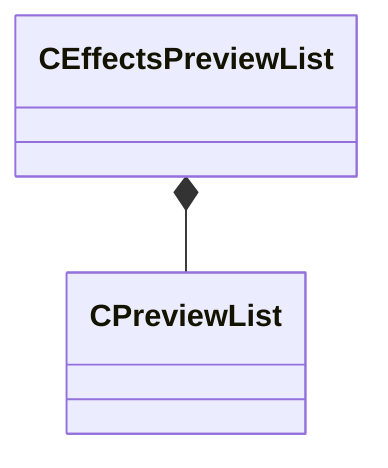

[Schemas](../../schemas.md) / [sounddoc_lib](../sounddoc_lib.md) / CEffectsPreviewList

# CEffectsPreviewList

> Source: **Build 25000182** · 2026-08-28 · `windows-x86_64` · schema `0.10.0`

**Kind:** class · **Size:** 48 bytes (`0x30`) · **Align:** 8 · **Module:** sounddoc_lib

**Relationships:**

## Memory layout

3 fields (3 declared here, 0 inherited). Offsets are absolute from the object base.

| Offset | Field | Type | From | Annotations |
|--------|-------|------|------|-------------|
| `0x0` | `m_previewGraphInput` | CUtlString |  |  |
| `0x8` | `m_flMix` | float32 |  |  |
| `0x10` | `m_previewList` | [CPreviewList](../sounddoc_lib/CPreviewList.md) |  |  |

KV3 class defaults

<pre>{
	&quot;m_previewGraphInput&quot;: &quot;&quot;,
	&quot;m_flMix&quot;: 1.000000,
	&quot;m_previewList&quot;:
	{
		&quot;m_sounds&quot;:
		[
		],
		&quot;m_bPreviewInGame&quot;: false
	}
}</pre>

