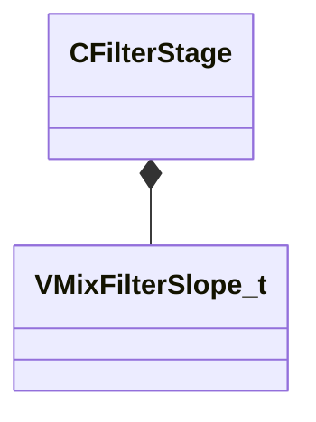

[Schemas](../../schemas.md) / [sounddoc_lib](../sounddoc_lib.md) / CFilterStage

# CFilterStage

> Source: **Build 25000182** · 2026-08-28 · `windows-x86_64` · schema `0.10.0`

**Kind:** class · **Size:** 24 bytes (`0x18`) · **Align:** 8 · **Module:** sounddoc_lib

**Relationships:**

## Memory layout

6 fields (6 declared here, 0 inherited). Offsets are absolute from the object base.

| Offset | Field | Type | From | Annotations |
|--------|-------|------|------|-------------|
| `0x0` | `m_filterType` | CUtlString |  | `MPropertyAttributeChoiceName filter_type` `MPropertyFriendlyName Filter Type` |
| `0x8` | `m_flFrequency` | float32 |  | `MPropertyAttributeRange biased 20 22000` `MPropertyFriendlyName Center Frequency (Hz)` |
| `0xc` | `m_flQ` | float32 |  | `MPropertyAttributeRange 0.1 12` `MPropertyFriendlyName Q` |
| `0x10` | `m_fldbGain` | float32 |  | `MPropertyAttributeRange -24 24` `MPropertyFriendlyName Gain (dB)` |
| `0x14` | `m_nFilterSlope` | [VMixFilterSlope_t](../soundsystem_lowlevel/VMixFilterSlope_t.md) |  | `MPropertyFriendlyName Slope` |
| `0x15` | `m_bEnable` | bool |  | `MPropertyFriendlyName Enabled` |

KV3 class defaults

<pre>{
	&quot;m_filterType&quot;: &quot;FILTER_LOWPASS&quot;,
	&quot;m_flFrequency&quot;: 11025.000000,
	&quot;m_flQ&quot;: 0.707000,
	&quot;m_fldbGain&quot;: 1.000000,
	&quot;m_nFilterSlope&quot;: &quot;FILTER_SLOPE_12dB&quot;,
	&quot;m_bEnable&quot;: true
}</pre>

