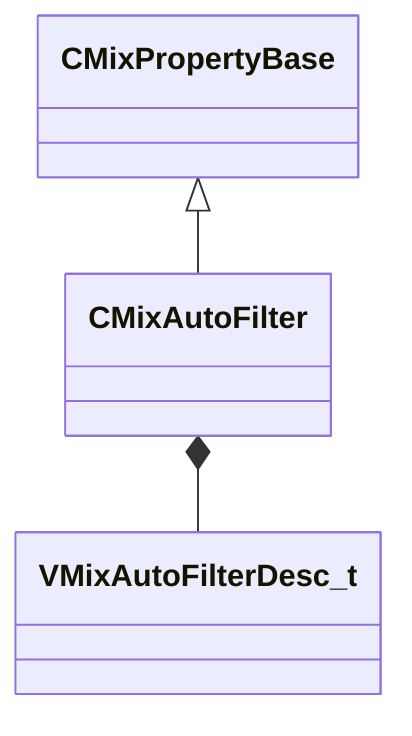

[Schemas](../../schemas.md) / [sounddoc_lib](../sounddoc_lib.md) / CMixAutoFilter

# CMixAutoFilter

**Kind:** class · **Size:** 80 bytes (`0x50`) · **Align:** 8 · **Module:** sounddoc_lib

**Inherits from:** [CMixPropertyBase](../sounddoc_lib/CMixPropertyBase.md)

**Metadata:** `MPropertyDescription A continuously variable filter that can be driven by a built-in envelope follower and/or LFO.  Stereo channels can be processed differently by adjusting the phase parameter.`, `MPropertyFriendlyName VMix Auto Filter Node`

**Relationships:**

## Memory layout

6 fields (1 declared here, 5 inherited). Offsets are absolute from the object base.

| Offset | Field | Type | From | Annotations |
|--------|-------|------|------|-------------|
| `0x8` | `m_name` | CUtlString | [CMixPropertyBase](../sounddoc_lib/CMixPropertyBase.md) | `MPropertyDescription Node name` `MPropertyFriendlyName Name` `MPropertySortPriority 1` |
| `0x10` | `m_Comment` | CUtlString | [CMixPropertyBase](../sounddoc_lib/CMixPropertyBase.md) | `MPropertyDescription Description of how this is used  the graph for people reading the graph` `MPropertySortPriority -2` |
| `0x18` | `m_bActive` | bool | [CMixPropertyBase](../sounddoc_lib/CMixPropertyBase.md) | `MPropertyHideField` `MPropertySortPriority -1` |
| `0x19` | `m_bSolo` | bool | [CMixPropertyBase](../sounddoc_lib/CMixPropertyBase.md) | `MPropertyHideField` `MPropertySortPriority -1` |
| `0x1a` | `m_bEditProperties` | bool | [CMixPropertyBase](../sounddoc_lib/CMixPropertyBase.md) | `MPropertyHideField` `MPropertySortPriority -1` |
| `0x20` | `m_desc` | [VMixAutoFilterDesc_t](../soundsystem_lowlevel/VMixAutoFilterDesc_t.md) |  | `MPropertyAutoExpandSelf` |

KV3 class defaults

<pre>{
	&quot;_class&quot;: &quot;CMixAutoFilter&quot;,
	&quot;m_name&quot;: &quot;&quot;,
	&quot;m_Comment&quot;: &quot;&quot;,
	&quot;m_bActive&quot;: true,
	&quot;m_bSolo&quot;: false,
	&quot;m_bEditProperties&quot;: false,
	&quot;m_desc&quot;:
	{
		&quot;m_flEnvelopeAmount&quot;: 0.000000,
		&quot;m_flAttackTimeMS&quot;: 5.000000,
		&quot;m_flReleaseTimeMS&quot;: 200.000000,
		&quot;m_filter&quot;:
		{
			&quot;m_nFilterType&quot;: &quot;FILTER_LOWPASS&quot;,
			&quot;m_nFilterSlope&quot;: &quot;FILTER_SLOPE_12dB&quot;,
			&quot;m_bEnabled&quot;: true,
			&quot;m_fldbGain&quot;: 0.000000,
			&quot;m_flCutoffFreq&quot;: 1000.000000,
			&quot;m_flQ&quot;: 0.707107
		},
		&quot;m_flLFOAmount&quot;: 0.000000,
		&quot;m_flLFORate&quot;: 0.000000,
		&quot;m_flPhase&quot;: 0.000000,
		&quot;m_nLFOShape&quot;: &quot;LFO_SHAPE_SINE&quot;
	}
}</pre>

