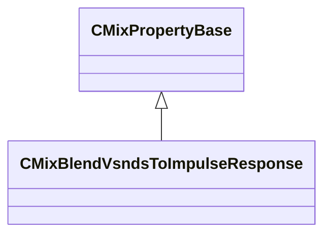

[Schemas](../../schemas.md) / [sounddoc_lib](../sounddoc_lib.md) / CMixBlendVsndsToImpulseResponse

# CMixBlendVsndsToImpulseResponse

> Source: **Build 25000182** · 2026-08-28 · `windows-x86_64` · schema `0.10.0`

**Kind:** class · **Size:** 96 bytes (`0x60`) · **Align:** 8 · **Module:** sounddoc_lib

**Inherits from:** [CMixPropertyBase](../sounddoc_lib/CMixPropertyBase.md)

**Metadata:** `MPropertyDescription Blends up to 8 vsnds to an impulse response.`, `MPropertyFriendlyName VMix Blend VSnds to Impulse Response Node`

**Relationships:**

## Memory layout

21 fields (16 declared here, 5 inherited). Offsets are absolute from the object base.

| Offset | Field | Type | From | Annotations |
|--------|-------|------|------|-------------|
| `0x8` | `m_name` | CUtlString | [CMixPropertyBase](../sounddoc_lib/CMixPropertyBase.md) | `MPropertyDescription Node name` `MPropertyFriendlyName Name` `MPropertySortPriority 1` |
| `0x10` | `m_Comment` | CUtlString | [CMixPropertyBase](../sounddoc_lib/CMixPropertyBase.md) | `MPropertyDescription Description of how this is used  the graph for people reading the graph` `MPropertySortPriority -2` |
| `0x18` | `m_bActive` | bool | [CMixPropertyBase](../sounddoc_lib/CMixPropertyBase.md) | `MPropertyHideField` `MPropertySortPriority -1` |
| `0x19` | `m_bSolo` | bool | [CMixPropertyBase](../sounddoc_lib/CMixPropertyBase.md) | `MPropertyHideField` `MPropertySortPriority -1` |
| `0x1a` | `m_bEditProperties` | bool | [CMixPropertyBase](../sounddoc_lib/CMixPropertyBase.md) | `MPropertyHideField` `MPropertySortPriority -1` |
| `0x20` | `m_flWeight0` | float32 |  | `MPropertyFriendlyName Weight:0` |
| `0x24` | `m_flWeight1` | float32 |  | `MPropertyFriendlyName Weight:1` |
| `0x28` | `m_flWeight2` | float32 |  | `MPropertyFriendlyName Weight:2` |
| `0x2c` | `m_flWeight3` | float32 |  | `MPropertyFriendlyName Weight:3` |
| `0x30` | `m_flWeight4` | float32 |  | `MPropertyFriendlyName Weight:4` |
| `0x34` | `m_flWeight5` | float32 |  | `MPropertyFriendlyName Weight:5` |
| `0x38` | `m_flWeight6` | float32 |  | `MPropertyFriendlyName Weight:6` |
| `0x3c` | `m_flWeight7` | float32 |  | `MPropertyFriendlyName Weight:7` |
| `0x40` | `m_flPreDelayMS0` | float32 |  | `MPropertyFriendlyName PreDelayMS:0` |
| `0x44` | `m_flPreDelayMS1` | float32 |  | `MPropertyFriendlyName PreDelayMS:1` |
| `0x48` | `m_flPreDelayMS2` | float32 |  | `MPropertyFriendlyName PreDelayMS:2` |
| `0x4c` | `m_flPreDelayMS3` | float32 |  | `MPropertyFriendlyName PreDelayMS:3` |
| `0x50` | `m_flPreDelayMS4` | float32 |  | `MPropertyFriendlyName PreDelayMS:4` |
| `0x54` | `m_flPreDelayMS5` | float32 |  | `MPropertyFriendlyName PreDelayMS:5` |
| `0x58` | `m_flPreDelayMS6` | float32 |  | `MPropertyFriendlyName PreDelayMS:6` |
| `0x5c` | `m_flPreDelayMS7` | float32 |  | `MPropertyFriendlyName PreDelayMS:7` |

KV3 class defaults

<pre>{
	&quot;_class&quot;: &quot;CMixBlendVsndsToImpulseResponse&quot;,
	&quot;m_name&quot;: &quot;&quot;,
	&quot;m_Comment&quot;: &quot;&quot;,
	&quot;m_bActive&quot;: true,
	&quot;m_bSolo&quot;: false,
	&quot;m_bEditProperties&quot;: false,
	&quot;m_flWeight0&quot;: 1.000000,
	&quot;m_flWeight1&quot;: 1.000000,
	&quot;m_flWeight2&quot;: 1.000000,
	&quot;m_flWeight3&quot;: 1.000000,
	&quot;m_flWeight4&quot;: 1.000000,
	&quot;m_flWeight5&quot;: 1.000000,
	&quot;m_flWeight6&quot;: 1.000000,
	&quot;m_flWeight7&quot;: 1.000000,
	&quot;m_flPreDelayMS0&quot;: 0.000000,
	&quot;m_flPreDelayMS1&quot;: 0.000000,
	&quot;m_flPreDelayMS2&quot;: 0.000000,
	&quot;m_flPreDelayMS3&quot;: 0.000000,
	&quot;m_flPreDelayMS4&quot;: 0.000000,
	&quot;m_flPreDelayMS5&quot;: 0.000000,
	&quot;m_flPreDelayMS6&quot;: 0.000000,
	&quot;m_flPreDelayMS7&quot;: 0.000000
}</pre>

