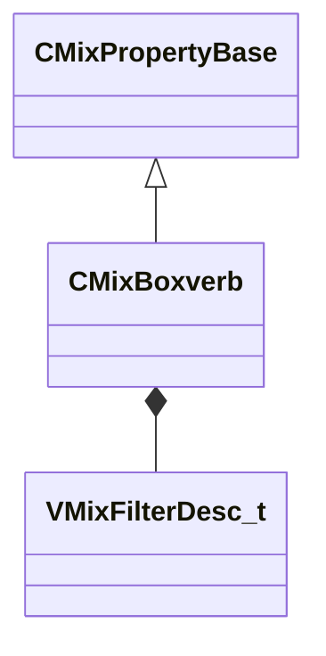

[Schemas](../../schemas.md) / [sounddoc_lib](../sounddoc_lib.md) / CMixBoxverb

# CMixBoxverb

> Source: **Build 25000182** · 2026-08-28 · `windows-x86_64` · schema `0.10.0`

**Kind:** class · **Size:** 112 bytes (`0x70`) · **Align:** 8 · **Module:** sounddoc_lib

**Inherits from:** [CMixPropertyBase](../sounddoc_lib/CMixPropertyBase.md)

**Metadata:** `MPropertyDescription A simple reverb that approximates the reflections of a box-shaped room, copied from previous audio system.`, `MPropertyFriendlyName Legacy VMix Shoebox Reverb Node`

**Relationships:**

## Memory layout

21 fields (16 declared here, 5 inherited). Offsets are absolute from the object base.

| Offset | Field | Type | From | Annotations |
|--------|-------|------|------|-------------|
| `0x8` | `m_name` | CUtlString | [CMixPropertyBase](../sounddoc_lib/CMixPropertyBase.md) | `MPropertyDescription Node name` `MPropertyFriendlyName Name` `MPropertySortPriority 1` |
| `0x10` | `m_Comment` | CUtlString | [CMixPropertyBase](../sounddoc_lib/CMixPropertyBase.md) | `MPropertyDescription Description of how this is used  the graph for people reading the graph` `MPropertySortPriority -2` |
| `0x18` | `m_bActive` | bool | [CMixPropertyBase](../sounddoc_lib/CMixPropertyBase.md) | `MPropertyHideField` `MPropertySortPriority -1` |
| `0x19` | `m_bSolo` | bool | [CMixPropertyBase](../sounddoc_lib/CMixPropertyBase.md) | `MPropertyHideField` `MPropertySortPriority -1` |
| `0x1a` | `m_bEditProperties` | bool | [CMixPropertyBase](../sounddoc_lib/CMixPropertyBase.md) | `MPropertyHideField` `MPropertySortPriority -1` |
| `0x20` | `m_flSizeMax` | float32 |  | `MPropertyAttributeRange 0.0 1000.0` `MPropertyDescription The reverb can be parameterized either by a delay range (min/max delay in milliseconds) OR by a delay size for each dimension of a box (width/height/depth). If you set width, height, or depth to anything other than zero, these min/max fields will not be used.` `MPropertyFriendlyName Max Size (milliseconds)` |
| `0x24` | `m_flSizeMin` | float32 |  | `MPropertyAttributeRange 0.0 1000.0` `MPropertyDescription The reverb can be parameterized either by a delay range (min/max delay in milliseconds) OR by a delay size for each dimension of a box (width/height/depth). If you set width, height, or depth to anything other than zero, these min/max fields will not be used.` `MPropertyFriendlyName Min Size (milliseconds)` |
| `0x28` | `m_flComplexity` | float32 |  | `MPropertyAttributeRange 1.01 12.0` `MPropertyDescription The complexity is how many delays are spread along the total delay length.  Max is 12.  More delays will give your space more reflections (more geometric complexity).` `MPropertyFriendlyName Complexity` |
| `0x2c` | `m_flModDepth` | float32 |  | `MPropertyAttributeRange 0.0 100` `MPropertyDescription This is a percentage of the delay length to modulate. 100 means you will modulate between 0 and the max delay.  10 means the delay will modulate between 90 and 100 percent of max delay.` `MPropertyFriendlyName Mod Depth (milliseconds)` |
| `0x30` | `m_flModRate` | float32 |  | `MPropertyAttributeRange 0.0 10.0` `MPropertyDescription This is the rate at which the delay length changes.  1 means change the delay every delaytime milliseconds.  2 means change the delay after 2*delaytime milliseconds.` `MPropertyFriendlyName Mod Rate (# of delay intervals before mod)` |
| `0x34` | `m_bParallel` | bool |  | `MPropertyDescription If true the filter is applied to the signal before output.  If false the filter is applied while feeding back into each delay line.` `MPropertyFriendlyName Parallalelize Filter` |
| `0x38` | `m_filterType` | [VMixFilterDesc_t](../soundsystem_lowlevel/VMixFilterDesc_t.md) |  | `MPropertyDescription Configure the filter to apply to the delay output.  Usually this should be a lowpass filter.` `MPropertyFriendlyName Filter Type` `MPropertyGroupName Filter` |
| `0x48` | `m_flWidth` | float32 |  | `MPropertyAttributeRange 0 1000.0` `MPropertyDescription If width, height, or depth is set min/max size will be ignored.  These dimensions are the size of the room in milliseconds to first reflection.` `MPropertyFriendlyName Width (milliseconds)` |
| `0x4c` | `m_flHeight` | float32 |  | `MPropertyAttributeRange 0 1000.0` `MPropertyDescription If width, height, or depth is set min/max size will be ignored.  These dimensions are the size of the room in milliseconds to first reflection.` `MPropertyFriendlyName Height (milliseconds)` |
| `0x50` | `m_flDepth` | float32 |  | `MPropertyAttributeRange 0 1000.0` `MPropertyDescription If width, height, or depth is set min/max size will be ignored.  These dimensions are the size of the room in milliseconds to first reflection.` `MPropertyFriendlyName Depth (milliseconds)` |
| `0x54` | `m_flFeedbackScale` | float32 |  | `MPropertyAttributeRange 0 1` `MPropertyDescription How much of the signal to send to the delay lines.  How loud the reflections are.` `MPropertyFriendlyName Feedback Scale` |
| `0x58` | `m_flFeedbackWidth` | float32 |  | `MPropertyAttributeRange -1.0 1.0` `MPropertyDescription Additional amp on the width dimension reflections.  Note negative numbers mean this feedback bypasses the filter (predelay).` `MPropertyFriendlyName Width Reflectivity` |
| `0x5c` | `m_flFeedbackHeight` | float32 |  | `MPropertyAttributeRange -1.0 1.0` `MPropertyDescription Additional amp on the height dimension reflections.  Note negative numbers mean this feedback bypasses the filter (predelay).` `MPropertyFriendlyName Height Reflectivity` |
| `0x60` | `m_flFeedbackDepth` | float32 |  | `MPropertyAttributeRange -1.0 1.0` `MPropertyDescription Additional amp on the depth dimension reflections.  Note negative numbers mean this feedback bypasses the filter (predelay).` `MPropertyFriendlyName Depth  Reflectivity` |
| `0x64` | `m_flOutputGain` | float32 |  | `MPropertyAttributeRange -24.0 -0.1` `MPropertyDescription Amplification at output in dB for tuning.` `MPropertyFriendlyName Output Gain (dB)` |
| `0x68` | `m_flTaps` | float32 |  | `MPropertyAttributeRange 0 0.333` `MPropertyDescription If zero there are no extra taps.  If non-zero there will be 3 extra taps and this value will adjust their relative phase.` `MPropertyFriendlyName Extra Tap Scale` |

KV3 class defaults

<pre>{
	&quot;_class&quot;: &quot;CMixBoxverb&quot;,
	&quot;m_name&quot;: &quot;&quot;,
	&quot;m_Comment&quot;: &quot;&quot;,
	&quot;m_bActive&quot;: true,
	&quot;m_bSolo&quot;: false,
	&quot;m_bEditProperties&quot;: false,
	&quot;m_flSizeMax&quot;: 100.000000,
	&quot;m_flSizeMin&quot;: 0.000000,
	&quot;m_flComplexity&quot;: 4.000000,
	&quot;m_flModDepth&quot;: 0.000000,
	&quot;m_flModRate&quot;: 0.000000,
	&quot;m_bParallel&quot;: false,
	&quot;m_filterType&quot;:
	{
		&quot;m_nFilterType&quot;: &quot;FILTER_LOWPASS&quot;,
		&quot;m_nFilterSlope&quot;: &quot;FILTER_SLOPE_12dB&quot;,
		&quot;m_bEnabled&quot;: true,
		&quot;m_fldbGain&quot;: 0.000000,
		&quot;m_flCutoffFreq&quot;: 1000.000000,
		&quot;m_flQ&quot;: 0.707107
	},
	&quot;m_flWidth&quot;: 20.000000,
	&quot;m_flHeight&quot;: 23.000000,
	&quot;m_flDepth&quot;: 27.000000,
	&quot;m_flFeedbackScale&quot;: 0.150000,
	&quot;m_flFeedbackWidth&quot;: 0.000000,
	&quot;m_flFeedbackHeight&quot;: 0.000000,
	&quot;m_flFeedbackDepth&quot;: 0.000000,
	&quot;m_flOutputGain&quot;: 0.000000,
	&quot;m_flTaps&quot;: 0.000000
}</pre>

