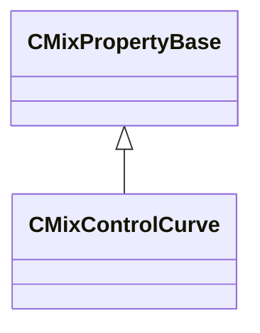

[Schemas](../../schemas.md) / [sounddoc_lib](../sounddoc_lib.md) / CMixControlCurve

# CMixControlCurve

> Source: **Build 25000182** · 2026-08-28 · `windows-x86_64` · schema `0.10.0`

**Kind:** class · **Size:** 112 bytes (`0x70`) · **Align:** 8 · **Module:** sounddoc_lib

**Inherits from:** [CMixPropertyBase](../sounddoc_lib/CMixPropertyBase.md)

**Metadata:** `MPropertyDescription Remap a control variable through a curve that you define.`, `MPropertyFriendlyName VMix Control Curve Node`

**Relationships:**

## Memory layout

10 fields (5 declared here, 5 inherited). Offsets are absolute from the object base.

| Offset | Field | Type | From | Annotations |
|--------|-------|------|------|-------------|
| `0x8` | `m_name` | CUtlString | [CMixPropertyBase](../sounddoc_lib/CMixPropertyBase.md) | `MPropertyDescription Node name` `MPropertyFriendlyName Name` `MPropertySortPriority 1` |
| `0x10` | `m_Comment` | CUtlString | [CMixPropertyBase](../sounddoc_lib/CMixPropertyBase.md) | `MPropertyDescription Description of how this is used  the graph for people reading the graph` `MPropertySortPriority -2` |
| `0x18` | `m_bActive` | bool | [CMixPropertyBase](../sounddoc_lib/CMixPropertyBase.md) | `MPropertyHideField` `MPropertySortPriority -1` |
| `0x19` | `m_bSolo` | bool | [CMixPropertyBase](../sounddoc_lib/CMixPropertyBase.md) | `MPropertyHideField` `MPropertySortPriority -1` |
| `0x1a` | `m_bEditProperties` | bool | [CMixPropertyBase](../sounddoc_lib/CMixPropertyBase.md) | `MPropertyHideField` `MPropertySortPriority -1` |
| `0x20` | `m_flInputMin` | float32 |  |  |
| `0x24` | `m_flInputMax` | float32 |  |  |
| `0x28` | `m_flOutputMin` | float32 |  |  |
| `0x2c` | `m_flOutputMax` | float32 |  |  |
| `0x30` | `m_curve` | CPiecewiseCurve |  | `MPropertySuppressField` |

KV3 class defaults

<pre>{
	&quot;_class&quot;: &quot;CMixControlCurve&quot;,
	&quot;m_name&quot;: &quot;&quot;,
	&quot;m_Comment&quot;: &quot;&quot;,
	&quot;m_bActive&quot;: true,
	&quot;m_bSolo&quot;: false,
	&quot;m_bEditProperties&quot;: false,
	&quot;m_flInputMin&quot;: 0.000000,
	&quot;m_flInputMax&quot;: 1.000000,
	&quot;m_flOutputMin&quot;: 0.000000,
	&quot;m_flOutputMax&quot;: 1.000000,
	&quot;m_curve&quot;:
	{
		&quot;m_spline&quot;:
		[
			{
				&quot;x&quot;: 0.000000,
				&quot;y&quot;: 0.000000,
				&quot;m_flSlopeIncoming&quot;: 1.000000,
				&quot;m_flSlopeOutgoing&quot;: 1.000000
			},
			{
				&quot;x&quot;: 1.000000,
				&quot;y&quot;: 1.000000,
				&quot;m_flSlopeIncoming&quot;: 1.000000,
				&quot;m_flSlopeOutgoing&quot;: 1.000000
			}
		],
		&quot;m_tangents&quot;:
		[
			{
				&quot;m_nIncomingTangent&quot;: &quot;CURVE_TANGENT_SPLINE&quot;,
				&quot;m_nOutgoingTangent&quot;: &quot;CURVE_TANGENT_SPLINE&quot;
			},
			{
				&quot;m_nIncomingTangent&quot;: &quot;CURVE_TANGENT_SPLINE&quot;,
				&quot;m_nOutgoingTangent&quot;: &quot;CURVE_TANGENT_SPLINE&quot;
			}
		],
		&quot;m_vDomainMins&quot;:
		[
			0.000000,
			0.000000
		],
		&quot;m_vDomainMaxs&quot;:
		[
			0.000000,
			0.000000
		]
	}
}</pre>

