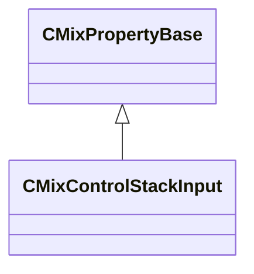

[Schemas](../../schemas.md) / [sounddoc_lib](../sounddoc_lib.md) / CMixControlStackInput

# CMixControlStackInput

**Kind:** class · **Size:** 48 bytes (`0x30`) · **Align:** 8 · **Module:** sounddoc_lib

**Inherits from:** [CMixPropertyBase](../sounddoc_lib/CMixPropertyBase.md)

**Metadata:** `MPropertyDescription This will copy a control value from this soundevent's operator stack.  Works with any stack/variable without modifying the stack itself.`, `MPropertyFriendlyName VMix Control Stack Input Node`

**Relationships:**

## Memory layout

8 fields (3 declared here, 5 inherited). Offsets are absolute from the object base.

| Offset | Field | Type | From | Annotations |
|--------|-------|------|------|-------------|
| `0x8` | `m_name` | CUtlString | [CMixPropertyBase](../sounddoc_lib/CMixPropertyBase.md) | `MPropertyDescription Node name` `MPropertyFriendlyName Name` `MPropertySortPriority 1` |
| `0x10` | `m_Comment` | CUtlString | [CMixPropertyBase](../sounddoc_lib/CMixPropertyBase.md) | `MPropertyDescription Description of how this is used  the graph for people reading the graph` `MPropertySortPriority -2` |
| `0x18` | `m_bActive` | bool | [CMixPropertyBase](../sounddoc_lib/CMixPropertyBase.md) | `MPropertyHideField` `MPropertySortPriority -1` |
| `0x19` | `m_bSolo` | bool | [CMixPropertyBase](../sounddoc_lib/CMixPropertyBase.md) | `MPropertyHideField` `MPropertySortPriority -1` |
| `0x1a` | `m_bEditProperties` | bool | [CMixPropertyBase](../sounddoc_lib/CMixPropertyBase.md) | `MPropertyHideField` `MPropertySortPriority -1` |
| `0x20` | `m_flDefaultValue` | float32 |  | `MPropertyFriendlyName Default Value` |
| `0x24` | `m_flMinRange` | float32 |  | `MPropertyFriendlyName Preview Min Range` |
| `0x28` | `m_flMaxRange` | float32 |  | `MPropertyFriendlyName Preview Max Range` |

KV3 class defaults

<pre>{
	&quot;_class&quot;: &quot;CMixControlStackInput&quot;,
	&quot;m_name&quot;: &quot;&quot;,
	&quot;m_Comment&quot;: &quot;&quot;,
	&quot;m_bActive&quot;: true,
	&quot;m_bSolo&quot;: false,
	&quot;m_bEditProperties&quot;: false,
	&quot;m_flDefaultValue&quot;: 1.000000,
	&quot;m_flMinRange&quot;: 0.000000,
	&quot;m_flMaxRange&quot;: 1.000000
}</pre>

