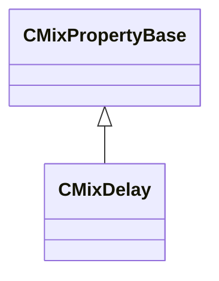

[Schemas](../../schemas.md) / [sounddoc_lib](../sounddoc_lib.md) / CMixDelay

# CMixDelay

**Kind:** class · **Size:** 88 bytes (`0x58`) · **Align:** 8 · **Module:** sounddoc_lib

**Inherits from:** [CMixPropertyBase](../sounddoc_lib/CMixPropertyBase.md)

**Metadata:** `MPropertyDescription Stereo delay with resonant filter on feedback.`, `MPropertyFriendlyName VMix Delay Audio Node`

**Relationships:**

## Memory layout

16 fields (11 declared here, 5 inherited). Offsets are absolute from the object base.

| Offset | Field | Type | From | Annotations |
|--------|-------|------|------|-------------|
| `0x8` | `m_name` | CUtlString | [CMixPropertyBase](../sounddoc_lib/CMixPropertyBase.md) | `MPropertyDescription Node name` `MPropertyFriendlyName Name` `MPropertySortPriority 1` |
| `0x10` | `m_Comment` | CUtlString | [CMixPropertyBase](../sounddoc_lib/CMixPropertyBase.md) | `MPropertyDescription Description of how this is used  the graph for people reading the graph` `MPropertySortPriority -2` |
| `0x18` | `m_bActive` | bool | [CMixPropertyBase](../sounddoc_lib/CMixPropertyBase.md) | `MPropertyHideField` `MPropertySortPriority -1` |
| `0x19` | `m_bSolo` | bool | [CMixPropertyBase](../sounddoc_lib/CMixPropertyBase.md) | `MPropertyHideField` `MPropertySortPriority -1` |
| `0x1a` | `m_bEditProperties` | bool | [CMixPropertyBase](../sounddoc_lib/CMixPropertyBase.md) | `MPropertyHideField` `MPropertySortPriority -1` |
| `0x20` | `m_nChannels` | int32 |  | `MPropertyAttributeChoiceName processor_channels` `MPropertyFriendlyName Channels` |
| `0x24` | `m_flDelay` | float32 |  | `MPropertyAttributeRange 0 2000` `MPropertyFriendlyName Delay (ms)` `MPropertyGroupName +Delay` |
| `0x28` | `m_fldbDirectGain` | float32 |  | `MPropertyAttributeRange -24 24` `MPropertyFriendlyName DirectGain (dB)` `MPropertyGroupName Delay` |
| `0x2c` | `m_fldbDelayGain` | float32 |  | `MPropertyAttributeRange -24 24` `MPropertyFriendlyName DelayGain (dB)` `MPropertyGroupName Delay` |
| `0x30` | `m_fldbFeedbackGain` | float32 |  | `MPropertyAttributeRange -60 12` `MPropertyFriendlyName FeedbackGain (dB)` `MPropertyGroupName Delay` |
| `0x34` | `m_flWidth` | float32 |  | `MPropertyAttributeRange 0 1.0` `MPropertyFriendlyName Width` |
| `0x38` | `m_bEnableFilter` | bool |  | `MPropertyFriendlyName EnableFilter` `MPropertyGroupName +Filter` |
| `0x40` | `m_filterType` | CUtlString |  | `MPropertyAttributeChoiceName filter_type` `MPropertyFriendlyName Filter Type` `MPropertyGroupName Filter` |
| `0x48` | `m_flFrequency` | float32 |  | `MPropertyAttributeRange biased 20 22000` `MPropertyFriendlyName Center Frequency (Hz)` `MPropertyGroupName Filter` |
| `0x4c` | `m_flQ` | float32 |  | `MPropertyAttributeRange 0.1 12` `MPropertyFriendlyName Q` `MPropertyGroupName Filter` |
| `0x50` | `m_fldbGain` | float32 |  | `MPropertyAttributeRange -24 24` `MPropertyFriendlyName Filter Gain (dB)` |

KV3 class defaults

<pre>{
	&quot;_class&quot;: &quot;CMixDelay&quot;,
	&quot;m_name&quot;: &quot;&quot;,
	&quot;m_Comment&quot;: &quot;&quot;,
	&quot;m_bActive&quot;: true,
	&quot;m_bSolo&quot;: false,
	&quot;m_bEditProperties&quot;: true,
	&quot;m_nChannels&quot;: -1,
	&quot;m_flDelay&quot;: 500.000000,
	&quot;m_fldbDirectGain&quot;: 0.000000,
	&quot;m_fldbDelayGain&quot;: -3.000000,
	&quot;m_fldbFeedbackGain&quot;: -3.000000,
	&quot;m_flWidth&quot;: 0.000000,
	&quot;m_bEnableFilter&quot;: false,
	&quot;m_filterType&quot;: &quot;FILTER_LOWPASS&quot;,
	&quot;m_flFrequency&quot;: 2000.000000,
	&quot;m_flQ&quot;: 0.707000,
	&quot;m_fldbGain&quot;: 0.000000
}</pre>

