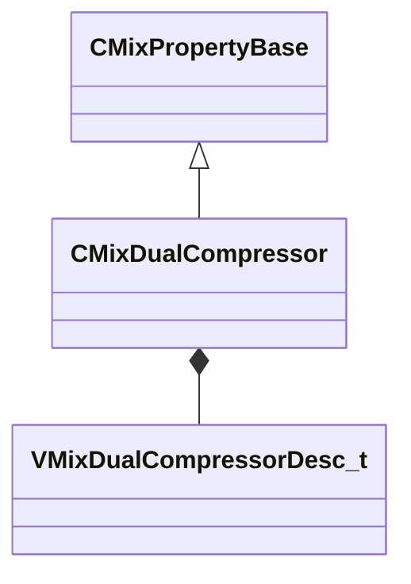

[Schemas](../../schemas.md) / [sounddoc_lib](../sounddoc_lib.md) / CMixDualCompressor

# CMixDualCompressor

> Source: **Build 25000182** · 2026-08-28 · `windows-x86_64` · schema `0.10.0`

**Kind:** class · **Size:** 88 bytes (`0x58`) · **Align:** 8 · **Module:** sounddoc_lib

**Inherits from:** [CMixPropertyBase](../sounddoc_lib/CMixPropertyBase.md)

**Metadata:** `MPropertyDescription Compress the dynamic range of both ends of a signal.`, `MPropertyFriendlyName VMix Dual Compressor Node`

**Relationships:**

## Memory layout

7 fields (2 declared here, 5 inherited). Offsets are absolute from the object base.

| Offset | Field | Type | From | Annotations |
|--------|-------|------|------|-------------|
| `0x8` | `m_name` | CUtlString | [CMixPropertyBase](../sounddoc_lib/CMixPropertyBase.md) | `MPropertyDescription Node name` `MPropertyFriendlyName Name` `MPropertySortPriority 1` |
| `0x10` | `m_Comment` | CUtlString | [CMixPropertyBase](../sounddoc_lib/CMixPropertyBase.md) | `MPropertyDescription Description of how this is used  the graph for people reading the graph` `MPropertySortPriority -2` |
| `0x18` | `m_bActive` | bool | [CMixPropertyBase](../sounddoc_lib/CMixPropertyBase.md) | `MPropertyHideField` `MPropertySortPriority -1` |
| `0x19` | `m_bSolo` | bool | [CMixPropertyBase](../sounddoc_lib/CMixPropertyBase.md) | `MPropertyHideField` `MPropertySortPriority -1` |
| `0x1a` | `m_bEditProperties` | bool | [CMixPropertyBase](../sounddoc_lib/CMixPropertyBase.md) | `MPropertyHideField` `MPropertySortPriority -1` |
| `0x20` | `m_nChannels` | int32 |  | `MPropertyAttributeChoiceName processor_channels` `MPropertyFriendlyName Channels` |
| `0x24` | `m_desc` | [VMixDualCompressorDesc_t](../soundsystem_lowlevel/VMixDualCompressorDesc_t.md) |  | `MPropertyAutoExpandSelf` |

KV3 class defaults

<pre>{
	&quot;_class&quot;: &quot;CMixDualCompressor&quot;,
	&quot;m_name&quot;: &quot;&quot;,
	&quot;m_Comment&quot;: &quot;&quot;,
	&quot;m_bActive&quot;: true,
	&quot;m_bSolo&quot;: false,
	&quot;m_bEditProperties&quot;: false,
	&quot;m_nChannels&quot;: -1,
	&quot;m_desc&quot;:
	{
		&quot;m_flRMSTimeMS&quot;: 300.000000,
		&quot;m_fldbKneeWidth&quot;: 0.000000,
		&quot;m_flWetMix&quot;: 1.000000,
		&quot;m_bPeakMode&quot;: false,
		&quot;m_bandDesc&quot;:
		{
			&quot;m_fldbGainInput&quot;: 0.000000,
			&quot;m_fldbGainOutput&quot;: 0.000000,
			&quot;m_fldbThresholdBelow&quot;: -40.000000,
			&quot;m_fldbThresholdAbove&quot;: -30.000000,
			&quot;m_flRatioBelow&quot;: 12.000000,
			&quot;m_flRatioAbove&quot;: 4.000000,
			&quot;m_flAttackTimeMS&quot;: 50.000000,
			&quot;m_flReleaseTimeMS&quot;: 200.000000,
			&quot;m_bEnable&quot;: true,
			&quot;m_bSolo&quot;: false
		}
	}
}</pre>

