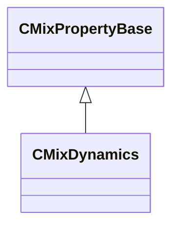

[Schemas](../../schemas.md) / [sounddoc_lib](../sounddoc_lib.md) / CMixDynamics

# CMixDynamics

> Source: **Build 25000182** · 2026-08-28 · `windows-x86_64` · schema `0.10.0`

**Kind:** class · **Size:** 88 bytes (`0x58`) · **Align:** 8 · **Module:** sounddoc_lib

**Inherits from:** [CMixPropertyBase](../sounddoc_lib/CMixPropertyBase.md)

**Metadata:** `MPropertyDescription A dynamics multiprocessor.  This is a single unit that switches between being a noise gate, compressor, or limiter as the signal moves through its dynamic range.  Useful in some specific cases, e.g. gate+compress or gate+limit usually.  Other cases may be more suited to using multiple compressors in series.`, `MPropertyFriendlyName VMix Dynamics Audio Node`

**Relationships:**

## Memory layout

19 fields (14 declared here, 5 inherited). Offsets are absolute from the object base.

| Offset | Field | Type | From | Annotations |
|--------|-------|------|------|-------------|
| `0x8` | `m_name` | CUtlString | [CMixPropertyBase](../sounddoc_lib/CMixPropertyBase.md) | `MPropertyDescription Node name` `MPropertyFriendlyName Name` `MPropertySortPriority 1` |
| `0x10` | `m_Comment` | CUtlString | [CMixPropertyBase](../sounddoc_lib/CMixPropertyBase.md) | `MPropertyDescription Description of how this is used  the graph for people reading the graph` `MPropertySortPriority -2` |
| `0x18` | `m_bActive` | bool | [CMixPropertyBase](../sounddoc_lib/CMixPropertyBase.md) | `MPropertyHideField` `MPropertySortPriority -1` |
| `0x19` | `m_bSolo` | bool | [CMixPropertyBase](../sounddoc_lib/CMixPropertyBase.md) | `MPropertyHideField` `MPropertySortPriority -1` |
| `0x1a` | `m_bEditProperties` | bool | [CMixPropertyBase](../sounddoc_lib/CMixPropertyBase.md) | `MPropertyHideField` `MPropertySortPriority -1` |
| `0x20` | `m_nChannels` | int32 |  | `MPropertyAttributeChoiceName processor_channels` `MPropertyFriendlyName Channels` |
| `0x24` | `m_fldbNoiseGateThreshold` | float32 |  | `MPropertyFriendlyName Noise Gate Threshold(dB)` |
| `0x28` | `m_fldbGain` | float32 |  | `MPropertyFriendlyName Gain (dB)` |
| `0x2c` | `m_fldbCompressionThreshold` | float32 |  | `MPropertyFriendlyName Compression Threshold(dB)` |
| `0x30` | `m_fldbLimiterThreshold` | float32 |  | `MPropertyFriendlyName Limiter Threshold(dB)` |
| `0x34` | `m_fldbKneeWidth` | float32 |  | `MPropertyFriendlyName Knee width (dB) 0 = hard knee` |
| `0x38` | `m_flRatio` | float32 |  | `MPropertyFriendlyName Compression Ratio` |
| `0x3c` | `m_flLimiterRatio` | float32 |  | `MPropertyFriendlyName Limiter Ratio` |
| `0x40` | `m_flAttackTime` | float32 |  | `MPropertyFriendlyName Attack time (ms)` |
| `0x44` | `m_flReleaseTime` | float32 |  | `MPropertyFriendlyName Release time (ms)` |
| `0x48` | `m_flRMSTime` | float32 |  | `MPropertyFriendlyName Threshold detection time (ms)` |
| `0x4c` | `m_flWetMix` | float32 |  | `MPropertyFriendlyName Dry/Wet` |
| `0x50` | `m_bPeakMode` | bool |  | `MPropertyFriendlyName Peak Mode` |
| `0x54` | `m_nUIPage` | int32 |  |  |

KV3 class defaults

<pre>{
	&quot;_class&quot;: &quot;CMixDynamics&quot;,
	&quot;m_name&quot;: &quot;&quot;,
	&quot;m_Comment&quot;: &quot;&quot;,
	&quot;m_bActive&quot;: true,
	&quot;m_bSolo&quot;: false,
	&quot;m_bEditProperties&quot;: false,
	&quot;m_nChannels&quot;: -1,
	&quot;m_fldbNoiseGateThreshold&quot;: -90.000000,
	&quot;m_fldbGain&quot;: 0.000000,
	&quot;m_fldbCompressionThreshold&quot;: -6.000000,
	&quot;m_fldbLimiterThreshold&quot;: 0.000000,
	&quot;m_fldbKneeWidth&quot;: 0.000000,
	&quot;m_flRatio&quot;: 2.000000,
	&quot;m_flLimiterRatio&quot;: 40.000000,
	&quot;m_flAttackTime&quot;: 100.000000,
	&quot;m_flReleaseTime&quot;: 200.000000,
	&quot;m_flRMSTime&quot;: 200.000000,
	&quot;m_flWetMix&quot;: 1.000000,
	&quot;m_bPeakMode&quot;: false,
	&quot;m_nUIPage&quot;: 0
}</pre>

