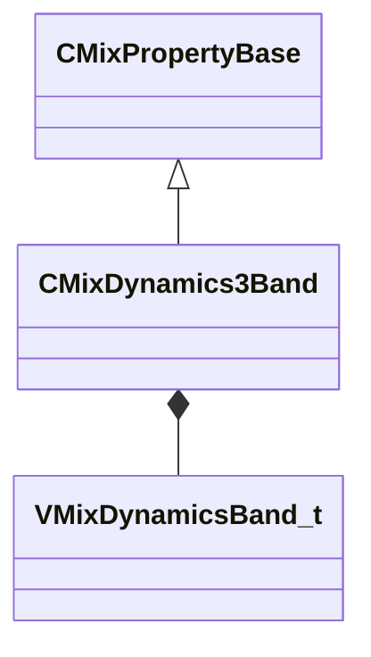

[Schemas](../../schemas.md) / [sounddoc_lib](../sounddoc_lib.md) / CMixDynamics3Band

# CMixDynamics3Band

> Source: **Build 25000182** · 2026-08-28 · `windows-x86_64` · schema `0.10.0`

**Kind:** class · **Size:** 184 bytes (`0xb8`) · **Align:** 8 · **Module:** sounddoc_lib

**Inherits from:** [CMixPropertyBase](../sounddoc_lib/CMixPropertyBase.md)

**Metadata:** `MPropertyDescription This is a multi-band dynamics processor.  First the signal is split into low/mid/high bands, then each band is routed through two compressors providing upward and downward compression to each band.  Input & Output gain can also be adjusted.`, `MPropertyFriendlyName VMix 3 Band Dynamics Node`

**Relationships:**

## Memory layout

17 fields (12 declared here, 5 inherited). Offsets are absolute from the object base.

| Offset | Field | Type | From | Annotations |
|--------|-------|------|------|-------------|
| `0x8` | `m_name` | CUtlString | [CMixPropertyBase](../sounddoc_lib/CMixPropertyBase.md) | `MPropertyDescription Node name` `MPropertyFriendlyName Name` `MPropertySortPriority 1` |
| `0x10` | `m_Comment` | CUtlString | [CMixPropertyBase](../sounddoc_lib/CMixPropertyBase.md) | `MPropertyDescription Description of how this is used  the graph for people reading the graph` `MPropertySortPriority -2` |
| `0x18` | `m_bActive` | bool | [CMixPropertyBase](../sounddoc_lib/CMixPropertyBase.md) | `MPropertyHideField` `MPropertySortPriority -1` |
| `0x19` | `m_bSolo` | bool | [CMixPropertyBase](../sounddoc_lib/CMixPropertyBase.md) | `MPropertyHideField` `MPropertySortPriority -1` |
| `0x1a` | `m_bEditProperties` | bool | [CMixPropertyBase](../sounddoc_lib/CMixPropertyBase.md) | `MPropertyHideField` `MPropertySortPriority -1` |
| `0x20` | `m_nChannels` | int32 |  | `MPropertyAttributeChoiceName processor_channels` `MPropertyFriendlyName Channels` |
| `0x24` | `m_fldbOutputGain` | float32 |  | `MPropertyAttributeRange -18 18` `MPropertyFriendlyName Output Gain (dB)` |
| `0x28` | `m_flRMSTime` | float32 |  | `MPropertyFriendlyName Threshold detection time (ms)` |
| `0x2c` | `m_flDepth` | float32 |  | `MPropertyAttributeRange 0 1` `MPropertyFriendlyName Depth [0.0 - 1.0]` |
| `0x30` | `m_flWetMix` | float32 |  | `MPropertyAttributeRange 0 1` `MPropertyFriendlyName Wet [0.0 - 1.0]` |
| `0x34` | `m_flTimeScale` | float32 |  | `MPropertyAttributeRange 0 10` `MPropertyFriendlyName Time Scale [0.0 - 10.0]` |
| `0x38` | `m_fldbKneeWidth` | float32 |  | `MPropertyFriendlyName Knee width (dB) 0 = hard knee` |
| `0x3c` | `m_flLowCutoffFreq` | float32 |  | `MPropertyFriendlyName Low Cutoff Freq (Hz)` |
| `0x40` | `m_flHighCutoffFreq` | float32 |  | `MPropertyFriendlyName High Cutoff Freq (Hz)` |
| `0x44` | `m_bPeakMode` | bool |  | `MPropertyFriendlyName Peak Mode` |
| `0x48` | `m_nSelectedPage` | int32 |  | `MPropertyHideField` |
| `0x4c` | `m_bands` | [VMixDynamicsBand_t](../soundsystem_lowlevel/VMixDynamicsBand_t.md)[3] |  |  |

KV3 class defaults

<pre>{
	&quot;_class&quot;: &quot;CMixDynamics3Band&quot;,
	&quot;m_name&quot;: &quot;&quot;,
	&quot;m_Comment&quot;: &quot;&quot;,
	&quot;m_bActive&quot;: true,
	&quot;m_bSolo&quot;: false,
	&quot;m_bEditProperties&quot;: false,
	&quot;m_nChannels&quot;: -1,
	&quot;m_fldbOutputGain&quot;: 0.000000,
	&quot;m_flRMSTime&quot;: 500.000000,
	&quot;m_flDepth&quot;: 1.000000,
	&quot;m_flWetMix&quot;: 1.000000,
	&quot;m_flTimeScale&quot;: 1.000000,
	&quot;m_fldbKneeWidth&quot;: 5.000000,
	&quot;m_flLowCutoffFreq&quot;: 88.300003,
	&quot;m_flHighCutoffFreq&quot;: 2500.000000,
	&quot;m_bPeakMode&quot;: false,
	&quot;m_nSelectedPage&quot;: 0,
	&quot;m_bands&quot;:
	[
		{
			&quot;m_fldbGainInput&quot;: 5.200000,
			&quot;m_fldbGainOutput&quot;: 8.000000,
			&quot;m_fldbThresholdBelow&quot;: -40.799999,
			&quot;m_fldbThresholdAbove&quot;: -33.799999,
			&quot;m_flRatioBelow&quot;: 4.170000,
			&quot;m_flRatioAbove&quot;: 39.000000,
			&quot;m_flAttackTimeMS&quot;: 47.799999,
			&quot;m_flReleaseTimeMS&quot;: 282.000000,
			&quot;m_bEnable&quot;: true,
			&quot;m_bSolo&quot;: false
		},
		{
			&quot;m_fldbGainInput&quot;: 5.200000,
			&quot;m_fldbGainOutput&quot;: 4.420000,
			&quot;m_fldbThresholdBelow&quot;: -41.799999,
			&quot;m_fldbThresholdAbove&quot;: -30.200001,
			&quot;m_flRatioBelow&quot;: 4.170000,
			&quot;m_flRatioAbove&quot;: 39.000000,
			&quot;m_flAttackTimeMS&quot;: 22.400000,
			&quot;m_flReleaseTimeMS&quot;: 282.000000,
			&quot;m_bEnable&quot;: true,
			&quot;m_bSolo&quot;: false
		},
		{
			&quot;m_fldbGainInput&quot;: 5.200000,
			&quot;m_fldbGainOutput&quot;: 8.000000,
			&quot;m_fldbThresholdBelow&quot;: -40.799999,
			&quot;m_fldbThresholdAbove&quot;: -35.500000,
			&quot;m_flRatioBelow&quot;: 4.170000,
			&quot;m_flRatioAbove&quot;: 80.000000,
			&quot;m_flAttackTimeMS&quot;: 13.500000,
			&quot;m_flReleaseTimeMS&quot;: 132.000000,
			&quot;m_bEnable&quot;: true,
			&quot;m_bSolo&quot;: false
		}
	]
}</pre>

