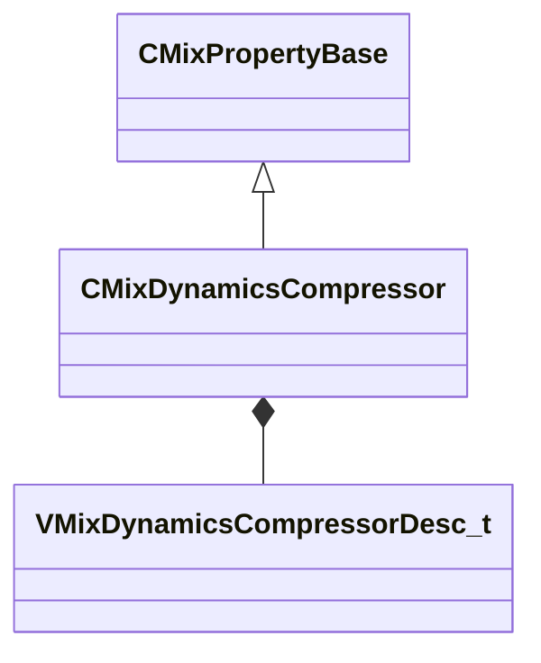

[Schemas](../../schemas.md) / [sounddoc_lib](../sounddoc_lib.md) / CMixDynamicsCompressor

# CMixDynamicsCompressor

**Kind:** class · **Size:** 80 bytes (`0x50`) · **Align:** 8 · **Module:** sounddoc_lib

**Inherits from:** [CMixPropertyBase](../sounddoc_lib/CMixPropertyBase.md)

**Metadata:** `MPropertyDescription Compress the dynamic range of a signal when it is louder than some threshold.`, `MPropertyFriendlyName VMix Compressor/Limiter Node`

**Relationships:**

## Memory layout

9 fields (4 declared here, 5 inherited). Offsets are absolute from the object base.

| Offset | Field | Type | From | Annotations |
|--------|-------|------|------|-------------|
| `0x8` | `m_name` | CUtlString | [CMixPropertyBase](../sounddoc_lib/CMixPropertyBase.md) | `MPropertyDescription Node name` `MPropertyFriendlyName Name` `MPropertySortPriority 1` |
| `0x10` | `m_Comment` | CUtlString | [CMixPropertyBase](../sounddoc_lib/CMixPropertyBase.md) | `MPropertyDescription Description of how this is used  the graph for people reading the graph` `MPropertySortPriority -2` |
| `0x18` | `m_bActive` | bool | [CMixPropertyBase](../sounddoc_lib/CMixPropertyBase.md) | `MPropertyHideField` `MPropertySortPriority -1` |
| `0x19` | `m_bSolo` | bool | [CMixPropertyBase](../sounddoc_lib/CMixPropertyBase.md) | `MPropertyHideField` `MPropertySortPriority -1` |
| `0x1a` | `m_bEditProperties` | bool | [CMixPropertyBase](../sounddoc_lib/CMixPropertyBase.md) | `MPropertyHideField` `MPropertySortPriority -1` |
| `0x20` | `m_nChannels` | int32 |  | `MPropertyAttributeChoiceName processor_channels` `MPropertyFriendlyName Channels` |
| `0x24` | `m_desc` | [VMixDynamicsCompressorDesc_t](../soundsystem_lowlevel/VMixDynamicsCompressorDesc_t.md) |  | `MPropertyAutoExpandSelf` |
| `0x48` | `m_nUIPage` | int32 |  |  |
| `0x4c` | `m_bIsLimiter` | bool |  |  |

KV3 class defaults

<pre>{
	&quot;_class&quot;: &quot;CMixDynamicsCompressor&quot;,
	&quot;m_name&quot;: &quot;&quot;,
	&quot;m_Comment&quot;: &quot;&quot;,
	&quot;m_bActive&quot;: true,
	&quot;m_bSolo&quot;: false,
	&quot;m_bEditProperties&quot;: false,
	&quot;m_nChannels&quot;: -1,
	&quot;m_desc&quot;:
	{
		&quot;m_fldbOutputGain&quot;: 0.000000,
		&quot;m_fldbCompressionThreshold&quot;: -6.000000,
		&quot;m_fldbKneeWidth&quot;: 0.000000,
		&quot;m_flCompressionRatio&quot;: 2.000000,
		&quot;m_flAttackTimeMS&quot;: 100.000000,
		&quot;m_flReleaseTimeMS&quot;: 400.000000,
		&quot;m_flRMSTimeMS&quot;: 300.000000,
		&quot;m_flWetMix&quot;: 1.000000,
		&quot;m_bPeakMode&quot;: false
	},
	&quot;m_nUIPage&quot;: 1,
	&quot;m_bIsLimiter&quot;: false
}</pre>

