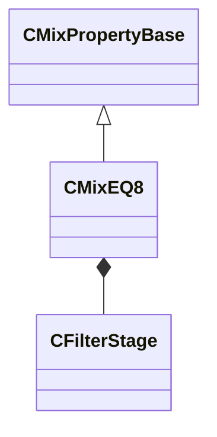

[Schemas](../../schemas.md) / [sounddoc_lib](../sounddoc_lib.md) / CMixEQ8

# CMixEQ8

**Kind:** class · **Size:** 232 bytes (`0xe8`) · **Align:** 8 · **Module:** sounddoc_lib

**Inherits from:** [CMixPropertyBase](../sounddoc_lib/CMixPropertyBase.md)

**Metadata:** `MPropertyDescription Up to 8 bands of EQ.  Boost/cut up to 8 bands with adjustable Q.  Filters can also be configured as low/high pass or low/high shelf.`, `MPropertyFriendlyName VMix EQ8 Audio Node`

**Relationships:**

## Memory layout

7 fields (2 declared here, 5 inherited). Offsets are absolute from the object base.

| Offset | Field | Type | From | Annotations |
|--------|-------|------|------|-------------|
| `0x8` | `m_name` | CUtlString | [CMixPropertyBase](../sounddoc_lib/CMixPropertyBase.md) | `MPropertyDescription Node name` `MPropertyFriendlyName Name` `MPropertySortPriority 1` |
| `0x10` | `m_Comment` | CUtlString | [CMixPropertyBase](../sounddoc_lib/CMixPropertyBase.md) | `MPropertyDescription Description of how this is used  the graph for people reading the graph` `MPropertySortPriority -2` |
| `0x18` | `m_bActive` | bool | [CMixPropertyBase](../sounddoc_lib/CMixPropertyBase.md) | `MPropertyHideField` `MPropertySortPriority -1` |
| `0x19` | `m_bSolo` | bool | [CMixPropertyBase](../sounddoc_lib/CMixPropertyBase.md) | `MPropertyHideField` `MPropertySortPriority -1` |
| `0x1a` | `m_bEditProperties` | bool | [CMixPropertyBase](../sounddoc_lib/CMixPropertyBase.md) | `MPropertyHideField` `MPropertySortPriority -1` |
| `0x20` | `m_nChannels` | int32 |  | `MPropertyAttributeChoiceName processor_channels` `MPropertyFriendlyName Channels` |
| `0x28` | `m_stages` | [CFilterStage](../sounddoc_lib/CFilterStage.md)[8] |  | `MPropertyFriendlyName EQ Stages` |

KV3 class defaults

<pre>{
	&quot;_class&quot;: &quot;CMixEQ8&quot;,
	&quot;m_name&quot;: &quot;&quot;,
	&quot;m_Comment&quot;: &quot;&quot;,
	&quot;m_bActive&quot;: true,
	&quot;m_bSolo&quot;: false,
	&quot;m_bEditProperties&quot;: false,
	&quot;m_nChannels&quot;: -1,
	&quot;m_stages&quot;:
	[
		{
			&quot;m_filterType&quot;: &quot;FILTER_LOW_SHELF&quot;,
			&quot;m_flFrequency&quot;: 80.000000,
			&quot;m_flQ&quot;: 1.000000,
			&quot;m_fldbGain&quot;: 0.000000,
			&quot;m_nFilterSlope&quot;: &quot;FILTER_SLOPE_12dB&quot;,
			&quot;m_bEnable&quot;: true
		},
		{
			&quot;m_filterType&quot;: &quot;FILTER_PEAKING_EQ&quot;,
			&quot;m_flFrequency&quot;: 500.000000,
			&quot;m_flQ&quot;: 3.000000,
			&quot;m_fldbGain&quot;: 0.000000,
			&quot;m_nFilterSlope&quot;: &quot;FILTER_SLOPE_12dB&quot;,
			&quot;m_bEnable&quot;: true
		},
		{
			&quot;m_filterType&quot;: &quot;FILTER_PEAKING_EQ&quot;,
			&quot;m_flFrequency&quot;: 750.000000,
			&quot;m_flQ&quot;: 3.000000,
			&quot;m_fldbGain&quot;: 0.000000,
			&quot;m_nFilterSlope&quot;: &quot;FILTER_SLOPE_12dB&quot;,
			&quot;m_bEnable&quot;: false
		},
		{
			&quot;m_filterType&quot;: &quot;FILTER_PEAKING_EQ&quot;,
			&quot;m_flFrequency&quot;: 1200.000000,
			&quot;m_flQ&quot;: 3.000000,
			&quot;m_fldbGain&quot;: 0.000000,
			&quot;m_nFilterSlope&quot;: &quot;FILTER_SLOPE_12dB&quot;,
			&quot;m_bEnable&quot;: true
		},
		{
			&quot;m_filterType&quot;: &quot;FILTER_PEAKING_EQ&quot;,
			&quot;m_flFrequency&quot;: 2000.000000,
			&quot;m_flQ&quot;: 3.000000,
			&quot;m_fldbGain&quot;: 0.000000,
			&quot;m_nFilterSlope&quot;: &quot;FILTER_SLOPE_12dB&quot;,
			&quot;m_bEnable&quot;: false
		},
		{
			&quot;m_filterType&quot;: &quot;FILTER_PEAKING_EQ&quot;,
			&quot;m_flFrequency&quot;: 3000.000000,
			&quot;m_flQ&quot;: 3.000000,
			&quot;m_fldbGain&quot;: 0.000000,
			&quot;m_nFilterSlope&quot;: &quot;FILTER_SLOPE_12dB&quot;,
			&quot;m_bEnable&quot;: true
		},
		{
			&quot;m_filterType&quot;: &quot;FILTER_PEAKING_EQ&quot;,
			&quot;m_flFrequency&quot;: 5000.000000,
			&quot;m_flQ&quot;: 3.000000,
			&quot;m_fldbGain&quot;: 0.000000,
			&quot;m_nFilterSlope&quot;: &quot;FILTER_SLOPE_12dB&quot;,
			&quot;m_bEnable&quot;: false
		},
		{
			&quot;m_filterType&quot;: &quot;FILTER_HIGH_SHELF&quot;,
			&quot;m_flFrequency&quot;: 12000.000000,
			&quot;m_flQ&quot;: 1.000000,
			&quot;m_fldbGain&quot;: 0.000000,
			&quot;m_nFilterSlope&quot;: &quot;FILTER_SLOPE_12dB&quot;,
			&quot;m_bEnable&quot;: true
		}
	]
}</pre>

