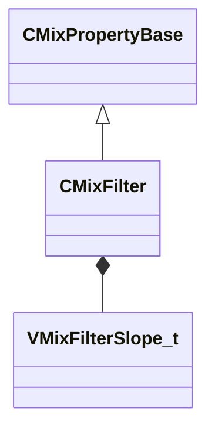

[Schemas](../../schemas.md) / [sounddoc_lib](../sounddoc_lib.md) / CMixFilter

# CMixFilter

**Kind:** class · **Size:** 64 bytes (`0x40`) · **Align:** 8 · **Module:** sounddoc_lib

**Inherits from:** [CMixPropertyBase](../sounddoc_lib/CMixPropertyBase.md)

**Metadata:** `MPropertyDescription Resonant filter with adjustable slope. NOTE: This is a clean filter, not an analog model with distortion.`, `MPropertyFriendlyName VMix Filter Audio Node`

**Relationships:**

## Memory layout

11 fields (6 declared here, 5 inherited). Offsets are absolute from the object base.

| Offset | Field | Type | From | Annotations |
|--------|-------|------|------|-------------|
| `0x8` | `m_name` | CUtlString | [CMixPropertyBase](../sounddoc_lib/CMixPropertyBase.md) | `MPropertyDescription Node name` `MPropertyFriendlyName Name` `MPropertySortPriority 1` |
| `0x10` | `m_Comment` | CUtlString | [CMixPropertyBase](../sounddoc_lib/CMixPropertyBase.md) | `MPropertyDescription Description of how this is used  the graph for people reading the graph` `MPropertySortPriority -2` |
| `0x18` | `m_bActive` | bool | [CMixPropertyBase](../sounddoc_lib/CMixPropertyBase.md) | `MPropertyHideField` `MPropertySortPriority -1` |
| `0x19` | `m_bSolo` | bool | [CMixPropertyBase](../sounddoc_lib/CMixPropertyBase.md) | `MPropertyHideField` `MPropertySortPriority -1` |
| `0x1a` | `m_bEditProperties` | bool | [CMixPropertyBase](../sounddoc_lib/CMixPropertyBase.md) | `MPropertyHideField` `MPropertySortPriority -1` |
| `0x20` | `m_filterType` | CUtlString |  | `MPropertyAttributeChoiceName filter_type` `MPropertyFriendlyName Filter Type` |
| `0x28` | `m_nChannels` | int32 |  | `MPropertyAttributeChoiceName processor_channels` `MPropertyFriendlyName Channels` |
| `0x2c` | `m_flFrequency` | float32 |  | `MPropertyAttributeRange biased 20 22000` `MPropertyFriendlyName Center Frequency (Hz)` |
| `0x30` | `m_flQ` | float32 |  | `MPropertyAttributeRange 0.1 12` `MPropertyFriendlyName Q` |
| `0x34` | `m_fldbGain` | float32 |  | `MPropertyAttributeRange -24 24` `MPropertyFriendlyName Gain (dB)` |
| `0x38` | `m_nFilterSlope` | [VMixFilterSlope_t](../!GlobalTypes/VMixFilterSlope_t.md) |  | `MPropertyFriendlyName Filter slope` |

KV3 class defaults

<pre>{
	&quot;_class&quot;: &quot;CMixFilter&quot;,
	&quot;m_name&quot;: &quot;&quot;,
	&quot;m_Comment&quot;: &quot;&quot;,
	&quot;m_bActive&quot;: true,
	&quot;m_bSolo&quot;: false,
	&quot;m_bEditProperties&quot;: false,
	&quot;m_filterType&quot;: &quot;FILTER_LOWPASS&quot;,
	&quot;m_nChannels&quot;: -1,
	&quot;m_flFrequency&quot;: 2000.000000,
	&quot;m_flQ&quot;: 0.707000,
	&quot;m_fldbGain&quot;: 0.000000,
	&quot;m_nFilterSlope&quot;: &quot;FILTER_SLOPE_12dB&quot;
}</pre>

