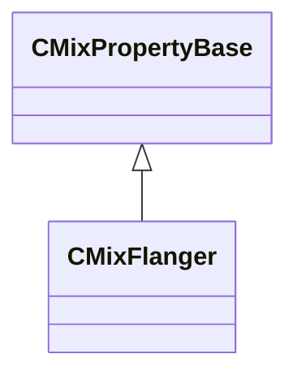

[Schemas](../../schemas.md) / [sounddoc_lib](../sounddoc_lib.md) / CMixFlanger

# CMixFlanger

> Source: **Build 25000182** · 2026-08-28 · `windows-x86_64` · schema `0.10.0`

**Kind:** class · **Size:** 72 bytes (`0x48`) · **Align:** 8 · **Module:** sounddoc_lib

**Inherits from:** [CMixPropertyBase](../sounddoc_lib/CMixPropertyBase.md)

**Metadata:** `MPropertyDescription A short time delay with modulation for flange and chorus effects.`, `MPropertyFriendlyName VMix Short timeModulating Delay Audio Node`

**Relationships:**

## Memory layout

14 fields (9 declared here, 5 inherited). Offsets are absolute from the object base.

| Offset | Field | Type | From | Annotations |
|--------|-------|------|------|-------------|
| `0x8` | `m_name` | CUtlString | [CMixPropertyBase](../sounddoc_lib/CMixPropertyBase.md) | `MPropertyDescription Node name` `MPropertyFriendlyName Name` `MPropertySortPriority 1` |
| `0x10` | `m_Comment` | CUtlString | [CMixPropertyBase](../sounddoc_lib/CMixPropertyBase.md) | `MPropertyDescription Description of how this is used  the graph for people reading the graph` `MPropertySortPriority -2` |
| `0x18` | `m_bActive` | bool | [CMixPropertyBase](../sounddoc_lib/CMixPropertyBase.md) | `MPropertyHideField` `MPropertySortPriority -1` |
| `0x19` | `m_bSolo` | bool | [CMixPropertyBase](../sounddoc_lib/CMixPropertyBase.md) | `MPropertyHideField` `MPropertySortPriority -1` |
| `0x1a` | `m_bEditProperties` | bool | [CMixPropertyBase](../sounddoc_lib/CMixPropertyBase.md) | `MPropertyHideField` `MPropertySortPriority -1` |
| `0x20` | `m_flDelay` | float32 |  | `MPropertyAttributeRange 0.5 14` `MPropertyFriendlyName Delay Time (ms)` |
| `0x24` | `m_flFeedback` | float32 |  | `MPropertyAttributeRange -40 -0.6` `MPropertyFriendlyName Feedback Gain (dB)` |
| `0x28` | `m_flFeedfoward` | float32 |  | `MPropertyAttributeRange 0 1.0` `MPropertyFriendlyName Wet (linear)` |
| `0x2c` | `m_flModRate` | float32 |  | `MPropertyAttributeRange 0 4` `MPropertyFriendlyName Modulation Rate (Hz)` |
| `0x30` | `m_flModDepth` | float32 |  | `MPropertyAttributeRange 0 1.0` `MPropertyFriendlyName Modulation Depth (linear)` |
| `0x34` | `m_bPhaseInvert` | bool |  | `MPropertyFriendlyName Invert Phase` |
| `0x38` | `m_flGlideTime` | float32 |  | `MPropertyAttributeRange 0 2000` `MPropertyFriendlyName Modulation Param Glide (ms)` |
| `0x3c` | `m_bAntialiasing` | bool |  | `MPropertyFriendlyName Apply Antialiasing` |
| `0x40` | `m_flGain` | float32 |  | `MPropertyAttributeRange -24 24` `MPropertyFriendlyName Output Gain (dB)` |

KV3 class defaults

<pre>{
	&quot;_class&quot;: &quot;CMixFlanger&quot;,
	&quot;m_name&quot;: &quot;&quot;,
	&quot;m_Comment&quot;: &quot;&quot;,
	&quot;m_bActive&quot;: true,
	&quot;m_bSolo&quot;: false,
	&quot;m_bEditProperties&quot;: false,
	&quot;m_flDelay&quot;: 8.000000,
	&quot;m_flFeedback&quot;: -40.000000,
	&quot;m_flFeedfoward&quot;: 0.500000,
	&quot;m_flModRate&quot;: 0.500000,
	&quot;m_flModDepth&quot;: 0.500000,
	&quot;m_bPhaseInvert&quot;: false,
	&quot;m_flGlideTime&quot;: 150.000000,
	&quot;m_bAntialiasing&quot;: false,
	&quot;m_flGain&quot;: 0.000000
}</pre>

