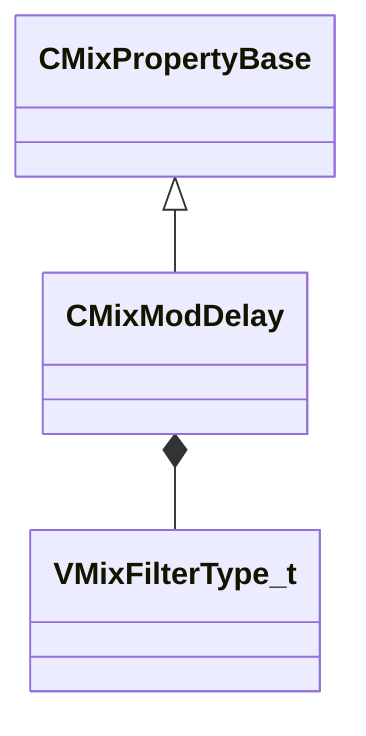

[Schemas](../../schemas.md) / [sounddoc_lib](../sounddoc_lib.md) / CMixModDelay

# CMixModDelay

**Kind:** class · **Size:** 80 bytes (`0x50`) · **Align:** 8 · **Module:** sounddoc_lib

**Inherits from:** [CMixPropertyBase](../sounddoc_lib/CMixPropertyBase.md)

**Metadata:** `MPropertyDescription A delay with a modulated delay time.`, `MPropertyFriendlyName VMix Modulating Delay Audio Node`

**Relationships:**

## Memory layout

17 fields (12 declared here, 5 inherited). Offsets are absolute from the object base.

| Offset | Field | Type | From | Annotations |
|--------|-------|------|------|-------------|
| `0x8` | `m_name` | CUtlString | [CMixPropertyBase](../sounddoc_lib/CMixPropertyBase.md) | `MPropertyDescription Node name` `MPropertyFriendlyName Name` `MPropertySortPriority 1` |
| `0x10` | `m_Comment` | CUtlString | [CMixPropertyBase](../sounddoc_lib/CMixPropertyBase.md) | `MPropertyDescription Description of how this is used  the graph for people reading the graph` `MPropertySortPriority -2` |
| `0x18` | `m_bActive` | bool | [CMixPropertyBase](../sounddoc_lib/CMixPropertyBase.md) | `MPropertyHideField` `MPropertySortPriority -1` |
| `0x19` | `m_bSolo` | bool | [CMixPropertyBase](../sounddoc_lib/CMixPropertyBase.md) | `MPropertyHideField` `MPropertySortPriority -1` |
| `0x1a` | `m_bEditProperties` | bool | [CMixPropertyBase](../sounddoc_lib/CMixPropertyBase.md) | `MPropertyHideField` `MPropertySortPriority -1` |
| `0x20` | `m_bPhaseInvert` | bool |  | `MPropertyFriendlyName Invert Phase` |
| `0x24` | `m_flGlideTime` | float32 |  | `MPropertyAttributeRange 0 2000` `MPropertyFriendlyName Glide Time (ms)` |
| `0x28` | `m_flDelay` | float32 |  | `MPropertyAttributeRange 10 2000` `MPropertyFriendlyName Delay Time (ms)` `MPropertyGroupName Delay` |
| `0x2c` | `m_flFeedback` | float32 |  | `MPropertyAttributeRange -24 -0.6` `MPropertyFriendlyName Feedback Gain (dB)` |
| `0x30` | `m_flGain` | float32 |  | `MPropertyAttributeRange -24 24` `MPropertyFriendlyName Output Gain (dB)` |
| `0x34` | `m_flModRate` | float32 |  | `MPropertyAttributeRange 0 20` `MPropertyFriendlyName Modulation Rate (Hz)` |
| `0x38` | `m_flModDepth` | float32 |  | `MPropertyAttributeRange 0 1.0` `MPropertyFriendlyName Modulation Depth (linear)` |
| `0x3c` | `m_filterType` | [VMixFilterType_t](../!GlobalTypes/VMixFilterType_t.md) |  | `MPropertyFriendlyName Filter Type` `MPropertyGroupName Filter` |
| `0x40` | `m_flFrequency` | float32 |  | `MPropertyAttributeRange biased 20 22000` `MPropertyFriendlyName Center Frequency (Hz)` `MPropertyGroupName Filter` |
| `0x44` | `m_flQ` | float32 |  | `MPropertyAttributeRange 0.1 12` `MPropertyFriendlyName Q` `MPropertyGroupName Filter` |
| `0x48` | `m_flFilterGain` | float32 |  | `MPropertyAttributeRange -24 24` `MPropertyFriendlyName Filter Gain (dB)` `MPropertyGroupName Filter` |
| `0x4c` | `m_bAntialiasing` | bool |  | `MPropertyFriendlyName Apply Antialiasing` |

KV3 class defaults

<pre>{
	&quot;_class&quot;: &quot;CMixModDelay&quot;,
	&quot;m_name&quot;: &quot;&quot;,
	&quot;m_Comment&quot;: &quot;&quot;,
	&quot;m_bActive&quot;: true,
	&quot;m_bSolo&quot;: false,
	&quot;m_bEditProperties&quot;: false,
	&quot;m_bPhaseInvert&quot;: false,
	&quot;m_flGlideTime&quot;: 150.000000,
	&quot;m_flDelay&quot;: 500.000000,
	&quot;m_flFeedback&quot;: -40.000000,
	&quot;m_flGain&quot;: 0.000000,
	&quot;m_flModRate&quot;: 0.000000,
	&quot;m_flModDepth&quot;: 0.000000,
	&quot;m_filterType&quot;: &quot;FILTER_PASSTHROUGH&quot;,
	&quot;m_flFrequency&quot;: 400.000000,
	&quot;m_flQ&quot;: 0.700000,
	&quot;m_flFilterGain&quot;: 0.000000,
	&quot;m_bAntialiasing&quot;: true
}</pre>

