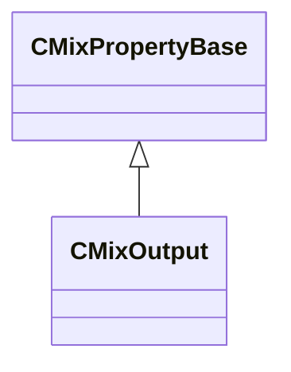

[Schemas](../../schemas.md) / [sounddoc_lib](../sounddoc_lib.md) / CMixOutput

# CMixOutput

> Source: **Build 25000182** · 2026-08-28 · `windows-x86_64` · schema `0.10.0`

**Kind:** class · **Size:** 48 bytes (`0x30`) · **Align:** 8 · **Module:** sounddoc_lib

**Inherits from:** [CMixPropertyBase](../sounddoc_lib/CMixPropertyBase.md)

**Metadata:** `MPropertyDescription This is where your audio is output from the graph`, `MPropertyFriendlyName VMix Output Node`

**Relationships:**

## Memory layout

8 fields (3 declared here, 5 inherited). Offsets are absolute from the object base.

| Offset | Field | Type | From | Annotations |
|--------|-------|------|------|-------------|
| `0x8` | `m_name` | CUtlString | [CMixPropertyBase](../sounddoc_lib/CMixPropertyBase.md) | `MPropertyDescription Node name` `MPropertyFriendlyName Name` `MPropertySortPriority 1` |
| `0x10` | `m_Comment` | CUtlString | [CMixPropertyBase](../sounddoc_lib/CMixPropertyBase.md) | `MPropertyDescription Description of how this is used  the graph for people reading the graph` `MPropertySortPriority -2` |
| `0x18` | `m_bActive` | bool | [CMixPropertyBase](../sounddoc_lib/CMixPropertyBase.md) | `MPropertyHideField` `MPropertySortPriority -1` |
| `0x19` | `m_bSolo` | bool | [CMixPropertyBase](../sounddoc_lib/CMixPropertyBase.md) | `MPropertyHideField` `MPropertySortPriority -1` |
| `0x1a` | `m_bEditProperties` | bool | [CMixPropertyBase](../sounddoc_lib/CMixPropertyBase.md) | `MPropertyHideField` `MPropertySortPriority -1` |
| `0x20` | `m_flVolume1` | float32 |  | `MPropertyDescription Volume for audio.Input1. Range is 0 - 1` |
| `0x24` | `m_flVolume2` | float32 |  | `MPropertyDescription Volume for audio.Input2. Range is 0 - 1` |
| `0x28` | `m_sendTo` | CUtlString |  | `MPropertyAttributeChoiceName send_to_track` `MPropertyDescription Optional name of a send in your main mix graph.  When set this node's mix will be sent to the named track in your main mix graph. Most voice graphs have a single output, that is routed by the sound operator stack.You should only use this for special cases where the vmix graph needs to route additional unique mixes to specific tracks.e.g.bypass HRTF andsend a different mix to the reverb send` `MPropertyFriendlyName Send To Track` |

KV3 class defaults

<pre>{
	&quot;_class&quot;: &quot;CMixOutput&quot;,
	&quot;m_name&quot;: &quot;&quot;,
	&quot;m_Comment&quot;: &quot;&quot;,
	&quot;m_bActive&quot;: true,
	&quot;m_bSolo&quot;: false,
	&quot;m_bEditProperties&quot;: false,
	&quot;m_flVolume1&quot;: 1.000000,
	&quot;m_flVolume2&quot;: 1.000000,
	&quot;m_sendTo&quot;: &quot;&quot;
}</pre>

