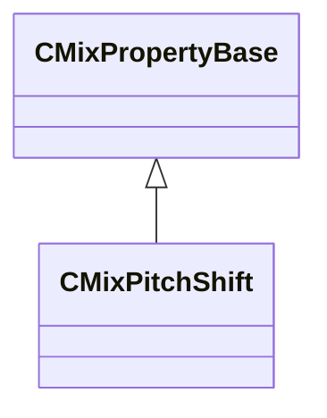

[Schemas](../../schemas.md) / [sounddoc_lib](../sounddoc_lib.md) / CMixPitchShift

# CMixPitchShift

> Source: **Build 25000182** · 2026-08-28 · `windows-x86_64` · schema `0.10.0`

**Kind:** class · **Size:** 56 bytes (`0x38`) · **Align:** 8 · **Module:** sounddoc_lib

**Inherits from:** [CMixPropertyBase](../sounddoc_lib/CMixPropertyBase.md)

**Metadata:** `MPropertyDescription Adjust the pitch of an audio track.  This happens in real-time so the timing of the track is unaffected.  Generally the time domain processor will produce better results for small shifts downward.  For shifting upward it will alias where the frequency space shifter will apply anti-aliasing.`, `MPropertyFriendlyName VMix Pitch Shift Audio Node`

**Relationships:**

## Memory layout

10 fields (5 declared here, 5 inherited). Offsets are absolute from the object base.

| Offset | Field | Type | From | Annotations |
|--------|-------|------|------|-------------|
| `0x8` | `m_name` | CUtlString | [CMixPropertyBase](../sounddoc_lib/CMixPropertyBase.md) | `MPropertyDescription Node name` `MPropertyFriendlyName Name` `MPropertySortPriority 1` |
| `0x10` | `m_Comment` | CUtlString | [CMixPropertyBase](../sounddoc_lib/CMixPropertyBase.md) | `MPropertyDescription Description of how this is used  the graph for people reading the graph` `MPropertySortPriority -2` |
| `0x18` | `m_bActive` | bool | [CMixPropertyBase](../sounddoc_lib/CMixPropertyBase.md) | `MPropertyHideField` `MPropertySortPriority -1` |
| `0x19` | `m_bSolo` | bool | [CMixPropertyBase](../sounddoc_lib/CMixPropertyBase.md) | `MPropertyHideField` `MPropertySortPriority -1` |
| `0x1a` | `m_bEditProperties` | bool | [CMixPropertyBase](../sounddoc_lib/CMixPropertyBase.md) | `MPropertyHideField` `MPropertySortPriority -1` |
| `0x20` | `m_nChannels` | int32 |  | `MPropertyAttributeChoiceName processor_channels` `MPropertyFriendlyName Channels` |
| `0x24` | `m_flPitchScale` | float32 |  | `MPropertyAttributeRange 0.2 4.0` `MPropertyFriendlyName Pitch Scale` |
| `0x28` | `m_flGrainMs` | float32 |  | `MPropertyAttributeRange 1 100` `MPropertyFriendlyName Grain Size (ms)` |
| `0x2c` | `m_nProcType` | int32 |  | `MPropertyAttributeRange 0 1` `MPropertyFriendlyName Type 0=time domain, 1 = freq domain` |
| `0x30` | `m_nQuality` | int32 |  | `MPropertyAttributeRange 1 4` `MPropertyFriendlyName Quality level 1..4` |

KV3 class defaults

<pre>{
	&quot;_class&quot;: &quot;CMixPitchShift&quot;,
	&quot;m_name&quot;: &quot;&quot;,
	&quot;m_Comment&quot;: &quot;&quot;,
	&quot;m_bActive&quot;: true,
	&quot;m_bSolo&quot;: false,
	&quot;m_bEditProperties&quot;: false,
	&quot;m_nChannels&quot;: -1,
	&quot;m_flPitchScale&quot;: 1.000000,
	&quot;m_flGrainMs&quot;: 100.000000,
	&quot;m_nProcType&quot;: 0,
	&quot;m_nQuality&quot;: 1
}</pre>

