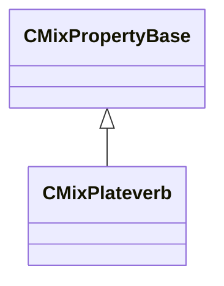

[Schemas](../../schemas.md) / [sounddoc_lib](../sounddoc_lib.md) / CMixPlateverb

# CMixPlateverb

> Source: **Build 25000182** · 2026-08-28 · `windows-x86_64` · schema `0.10.0`

**Kind:** class · **Size:** 64 bytes (`0x40`) · **Align:** 8 · **Module:** sounddoc_lib

**Inherits from:** [CMixPropertyBase](../sounddoc_lib/CMixPropertyBase.md)

**Metadata:** `MPropertyDescription Used to create reverb effects based on a model of a reverb plate.`, `MPropertyFriendlyName VMix Plateverb Audio Node`

**Relationships:**

## Memory layout

12 fields (7 declared here, 5 inherited). Offsets are absolute from the object base.

| Offset | Field | Type | From | Annotations |
|--------|-------|------|------|-------------|
| `0x8` | `m_name` | CUtlString | [CMixPropertyBase](../sounddoc_lib/CMixPropertyBase.md) | `MPropertyDescription Node name` `MPropertyFriendlyName Name` `MPropertySortPriority 1` |
| `0x10` | `m_Comment` | CUtlString | [CMixPropertyBase](../sounddoc_lib/CMixPropertyBase.md) | `MPropertyDescription Description of how this is used  the graph for people reading the graph` `MPropertySortPriority -2` |
| `0x18` | `m_bActive` | bool | [CMixPropertyBase](../sounddoc_lib/CMixPropertyBase.md) | `MPropertyHideField` `MPropertySortPriority -1` |
| `0x19` | `m_bSolo` | bool | [CMixPropertyBase](../sounddoc_lib/CMixPropertyBase.md) | `MPropertyHideField` `MPropertySortPriority -1` |
| `0x1a` | `m_bEditProperties` | bool | [CMixPropertyBase](../sounddoc_lib/CMixPropertyBase.md) | `MPropertyHideField` `MPropertySortPriority -1` |
| `0x20` | `m_flPrefilter` | float32 |  | `MPropertyAttributeRange 0.0 1.0` `MPropertyFriendlyName Prefilter` |
| `0x24` | `m_flInputDiffusion1` | float32 |  | `MPropertyAttributeRange 0.0 1.0` `MPropertyFriendlyName Input Diffusion 1` |
| `0x28` | `m_flInputDiffusion2` | float32 |  | `MPropertyAttributeRange 0.0 1.0` `MPropertyFriendlyName Input Diffusion 2` |
| `0x2c` | `m_flDecay` | float32 |  | `MPropertyAttributeRange 0.0 1.0` `MPropertyFriendlyName Decay` |
| `0x30` | `m_flDamp` | float32 |  | `MPropertyAttributeRange 0.0 1.0` `MPropertyFriendlyName Dampening Factor` |
| `0x34` | `m_flFeedbackDiffusion1` | float32 |  | `MPropertyAttributeRange 0.0 1.0` `MPropertyFriendlyName Feedback Diffusion 1` |
| `0x38` | `m_flFeedbackDiffusion2` | float32 |  | `MPropertyAttributeRange 0.0 1.0` `MPropertyFriendlyName Feedback Diffusion 1` |

KV3 class defaults

<pre>{
	&quot;_class&quot;: &quot;CMixPlateverb&quot;,
	&quot;m_name&quot;: &quot;&quot;,
	&quot;m_Comment&quot;: &quot;&quot;,
	&quot;m_bActive&quot;: true,
	&quot;m_bSolo&quot;: false,
	&quot;m_bEditProperties&quot;: false,
	&quot;m_flPrefilter&quot;: 0.500000,
	&quot;m_flInputDiffusion1&quot;: 0.500000,
	&quot;m_flInputDiffusion2&quot;: 0.500000,
	&quot;m_flDecay&quot;: 0.500000,
	&quot;m_flDamp&quot;: 0.500000,
	&quot;m_flFeedbackDiffusion1&quot;: 0.500000,
	&quot;m_flFeedbackDiffusion2&quot;: 0.500000
}</pre>

