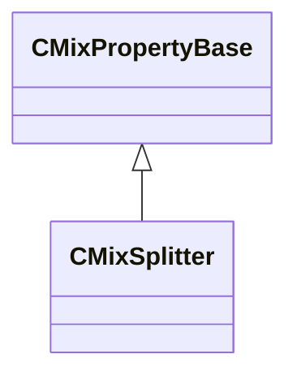

[Schemas](../../schemas.md) / [sounddoc_lib](../sounddoc_lib.md) / CMixSplitter

# CMixSplitter

> Source: **Build 25000182** · 2026-08-28 · `windows-x86_64` · schema `0.10.0`

**Kind:** class · **Size:** 64 bytes (`0x40`) · **Align:** 8 · **Module:** sounddoc_lib

**Inherits from:** [CMixPropertyBase](../sounddoc_lib/CMixPropertyBase.md)

**Metadata:** `MPropertyDescription Create multiple copies of a track at different volumes for processing or mixing separately.`, `MPropertyFriendlyName VMix Splitter Audio Node`

**Relationships:**

## Memory layout

13 fields (8 declared here, 5 inherited). Offsets are absolute from the object base.

| Offset | Field | Type | From | Annotations |
|--------|-------|------|------|-------------|
| `0x8` | `m_name` | CUtlString | [CMixPropertyBase](../sounddoc_lib/CMixPropertyBase.md) | `MPropertyDescription Node name` `MPropertyFriendlyName Name` `MPropertySortPriority 1` |
| `0x10` | `m_Comment` | CUtlString | [CMixPropertyBase](../sounddoc_lib/CMixPropertyBase.md) | `MPropertyDescription Description of how this is used  the graph for people reading the graph` `MPropertySortPriority -2` |
| `0x18` | `m_bActive` | bool | [CMixPropertyBase](../sounddoc_lib/CMixPropertyBase.md) | `MPropertyHideField` `MPropertySortPriority -1` |
| `0x19` | `m_bSolo` | bool | [CMixPropertyBase](../sounddoc_lib/CMixPropertyBase.md) | `MPropertyHideField` `MPropertySortPriority -1` |
| `0x1a` | `m_bEditProperties` | bool | [CMixPropertyBase](../sounddoc_lib/CMixPropertyBase.md) | `MPropertyHideField` `MPropertySortPriority -1` |
| `0x20` | `m_flVolume1` | float32 |  | `MPropertyFriendlyName Volume1` |
| `0x24` | `m_flVolume2` | float32 |  | `MPropertyFriendlyName Volume2` |
| `0x28` | `m_flVolume3` | float32 |  | `MPropertyFriendlyName Volume3` |
| `0x2c` | `m_flVolume4` | float32 |  | `MPropertyFriendlyName Volume4` |
| `0x30` | `m_flVolume5` | float32 |  | `MPropertyFriendlyName Volume5` |
| `0x34` | `m_flVolume6` | float32 |  | `MPropertyFriendlyName Volume6` |
| `0x38` | `m_flVolume7` | float32 |  | `MPropertyFriendlyName Volume7` |
| `0x3c` | `m_flVolume8` | float32 |  | `MPropertyFriendlyName Volume8` |

KV3 class defaults

<pre>{
	&quot;_class&quot;: &quot;CMixSplitter&quot;,
	&quot;m_name&quot;: &quot;&quot;,
	&quot;m_Comment&quot;: &quot;&quot;,
	&quot;m_bActive&quot;: true,
	&quot;m_bSolo&quot;: false,
	&quot;m_bEditProperties&quot;: false,
	&quot;m_flVolume1&quot;: 1.000000,
	&quot;m_flVolume2&quot;: 1.000000,
	&quot;m_flVolume3&quot;: 1.000000,
	&quot;m_flVolume4&quot;: 1.000000,
	&quot;m_flVolume5&quot;: 1.000000,
	&quot;m_flVolume6&quot;: 1.000000,
	&quot;m_flVolume7&quot;: 1.000000,
	&quot;m_flVolume8&quot;: 1.000000
}</pre>

