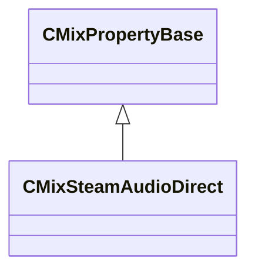

[Schemas](../../schemas.md) / [sounddoc_lib](../sounddoc_lib.md) / CMixSteamAudioDirect

# CMixSteamAudioDirect

**Kind:** class · **Size:** 88 bytes (`0x58`) · **Align:** 8 · **Module:** sounddoc_lib

**Inherits from:** [CMixPropertyBase](../sounddoc_lib/CMixPropertyBase.md)

**Metadata:** `MPropertyDescription Applies steam audio model for direct audio.  This includes modeling the loss due to transmission in air, directivity and occlusion effects.`, `MPropertyFriendlyName VMix Steam Audio Direct Node`

**Relationships:**

## Memory layout

17 fields (12 declared here, 5 inherited). Offsets are absolute from the object base.

| Offset | Field | Type | From | Annotations |
|--------|-------|------|------|-------------|
| `0x8` | `m_name` | CUtlString | [CMixPropertyBase](../sounddoc_lib/CMixPropertyBase.md) | `MPropertyDescription Node name` `MPropertyFriendlyName Name` `MPropertySortPriority 1` |
| `0x10` | `m_Comment` | CUtlString | [CMixPropertyBase](../sounddoc_lib/CMixPropertyBase.md) | `MPropertyDescription Description of how this is used  the graph for people reading the graph` `MPropertySortPriority -2` |
| `0x18` | `m_bActive` | bool | [CMixPropertyBase](../sounddoc_lib/CMixPropertyBase.md) | `MPropertyHideField` `MPropertySortPriority -1` |
| `0x19` | `m_bSolo` | bool | [CMixPropertyBase](../sounddoc_lib/CMixPropertyBase.md) | `MPropertyHideField` `MPropertySortPriority -1` |
| `0x1a` | `m_bEditProperties` | bool | [CMixPropertyBase](../sounddoc_lib/CMixPropertyBase.md) | `MPropertyHideField` `MPropertySortPriority -1` |
| `0x20` | `m_bApplyDistanceAttenuation` | bool |  | `MPropertyFriendlyName Apply Distance Attenuation` |
| `0x21` | `m_bApplyAirAbsorption` | bool |  | `MPropertyFriendlyName Apply Air Absorption` |
| `0x22` | `m_bApplyDirectivity` | bool |  | `MPropertyFriendlyName Apply Directivity` |
| `0x23` | `m_bApplyOcclusion` | bool |  | `MPropertyFriendlyName Apply Occlusion` |
| `0x24` | `m_bApplyTransmission` | bool |  | `MPropertyFriendlyName Apply Transmission` |
| `0x28` | `m_flDipoleWeight` | float32 |  | `MPropertyAttributeRange 0.0 1.0` `MPropertyFriendlyName Dipole Weight` |
| `0x2c` | `m_flDipolePower` | float32 |  | `MPropertyAttributeRange 0.0 4.0` `MPropertyFriendlyName Dipole Power` |
| `0x30` | `m_flOcclusion` | float32 |  | `MPropertyAttributeRange 0.0 1.0` `MPropertyFriendlyName Occlusion Value` |
| `0x34` | `m_flTransmissionLow` | float32 |  | `MPropertyAttributeRange 0.0 1.0` `MPropertyFriendlyName Transmission Value (Low Freq)` |
| `0x38` | `m_flTransmissionMid` | float32 |  | `MPropertyAttributeRange 0.0 1.0` `MPropertyFriendlyName Transmission Value (Mid Freq)` |
| `0x3c` | `m_flTransmissionHigh` | float32 |  | `MPropertyAttributeRange 0.0 1.0` `MPropertyFriendlyName Transmission Value (High Freq)` |
| `0x40` | `m_vecTransmission` | CUtlVector< float32 > |  | `MPropertyAttributeRange 0.0 1.0` `MPropertyFriendlyName Transmission Values` |

KV3 class defaults

<pre>{
	&quot;_class&quot;: &quot;CMixSteamAudioDirect&quot;,
	&quot;m_name&quot;: &quot;&quot;,
	&quot;m_Comment&quot;: &quot;&quot;,
	&quot;m_bActive&quot;: true,
	&quot;m_bSolo&quot;: false,
	&quot;m_bEditProperties&quot;: false,
	&quot;m_bApplyDistanceAttenuation&quot;: false,
	&quot;m_bApplyAirAbsorption&quot;: false,
	&quot;m_bApplyDirectivity&quot;: false,
	&quot;m_bApplyOcclusion&quot;: false,
	&quot;m_bApplyTransmission&quot;: false,
	&quot;m_flDipoleWeight&quot;: 1.000000,
	&quot;m_flDipolePower&quot;: 1.000000,
	&quot;m_flOcclusion&quot;: 1.000000,
	&quot;m_flTransmissionLow&quot;: 0.000000,
	&quot;m_flTransmissionMid&quot;: 0.000000,
	&quot;m_flTransmissionHigh&quot;: 0.000000,
	&quot;m_vecTransmission&quot;:
	[
	]
}</pre>

