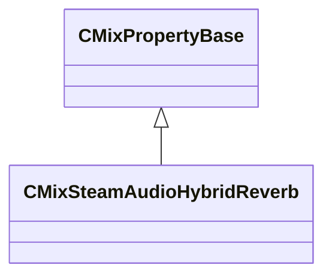

[Schemas](../../schemas.md) / [sounddoc_lib](../sounddoc_lib.md) / CMixSteamAudioHybridReverb

# CMixSteamAudioHybridReverb

**Kind:** class · **Size:** 72 bytes (`0x48`) · **Align:** 8 · **Module:** sounddoc_lib

**Inherits from:** [CMixPropertyBase](../sounddoc_lib/CMixPropertyBase.md)

**Metadata:** `MPropertyDescription Applies Steam Audio Hybrid Reverb.`, `MPropertyFriendlyName VMix Steam Audio Hybrid Reverb Node`

**Relationships:**

## Memory layout

9 fields (4 declared here, 5 inherited). Offsets are absolute from the object base.

| Offset | Field | Type | From | Annotations |
|--------|-------|------|------|-------------|
| `0x8` | `m_name` | CUtlString | [CMixPropertyBase](../sounddoc_lib/CMixPropertyBase.md) | `MPropertyDescription Node name` `MPropertyFriendlyName Name` `MPropertySortPriority 1` |
| `0x10` | `m_Comment` | CUtlString | [CMixPropertyBase](../sounddoc_lib/CMixPropertyBase.md) | `MPropertyDescription Description of how this is used  the graph for people reading the graph` `MPropertySortPriority -2` |
| `0x18` | `m_bActive` | bool | [CMixPropertyBase](../sounddoc_lib/CMixPropertyBase.md) | `MPropertyHideField` `MPropertySortPriority -1` |
| `0x19` | `m_bSolo` | bool | [CMixPropertyBase](../sounddoc_lib/CMixPropertyBase.md) | `MPropertyHideField` `MPropertySortPriority -1` |
| `0x1a` | `m_bEditProperties` | bool | [CMixPropertyBase](../sounddoc_lib/CMixPropertyBase.md) | `MPropertyHideField` `MPropertySortPriority -1` |
| `0x20` | `m_flReverbTimeLow` | float32 |  | `MPropertyAttributeRange 0.1 10.0` `MPropertyFriendlyName Reverb Time (RT60), Low Frequency` |
| `0x24` | `m_flReverbTimeMid` | float32 |  | `MPropertyAttributeRange 0.1 10.0` `MPropertyFriendlyName Reverb Time (RT60), Mid Frequency` |
| `0x28` | `m_flReverbTimeHigh` | float32 |  | `MPropertyAttributeRange 0.1 10.0` `MPropertyFriendlyName Reverb Time (RT60), High Frequency` |
| `0x30` | `m_vecReverbTime` | CUtlVector< float32 > |  | `MPropertyAttributeRange 0.1 10.0` `MPropertyFriendlyName Reverb Time` |

KV3 class defaults

<pre>{
	&quot;_class&quot;: &quot;CMixSteamAudioHybridReverb&quot;,
	&quot;m_name&quot;: &quot;&quot;,
	&quot;m_Comment&quot;: &quot;&quot;,
	&quot;m_bActive&quot;: true,
	&quot;m_bSolo&quot;: false,
	&quot;m_bEditProperties&quot;: false,
	&quot;m_flReverbTimeLow&quot;: 0.100000,
	&quot;m_flReverbTimeMid&quot;: 0.100000,
	&quot;m_flReverbTimeHigh&quot;: 0.100000,
	&quot;m_vecReverbTime&quot;:
	[
	]
}</pre>

