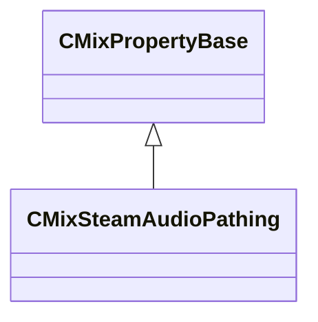

[Schemas](../../schemas.md) / [sounddoc_lib](../sounddoc_lib.md) / CMixSteamAudioPathing

# CMixSteamAudioPathing

**Kind:** class · **Size:** 96 bytes (`0x60`) · **Align:** 8 · **Module:** sounddoc_lib

**Inherits from:** [CMixPropertyBase](../sounddoc_lib/CMixPropertyBase.md)

**Metadata:** `MPropertyDescription Applies steam audio model for pathing audio through space.  This pans the audio based on the openings that the audio is audible through by traversing a path through space from the source to the listener.`, `MPropertyFriendlyName VMix Steam Audio Pathing Node`

**Relationships:**

## Memory layout

9 fields (4 declared here, 5 inherited). Offsets are absolute from the object base.

| Offset | Field | Type | From | Annotations |
|--------|-------|------|------|-------------|
| `0x8` | `m_name` | CUtlString | [CMixPropertyBase](../sounddoc_lib/CMixPropertyBase.md) | `MPropertyDescription Node name` `MPropertyFriendlyName Name` `MPropertySortPriority 1` |
| `0x10` | `m_Comment` | CUtlString | [CMixPropertyBase](../sounddoc_lib/CMixPropertyBase.md) | `MPropertyDescription Description of how this is used  the graph for people reading the graph` `MPropertySortPriority -2` |
| `0x18` | `m_bActive` | bool | [CMixPropertyBase](../sounddoc_lib/CMixPropertyBase.md) | `MPropertyHideField` `MPropertySortPriority -1` |
| `0x19` | `m_bSolo` | bool | [CMixPropertyBase](../sounddoc_lib/CMixPropertyBase.md) | `MPropertyHideField` `MPropertySortPriority -1` |
| `0x1a` | `m_bEditProperties` | bool | [CMixPropertyBase](../sounddoc_lib/CMixPropertyBase.md) | `MPropertyHideField` `MPropertySortPriority -1` |
| `0x20` | `m_flPathingMixLevel` | float32 |  | `MPropertyAttributeRange 0 1` `MPropertyFriendlyName Pathing Mix Level` |
| `0x24` | `m_vPathingEQ` | float32[3] |  | `MPropertyAttributeRange 0 1` `MPropertyFriendlyName Pathing EQ` |
| `0x30` | `m_vPathingCoeffs` | CUtlVector< float32 > |  | `MPropertyAttributeRange -1 1` `MPropertyFriendlyName Pathing Coefficients` |
| `0x48` | `m_vecPathingEQ` | CUtlVector< float32 > |  | `MPropertyAttributeRange 0.0 1.0` `MPropertyFriendlyName Pathing EQ (N-band)` |

KV3 class defaults

<pre>{
	&quot;_class&quot;: &quot;CMixSteamAudioPathing&quot;,
	&quot;m_name&quot;: &quot;&quot;,
	&quot;m_Comment&quot;: &quot;&quot;,
	&quot;m_bActive&quot;: true,
	&quot;m_bSolo&quot;: false,
	&quot;m_bEditProperties&quot;: false,
	&quot;m_flPathingMixLevel&quot;: 1.000000,
	&quot;m_vPathingEQ&quot;:
	[
		1.000000,
		1.000000,
		1.000000
	],
	&quot;m_vPathingCoeffs&quot;:
	[
	],
	&quot;m_vecPathingEQ&quot;:
	[
	]
}</pre>

