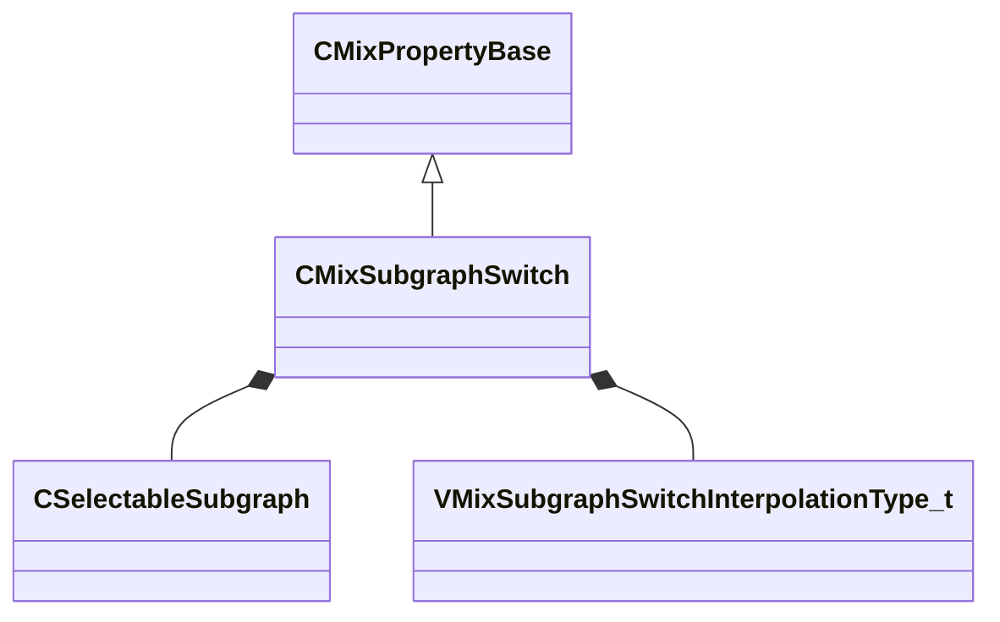

[Schemas](../../schemas.md) / [sounddoc_lib](../sounddoc_lib.md) / CMixSubgraphSwitch

# CMixSubgraphSwitch

**Kind:** class · **Size:** 104 bytes (`0x68`) · **Align:** 8 · **Module:** sounddoc_lib

**Inherits from:** [CMixPropertyBase](../sounddoc_lib/CMixPropertyBase.md)

**Metadata:** `MPropertyDescription Allows you to swap between sub-graphs with a short crossfade.  Can be used to swap out processing algorithms/configurations, or to dynamically enable/disable optional processing stages.  This can also expose control parameters from the subgraphs so those can be connected to the outer graph.`, `MPropertyFriendlyName VMix Subgraph Switch Audio Node`

**Relationships:**

## Memory layout

12 fields (7 declared here, 5 inherited). Offsets are absolute from the object base.

| Offset | Field | Type | From | Annotations |
|--------|-------|------|------|-------------|
| `0x8` | `m_name` | CUtlString | [CMixPropertyBase](../sounddoc_lib/CMixPropertyBase.md) | `MPropertyDescription Node name` `MPropertyFriendlyName Name` `MPropertySortPriority 1` |
| `0x10` | `m_Comment` | CUtlString | [CMixPropertyBase](../sounddoc_lib/CMixPropertyBase.md) | `MPropertyDescription Description of how this is used  the graph for people reading the graph` `MPropertySortPriority -2` |
| `0x18` | `m_bActive` | bool | [CMixPropertyBase](../sounddoc_lib/CMixPropertyBase.md) | `MPropertyHideField` `MPropertySortPriority -1` |
| `0x19` | `m_bSolo` | bool | [CMixPropertyBase](../sounddoc_lib/CMixPropertyBase.md) | `MPropertyHideField` `MPropertySortPriority -1` |
| `0x1a` | `m_bEditProperties` | bool | [CMixPropertyBase](../sounddoc_lib/CMixPropertyBase.md) | `MPropertyHideField` `MPropertySortPriority -1` |
| `0x20` | `bUseDetailedPlugNames` | bool |  | `MPropertyFriendlyName Show Detailed Plug Names` |
| `0x28` | `defaultSubgraph` | [CSelectableSubgraph](../sounddoc_lib/CSelectableSubgraph.md) |  | `MPropertyFriendlyName Default Subgraph` |
| `0x40` | `interpolationMode` | [VMixSubgraphSwitchInterpolationType_t](../!GlobalTypes/VMixSubgraphSwitchInterpolationType_t.md) |  | `MPropertyFriendlyName Mode` `MPropertyGroupName +Transition Behavior` |
| `0x44` | `bOnlyTailsOnFadeOut` | bool |  | `MPropertyFriendlyName Only Let Effect Ring On Fadeout` `MPropertyGroupName Transition Behavior` |
| `0x48` | `flTransitionTime` | float32 |  | `MPropertyFriendlyName Transition time (seconds)` `MPropertyGroupName Transition Behavior` |
| `0x4c` | `nChannels` | int32 |  | `MPropertyAttributeChoiceName processor_channels` `MPropertyFriendlyName Channels` |
| `0x50` | `subgraphs` | CUtlVector< [CSelectableSubgraph](../sounddoc_lib/CSelectableSubgraph.md) > |  |  |

KV3 class defaults

<pre>{
	&quot;_class&quot;: &quot;CMixSubgraphSwitch&quot;,
	&quot;m_name&quot;: &quot;&quot;,
	&quot;m_Comment&quot;: &quot;&quot;,
	&quot;m_bActive&quot;: true,
	&quot;m_bSolo&quot;: false,
	&quot;m_bEditProperties&quot;: false,
	&quot;bUseDetailedPlugNames&quot;: false,
	&quot;defaultSubgraph&quot;:
	{
		&quot;_class&quot;: &quot;CSelectableSubgraph&quot;,
		&quot;file&quot;: &quot;soundstacks/subgraph_default.vmix&quot;,
		&quot;subgraphName&quot;: &quot;&quot;
	},
	&quot;interpolationMode&quot;: &quot;SUBGRAPH_INTERPOLATION_TEMPORAL_CROSSFADE&quot;,
	&quot;bOnlyTailsOnFadeOut&quot;: false,
	&quot;flTransitionTime&quot;: 0.500000,
	&quot;nChannels&quot;: -1,
	&quot;subgraphs&quot;:
	[
	]
}</pre>

