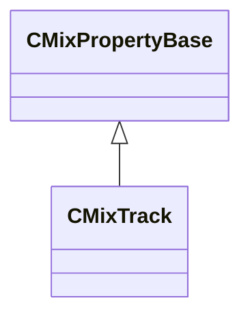

[Schemas](../../schemas.md) / [sounddoc_lib](../sounddoc_lib.md) / CMixTrack

# CMixTrack

> Source: **Build 25000182** · 2026-08-28 · `windows-x86_64` · schema `0.10.0`

**Kind:** class · **Size:** 80 bytes (`0x50`) · **Align:** 8 · **Module:** sounddoc_lib

**Inherits from:** [CMixPropertyBase](../sounddoc_lib/CMixPropertyBase.md)

**Metadata:** `MPropertyDescription This node creates a track.Voices can be played on a track.  This is the source of audio for your graph.`, `MPropertyFriendlyName VMix Track Node`

**Relationships:**

## Memory layout

12 fields (7 declared here, 5 inherited). Offsets are absolute from the object base.

| Offset | Field | Type | From | Annotations |
|--------|-------|------|------|-------------|
| `0x8` | `m_name` | CUtlString | [CMixPropertyBase](../sounddoc_lib/CMixPropertyBase.md) | `MPropertyDescription Node name` `MPropertyFriendlyName Name` `MPropertySortPriority 1` |
| `0x10` | `m_Comment` | CUtlString | [CMixPropertyBase](../sounddoc_lib/CMixPropertyBase.md) | `MPropertyDescription Description of how this is used  the graph for people reading the graph` `MPropertySortPriority -2` |
| `0x18` | `m_bActive` | bool | [CMixPropertyBase](../sounddoc_lib/CMixPropertyBase.md) | `MPropertyHideField` `MPropertySortPriority -1` |
| `0x19` | `m_bSolo` | bool | [CMixPropertyBase](../sounddoc_lib/CMixPropertyBase.md) | `MPropertyHideField` `MPropertySortPriority -1` |
| `0x1a` | `m_bEditProperties` | bool | [CMixPropertyBase](../sounddoc_lib/CMixPropertyBase.md) | `MPropertyHideField` `MPropertySortPriority -1` |
| `0x20` | `m_nChannels` | int32 |  | `MPropertyAttributeChoiceName channel_count` `MPropertyDescription Leave this as "Automatic" unless you are forcing mono/stereo for some reason.  That way each graph will get configured to match the incoming vsnd (for a voice graph) or the audio device (main mix graph)` |
| `0x24` | `m_nMixDownRule` | int32 |  | `MPropertyAttributeChoiceName mix_down_rule` `MPropertyDescription This determines what happens when your incoming audio doesn't match the channel count for the track.  e.g. for a mono track, this is the rule for what happens to stereo audio` `MPropertyFriendlyName Mix Down Rule` |
| `0x28` | `m_sendOperator` | CUtlString |  | `MPropertyAttributeChoiceName send_operator` `MPropertyDescription <b>Main Graph Only</b> This refers to a piece of code in the sound engine that will select specific voices to be mixed into this track and at what mix level each voice will be mixed. If you want to drive that with data, choose "By Named Send" and author a list of send names for this track.  Then any sound event can send to one of those names and the audio will be mixed here.` `MPropertyFriendlyName Send These Voices` `MPropertyGroupName MainGraph` |
| `0x30` | `m_Send1` | CUtlString |  | `MPropertyFriendlyName Send Name 1` `MPropertyGroupName MainGraph` |
| `0x38` | `m_Send2` | CUtlString |  | `MPropertyFriendlyName Send Name 2` `MPropertyGroupName MainGraph` |
| `0x40` | `m_Send3` | CUtlString |  | `MPropertyFriendlyName Send Name 3` `MPropertyGroupName MainGraph` |
| `0x48` | `m_Send4` | CUtlString |  | `MPropertyFriendlyName Send Name 4` `MPropertyGroupName MainGraph` |

KV3 class defaults

<pre>{
	&quot;_class&quot;: &quot;CMixTrack&quot;,
	&quot;m_name&quot;: &quot;&quot;,
	&quot;m_Comment&quot;: &quot;&quot;,
	&quot;m_bActive&quot;: true,
	&quot;m_bSolo&quot;: false,
	&quot;m_bEditProperties&quot;: false,
	&quot;m_nChannels&quot;: -1,
	&quot;m_nMixDownRule&quot;: 0,
	&quot;m_sendOperator&quot;: &quot;SendVoiceWithNamedSend&quot;,
	&quot;m_Send1&quot;: &quot;&quot;,
	&quot;m_Send2&quot;: &quot;&quot;,
	&quot;m_Send3&quot;: &quot;&quot;,
	&quot;m_Send4&quot;: &quot;&quot;
}</pre>

