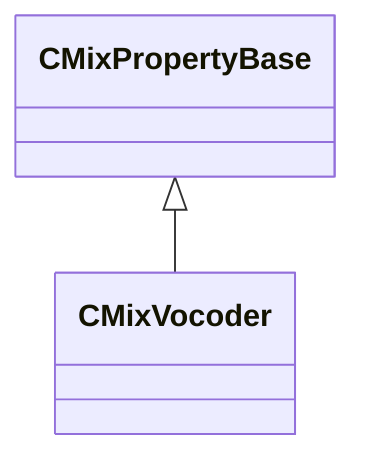

[Schemas](../../schemas.md) / [sounddoc_lib](../sounddoc_lib.md) / CMixVocoder

# CMixVocoder

> Source: **Build 25000182** · 2026-08-28 · `windows-x86_64` · schema `0.10.0`

**Kind:** class · **Size:** 72 bytes (`0x48`) · **Align:** 8 · **Module:** sounddoc_lib

**Inherits from:** [CMixPropertyBase](../sounddoc_lib/CMixPropertyBase.md)

**Metadata:** `MPropertyDescription Applies multi-band modulation to a carrier signal, based on the multi-band envelope of a modulator signal.  Modulation bands can be configured to a certain number of bands or range of frequencies.`, `MPropertyFriendlyName VMix Vocoder Audio Node`

**Relationships:**

## Memory layout

15 fields (10 declared here, 5 inherited). Offsets are absolute from the object base.

| Offset | Field | Type | From | Annotations |
|--------|-------|------|------|-------------|
| `0x8` | `m_name` | CUtlString | [CMixPropertyBase](../sounddoc_lib/CMixPropertyBase.md) | `MPropertyDescription Node name` `MPropertyFriendlyName Name` `MPropertySortPriority 1` |
| `0x10` | `m_Comment` | CUtlString | [CMixPropertyBase](../sounddoc_lib/CMixPropertyBase.md) | `MPropertyDescription Description of how this is used  the graph for people reading the graph` `MPropertySortPriority -2` |
| `0x18` | `m_bActive` | bool | [CMixPropertyBase](../sounddoc_lib/CMixPropertyBase.md) | `MPropertyHideField` `MPropertySortPriority -1` |
| `0x19` | `m_bSolo` | bool | [CMixPropertyBase](../sounddoc_lib/CMixPropertyBase.md) | `MPropertyHideField` `MPropertySortPriority -1` |
| `0x1a` | `m_bEditProperties` | bool | [CMixPropertyBase](../sounddoc_lib/CMixPropertyBase.md) | `MPropertyHideField` `MPropertySortPriority -1` |
| `0x20` | `m_nBandCount` | int32 |  | `MPropertyFriendlyName Vocoder Band Count` |
| `0x24` | `m_flBandwidth` | float32 |  | `MPropertyAttributeRange 0.1 3.0` `MPropertyFriendlyName Bandwidth` |
| `0x28` | `m_fldBModGain` | float32 |  | `MPropertyAttributeRange -12 12` `MPropertyFriendlyName dB gain for modulation signal` |
| `0x2c` | `m_flAttackTime` | float32 |  | `MPropertyFriendlyName Attack time (ms)` |
| `0x30` | `m_flReleaseTime` | float32 |  | `MPropertyFriendlyName Release time (ms)` |
| `0x34` | `m_flFreqRangeStart` | float32 |  | `MPropertyAttributeRange 0 11025` `MPropertyFriendlyName Frequency Start` |
| `0x38` | `m_flFreqRangeEnd` | float32 |  | `MPropertyAttributeRange 100 22050` `MPropertyFriendlyName Frequency End` |
| `0x3c` | `m_fldBUnvoicedGain` | float32 |  | `MPropertyAttributeRange -12 12` `MPropertyFriendlyName Gain of Unvoiced` |
| `0x40` | `m_nDebugBand` | int32 |  |  |
| `0x44` | `m_bPeakMode` | bool |  |  |

KV3 class defaults

<pre>{
	&quot;_class&quot;: &quot;CMixVocoder&quot;,
	&quot;m_name&quot;: &quot;&quot;,
	&quot;m_Comment&quot;: &quot;&quot;,
	&quot;m_bActive&quot;: true,
	&quot;m_bSolo&quot;: false,
	&quot;m_bEditProperties&quot;: false,
	&quot;m_nBandCount&quot;: 6,
	&quot;m_flBandwidth&quot;: 1.000000,
	&quot;m_fldBModGain&quot;: 12.000000,
	&quot;m_flAttackTime&quot;: 50.000000,
	&quot;m_flReleaseTime&quot;: 100.000000,
	&quot;m_flFreqRangeStart&quot;: 100.000000,
	&quot;m_flFreqRangeEnd&quot;: 12000.000000,
	&quot;m_fldBUnvoicedGain&quot;: 0.000000,
	&quot;m_nDebugBand&quot;: -1,
	&quot;m_bPeakMode&quot;: false
}</pre>

