[Schemas](../../schemas.md) / [sounddoc_lib](../sounddoc_lib.md) / CVAudioNodeBaseDesc

# CVAudioNodeBaseDesc

**Kind:** class · **Size:** 136 bytes (`0x88`) · **Align:** 255 · **Module:** sounddoc_lib

**Inherits from:** [CVNodeTypeDesc](../sounddoc_lib/CVNodeTypeDesc.md)

**Derived by:** [CAudioAutoFilterNodeDesc](../sounddoc_lib/CAudioAutoFilterNodeDesc.md), [CAudioBoxverb2NodeDesc](../sounddoc_lib/CAudioBoxverb2NodeDesc.md), [CAudioBoxverbNodeDesc](../sounddoc_lib/CAudioBoxverbNodeDesc.md), [CAudioConvolutionNodeDesc](../sounddoc_lib/CAudioConvolutionNodeDesc.md), [CAudioDelayNodeDesc](../sounddoc_lib/CAudioDelayNodeDesc.md), [CAudioDiffusorNodeDesc](../sounddoc_lib/CAudioDiffusorNodeDesc.md), [CAudioDynamics3BandNodeDesc](../sounddoc_lib/CAudioDynamics3BandNodeDesc.md), [CAudioEQ8NodeDesc](../sounddoc_lib/CAudioEQ8NodeDesc.md), [CAudioEffectChainNodeDesc](../sounddoc_lib/CAudioEffectChainNodeDesc.md), [CAudioEnvelopeNodeDesc](../sounddoc_lib/CAudioEnvelopeNodeDesc.md), [CAudioFilterNodeDesc](../sounddoc_lib/CAudioFilterNodeDesc.md), [CAudioFlangerNodeDesc](../sounddoc_lib/CAudioFlangerNodeDesc.md), [CAudioFreeverbNodeDesc](../sounddoc_lib/CAudioFreeverbNodeDesc.md), [CAudioMeterNodeDesc](../sounddoc_lib/CAudioMeterNodeDesc.md), [CAudioModDelayNodeDesc](../sounddoc_lib/CAudioModDelayNodeDesc.md), [CAudioOscNodeDesc](../sounddoc_lib/CAudioOscNodeDesc.md), [CAudioPannerNodeDesc](../sounddoc_lib/CAudioPannerNodeDesc.md), [CAudioPitchShiftNodeDesc](../sounddoc_lib/CAudioPitchShiftNodeDesc.md), [CAudioPlateverbNodeDesc](../sounddoc_lib/CAudioPlateverbNodeDesc.md), [CAudioProcessorNodeDesc](../sounddoc_lib/CAudioProcessorNodeDesc.md), [CAudioShaperNodeDesc](../sounddoc_lib/CAudioShaperNodeDesc.md), [CAudioSourceNodeDesc](../sounddoc_lib/CAudioSourceNodeDesc.md), [CAudioSplitterBlendDesc](../sounddoc_lib/CAudioSplitterBlendDesc.md), [CAudioSplitterNodeDesc](../sounddoc_lib/CAudioSplitterNodeDesc.md), [CAudioSteamAudioPathingNodeDesc](../sounddoc_lib/CAudioSteamAudioPathingNodeDesc.md), [CAudioSteamAudioSourceNodeDesc](../sounddoc_lib/CAudioSteamAudioSourceNodeDesc.md), [CAudioSubgraphNodeDesc](../sounddoc_lib/CAudioSubgraphNodeDesc.md), [CAudioSubgraphSwitchNodeDesc](../sounddoc_lib/CAudioSubgraphSwitchNodeDesc.md), [CAudioUtilityNodeDesc](../sounddoc_lib/CAudioUtilityNodeDesc.md), [CAudioVocoderNodeDesc](../sounddoc_lib/CAudioVocoderNodeDesc.md), [CSteamAudioDirectNodeDesc](../sounddoc_lib/CSteamAudioDirectNodeDesc.md), [CSteamAudioHybridReverbNodeDesc](../sounddoc_lib/CSteamAudioHybridReverbNodeDesc.md), [CStereoDelayNodeDesc](../sounddoc_lib/CStereoDelayNodeDesc.md)

**Relationships:**

```mermaid
classDiagram
    CVNodeTypeDesc <|-- CVAudioNodeBaseDesc
    CVAudioNodeBaseDesc <|-- CAudioAutoFilterNodeDesc
    CVAudioNodeBaseDesc <|-- CAudioBoxverb2NodeDesc
    CVAudioNodeBaseDesc <|-- CAudioBoxverbNodeDesc
    CVAudioNodeBaseDesc <|-- CAudioConvolutionNodeDesc
    CVAudioNodeBaseDesc <|-- CAudioDelayNodeDesc
    CVAudioNodeBaseDesc <|-- CAudioDiffusorNodeDesc
    CVAudioNodeBaseDesc <|-- CAudioDynamics3BandNodeDesc
    CVAudioNodeBaseDesc <|-- CAudioEQ8NodeDesc
    CVAudioNodeBaseDesc <|-- CAudioEffectChainNodeDesc
    CVAudioNodeBaseDesc <|-- CAudioEnvelopeNodeDesc
    CVAudioNodeBaseDesc <|-- CAudioFilterNodeDesc
    CVAudioNodeBaseDesc <|-- CAudioFlangerNodeDesc
    CVAudioNodeBaseDesc <|-- CAudioFreeverbNodeDesc
    CVAudioNodeBaseDesc <|-- CAudioMeterNodeDesc
    CVAudioNodeBaseDesc <|-- CAudioModDelayNodeDesc
    CVAudioNodeBaseDesc <|-- CAudioOscNodeDesc
    CVAudioNodeBaseDesc <|-- CAudioPannerNodeDesc
    CVAudioNodeBaseDesc <|-- CAudioPitchShiftNodeDesc
    CVAudioNodeBaseDesc <|-- CAudioPlateverbNodeDesc
    CVAudioNodeBaseDesc <|-- CAudioProcessorNodeDesc
    CVAudioNodeBaseDesc <|-- CAudioShaperNodeDesc
    CVAudioNodeBaseDesc <|-- CAudioSourceNodeDesc
    CVAudioNodeBaseDesc <|-- CAudioSplitterBlendDesc
    CVAudioNodeBaseDesc <|-- CAudioSplitterNodeDesc
    CVAudioNodeBaseDesc <|-- CAudioSteamAudioPathingNodeDesc
    CVAudioNodeBaseDesc <|-- CAudioSteamAudioSourceNodeDesc
    CVAudioNodeBaseDesc <|-- CAudioSubgraphNodeDesc
    CVAudioNodeBaseDesc <|-- CAudioSubgraphSwitchNodeDesc
    CVAudioNodeBaseDesc <|-- CAudioUtilityNodeDesc
    CVAudioNodeBaseDesc <|-- CAudioVocoderNodeDesc
    CVAudioNodeBaseDesc <|-- CSteamAudioDirectNodeDesc
    CVAudioNodeBaseDesc <|-- CSteamAudioHybridReverbNodeDesc
    CVAudioNodeBaseDesc <|-- CStereoDelayNodeDesc
```

## Memory layout

15 fields (0 declared here, 15 inherited). Offsets are absolute from the object base.

| Offset | Field | Type | From | Annotations |
|--------|-------|------|------|-------------|
| `0x8` | `m_name` | CUtlString | [CVNodeTypeDesc](../sounddoc_lib/CVNodeTypeDesc.md) |  |
| `0x10` | `m_iconName` | CUtlString | [CVNodeTypeDesc](../sounddoc_lib/CVNodeTypeDesc.md) |  |
| `0x18` | `m_prefix` | CUtlString | [CVNodeTypeDesc](../sounddoc_lib/CVNodeTypeDesc.md) |  |
| `0x20` | `m_inputNames` | CUtlVector< CUtlString > | [CVNodeTypeDesc](../sounddoc_lib/CVNodeTypeDesc.md) |  |
| `0x38` | `m_outputNames` | CUtlVector< CUtlString > | [CVNodeTypeDesc](../sounddoc_lib/CVNodeTypeDesc.md) |  |
| `0x50` | `m_inputTypeIds` | CUtlVector< int32 > | [CVNodeTypeDesc](../sounddoc_lib/CVNodeTypeDesc.md) |  |
| `0x68` | `m_outputTypeIds` | CUtlVector< int32 > | [CVNodeTypeDesc](../sounddoc_lib/CVNodeTypeDesc.md) |  |
| `0x80` | `m_bIsGroup` | bool | [CVNodeTypeDesc](../sounddoc_lib/CVNodeTypeDesc.md) |  |
| `0x81` | `m_bAppliesToMainGraph` | bool | [CVNodeTypeDesc](../sounddoc_lib/CVNodeTypeDesc.md) |  |
| `0x82` | `m_bAppliesToVoiceGraph` | bool | [CVNodeTypeDesc](../sounddoc_lib/CVNodeTypeDesc.md) |  |
| `0x83` | `m_bIsAudioTrack` | bool | [CVNodeTypeDesc](../sounddoc_lib/CVNodeTypeDesc.md) |  |
| `0x84` | `m_bIsAudioOutput` | bool | [CVNodeTypeDesc](../sounddoc_lib/CVNodeTypeDesc.md) |  |
| `0x85` | `m_bIsControlInput` | bool | [CVNodeTypeDesc](../sounddoc_lib/CVNodeTypeDesc.md) |  |
| `0x86` | `m_bIsControlOutput` | bool | [CVNodeTypeDesc](../sounddoc_lib/CVNodeTypeDesc.md) |  |
| `0x87` | `m_bIsSubgraphNode` | bool | [CVNodeTypeDesc](../sounddoc_lib/CVNodeTypeDesc.md) |  |
