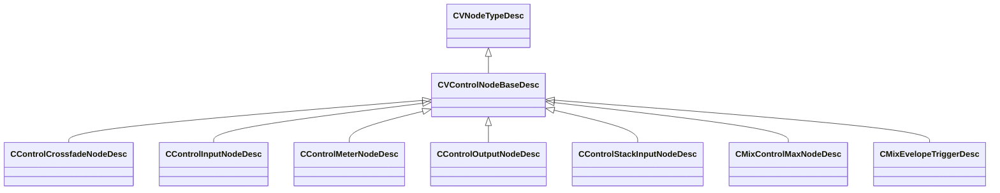

[Schemas](../../schemas.md) / [sounddoc_lib](../sounddoc_lib.md) / CVControlNodeBaseDesc

# CVControlNodeBaseDesc

> Source: **Build 25000182** · 2026-08-28 · `windows-x86_64` · schema `0.10.0`

**Kind:** class · **Size:** 136 bytes (`0x88`) · **Align:** n/a (unspecified) · **Module:** sounddoc_lib

**Inherits from:** [CVNodeTypeDesc](../sounddoc_lib/CVNodeTypeDesc.md)

**Derived by:** [CControlCrossfadeNodeDesc](../sounddoc_lib/CControlCrossfadeNodeDesc.md), [CControlInputNodeDesc](../sounddoc_lib/CControlInputNodeDesc.md), [CControlMeterNodeDesc](../sounddoc_lib/CControlMeterNodeDesc.md), [CControlOutputNodeDesc](../sounddoc_lib/CControlOutputNodeDesc.md), [CControlStackInputNodeDesc](../sounddoc_lib/CControlStackInputNodeDesc.md), [CMixControlMaxNodeDesc](../sounddoc_lib/CMixControlMaxNodeDesc.md), [CMixEvelopeTriggerDesc](../sounddoc_lib/CMixEvelopeTriggerDesc.md)

**Relationships:**

## Memory layout

15 fields (0 declared here, 15 inherited). Offsets are absolute from the object base.

| Offset | Field | Type | From | Annotations |
|--------|-------|------|------|-------------|
| `0x8` | `m_name` | CUtlString | [CVNodeTypeDesc](../sounddoc_lib/CVNodeTypeDesc.md) |  |
| `0x10` | `m_iconName` | CUtlString | [CVNodeTypeDesc](../sounddoc_lib/CVNodeTypeDesc.md) |  |
| `0x18` | `m_prefix` | CUtlString | [CVNodeTypeDesc](../sounddoc_lib/CVNodeTypeDesc.md) |  |
| `0x20` | `m_inputNames` | CUtlVector< CUtlString > | [CVNodeTypeDesc](../sounddoc_lib/CVNodeTypeDesc.md) |  |
| `0x38` | `m_outputNames` | CUtlVector< CUtlString > | [CVNodeTypeDesc](../sounddoc_lib/CVNodeTypeDesc.md) |  |
| `0x50` | `m_inputTypeIds` | CUtlVector< int32 > | [CVNodeTypeDesc](../sounddoc_lib/CVNodeTypeDesc.md) |  |
| `0x68` | `m_outputTypeIds` | CUtlVector< int32 > | [CVNodeTypeDesc](../sounddoc_lib/CVNodeTypeDesc.md) |  |
| `0x80` | `m_bIsGroup` | bool | [CVNodeTypeDesc](../sounddoc_lib/CVNodeTypeDesc.md) |  |
| `0x81` | `m_bAppliesToMainGraph` | bool | [CVNodeTypeDesc](../sounddoc_lib/CVNodeTypeDesc.md) |  |
| `0x82` | `m_bAppliesToVoiceGraph` | bool | [CVNodeTypeDesc](../sounddoc_lib/CVNodeTypeDesc.md) |  |
| `0x83` | `m_bIsAudioTrack` | bool | [CVNodeTypeDesc](../sounddoc_lib/CVNodeTypeDesc.md) |  |
| `0x84` | `m_bIsAudioOutput` | bool | [CVNodeTypeDesc](../sounddoc_lib/CVNodeTypeDesc.md) |  |
| `0x85` | `m_bIsControlInput` | bool | [CVNodeTypeDesc](../sounddoc_lib/CVNodeTypeDesc.md) |  |
| `0x86` | `m_bIsControlOutput` | bool | [CVNodeTypeDesc](../sounddoc_lib/CVNodeTypeDesc.md) |  |
| `0x87` | `m_bIsSubgraphNode` | bool | [CVNodeTypeDesc](../sounddoc_lib/CVNodeTypeDesc.md) |  |
