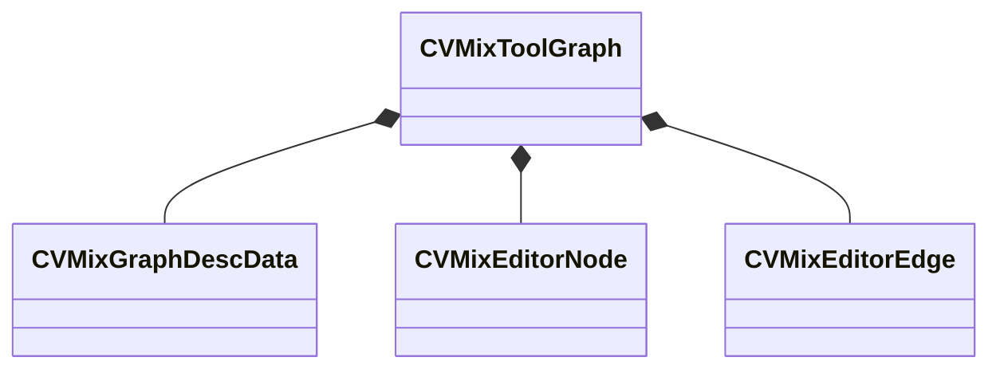

[Schemas](../../schemas.md) / [sounddoc_lib](../sounddoc_lib.md) / CVMixToolGraph

# CVMixToolGraph

> Source: **Build 25000182** · 2026-08-28 · `windows-x86_64` · schema `0.10.0`

**Kind:** class · **Size:** 72 bytes (`0x48`) · **Align:** 8 · **Module:** sounddoc_lib

**Relationships:**

## Memory layout

4 fields (4 declared here, 0 inherited). Offsets are absolute from the object base.

| Offset | Field | Type | From | Annotations |
|--------|-------|------|------|-------------|
| `0x0` | `m_graphDescData` | [CVMixGraphDescData](../soundsystem_lowlevel/CVMixGraphDescData.md) |  |  |
| `0x10` | `m_editorNodes` | CUtlVector< [CVMixEditorNode](../sounddoc_lib/CVMixEditorNode.md) > |  |  |
| `0x28` | `m_editorEdges` | CUtlVector< [CVMixEditorEdge](../sounddoc_lib/CVMixEditorEdge.md) > |  |  |
| `0x40` | `m_nPreviewNode` | int32 |  |  |

KV3 class defaults

<pre>{
	&quot;m_graphDescData&quot;:
	{
		&quot;Name&quot;: &quot;&quot;,
		&quot;m_nGraphOutputChannels&quot;: -1,
		&quot;m_bIsMainGraph&quot;: false
	},
	&quot;m_editorNodes&quot;:
	[
	],
	&quot;m_editorEdges&quot;:
	[
	],
	&quot;m_nPreviewNode&quot;: 0
}</pre>

