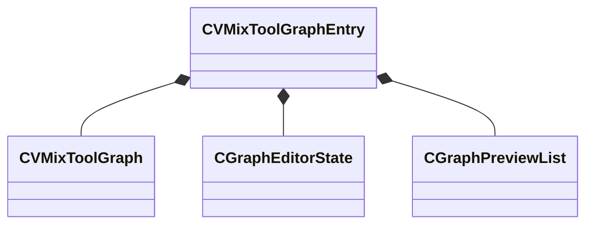

[Schemas](../../schemas.md) / [sounddoc_lib](../sounddoc_lib.md) / CVMixToolGraphEntry

# CVMixToolGraphEntry

**Kind:** class · **Size:** 152 bytes (`0x98`) · **Align:** 8 · **Module:** sounddoc_lib

**Relationships:**

## Memory layout

3 fields (3 declared here, 0 inherited). Offsets are absolute from the object base.

| Offset | Field | Type | From | Annotations |
|--------|-------|------|------|-------------|
| `0x0` | `m_graph` | [CVMixToolGraph](../sounddoc_lib/CVMixToolGraph.md) |  |  |
| `0x48` | `m_editorState` | [CGraphEditorState](../sounddoc_lib/CGraphEditorState.md) |  |  |
| `0x70` | `m_graphPreview` | [CGraphPreviewList](../sounddoc_lib/CGraphPreviewList.md) |  |  |

KV3 class defaults

<pre>{
	&quot;m_graph&quot;:
	{
		&quot;m_graphDescData&quot;:
		{
			&quot;Name&quot;: &quot;&quot;,
			&quot;m_nGraphOutputChannels&quot;: -1,
			&quot;m_bIsMainGraph&quot;: false
		},
		&quot;m_editorNodes&quot;:
		[
		],
		&quot;m_editorEdges&quot;:
		[
		],
		&quot;m_nPreviewNode&quot;: 0
	},
	&quot;m_editorState&quot;:
	{
		&quot;m_viewConfig&quot;:
		{
			&quot;XAxis&quot;:
			{
				&quot;pos&quot;: 0.000000,
				&quot;scrollpos&quot;: 0,
				&quot;min&quot;: 0.000000,
				&quot;max&quot;: 1.000000,
				&quot;scale&quot;: 1.000000
			},
			&quot;YAxis&quot;:
			{
				&quot;pos&quot;: 0.000000,
				&quot;scrollpos&quot;: 0,
				&quot;min&quot;: 0.000000,
				&quot;max&quot;: 1.000000,
				&quot;scale&quot;: 1.000000
			}
		}
	},
	&quot;m_graphPreview&quot;:
	{
		&quot;m_flVolume&quot;: 1.000000,
		&quot;m_previewList&quot;:
		{
			&quot;m_sounds&quot;:
			[
			],
			&quot;m_bPreviewInGame&quot;: false
		}
	}
}</pre>

