[Schemas](../../schemas.md) / [sounddoc_lib](../sounddoc_lib.md) / CVNodeTypeDesc

# CVNodeTypeDesc

> Source: **Build 25000182** · 2026-08-28 · `windows-x86_64` · schema `0.10.0`

**Kind:** class · **Size:** 136 bytes (`0x88`) · **Align:** n/a (unspecified) · **Module:** sounddoc_lib

**Derived by:** [CAudioAmpNodeDesc](../sounddoc_lib/CAudioAmpNodeDesc.md), [CAudioBlendDesc](../sounddoc_lib/CAudioBlendDesc.md), [CAudioDualCompressorNodeDesc](../sounddoc_lib/CAudioDualCompressorNodeDesc.md), [CAudioDynamicsCompressorNodeDesc](../sounddoc_lib/CAudioDynamicsCompressorNodeDesc.md), [CAudioDynamicsLimiterNodeDesc](../sounddoc_lib/CAudioDynamicsLimiterNodeDesc.md), [CAudioDynamicsNodeDesc](../sounddoc_lib/CAudioDynamicsNodeDesc.md), [CAudioMixerNodeDesc](../sounddoc_lib/CAudioMixerNodeDesc.md), [CAudioOutputNodeDesc](../sounddoc_lib/CAudioOutputNodeDesc.md), [CAudioTrackNodeDesc](../sounddoc_lib/CAudioTrackNodeDesc.md), [CBlendVsndsToImpulseResponseNodeDesc](../sounddoc_lib/CBlendVsndsToImpulseResponseNodeDesc.md), [CControlAutomaticNodeDesc](../sounddoc_lib/CControlAutomaticNodeDesc.md), [CControlCurveNodeDesc](../sounddoc_lib/CControlCurveNodeDesc.md), [CControlInputArrayNodeDesc](../sounddoc_lib/CControlInputArrayNodeDesc.md), [CControlListenerNodeDesc](../sounddoc_lib/CControlListenerNodeDesc.md), [CControlRemapNodeDesc](../sounddoc_lib/CControlRemapNodeDesc.md), [CDelayImpulseResponseNodeDesc](../sounddoc_lib/CDelayImpulseResponseNodeDesc.md), [CEffectNameInputNodeDesc](../sounddoc_lib/CEffectNameInputNodeDesc.md), [CImpulseResponseInputNodeDesc](../sounddoc_lib/CImpulseResponseInputNodeDesc.md), [CMixControlTransientInputDesc](../sounddoc_lib/CMixControlTransientInputDesc.md), [CMixGroupBoxDesc](../sounddoc_lib/CMixGroupBoxDesc.md), [CRemapVsndToImpulseResponseNodeDesc](../sounddoc_lib/CRemapVsndToImpulseResponseNodeDesc.md), [CVAudioNodeBaseDesc](../sounddoc_lib/CVAudioNodeBaseDesc.md), [CVControlNodeBaseDesc](../sounddoc_lib/CVControlNodeBaseDesc.md), [CVsndInputNodeDesc](../sounddoc_lib/CVsndInputNodeDesc.md)

**Relationships:**

```mermaid
classDiagram
    CVNodeTypeDesc <|-- CAudioAmpNodeDesc
    CVNodeTypeDesc <|-- CAudioBlendDesc
    CVNodeTypeDesc <|-- CAudioDualCompressorNodeDesc
    CVNodeTypeDesc <|-- CAudioDynamicsCompressorNodeDesc
    CVNodeTypeDesc <|-- CAudioDynamicsLimiterNodeDesc
    CVNodeTypeDesc <|-- CAudioDynamicsNodeDesc
    CVNodeTypeDesc <|-- CAudioMixerNodeDesc
    CVNodeTypeDesc <|-- CAudioOutputNodeDesc
    CVNodeTypeDesc <|-- CAudioTrackNodeDesc
    CVNodeTypeDesc <|-- CBlendVsndsToImpulseResponseNodeDesc
    CVNodeTypeDesc <|-- CControlAutomaticNodeDesc
    CVNodeTypeDesc <|-- CControlCurveNodeDesc
    CVNodeTypeDesc <|-- CControlInputArrayNodeDesc
    CVNodeTypeDesc <|-- CControlListenerNodeDesc
    CVNodeTypeDesc <|-- CControlRemapNodeDesc
    CVNodeTypeDesc <|-- CDelayImpulseResponseNodeDesc
    CVNodeTypeDesc <|-- CEffectNameInputNodeDesc
    CVNodeTypeDesc <|-- CImpulseResponseInputNodeDesc
    CVNodeTypeDesc <|-- CMixControlTransientInputDesc
    CVNodeTypeDesc <|-- CMixGroupBoxDesc
    CVNodeTypeDesc <|-- CRemapVsndToImpulseResponseNodeDesc
    CVNodeTypeDesc <|-- CVAudioNodeBaseDesc
    CVNodeTypeDesc <|-- CVControlNodeBaseDesc
    CVNodeTypeDesc <|-- CVsndInputNodeDesc
```

## Memory layout

15 fields (15 declared here, 0 inherited). Offsets are absolute from the object base.

| Offset | Field | Type | From | Annotations |
|--------|-------|------|------|-------------|
| `0x8` | `m_name` | CUtlString |  |  |
| `0x10` | `m_iconName` | CUtlString |  |  |
| `0x18` | `m_prefix` | CUtlString |  |  |
| `0x20` | `m_inputNames` | CUtlVector< CUtlString > |  |  |
| `0x38` | `m_outputNames` | CUtlVector< CUtlString > |  |  |
| `0x50` | `m_inputTypeIds` | CUtlVector< int32 > |  |  |
| `0x68` | `m_outputTypeIds` | CUtlVector< int32 > |  |  |
| `0x80` | `m_bIsGroup` | bool |  |  |
| `0x81` | `m_bAppliesToMainGraph` | bool |  |  |
| `0x82` | `m_bAppliesToVoiceGraph` | bool |  |  |
| `0x83` | `m_bIsAudioTrack` | bool |  |  |
| `0x84` | `m_bIsAudioOutput` | bool |  |  |
| `0x85` | `m_bIsControlInput` | bool |  |  |
| `0x86` | `m_bIsControlOutput` | bool |  |  |
| `0x87` | `m_bIsSubgraphNode` | bool |  |  |
