# Module: soundsystem

[📊 View UML Diagram](../diagrams/soundsystem.md)

| Name | Kind | Bases | Fields |
|------|------|-------|--------|
| [CDSPMixgroupModifier](#cdspmixgroupmodifier) | class |  | 6 |
| [CDSPPresetMixgroupModifierTable](#cdsppresetmixgroupmodifiertable) | class |  | 1 |
| [CDspPresetModifierList](#cdsppresetmodifierlist) | class |  | 2 |
| [CSndSeqInstBaseSchema](#csndseqinstbaseschema) | class |  | 6 |
| [CSndSeqInstMidiSampler](#csndseqinstmidisampler) | class | CSndSeqInstBaseSchema | 11 |
| [CSndSeqInstSndEvtSchema](#csndseqinstsndevtschema) | class | CSndSeqInstBaseSchema | 0 |
| [CSndSeqInstruments](#csndseqinstruments) | class | ISndSeqInstruments | 0 |
| [CSosGroupActionLimitSchema](#csosgroupactionlimitschema) | class | CSosGroupActionSchema | 5 |
| [CSosGroupActionMemberCountEnvelopeSchema](#csosgroupactionmembercountenvelopeschema) | class | CSosGroupActionSchema | 8 |
| [CSosGroupActionOcclusionSchema](#csosgroupactionocclusionschema) | class | CSosGroupActionSchema | 6 |
| [CSosGroupActionSchema](#csosgroupactionschema) | class |  | 0 |
| [CSosGroupActionSetSoundeventParameterSchema](#csosgroupactionsetsoundeventparameterschema) | class | CSosGroupActionSchema | 5 |
| [CSosGroupActionSoundeventClusterSchema](#csosgroupactionsoundeventclusterschema) | class | CSosGroupActionSchema | 7 |
| [CSosGroupActionSoundeventCountSchema](#csosgroupactionsoundeventcountschema) | class | CSosGroupActionSchema | 2 |
| [CSosGroupActionSoundeventMinMaxValuesSchema](#csosgroupactionsoundeventminmaxvaluesschema) | class | CSosGroupActionSchema | 10 |
| [CSosGroupActionSoundeventPrioritySchema](#csosgroupactionsoundeventpriorityschema) | class | CSosGroupActionSchema | 4 |
| [CSosGroupActionTimeBlockLimitSchema](#csosgroupactiontimeblocklimitschema) | class | CSosGroupActionSchema | 2 |
| [CSosGroupActionTimeLimitSchema](#csosgroupactiontimelimitschema) | class | CSosGroupActionSchema | 1 |
| [CSosSoundEventGroupSchema](#csossoundeventgroupschema) | class |  | 16 |
| [CSoundEventMetaData](#csoundeventmetadata) | class |  | 1 |
| [ISndSeqInstruments](#isndseqinstruments) | class |  | 0 |
| [KeyGroup_t](#keygroup_t) | class |  | 5 |
| [SamplerVoice_t](#samplervoice_t) | class |  | 1 |
| [SelectedEditItemInfo_t](#selectededititeminfo_t) | class |  | 1 |
| [SndSeqInstrumentType_t](#sndseqinstrumenttype_t) | enum |  | 3 |
| [SndSeqMidiStatusType_t](#sndseqmidistatustype_t) | enum |  | 7 |
| [SndSeqPlayerType_t](#sndseqplayertype_t) | enum |  | 3 |
| [SndSeqQuantizeType_t](#sndseqquantizetype_t) | enum |  | 7 |
| [SndSeqRegionType_t](#sndseqregiontype_t) | enum |  | 3 |
| [SndSeqSyncType_t](#sndseqsynctype_t) | enum |  | 3 |
| [SndSeqTrackPlaybackType_t](#sndseqtrackplaybacktype_t) | enum |  | 2 |
| [SosActionLimitSortType_t](#sosactionlimitsorttype_t) | enum |  | 2 |
| [SosActionSetParamSortType_t](#sosactionsetparamsorttype_t) | enum |  | 2 |
| [SosActionStopType_t](#sosactionstoptype_t) | enum |  | 3 |
| [SosEditItemInfo_t](#sosedititeminfo_t) | class |  | 5 |
| [SosEditItemType_t](#sosedititemtype_t) | enum |  | 6 |
| [SosGroupFieldBehavior_t](#sosgroupfieldbehavior_t) | enum |  | 3 |
| [SosGroupType_t](#sosgrouptype_t) | enum |  | 2 |
| [VelocityZone_t](#velocityzone_t) | class |  | 4 |

---

### CDSPMixgroupModifier

**Metadata:** `MGetKV3ClassDefaults {
	"m_mixgroup": "default",
	"m_flModifier": 1.000000,
	"m_flModifierMin": 0.000000,
	"m_flSourceModifier": -1.000000,
	"m_flSourceModifierMin": -1.000000,
	"m_flListenerReverbModifierWhenSourceReverbIsActive": 1.000000
}`

**Fields:**

| Name | Type | Annotations |
|------|------|-------------|
| `m_mixgroup` | CUtlString | `MPropertyDescription "Name of the mixgroup. TODO: needs to be autopopulated with mixgroups."` `MPropertyFriendlyName "Mixgroup Name"` |
| `m_flModifier` | float32 | `MPropertyDescription "The amount to multiply the volume of the non-spatialized reverb/dsp by when at the max reverb blend distance. 1.0 leaves the volume unchanged."` `MPropertyFriendlyName "Max reverb gain amount for listener DSP."` |
| `m_flModifierMin` | float32 | `MPropertyDescription "The amount to multiply the volume of the non-spatialized reverb/dsp by when at the min reverb blend distance. 1.0 leaves the volume unchanged."` `MPropertyFriendlyName "Min reverb gain amount amount for listener DSP."` |
| `m_flSourceModifier` | float32 | `MPropertyDescription "If set to >= 0, we will use this mix modifier for source-specific DSP effects. Otherwise we will use the listener DSP value."` `MPropertyFriendlyName "Max reverb gain amount for source-specific DSP."` |
| `m_flSourceModifierMin` | float32 | `MPropertyDescription "If set to >= 0, we will use this mix modifier for source-specific DSP effects. Otherwise we will use the listener DSP value."` `MPropertyFriendlyName "Min reverb gain amount for source-specific DSP."` |
| `m_flListenerReverbModifierWhenSourceReverbIsActive` | float32 | `MPropertyDescription "When a source has source-specific DSP, this can be used as an additional mix stage for the listener reverb amount."` `MPropertyFriendlyName "Modification amount for listener DSP when source DSP is used."` |

### CDSPPresetMixgroupModifierTable

**Metadata:** `MGetKV3ClassDefaults {
	"m_table":
	[
	]
}`, `MVDataRoot`, `MVDataNodeType 1`

**Relationships:**

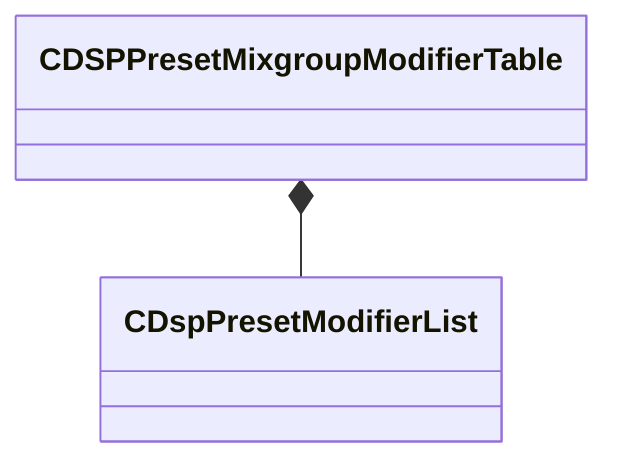

**Fields:**

| Name | Type | Annotations |
|------|------|-------------|
| `m_table` | CUtlVector<[CDspPresetModifierList](../schemas/soundsystem.md#cdsppresetmodifierlist)> | `MPropertyDescription "Table of mixgroup modifiers for effect names."` `MPropertyFriendlyName "Modifier Table"` |

### CDspPresetModifierList

**Metadata:** `MGetKV3ClassDefaults {
	"m_dspName": "default",
	"m_modifiers":
	[
	]
}`

**Relationships:**

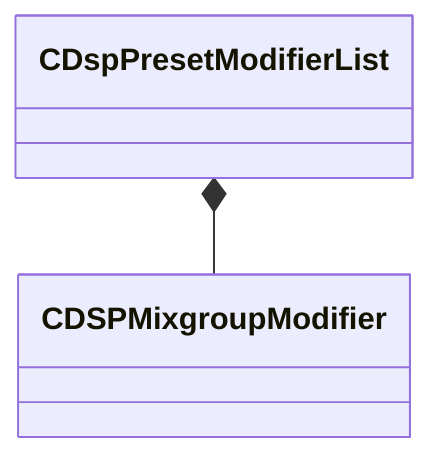

**Fields:**

| Name | Type | Annotations |
|------|------|-------------|
| `m_dspName` | CUtlString | `MPropertyDescription "Name of the DSP effect / subgraph used."` `MPropertyFriendlyName "DSP Effect Name"` |
| `m_modifiers` | CUtlVector<[CDSPMixgroupModifier](../schemas/soundsystem.md#cdspmixgroupmodifier)> | `MPropertyDescription "Set of modifiers for individual mix groups"` `MPropertyFriendlyName "Mixgroup Modifiers"` |

### CSndSeqInstBaseSchema

**Derived by:** [CSndSeqInstMidiSampler](soundsystem.md#csndseqinstmidisampler), [CSndSeqInstSndEvtSchema](soundsystem.md#csndseqinstsndevtschema)

**Metadata:** `MGetKV3ClassDefaults Could not parse KV3 Defaults`, `MPropertyAutoExpandSelf`, `MPropertyPolymorphicClass`

**Relationships:**

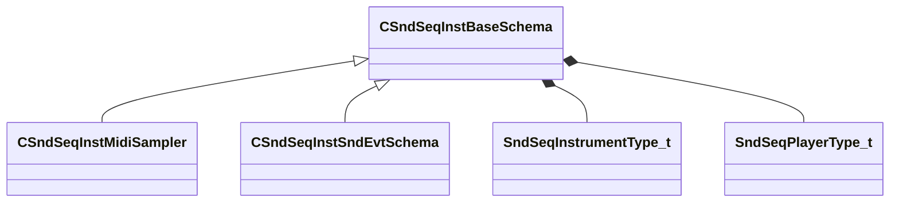

**Fields:**

| Name | Type | Annotations |
|------|------|-------------|
| `m_nType` | [SndSeqInstrumentType_t](../schemas/soundsystem.md#sndseqinstrumenttype_t) |  |
| `m_nPlayerType` | [SndSeqPlayerType_t](../schemas/soundsystem.md#sndseqplayertype_t) |  |
| `m_bStopCurrentEvents` | bool |  |
| `m_flBPM` | float32 |  |
| `m_flBPMFactor` | float32 |  |
| `m_flBPMInvFactor` | float32 |  |

### CSndSeqInstMidiSampler

**Inherits from:** [CSndSeqInstBaseSchema](soundsystem.md#csndseqinstbaseschema)

**Metadata:** `MGetKV3ClassDefaults {
	"_class": "CSndSeqInstMidiSampler",
	"m_nType": "eSndSeqInstMidiSampler",
	"m_nPlayerType": "eSndSeqPlayerMidiSeq",
	"m_bStopCurrentEvents": false,
	"m_flBPM": 120.000000,
	"m_flBPMFactor": 2.000000,
	"m_flBPMInvFactor": 0.500000,
	"m_bIsSoundEvent": false,
	"m_bStopPrevious": true,
	"m_nMinNote": 0,
	"m_nMaxNote": 0,
	"m_flMinVelocityAtten": 0.000000,
	"m_flMaxVelocityAtten": 0.000000,
	"m_flAttack": 0.000000,
	"m_flRelease": 0.000000,
	"m_bBeatEnvelopes": true,
	"m_nNextVoiceSlot": 0,
	"m_hSoundEventHash": 0
}`, `MPropertyFriendlyName "Midi Sampler"`

**Relationships:**

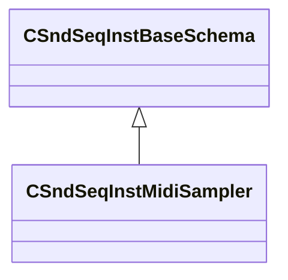

**Fields:**

| Name | Type | Annotations |
|------|------|-------------|
| `m_bIsSoundEvent` | bool |  |
| `m_bStopPrevious` | bool |  |
| `m_nMinNote` | uint8 |  |
| `m_nMaxNote` | uint8 |  |
| `m_flMinVelocityAtten` | float32 |  |
| `m_flMaxVelocityAtten` | float32 |  |
| `m_flAttack` | float32 |  |
| `m_flRelease` | float32 |  |
| `m_bBeatEnvelopes` | bool |  |
| `m_nNextVoiceSlot` | uint8 |  |
| `m_hSoundEventHash` | uint32 |  |

### CSndSeqInstSndEvtSchema

**Inherits from:** [CSndSeqInstBaseSchema](soundsystem.md#csndseqinstbaseschema)

**Metadata:** `MGetKV3ClassDefaults {
	"_class": "CSndSeqInstSndEvtSchema",
	"m_nType": "eSndSeqInstSndEvt",
	"m_nPlayerType": "eSndSeqPlayerSndEvt",
	"m_bStopCurrentEvents": false,
	"m_flBPM": 0.000000,
	"m_flBPMFactor": 0.000000,
	"m_flBPMInvFactor": 0.000000
}`, `MPropertyFriendlyName "SoundEvent on Start"`

**Relationships:**

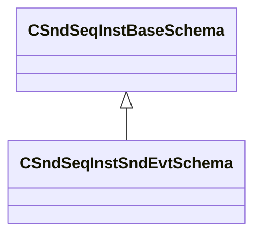

### CSndSeqInstruments

**Inherits from:** [ISndSeqInstruments](soundsystem.md#isndseqinstruments)

**Relationships:**

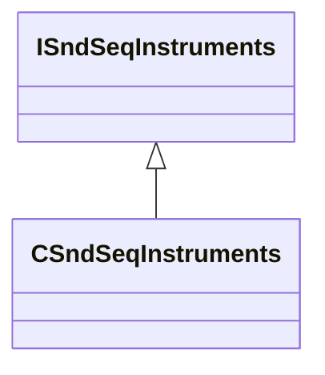

### CSosGroupActionLimitSchema

**Inherits from:** [CSosGroupActionSchema](soundsystem.md#csosgroupactionschema)

**Metadata:** `MGetKV3ClassDefaults {
	"_class": "CSosGroupActionLimitSchema",
	"m_nMaxCount": -1,
	"m_nStopType": "SOS_STOPTYPE_NONE",
	"m_nSortType": "SOS_LIMIT_SORTTYPE_HIGHEST",
	"m_bStopImmediate": false,
	"m_bCountStopped": true
}`, `MPropertyFriendlyName "Limiter"`

**Relationships:**

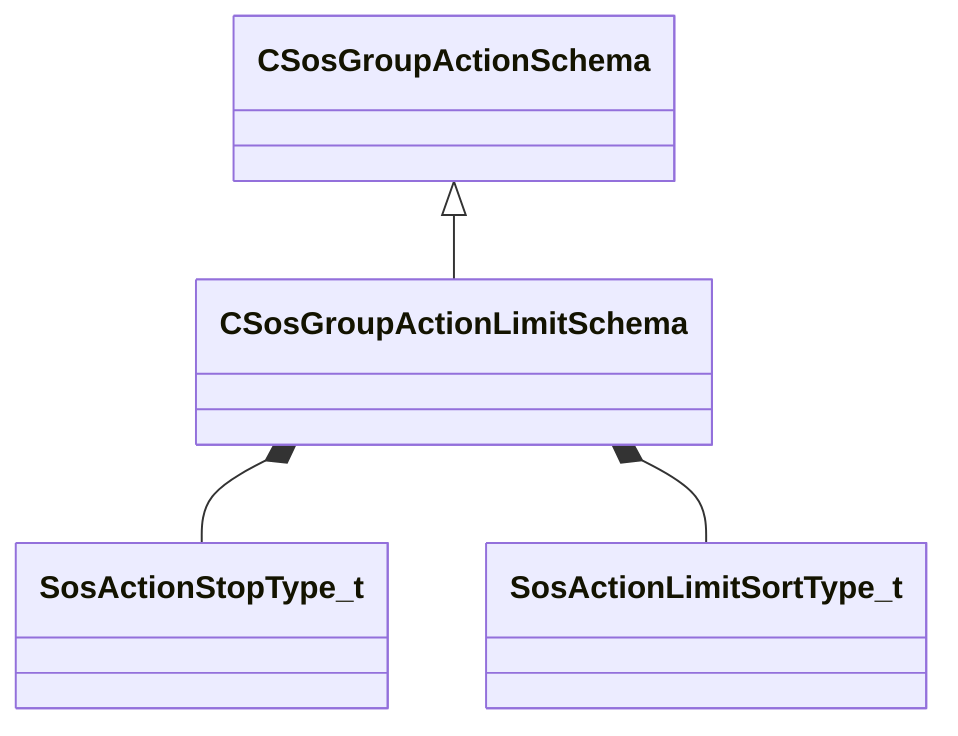

**Fields:**

| Name | Type | Annotations |
|------|------|-------------|
| `m_nMaxCount` | int32 |  |
| `m_nStopType` | [SosActionStopType_t](../schemas/soundsystem.md#sosactionstoptype_t) |  |
| `m_nSortType` | [SosActionLimitSortType_t](../schemas/soundsystem.md#sosactionlimitsorttype_t) |  |
| `m_bStopImmediate` | bool |  |
| `m_bCountStopped` | bool | `MPropertyFriendlyName "Count Stopped Events"` |

### CSosGroupActionMemberCountEnvelopeSchema

**Inherits from:** [CSosGroupActionSchema](soundsystem.md#csosgroupactionschema)

**Metadata:** `MGetKV3ClassDefaults {
	"_class": "CSosGroupActionMemberCountEnvelopeSchema",
	"m_nBaseCount": 0,
	"m_nTargetCount": 1,
	"m_flBaseValue": 0.000000,
	"m_flTargetValue": 0.000000,
	"m_flAttack": 1.000000,
	"m_flDecay": 1.000000,
	"m_resultVarName": "envelope_result",
	"m_bSaveToGroup": false
}`, `MPropertyFriendlyName "Count Envelope"`

**Relationships:**

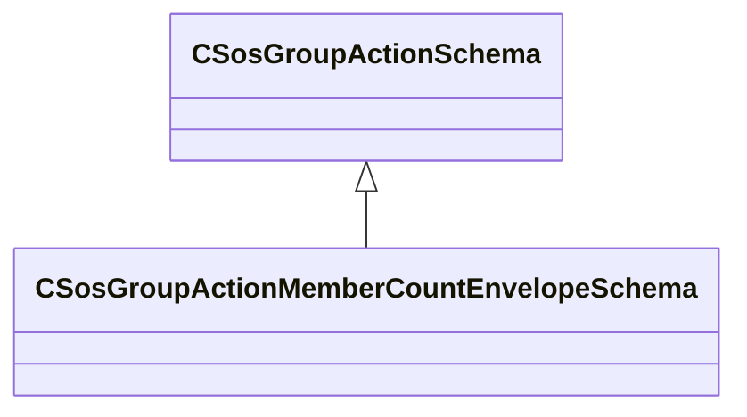

**Fields:**

| Name | Type | Annotations |
|------|------|-------------|
| `m_nBaseCount` | int32 | `MPropertyFriendlyName "Min Threshold Count"` |
| `m_nTargetCount` | int32 | `MPropertyFriendlyName "Max Target Count"` |
| `m_flBaseValue` | float32 | `MPropertyFriendlyName "Threshold Value"` |
| `m_flTargetValue` | float32 | `MPropertyFriendlyName "Target Value"` |
| `m_flAttack` | float32 | `MPropertyFriendlyName "Attack"` |
| `m_flDecay` | float32 | `MPropertyFriendlyName "Decay"` |
| `m_resultVarName` | CUtlString | `MPropertyFriendlyName "Result Variable Name"` |
| `m_bSaveToGroup` | bool | `MPropertyFriendlyName "Save Result to Group"` |

### CSosGroupActionOcclusionSchema

**Inherits from:** [CSosGroupActionSchema](soundsystem.md#csosgroupactionschema)

**Metadata:** `MGetKV3ClassDefaults {
	"_class": "CSosGroupActionOcclusionSchema",
	"m_flCalculationInterval": 0.100000,
	"m_flRadius": 0.000000,
	"m_flOcclusionScale": 1.000000,
	"m_flOcclusionMin": 0.000000,
	"m_flOcclusionMax": 1.000000,
	"m_flTestDepth": 0.000000
}`, `MPropertyFriendlyName "Occlusion Info"`

**Relationships:**

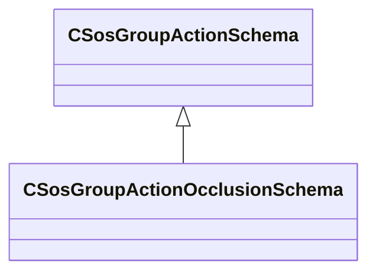

**Fields:**

| Name | Type | Annotations |
|------|------|-------------|
| `m_flCalculationInterval` | float32 | `MPropertyFriendlyName "Calculation interval ( seconds )."` |
| `m_flRadius` | float32 | `MPropertyFriendlyName "Occlusion radius."` |
| `m_flOcclusionScale` | float32 | `MPropertyFriendlyName "Occlusion scale."` |
| `m_flOcclusionMin` | float32 | `MPropertyFriendlyName "Occlusion min."` |
| `m_flOcclusionMax` | float32 | `MPropertyFriendlyName "Occlusion max."` |
| `m_flTestDepth` | float32 | `MPropertyFriendlyName "Test depth."` |

### CSosGroupActionSchema

**Derived by:** [CSosGroupActionLimitSchema](soundsystem.md#csosgroupactionlimitschema), [CSosGroupActionMemberCountEnvelopeSchema](soundsystem.md#csosgroupactionmembercountenvelopeschema), [CSosGroupActionOcclusionSchema](soundsystem.md#csosgroupactionocclusionschema), [CSosGroupActionSetSoundeventParameterSchema](soundsystem.md#csosgroupactionsetsoundeventparameterschema), [CSosGroupActionSoundeventClusterSchema](soundsystem.md#csosgroupactionsoundeventclusterschema), [CSosGroupActionSoundeventCountSchema](soundsystem.md#csosgroupactionsoundeventcountschema), [CSosGroupActionSoundeventMinMaxValuesSchema](soundsystem.md#csosgroupactionsoundeventminmaxvaluesschema), [CSosGroupActionSoundeventPrioritySchema](soundsystem.md#csosgroupactionsoundeventpriorityschema), [CSosGroupActionTimeBlockLimitSchema](soundsystem.md#csosgroupactiontimeblocklimitschema), [CSosGroupActionTimeLimitSchema](soundsystem.md#csosgroupactiontimelimitschema)

**Metadata:** `MGetKV3ClassDefaults Could not parse KV3 Defaults`, `MPropertyAutoExpandSelf`, `MPropertyPolymorphicClass`

**Relationships:**

```mermaid
classDiagram
    CSosGroupActionSchema <|-- CSosGroupActionTimeLimitSchema
    CSosGroupActionSchema <|-- CSosGroupActionMemberCountEnvelopeSchema
    CSosGroupActionSchema <|-- CSosGroupActionTimeBlockLimitSchema
    CSosGroupActionSchema <|-- CSosGroupActionLimitSchema
    CSosGroupActionSchema <|-- CSosGroupActionSoundeventCountSchema
    CSosGroupActionSchema <|-- CSosGroupActionSoundeventPrioritySchema
    CSosGroupActionSchema <|-- CSosGroupActionSoundeventMinMaxValuesSchema
    CSosGroupActionSchema <|-- CSosGroupActionSetSoundeventParameterSchema
    CSosGroupActionSchema <|-- CSosGroupActionSoundeventClusterSchema
    CSosGroupActionSchema <|-- CSosGroupActionOcclusionSchema
```

### CSosGroupActionSetSoundeventParameterSchema

**Inherits from:** [CSosGroupActionSchema](soundsystem.md#csosgroupactionschema)

**Metadata:** `MGetKV3ClassDefaults {
	"_class": "CSosGroupActionSetSoundeventParameterSchema",
	"m_nMaxCount": -1,
	"m_flMinValue": 0.000000,
	"m_flMaxValue": 1.000000,
	"m_opvarName": "None",
	"m_nSortType": "SOS_SETPARAM_SORTTYPE_LOWEST"
}`, `MPropertyFriendlyName "Set Sound Event Parameter"`

**Relationships:**

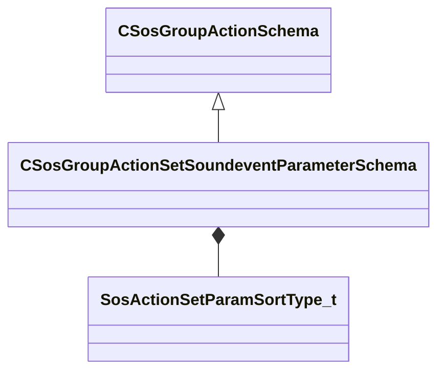

**Fields:**

| Name | Type | Annotations |
|------|------|-------------|
| `m_nMaxCount` | int32 |  |
| `m_flMinValue` | float32 |  |
| `m_flMaxValue` | float32 |  |
| `m_opvarName` | CUtlString | `MPropertyFriendlyName "Parameter Name"` |
| `m_nSortType` | [SosActionSetParamSortType_t](../schemas/soundsystem.md#sosactionsetparamsorttype_t) |  |

### CSosGroupActionSoundeventClusterSchema

**Inherits from:** [CSosGroupActionSchema](soundsystem.md#csosgroupactionschema)

**Metadata:** `MGetKV3ClassDefaults {
	"_class": "CSosGroupActionSoundeventClusterSchema",
	"m_nMinNearby": 6,
	"m_flClusterEpsilon": 36.000000,
	"m_shouldPlayOpvar": "cluster_should_play",
	"m_shouldPlayClusterChild": "cluster_should_play_child",
	"m_clusterSizeOpvar": "cluster_size",
	"m_groupBoundingBoxMinsOpvar": "cluster_group_box_mins",
	"m_groupBoundingBoxMaxsOpvar": "cluster_group_box_maxs"
}`, `MPropertyFriendlyName "Soundevent Cluster"`

**Relationships:**

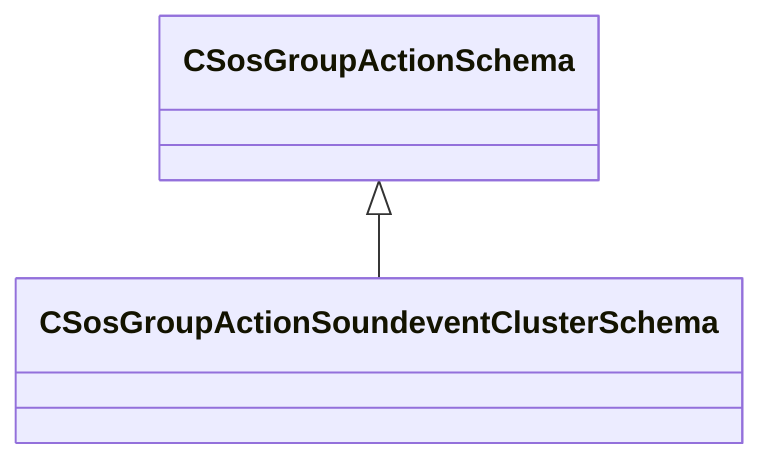

**Fields:**

| Name | Type | Annotations |
|------|------|-------------|
| `m_nMinNearby` | int32 | `MPropertyFriendlyName "Minimum Nearby Soundevents"` |
| `m_flClusterEpsilon` | float32 | `MPropertyFriendlyName "Search Radius to Cluster Soundevents"` |
| `m_shouldPlayOpvar` | CUtlString | `MPropertyFriendlyName "'Should Play' Opvar Name"` |
| `m_shouldPlayClusterChild` | CUtlString | `MPropertyFriendlyName "'Should Play Cluster Child' Opvar Name"` |
| `m_clusterSizeOpvar` | CUtlString | `MPropertyFriendlyName "Cluster Size Opvar Name"` |
| `m_groupBoundingBoxMinsOpvar` | CUtlString | `MPropertyFriendlyName "'Group Box Mins' Opvar Name"` |
| `m_groupBoundingBoxMaxsOpvar` | CUtlString | `MPropertyFriendlyName "'Group Box Maxs' Opvar Name"` |

### CSosGroupActionSoundeventCountSchema

**Inherits from:** [CSosGroupActionSchema](soundsystem.md#csosgroupactionschema)

**Metadata:** `MGetKV3ClassDefaults {
	"_class": "CSosGroupActionSoundeventCountSchema",
	"m_bExcludeStoppedSounds": true,
	"m_strCountKeyName": "current_count"
}`, `MPropertyFriendlyName "Soundevent Count"`

**Relationships:**

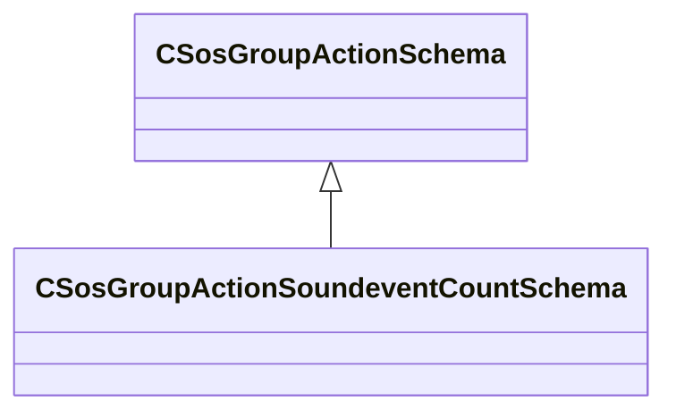

**Fields:**

| Name | Type | Annotations |
|------|------|-------------|
| `m_bExcludeStoppedSounds` | bool | `MPropertyFriendlyName "Exclude Stopped Sounds from Count"` |
| `m_strCountKeyName` | CUtlString | `MPropertyFriendlyName "Result Current Count"` |

### CSosGroupActionSoundeventMinMaxValuesSchema

**Inherits from:** [CSosGroupActionSchema](soundsystem.md#csosgroupactionschema)

**Metadata:** `MGetKV3ClassDefaults {
	"_class": "CSosGroupActionSoundeventMinMaxValuesSchema",
	"m_strQueryPublicFieldName": "min_max_query",
	"m_strDelayPublicFieldName": "delay",
	"m_bExcludeStoppedSounds": true,
	"m_bExcludeDelayedSounds": true,
	"m_bExcludeSoundsBelowThreshold": false,
	"m_flExcludeSoundsMinThresholdValue": -1.000000,
	"m_bExcludSoundsAboveThreshold": false,
	"m_flExcludeSoundsMaxThresholdValue": -1.000000,
	"m_strMinValueName": "min",
	"m_strMaxValueName": "max"
}`, `MPropertyFriendlyName "Soundevent Min/Max Values"`

**Relationships:**

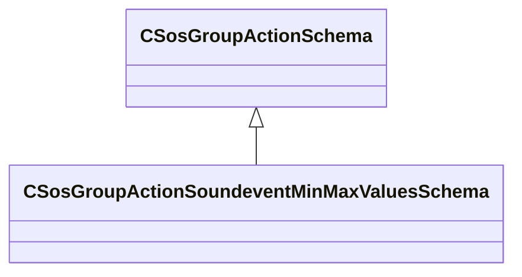

**Fields:**

| Name | Type | Annotations |
|------|------|-------------|
| `m_strQueryPublicFieldName` | CUtlString | `MPropertyFriendlyName "Public field name to query."` |
| `m_strDelayPublicFieldName` | CUtlString | `MPropertyFriendlyName "Public field 'delay' name."` |
| `m_bExcludeStoppedSounds` | bool | `MPropertyFriendlyName "Exclude stopped sounds from evaluation"` |
| `m_bExcludeDelayedSounds` | bool | `MPropertyFriendlyName "Exclude delayed sounds from evaluation"` |
| `m_bExcludeSoundsBelowThreshold` | bool | `MPropertyFriendlyName "Exclude sounds from evaluation less than or equal to a min value threshold."` |
| `m_flExcludeSoundsMinThresholdValue` | float32 | `MPropertyFriendlyName "The minimum threshold value to exclude sounds."` |
| `m_bExcludSoundsAboveThreshold` | bool | `MPropertyFriendlyName "Exclude sounds from evaluation greater than or equal to a max value threshold."` |
| `m_flExcludeSoundsMaxThresholdValue` | float32 | `MPropertyFriendlyName "The maximum threshold value to exclude sounds."` |
| `m_strMinValueName` | CUtlString | `MPropertyFriendlyName "Min value property name"` |
| `m_strMaxValueName` | CUtlString | `MPropertyFriendlyName "Max value property name"` |

### CSosGroupActionSoundeventPrioritySchema

**Inherits from:** [CSosGroupActionSchema](soundsystem.md#csosgroupactionschema)

**Metadata:** `MGetKV3ClassDefaults {
	"_class": "CSosGroupActionSoundeventPrioritySchema",
	"m_priorityValue": "priority_value",
	"m_priorityVolumeScalar": "priority_volume_scalar",
	"m_priorityContributeButDontRead": "priority_contribute_dont_read",
	"m_bPriorityReadButDontContribute": "priority_read_dont_contribute"
}`, `MPropertyFriendlyName "Soundevent Priority"`

**Relationships:**

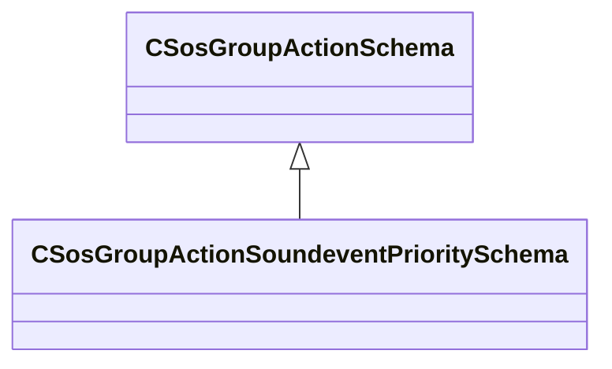

**Fields:**

| Name | Type | Annotations |
|------|------|-------------|
| `m_priorityValue` | CUtlString | `MPropertyFriendlyName "Priority Value, typically 0.0 to 1.0"` |
| `m_priorityVolumeScalar` | CUtlString | `MPropertyFriendlyName "Priority-Based Volume Multiplier, 0.0 to 1.0"` |
| `m_priorityContributeButDontRead` | CUtlString | `MPropertyFriendlyName "Contribute to the priority system, but volume is unaffected by it (bool)"` |
| `m_bPriorityReadButDontContribute` | CUtlString | `MPropertyFriendlyName "Don't contribute to the priority system, but volume is affected by it (bool)"` |

### CSosGroupActionTimeBlockLimitSchema

**Inherits from:** [CSosGroupActionSchema](soundsystem.md#csosgroupactionschema)

**Metadata:** `MGetKV3ClassDefaults {
	"_class": "CSosGroupActionTimeBlockLimitSchema",
	"m_nMaxCount": -1,
	"m_flMaxDuration": 0.000000
}`, `MPropertyFriendlyName "Timed Block Limiter"`

**Relationships:**

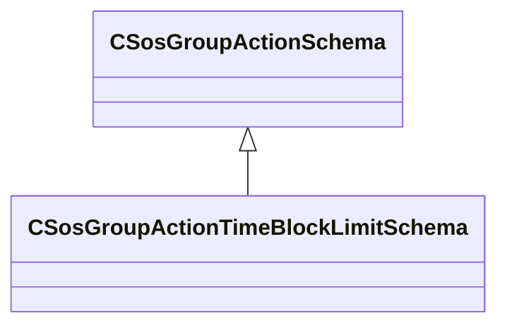

**Fields:**

| Name | Type | Annotations |
|------|------|-------------|
| `m_nMaxCount` | int32 |  |
| `m_flMaxDuration` | float32 |  |

### CSosGroupActionTimeLimitSchema

**Inherits from:** [CSosGroupActionSchema](soundsystem.md#csosgroupactionschema)

**Metadata:** `MGetKV3ClassDefaults {
	"_class": "CSosGroupActionTimeLimitSchema",
	"m_flMaxDuration": -1.000000
}`, `MPropertyFriendlyName "Time Limiter"`

**Relationships:**

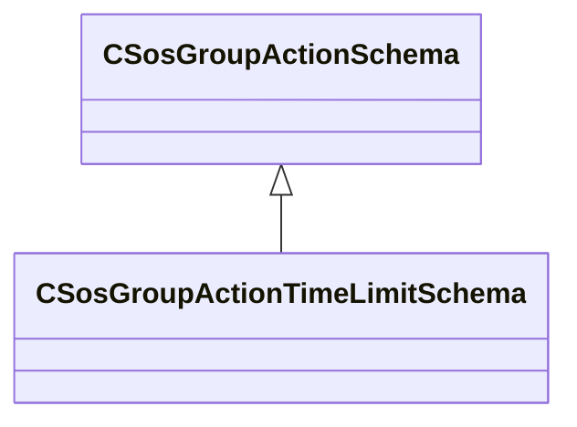

**Fields:**

| Name | Type | Annotations |
|------|------|-------------|
| `m_flMaxDuration` | float32 |  |

### CSosSoundEventGroupSchema

**Metadata:** `MGetKV3ClassDefaults {
	"m_nGroupType": "SOS_GROUPTYPE_DYNAMIC",
	"m_bBlocksEvents": false,
	"m_nBlockMaxCount": 0,
	"m_flMemberLifespanTime": -1.000000,
	"m_bInvertMatch": false,
	"m_Behavior_EventName": "kIgnore",
	"m_matchSoundEventName": "",
	"m_bMatchEventSubString": false,
	"m_matchSoundEventSubString": "",
	"m_Behavior_EntIndex": "kIgnore",
	"m_flEntIndex": -1.000000,
	"m_Behavior_Opvar": "kIgnore",
	"m_flOpvar": -1.000000,
	"m_Behavior_String": "kIgnore",
	"m_opvarString": "",
	"m_vActions":
	[
	]
}`, `MVDataRoot`

**Relationships:**

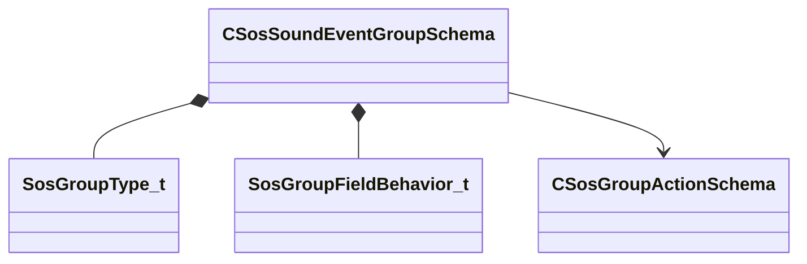

**Fields:**

| Name | Type | Annotations |
|------|------|-------------|
| `m_nGroupType` | [SosGroupType_t](../schemas/soundsystem.md#sosgrouptype_t) | `MPropertyAttributeEditor "Radio"` |
| `m_bBlocksEvents` | bool | `MPropertyStartGroup "+Block Events"` |
| `m_nBlockMaxCount` | int32 | `MPropertyReadonlyExpr "!m_bBlocksEvents"` |
| `m_flMemberLifespanTime` | float32 | `MPropertyStartGroup ""` |
| `m_bInvertMatch` | bool |  |
| `m_Behavior_EventName` | [SosGroupFieldBehavior_t](../schemas/soundsystem.md#sosgroupfieldbehavior_t) | `MPropertyStartGroup "+Event Name"` `MPropertyAttributeEditor "Radio"` `MPropertyReadonlyExpr "m_bMatchEventSubString"` |
| `m_matchSoundEventName` | CUtlString | `MPropertyReadonlyExpr "m_Behavior_EventName != kMatch || m_bMatchEventSubString"` |
| `m_bMatchEventSubString` | bool | `MPropertyStartGroup "+Event SubString"` |
| `m_matchSoundEventSubString` | CUtlString | `MPropertyReadonlyExpr "!m_bMatchEventSubString"` |
| `m_Behavior_EntIndex` | [SosGroupFieldBehavior_t](../schemas/soundsystem.md#sosgroupfieldbehavior_t) | `MPropertyStartGroup "+Ent Index"` `MPropertyAttributeEditor "Radio"` |
| `m_flEntIndex` | float32 | `MPropertyReadonlyExpr "m_Behavior_EntIndex != kMatch"` |
| `m_Behavior_Opvar` | [SosGroupFieldBehavior_t](../schemas/soundsystem.md#sosgroupfieldbehavior_t) | `MPropertyStartGroup "+OpVar Float"` `MPropertySuppressExpr "m_nGroupType == SOS_GROUPTYPE_STATIC"` `MPropertyAttributeEditor "Radio"` |
| `m_flOpvar` | float32 | `MPropertyReadonlyExpr "m_Behavior_Opvar != kMatch"` `MPropertySuppressExpr "m_nGroupType == SOS_GROUPTYPE_STATIC"` |
| `m_Behavior_String` | [SosGroupFieldBehavior_t](../schemas/soundsystem.md#sosgroupfieldbehavior_t) | `MPropertyStartGroup "+OpVar String"` `MPropertySuppressExpr "m_nGroupType == SOS_GROUPTYPE_STATIC"` `MPropertyAttributeEditor "Radio"` |
| `m_opvarString` | CUtlString | `MPropertyReadonlyExpr "m_Behavior_String != kMatch"` `MPropertySuppressExpr "m_nGroupType == SOS_GROUPTYPE_STATIC"` |
| `m_vActions` | CUtlVector<[CSosGroupActionSchema](../schemas/soundsystem.md#csosgroupactionschema)*> | `MPropertyStartGroup ""` `MPropertyAutoExpandSelf` |

### CSoundEventMetaData

**Metadata:** `MGetKV3ClassDefaults {
	"m_soundEventVMix": ""
}`

**Relationships:**

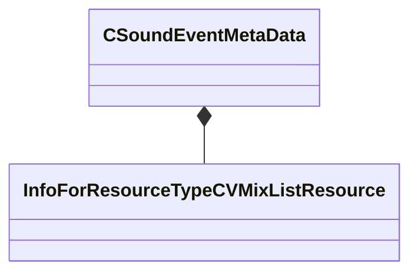

**Fields:**

| Name | Type | Annotations |
|------|------|-------------|
| `m_soundEventVMix` | CStrongHandle<[InfoForResourceTypeCVMixListResource](../schemas/resourcesystem.md#infoforresourcetypecvmixlistresource)> |  |

### ISndSeqInstruments

**Derived by:** [CSndSeqInstruments](soundsystem.md#csndseqinstruments)

**Relationships:**


### KeyGroup_t

**Relationships:**

```mermaid
classDiagram
    KeyGroup_t --> VelocityZone_t
```

**Fields:**

| Name | Type | Annotations |
|------|------|-------------|
| `nCenterNote` | uint8 |  |
| `nMinNote` | uint8 |  |
| `nMaxNote` | uint8 |  |
| `nNumVelocityZones` | uint8 |  |
| `pVelocityZones` | [VelocityZone_t](../schemas/soundsystem.md#velocityzone_t)* |  |

### SamplerVoice_t

**Fields:**

| Name | Type | Annotations |
|------|------|-------------|
| `nNoteNum` | uint8 |  |

### SelectedEditItemInfo_t

**Metadata:** `MGetKV3ClassDefaults {
	"m_EditItems":
	[
	]
}`

**Relationships:**

```mermaid
classDiagram
    SelectedEditItemInfo_t *-- SosEditItemInfo_t
```

**Fields:**

| Name | Type | Annotations |
|------|------|-------------|
| `m_EditItems` | CUtlVector<[SosEditItemInfo_t](../schemas/soundsystem.md#sosedititeminfo_t)> |  |

### SndSeqInstrumentType_t

**Values:**

| Name | Value | Description |
|------|-------|-------------|
| `eSndSeqInstNull` | 0 |  |
| `eSndSeqInstSndEvt` | 1 |  |
| `eSndSeqInstMidiSampler` | 2 |  |

### SndSeqMidiStatusType_t

**Values:**

| Name | Value | Description |
|------|-------|-------------|
| `SndSeqMidiStatusNoteOff` | 8 |  |
| `SndSeqMidiStatusNoteOn` | 9 |  |
| `SndSeqMidiStatusKeyPressure` | 10 |  |
| `SndSeqMidiStatusCtrlChange` | 11 |  |
| `SndSeqMidiStatusProgramChange` | 12 |  |
| `SndSeqMidiStatusChannelPressure` | 13 |  |
| `SndSeqMidiStatusPitchBend` | 14 |  |

### SndSeqPlayerType_t

**Values:**

| Name | Value | Description |
|------|-------|-------------|
| `eSndSeqPlayerNull` | 0 |  |
| `eSndSeqPlayerSndEvt` | 1 |  |
| `eSndSeqPlayerMidiSeq` | 2 |  |

### SndSeqQuantizeType_t

**Values:**

| Name | Value | Description |
|------|-------|-------------|
| `eSndSeqQuantizeInvalid` | -1 |  |
| `eSndSeqQuantizeNone` | 0 |  |
| `eSndSeqQuantizeBeat` | 1 |  |
| `eSndSeqQuantizeBar` | 2 |  |
| `eSndSeqQuantizeSequence` | 3 |  |
| `eSndSeqQuantizeSeek` | 4 |  |
| `eSndSeqQuantizeReset` | 5 |  |

### SndSeqRegionType_t

**Values:**

| Name | Value | Description |
|------|-------|-------------|
| `eSndSeqRegionTypeNull` | 0 |  |
| `eSndSeqRegionTypeSndEvt` | 1 |  |
| `eSndSeqRegionTypeMidiSeq` | 2 |  |

### SndSeqSyncType_t

**Values:**

| Name | Value | Description |
|------|-------|-------------|
| `eSndSeqSyncTypeNone` | 0 |  |
| `eSndSeqSyncTypeWait` | 1 |  |
| `eSndSeqSyncTypeSeek` | 2 |  |

### SndSeqTrackPlaybackType_t

**Values:**

| Name | Value | Description |
|------|-------|-------------|
| `eSndSeqTrackPlaybackTypeStep` | 0 |  |
| `eSndSeqTrackPlaybackTypeFwd` | 1 |  |

### SosActionLimitSortType_t

**Values:**

| Name | Value | Description |
|------|-------|-------------|
| `SOS_LIMIT_SORTTYPE_HIGHEST` | 0 | Stop Highest |
| `SOS_LIMIT_SORTTYPE_LOWEST` | 1 | Stop Lowest |

### SosActionSetParamSortType_t

**Values:**

| Name | Value | Description |
|------|-------|-------------|
| `SOS_SETPARAM_SORTTYPE_HIGHEST` | 0 | Max = Highest |
| `SOS_SETPARAM_SORTTYPE_LOWEST` | 1 | Max = Lowest |

### SosActionStopType_t

**Values:**

| Name | Value | Description |
|------|-------|-------------|
| `SOS_STOPTYPE_NONE` | 0 | None |
| `SOS_STOPTYPE_TIME` | 1 | Elapsed Time |
| `SOS_STOPTYPE_OPVAR` | 2 | Opvar Float |

### SosEditItemInfo_t

**Metadata:** `MGetKV3ClassDefaults {
	"itemType": "SOS_EDIT_ITEM_TYPE_SOUNDEVENTS",
	"itemName": "",
	"itemTypeName": "",
	"itemKVString": "",
	"itemPos":
	[
		0.000000,
		0.000000
	]
}`

**Relationships:**

```mermaid
classDiagram
    SosEditItemInfo_t *-- SosEditItemType_t
```

**Fields:**

| Name | Type | Annotations |
|------|------|-------------|
| `itemType` | [SosEditItemType_t](../schemas/soundsystem.md#sosedititemtype_t) |  |
| `itemName` | CUtlString |  |
| `itemTypeName` | CUtlString |  |
| `itemKVString` | CUtlString |  |
| `itemPos` | Vector2D |  |

### SosEditItemType_t

**Values:**

| Name | Value | Description |
|------|-------|-------------|
| `SOS_EDIT_ITEM_TYPE_SOUNDEVENTS` | 0 |  |
| `SOS_EDIT_ITEM_TYPE_SOUNDEVENT` | 1 |  |
| `SOS_EDIT_ITEM_TYPE_LIBRARYSTACKS` | 2 |  |
| `SOS_EDIT_ITEM_TYPE_STACK` | 3 |  |
| `SOS_EDIT_ITEM_TYPE_OPERATOR` | 4 |  |
| `SOS_EDIT_ITEM_TYPE_FIELD` | 5 |  |

### SosGroupFieldBehavior_t

**Values:**

| Name | Value | Description |
|------|-------|-------------|
| `kIgnore` | 0 | Ignore |
| `kBranch` | 1 | Branch |
| `kMatch` | 2 | Match |

### SosGroupType_t

**Values:**

| Name | Value | Description |
|------|-------|-------------|
| `SOS_GROUPTYPE_DYNAMIC` | 0 | Dynamic |
| `SOS_GROUPTYPE_STATIC` | 1 | Static |

### VelocityZone_t

**Fields:**

| Name | Type | Annotations |
|------|------|-------------|
| `nMaxVel` | uint8 |  |
| `nNextSelection` | uint8 |  |
| `nNumSamples` | uint8 |  |
| `pSamples` | uint32[4] |  |
