# Module: soundsystem

[📊 View UML Diagram](../diagrams/soundsystem.md)

| Name | Kind | Bases | Fields |
|------|------|-------|--------|
| [CDSPMixgroupModifier](#cdspmixgroupmodifier) | class |  | 6 |
| [CDSPPresetMixgroupModifierTable](#cdsppresetmixgroupmodifiertable) | class |  | 1 |
| [CDspPresetModifierList](#cdsppresetmodifierlist) | class |  | 2 |
| [CSndBeatPattern](#csndbeatpattern) | class |  | 15 |
| [CSndBeatPatternManager](#csndbeatpatternmanager) | class |  | 2 |
| [CSndBeatTrack](#csndbeattrack) | class |  | 5 |
| [CSndSeqInstBaseSchema](#csndseqinstbaseschema) | class |  | 5 |
| [CSndSeqInstMidiSampler](#csndseqinstmidisampler) | class | CSndSeqInstBaseSchema | 11 |
| [CSndSeqInstSndEvtSchema](#csndseqinstsndevtschema) | class | CSndSeqInstBaseSchema | 0 |
| [CSndSeqInstruments](#csndseqinstruments) | class | ISndSeqInstruments | 0 |
| [CSosGroupActionLimitSchema](#csosgroupactionlimitschema) | class | CSosGroupActionSchema | 5 |
| [CSosGroupActionMemberCountEnvelopeSchema](#csosgroupactionmembercountenvelopeschema) | class | CSosGroupActionSchema | 8 |
| [CSosGroupActionOcclusionSchema](#csosgroupactionocclusionschema) | class | CSosGroupActionSchema | 6 |
| [CSosGroupActionSchema](#csosgroupactionschema) | class |  | 0 |
| [CSosGroupActionSetSoundeventParameterSchema](#csosgroupactionsetsoundeventparameterschema) | class | CSosGroupActionSchema | 5 |
| [CSosGroupActionSoundeventClusterSchema](#csosgroupactionsoundeventclusterschema) | class | CSosGroupActionSchema | 7 |
| [CSosGroupActionSoundeventCountSchema](#csosgroupactionsoundeventcountschema) | class | CSosGroupActionSchema | 2 |
| [CSosGroupActionSoundeventMinMaxValuesSchema](#csosgroupactionsoundeventminmaxvaluesschema) | class | CSosGroupActionSchema | 10 |
| [CSosGroupActionSoundeventPrioritySchema](#csosgroupactionsoundeventpriorityschema) | class | CSosGroupActionSchema | 4 |
| [CSosGroupActionTimeBlockLimitSchema](#csosgroupactiontimeblocklimitschema) | class | CSosGroupActionSchema | 2 |
| [CSosGroupActionTimeLimitSchema](#csosgroupactiontimelimitschema) | class | CSosGroupActionSchema | 1 |
| [CSosSoundEventGroupSchema](#csossoundeventgroupschema) | class |  | 16 |
| [CSoundEventMetaData](#csoundeventmetadata) | class |  | 1 |
| [CVoiceContainerVMixSnd](#cvoicecontainervmixsnd) | class | CVoiceContainerBase | 0 |
| [ISndSeqInstruments](#isndseqinstruments) | class |  | 0 |
| [KeyGroup_t](#keygroup_t) | class |  | 5 |
| [SamplerVoice_t](#samplervoice_t) | class |  | 1 |
| [SelectedEditItemInfo_t](#selectededititeminfo_t) | class |  | 1 |
| [SndBeatEventKeyedFloats_t](#sndbeateventkeyedfloats_t) | class | SndBeatEventKeys_t | 1 |
| [SndBeatEventKeyedMidiNotes_t](#sndbeateventkeyedmidinotes_t) | class | SndBeatEventKeys_t | 3 |
| [SndBeatEventKeyedSndEvts_t](#sndbeateventkeyedsndevts_t) | class | SndBeatEventKeys_t | 1 |
| [SndBeatEventKeys_t](#sndbeateventkeys_t) | class |  | 1 |
| [SndBeatTimeSignature_t](#sndbeattimesignature_t) | class |  | 2 |
| [SosEditItemInfo_t](#sosedititeminfo_t) | class |  | 5 |
| [VelocityZone_t](#velocityzone_t) | class |  | 4 |

---

### CDSPMixgroupModifier

**Metadata:** `MGetKV3ClassDefaults`

**Fields:**

| Name | Type | Annotations |
|------|------|-------------|
| `m_mixgroup` | CUtlString | `MPropertyDescription Name of the mixgroup. TODO: needs to be autopopulated with mixgroups.` `MPropertyFriendlyName Mixgroup Name` |
| `m_flModifier` | float32 | `MPropertyDescription The amount to multiply the volume of the non-spatialized reverb/dsp by when at the max reverb blend distance. 1.0 leaves the volume unchanged.` `MPropertyFriendlyName Max reverb gain amount for listener DSP.` |
| `m_flModifierMin` | float32 | `MPropertyDescription The amount to multiply the volume of the non-spatialized reverb/dsp by when at the min reverb blend distance. 1.0 leaves the volume unchanged.` `MPropertyFriendlyName Min reverb gain amount amount for listener DSP.` |
| `m_flSourceModifier` | float32 | `MPropertyDescription If set to >= 0, we will use this mix modifier for source-specific DSP effects. Otherwise we will use the listener DSP value.` `MPropertyFriendlyName Max reverb gain amount for source-specific DSP.` |
| `m_flSourceModifierMin` | float32 | `MPropertyDescription If set to >= 0, we will use this mix modifier for source-specific DSP effects. Otherwise we will use the listener DSP value.` `MPropertyFriendlyName Min reverb gain amount for source-specific DSP.` |
| `m_flListenerReverbModifierWhenSourceReverbIsActive` | float32 | `MPropertyDescription When a source has source-specific DSP, this can be used as an additional mix stage for the listener reverb amount.` `MPropertyFriendlyName Modification amount for listener DSP when source DSP is used.` |

### CDSPPresetMixgroupModifierTable

**Metadata:** `MGetKV3ClassDefaults`, `MVDataNodeType 1`, `MVDataRoot`

**Relationships:**

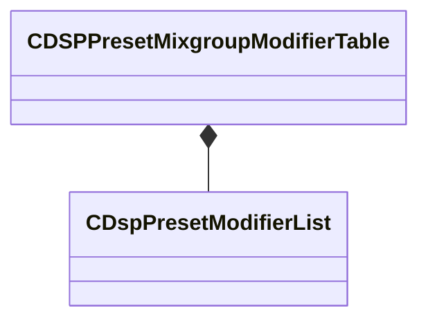
```mermaid
classDiagram
    CDSPPresetMixgroupModifierTable *-- CDspPresetModifierList
```

**Fields:**

| Name | Type | Annotations |
|------|------|-------------|
| `m_table` | CUtlVector< [CDspPresetModifierList](../schemas/soundsystem.md#cdsppresetmodifierlist) > | `MPropertyDescription Table of mixgroup modifiers for effect names.` `MPropertyFriendlyName Modifier Table` |

### CDspPresetModifierList

**Metadata:** `MGetKV3ClassDefaults`

**Relationships:**

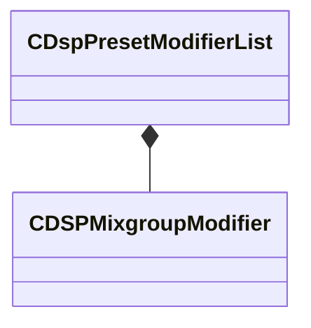
```mermaid
classDiagram
    CDspPresetModifierList *-- CDSPMixgroupModifier
```

**Fields:**

| Name | Type | Annotations |
|------|------|-------------|
| `m_dspName` | CUtlString | `MPropertyDescription Name of the DSP effect / subgraph used.` `MPropertyFriendlyName DSP Effect Name` |
| `m_modifiers` | CUtlVector< [CDSPMixgroupModifier](../schemas/soundsystem.md#cdspmixgroupmodifier) > | `MPropertyDescription Set of modifiers for individual mix groups` `MPropertyFriendlyName Mixgroup Modifiers` |

### CSndBeatPattern

**Metadata:** `MGetKV3ClassDefaults`, `MPropertyArrayElementNameKey m_name`, `MVDataAnonymousNode`, `MVDataOutlinerNameExpr`

**Relationships:**

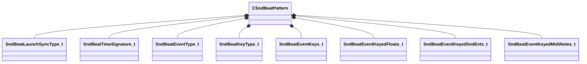
```mermaid
classDiagram
    CSndBeatPattern *-- SndBeatLaunchSyncType_t
    CSndBeatPattern *-- SndBeatTimeSignature_t
    CSndBeatPattern *-- SndBeatEventType_t
    CSndBeatPattern *-- SndBeatKeyType_t
    CSndBeatPattern *-- SndBeatEventKeys_t
    CSndBeatPattern *-- SndBeatEventKeyedFloats_t
    CSndBeatPattern *-- SndBeatEventKeyedSndEvts_t
    CSndBeatPattern *-- SndBeatEventKeyedMidiNotes_t
```

**Fields:**

| Name | Type | Annotations |
|------|------|-------------|
| `m_name` | CUtlString | `MPropertyFriendlyName Pattern Name` |
| `m_launchSyncType` | [SndBeatLaunchSyncType_t](../schemas/!GlobalTypes.md#sndbeatlaunchsynctype_t) | `MPropertyFriendlyName Pattern Launch Type` |
| `m_flSyncPriority` | float32 | `MPropertyFriendlyName Pattern Launch Priority` |
| `m_timeSignature` | [SndBeatTimeSignature_t](../schemas/soundsystem.md#sndbeattimesignature_t) | `MPropertyFriendlyName Time Signature` |
| `m_flLength` | float32 | `MPropertyFriendlyName Length (beats)` |
| `m_bLooping` | bool | `MPropertyFriendlyName Looping` |
| `m_launchSyncEventType` | [SndBeatEventType_t](../schemas/!GlobalTypes.md#sndbeateventtype_t) | `MPropertyFriendlyName Launch Track Event Type` `MPropertyGroupName Launch Track` |
| `m_flSyncBeatMult` | float32 | `MPropertyFriendlyName Launch Track Beat/Bar/Phrase/Length Multiplier` `MPropertyGroupName Launch Track` `MPropertySuppressExpr` |
| `m_playEventType` | [SndBeatEventType_t](../schemas/!GlobalTypes.md#sndbeateventtype_t) | `MPropertyFriendlyName Play Track Event Type` `MPropertyGroupName Playback Track` |
| `m_flPlayBeatMult` | float32 | `MPropertyFriendlyName Play Track Beat/Bar/Phrase/Length Multiplier` `MPropertyGroupName Playback Track` |
| `m_keyType` | [SndBeatKeyType_t](../schemas/!GlobalTypes.md#sndbeatkeytype_t) | `MPropertyFriendlyName Key Type` |
| `m_vecPatternKeys` | CUtlVector< [SndBeatEventKeys_t](../schemas/soundsystem.md#sndbeateventkeys_t) > | `MPropertySuppressExpr` |
| `m_vecPatternFloats` | CUtlVector< [SndBeatEventKeyedFloats_t](../schemas/soundsystem.md#sndbeateventkeyedfloats_t) > | `MPropertySuppressExpr` |
| `m_vecPatternSndEvts` | CUtlVector< [SndBeatEventKeyedSndEvts_t](../schemas/soundsystem.md#sndbeateventkeyedsndevts_t) > | `MPropertySuppressExpr` |
| `m_vecPatternMidi` | CUtlVector< [SndBeatEventKeyedMidiNotes_t](../schemas/soundsystem.md#sndbeateventkeyedmidinotes_t) > | `MPropertySuppressExpr` |

### CSndBeatPatternManager

**Metadata:** `MGetKV3ClassDefaults`, `MPropertyFriendlyName Beat Pattern Library`, `MVDataRoot`, `MVDataSingleton`

**Relationships:**

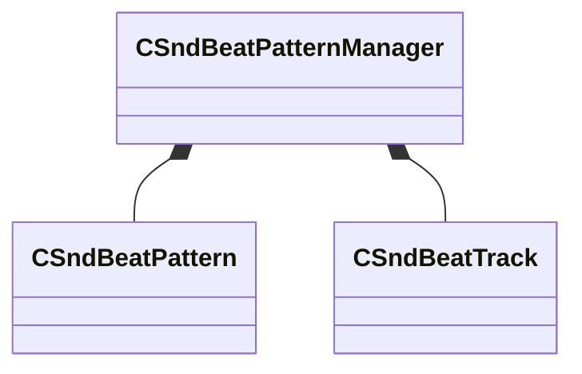
```mermaid
classDiagram
    CSndBeatPatternManager *-- CSndBeatPattern
    CSndBeatPatternManager *-- CSndBeatTrack
```

**Fields:**

| Name | Type | Annotations |
|------|------|-------------|
| `m_vecPatterns` | CUtlVector< [CSndBeatPattern](../schemas/soundsystem.md#csndbeatpattern) > | `MPropertyFriendlyName Patterns` `MVDataPromoteField` |
| `m_vecActiveTracks` | CUtlVector< [CSndBeatTrack](../schemas/soundsystem.md#csndbeattrack) > | `MPropertyFriendlyName Tracks` `MVDataPromoteField` |

### CSndBeatTrack

**Metadata:** `MGetKV3ClassDefaults`, `MPropertyArrayElementNameKey m_name`, `MVDataAnonymousNode`, `MVDataOutlinerNameExpr`

**Relationships:**

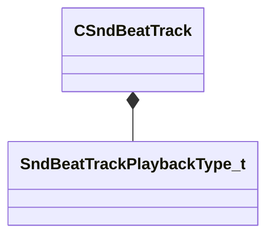
```mermaid
classDiagram
    CSndBeatTrack *-- SndBeatTrackPlaybackType_t
```

**Fields:**

| Name | Type | Annotations |
|------|------|-------------|
| `m_name` | CUtlString | `MPropertyFriendlyName Track Name` |
| `m_playbackType` | [SndBeatTrackPlaybackType_t](../schemas/!GlobalTypes.md#sndbeattrackplaybacktype_t) | `MPropertyFriendlyName Playback Mode` |
| `m_nTranspose` | int32 | `MPropertyFriendlyName Transpose` |
| `m_bSyncToVoice` | bool | `MPropertyFriendlyName Sync To Voice` |
| `m_flBPM` | float32 | `MPropertyFriendlyName BPM` |

### CSndSeqInstBaseSchema

**Derived by:** [CSndSeqInstMidiSampler](soundsystem.md#csndseqinstmidisampler), [CSndSeqInstSndEvtSchema](soundsystem.md#csndseqinstsndevtschema)

**Metadata:** `MGetKV3ClassDefaults`, `MPropertyAutoExpandSelf`, `MPropertyPolymorphicClass`

**Relationships:**

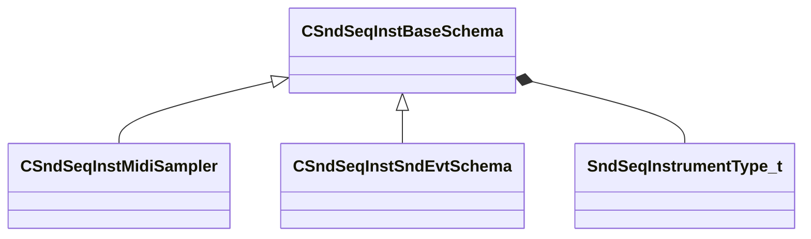
```mermaid
classDiagram
    CSndSeqInstBaseSchema <|-- CSndSeqInstMidiSampler
    CSndSeqInstBaseSchema <|-- CSndSeqInstSndEvtSchema
    CSndSeqInstBaseSchema *-- SndSeqInstrumentType_t
```

**Fields:**

| Name | Type | Annotations |
|------|------|-------------|
| `m_nType` | [SndSeqInstrumentType_t](../schemas/!GlobalTypes.md#sndseqinstrumenttype_t) |  |
| `m_bStopCurrentEvents` | bool |  |
| `m_flBPM` | float32 |  |
| `m_flBPMFactor` | float32 |  |
| `m_flBPMInvFactor` | float32 |  |

### CSndSeqInstMidiSampler

**Inherits from:** [CSndSeqInstBaseSchema](soundsystem.md#csndseqinstbaseschema)

**Metadata:** `MGetKV3ClassDefaults`, `MPropertyFriendlyName Midi Sampler`

**Relationships:**

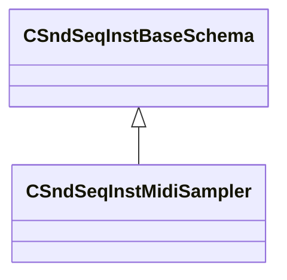
```mermaid
classDiagram
    CSndSeqInstBaseSchema <|-- CSndSeqInstMidiSampler
```

**Fields:**

| Name | Type | Annotations |
|------|------|-------------|
| `m_bIsSoundEvent` | bool |  |
| `m_bStopPrevious` | bool |  |
| `m_nMinNote` | uint8 |  |
| `m_nMaxNote` | uint8 |  |
| `m_flMinVelocityAtten` | float32 |  |
| `m_flMaxVelocityAtten` | float32 |  |
| `m_flAttack` | float32 |  |
| `m_flRelease` | float32 |  |
| `m_bBeatEnvelopes` | bool |  |
| `m_nNextVoiceSlot` | uint8 |  |
| `m_hSoundEventHash` | uint32 |  |

### CSndSeqInstSndEvtSchema

**Inherits from:** [CSndSeqInstBaseSchema](soundsystem.md#csndseqinstbaseschema)

**Metadata:** `MGetKV3ClassDefaults`, `MPropertyFriendlyName SoundEvent on Start`

**Relationships:**

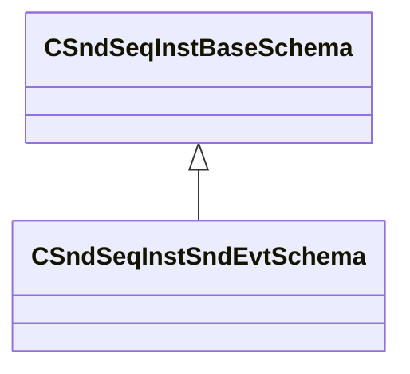
```mermaid
classDiagram
    CSndSeqInstBaseSchema <|-- CSndSeqInstSndEvtSchema
```

### CSndSeqInstruments

**Inherits from:** [ISndSeqInstruments](soundsystem.md#isndseqinstruments)

**Relationships:**

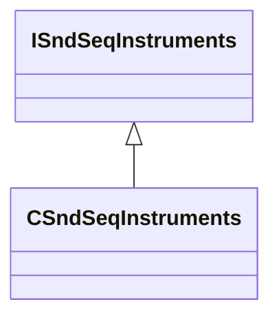
```mermaid
classDiagram
    ISndSeqInstruments <|-- CSndSeqInstruments
```

### CSosGroupActionLimitSchema

**Inherits from:** [CSosGroupActionSchema](soundsystem.md#csosgroupactionschema)

**Metadata:** `MGetKV3ClassDefaults`, `MPropertyFriendlyName Limiter`

**Relationships:**

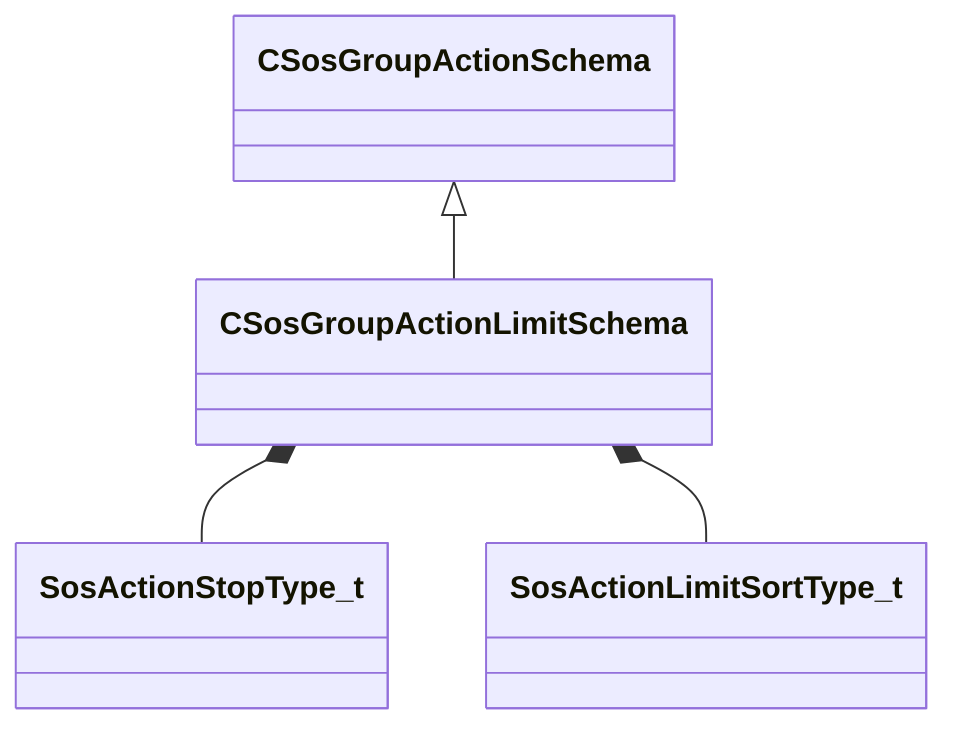
```mermaid
classDiagram
    CSosGroupActionSchema <|-- CSosGroupActionLimitSchema
    CSosGroupActionLimitSchema *-- SosActionStopType_t
    CSosGroupActionLimitSchema *-- SosActionLimitSortType_t
```

**Fields:**

| Name | Type | Annotations |
|------|------|-------------|
| `m_nMaxCount` | int32 |  |
| `m_nStopType` | [SosActionStopType_t](../schemas/!GlobalTypes.md#sosactionstoptype_t) |  |
| `m_nSortType` | [SosActionLimitSortType_t](../schemas/!GlobalTypes.md#sosactionlimitsorttype_t) |  |
| `m_bStopImmediate` | bool |  |
| `m_bCountStopped` | bool | `MPropertyFriendlyName Count Stopped Events` |

### CSosGroupActionMemberCountEnvelopeSchema

**Inherits from:** [CSosGroupActionSchema](soundsystem.md#csosgroupactionschema)

**Metadata:** `MGetKV3ClassDefaults`, `MPropertyFriendlyName Count Envelope`

**Relationships:**

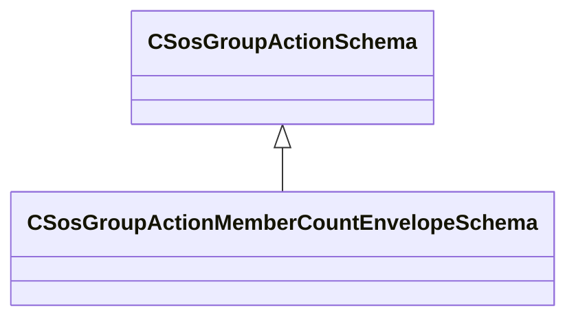
```mermaid
classDiagram
    CSosGroupActionSchema <|-- CSosGroupActionMemberCountEnvelopeSchema
```

**Fields:**

| Name | Type | Annotations |
|------|------|-------------|
| `m_nBaseCount` | int32 | `MPropertyFriendlyName Min Threshold Count` |
| `m_nTargetCount` | int32 | `MPropertyFriendlyName Max Target Count` |
| `m_flBaseValue` | float32 | `MPropertyFriendlyName Threshold Value` |
| `m_flTargetValue` | float32 | `MPropertyFriendlyName Target Value` |
| `m_flAttack` | float32 | `MPropertyFriendlyName Attack` |
| `m_flDecay` | float32 | `MPropertyFriendlyName Decay` |
| `m_resultVarName` | CUtlString | `MPropertyFriendlyName Result Variable Name` |
| `m_bSaveToGroup` | bool | `MPropertyFriendlyName Save Result to Group` |

### CSosGroupActionOcclusionSchema

**Inherits from:** [CSosGroupActionSchema](soundsystem.md#csosgroupactionschema)

**Metadata:** `MGetKV3ClassDefaults`, `MPropertyFriendlyName Occlusion Info`

**Relationships:**

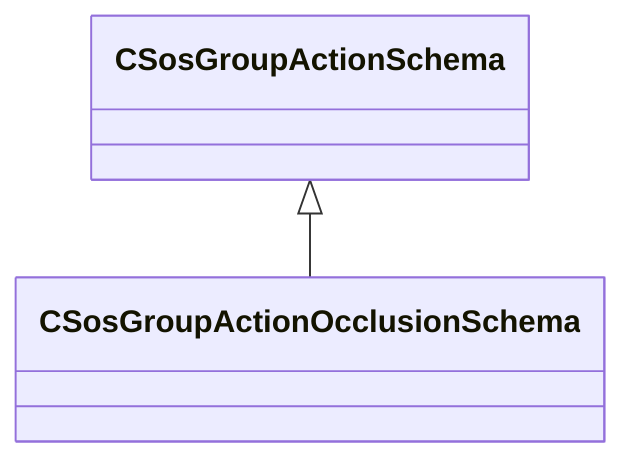
```mermaid
classDiagram
    CSosGroupActionSchema <|-- CSosGroupActionOcclusionSchema
```

**Fields:**

| Name | Type | Annotations |
|------|------|-------------|
| `m_flCalculationInterval` | float32 | `MPropertyFriendlyName Calculation interval ( seconds ).` |
| `m_flRadius` | float32 | `MPropertyFriendlyName Occlusion radius.` |
| `m_flOcclusionScale` | float32 | `MPropertyFriendlyName Occlusion scale.` |
| `m_flOcclusionMin` | float32 | `MPropertyFriendlyName Occlusion min.` |
| `m_flOcclusionMax` | float32 | `MPropertyFriendlyName Occlusion max.` |
| `m_flTestDepth` | float32 | `MPropertyFriendlyName Test depth.` |

### CSosGroupActionSchema

**Derived by:** [CSosGroupActionLimitSchema](soundsystem.md#csosgroupactionlimitschema), [CSosGroupActionMemberCountEnvelopeSchema](soundsystem.md#csosgroupactionmembercountenvelopeschema), [CSosGroupActionOcclusionSchema](soundsystem.md#csosgroupactionocclusionschema), [CSosGroupActionSetSoundeventParameterSchema](soundsystem.md#csosgroupactionsetsoundeventparameterschema), [CSosGroupActionSoundeventClusterSchema](soundsystem.md#csosgroupactionsoundeventclusterschema), [CSosGroupActionSoundeventCountSchema](soundsystem.md#csosgroupactionsoundeventcountschema), [CSosGroupActionSoundeventMinMaxValuesSchema](soundsystem.md#csosgroupactionsoundeventminmaxvaluesschema), [CSosGroupActionSoundeventPrioritySchema](soundsystem.md#csosgroupactionsoundeventpriorityschema), [CSosGroupActionTimeBlockLimitSchema](soundsystem.md#csosgroupactiontimeblocklimitschema), [CSosGroupActionTimeLimitSchema](soundsystem.md#csosgroupactiontimelimitschema)

**Metadata:** `MGetKV3ClassDefaults`, `MPropertyAutoExpandSelf`, `MPropertyPolymorphicClass`

**Relationships:**

```mermaid
classDiagram
    CSosGroupActionSchema <|-- CSosGroupActionLimitSchema
    CSosGroupActionSchema <|-- CSosGroupActionMemberCountEnvelopeSchema
    CSosGroupActionSchema <|-- CSosGroupActionOcclusionSchema
    CSosGroupActionSchema <|-- CSosGroupActionSetSoundeventParameterSchema
    CSosGroupActionSchema <|-- CSosGroupActionSoundeventClusterSchema
    CSosGroupActionSchema <|-- CSosGroupActionSoundeventCountSchema
    CSosGroupActionSchema <|-- CSosGroupActionSoundeventMinMaxValuesSchema
    CSosGroupActionSchema <|-- CSosGroupActionSoundeventPrioritySchema
    CSosGroupActionSchema <|-- CSosGroupActionTimeBlockLimitSchema
    CSosGroupActionSchema <|-- CSosGroupActionTimeLimitSchema
```

### CSosGroupActionSetSoundeventParameterSchema

**Inherits from:** [CSosGroupActionSchema](soundsystem.md#csosgroupactionschema)

**Metadata:** `MGetKV3ClassDefaults`, `MPropertyFriendlyName Set Sound Event Parameter`

**Relationships:**

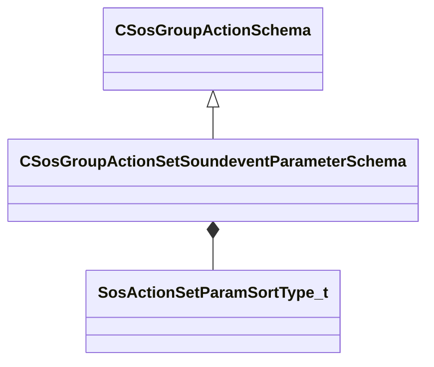
```mermaid
classDiagram
    CSosGroupActionSchema <|-- CSosGroupActionSetSoundeventParameterSchema
    CSosGroupActionSetSoundeventParameterSchema *-- SosActionSetParamSortType_t
```

**Fields:**

| Name | Type | Annotations |
|------|------|-------------|
| `m_nMaxCount` | int32 |  |
| `m_flMinValue` | float32 |  |
| `m_flMaxValue` | float32 |  |
| `m_opvarName` | CUtlString | `MPropertyFriendlyName Parameter Name` |
| `m_nSortType` | [SosActionSetParamSortType_t](../schemas/!GlobalTypes.md#sosactionsetparamsorttype_t) |  |

### CSosGroupActionSoundeventClusterSchema

**Inherits from:** [CSosGroupActionSchema](soundsystem.md#csosgroupactionschema)

**Metadata:** `MGetKV3ClassDefaults`, `MPropertyFriendlyName Soundevent Cluster`

**Relationships:**

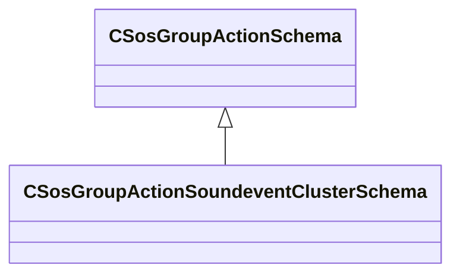
```mermaid
classDiagram
    CSosGroupActionSchema <|-- CSosGroupActionSoundeventClusterSchema
```

**Fields:**

| Name | Type | Annotations |
|------|------|-------------|
| `m_nMinNearby` | int32 | `MPropertyFriendlyName Minimum Nearby Soundevents` |
| `m_flClusterEpsilon` | float32 | `MPropertyFriendlyName Search Radius to Cluster Soundevents` |
| `m_shouldPlayOpvar` | CUtlString | `MPropertyFriendlyName 'Should Play' Opvar Name` |
| `m_shouldPlayClusterChild` | CUtlString | `MPropertyFriendlyName 'Should Play Cluster Child' Opvar Name` |
| `m_clusterSizeOpvar` | CUtlString | `MPropertyFriendlyName Cluster Size Opvar Name` |
| `m_groupBoundingBoxMinsOpvar` | CUtlString | `MPropertyFriendlyName 'Group Box Mins' Opvar Name` |
| `m_groupBoundingBoxMaxsOpvar` | CUtlString | `MPropertyFriendlyName 'Group Box Maxs' Opvar Name` |

### CSosGroupActionSoundeventCountSchema

**Inherits from:** [CSosGroupActionSchema](soundsystem.md#csosgroupactionschema)

**Metadata:** `MGetKV3ClassDefaults`, `MPropertyFriendlyName Soundevent Count`

**Relationships:**

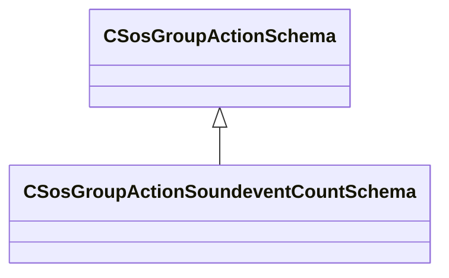
```mermaid
classDiagram
    CSosGroupActionSchema <|-- CSosGroupActionSoundeventCountSchema
```

**Fields:**

| Name | Type | Annotations |
|------|------|-------------|
| `m_bExcludeStoppedSounds` | bool | `MPropertyFriendlyName Exclude Stopped Sounds from Count` |
| `m_strCountKeyName` | CUtlString | `MPropertyFriendlyName Result Current Count` |

### CSosGroupActionSoundeventMinMaxValuesSchema

**Inherits from:** [CSosGroupActionSchema](soundsystem.md#csosgroupactionschema)

**Metadata:** `MGetKV3ClassDefaults`, `MPropertyFriendlyName Soundevent Min/Max Values`

**Relationships:**

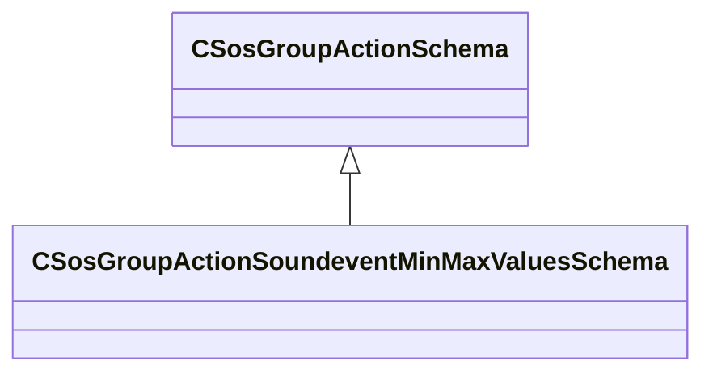
```mermaid
classDiagram
    CSosGroupActionSchema <|-- CSosGroupActionSoundeventMinMaxValuesSchema
```

**Fields:**

| Name | Type | Annotations |
|------|------|-------------|
| `m_strQueryPublicFieldName` | CUtlString | `MPropertyFriendlyName Public field name to query.` |
| `m_strDelayPublicFieldName` | CUtlString | `MPropertyFriendlyName Public field 'delay' name.` |
| `m_bExcludeStoppedSounds` | bool | `MPropertyFriendlyName Exclude stopped sounds from evaluation` |
| `m_bExcludeDelayedSounds` | bool | `MPropertyFriendlyName Exclude delayed sounds from evaluation` |
| `m_bExcludeSoundsBelowThreshold` | bool | `MPropertyFriendlyName Exclude sounds from evaluation less than or equal to a min value threshold.` |
| `m_flExcludeSoundsMinThresholdValue` | float32 | `MPropertyFriendlyName The minimum threshold value to exclude sounds.` |
| `m_bExcludSoundsAboveThreshold` | bool | `MPropertyFriendlyName Exclude sounds from evaluation greater than or equal to a max value threshold.` |
| `m_flExcludeSoundsMaxThresholdValue` | float32 | `MPropertyFriendlyName The maximum threshold value to exclude sounds.` |
| `m_strMinValueName` | CUtlString | `MPropertyFriendlyName Min value property name` |
| `m_strMaxValueName` | CUtlString | `MPropertyFriendlyName Max value property name` |

### CSosGroupActionSoundeventPrioritySchema

**Inherits from:** [CSosGroupActionSchema](soundsystem.md#csosgroupactionschema)

**Metadata:** `MGetKV3ClassDefaults`, `MPropertyFriendlyName Soundevent Priority`

**Relationships:**

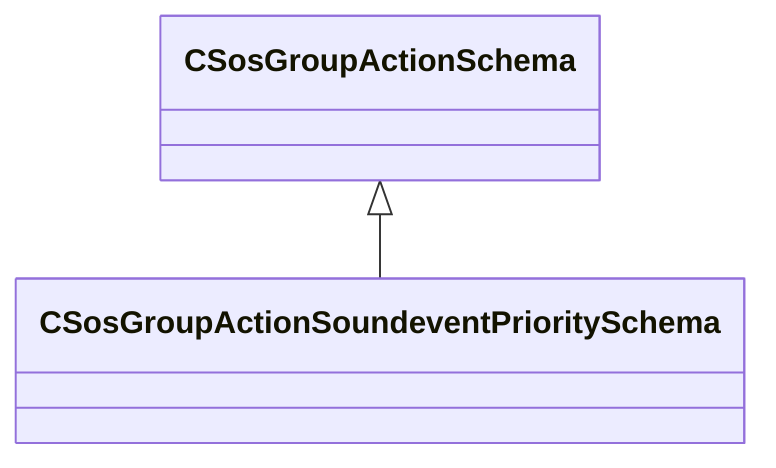
```mermaid
classDiagram
    CSosGroupActionSchema <|-- CSosGroupActionSoundeventPrioritySchema
```

**Fields:**

| Name | Type | Annotations |
|------|------|-------------|
| `m_priorityValue` | CUtlString | `MPropertyFriendlyName Priority Value, typically 0.0 to 1.0` |
| `m_priorityVolumeScalar` | CUtlString | `MPropertyFriendlyName Priority-Based Volume Multiplier, 0.0 to 1.0` |
| `m_priorityContributeButDontRead` | CUtlString | `MPropertyFriendlyName Contribute to the priority system, but volume is unaffected by it (bool)` |
| `m_bPriorityReadButDontContribute` | CUtlString | `MPropertyFriendlyName Don't contribute to the priority system, but volume is affected by it (bool)` |

### CSosGroupActionTimeBlockLimitSchema

**Inherits from:** [CSosGroupActionSchema](soundsystem.md#csosgroupactionschema)

**Metadata:** `MGetKV3ClassDefaults`, `MPropertyFriendlyName Timed Block Limiter`

**Relationships:**

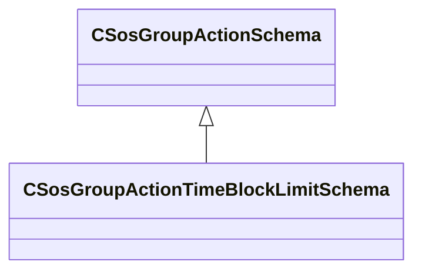
```mermaid
classDiagram
    CSosGroupActionSchema <|-- CSosGroupActionTimeBlockLimitSchema
```

**Fields:**

| Name | Type | Annotations |
|------|------|-------------|
| `m_nMaxCount` | int32 |  |
| `m_flMaxDuration` | float32 |  |

### CSosGroupActionTimeLimitSchema

**Inherits from:** [CSosGroupActionSchema](soundsystem.md#csosgroupactionschema)

**Metadata:** `MGetKV3ClassDefaults`, `MPropertyFriendlyName Time Limiter`

**Relationships:**

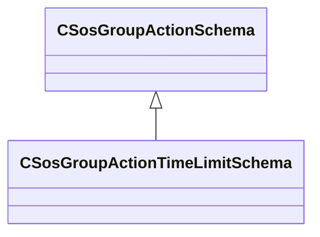
```mermaid
classDiagram
    CSosGroupActionSchema <|-- CSosGroupActionTimeLimitSchema
```

**Fields:**

| Name | Type | Annotations |
|------|------|-------------|
| `m_flMaxDuration` | float32 |  |

### CSosSoundEventGroupSchema

**Metadata:** `MGetKV3ClassDefaults`, `MVDataRoot`

**Relationships:**

```mermaid
classDiagram
    CSosSoundEventGroupSchema *-- SosGroupType_t
    CSosSoundEventGroupSchema *-- SosGroupFieldBehavior_t
    CSosSoundEventGroupSchema --> CSosGroupActionSchema
```

**Fields:**

| Name | Type | Annotations |
|------|------|-------------|
| `m_nGroupType` | [SosGroupType_t](../schemas/!GlobalTypes.md#sosgrouptype_t) | `MPropertyAttributeEditor Radio` |
| `m_bBlocksEvents` | bool | `MPropertyStartGroup +Block Events` |
| `m_nBlockMaxCount` | int32 | `MPropertyReadonlyExpr` |
| `m_flMemberLifespanTime` | float32 | `MPropertyStartGroup` |
| `m_bInvertMatch` | bool |  |
| `m_Behavior_EventName` | [SosGroupFieldBehavior_t](../schemas/!GlobalTypes.md#sosgroupfieldbehavior_t) | `MPropertyAttributeEditor Radio` `MPropertyReadonlyExpr` `MPropertyStartGroup +Event Name` |
| `m_matchSoundEventName` | CUtlString | `MPropertyReadonlyExpr` |
| `m_bMatchEventSubString` | bool | `MPropertyStartGroup +Event SubString` |
| `m_matchSoundEventSubString` | CUtlString | `MPropertyReadonlyExpr` |
| `m_Behavior_EntIndex` | [SosGroupFieldBehavior_t](../schemas/!GlobalTypes.md#sosgroupfieldbehavior_t) | `MPropertyAttributeEditor Radio` `MPropertyStartGroup +Ent Index` |
| `m_flEntIndex` | float32 | `MPropertyReadonlyExpr` |
| `m_Behavior_Opvar` | [SosGroupFieldBehavior_t](../schemas/!GlobalTypes.md#sosgroupfieldbehavior_t) | `MPropertyAttributeEditor Radio` `MPropertyStartGroup +OpVar Float` `MPropertySuppressExpr` |
| `m_flOpvar` | float32 | `MPropertyReadonlyExpr` `MPropertySuppressExpr` |
| `m_Behavior_String` | [SosGroupFieldBehavior_t](../schemas/!GlobalTypes.md#sosgroupfieldbehavior_t) | `MPropertyAttributeEditor Radio` `MPropertyStartGroup +OpVar String` `MPropertySuppressExpr` |
| `m_opvarString` | CUtlString | `MPropertyReadonlyExpr` `MPropertySuppressExpr` |
| `m_vActions` | CUtlVector< [CSosGroupActionSchema](../schemas/soundsystem.md#csosgroupactionschema)* > | `MPropertyAutoExpandSelf` `MPropertyStartGroup` |

### CSoundEventMetaData

**Metadata:** `MGetKV3ClassDefaults`

**Relationships:**

```mermaid
classDiagram
    CSoundEventMetaData *-- InfoForResourceTypeCVMixListResource
```

**Fields:**

| Name | Type | Annotations |
|------|------|-------------|
| `m_soundEventVMix` | CStrongHandle< [InfoForResourceTypeCVMixListResource](../schemas/resourcesystem.md#infoforresourcetypecvmixlistresource) > |  |

### CVoiceContainerVMixSnd

**Inherits from:** [CVoiceContainerBase](soundsystem_voicecontainers.md#cvoicecontainerbase)

**Metadata:** `MGetKV3ClassDefaults`, `MPropertyDescription Plays a vmix graph and its containers.`, `MPropertyFriendlyName VMixSound`

**Relationships:**

```mermaid
classDiagram
    CVoiceContainerBase <|-- CVoiceContainerVMixSnd
```

### ISndSeqInstruments

**Derived by:** [CSndSeqInstruments](soundsystem.md#csndseqinstruments)

**Relationships:**

```mermaid
classDiagram
    ISndSeqInstruments <|-- CSndSeqInstruments
```

### KeyGroup_t

**Relationships:**

```mermaid
classDiagram
    KeyGroup_t --> VelocityZone_t
```

**Fields:**

| Name | Type | Annotations |
|------|------|-------------|
| `nCenterNote` | uint8 |  |
| `nMinNote` | uint8 |  |
| `nMaxNote` | uint8 |  |
| `nNumVelocityZones` | uint8 |  |
| `pVelocityZones` | [VelocityZone_t](../schemas/soundsystem.md#velocityzone_t)* |  |

### SamplerVoice_t

**Fields:**

| Name | Type | Annotations |
|------|------|-------------|
| `nNoteNum` | uint8 |  |

### SelectedEditItemInfo_t

**Metadata:** `MGetKV3ClassDefaults`

**Relationships:**

```mermaid
classDiagram
    SelectedEditItemInfo_t *-- SosEditItemInfo_t
```

**Fields:**

| Name | Type | Annotations |
|------|------|-------------|
| `m_EditItems` | CUtlVector< [SosEditItemInfo_t](../schemas/soundsystem.md#sosedititeminfo_t) > |  |

### SndBeatEventKeyedFloats_t

**Inherits from:** [SndBeatEventKeys_t](soundsystem.md#sndbeateventkeys_t)

**Metadata:** `MGetKV3ClassDefaults`

**Relationships:**

```mermaid
classDiagram
    SndBeatEventKeys_t <|-- SndBeatEventKeyedFloats_t
```

**Fields:**

| Name | Type | Annotations |
|------|------|-------------|
| `m_flFloat` | float32 | `MPropertyFriendlyName Float` |

### SndBeatEventKeyedMidiNotes_t

**Inherits from:** [SndBeatEventKeys_t](soundsystem.md#sndbeateventkeys_t)

**Metadata:** `MGetKV3ClassDefaults`

**Relationships:**

```mermaid
classDiagram
    SndBeatEventKeys_t <|-- SndBeatEventKeyedMidiNotes_t
```

**Fields:**

| Name | Type | Annotations |
|------|------|-------------|
| `m_nStatus` | uint8 | `MPropertyFriendlyName Status` |
| `m_nNote` | uint8 | `MPropertyFriendlyName Note` |
| `m_nVelocity` | uint8 | `MPropertyFriendlyName Velocity` |

### SndBeatEventKeyedSndEvts_t

**Inherits from:** [SndBeatEventKeys_t](soundsystem.md#sndbeateventkeys_t)

**Metadata:** `MGetKV3ClassDefaults`

**Relationships:**

```mermaid
classDiagram
    SndBeatEventKeys_t <|-- SndBeatEventKeyedSndEvts_t
```

**Fields:**

| Name | Type | Annotations |
|------|------|-------------|
| `m_strSoundEventName` | CUtlString | `MPropertyFriendlyName SoundEvent Name` |

### SndBeatEventKeys_t

**Derived by:** [SndBeatEventKeyedFloats_t](soundsystem.md#sndbeateventkeyedfloats_t), [SndBeatEventKeyedMidiNotes_t](soundsystem.md#sndbeateventkeyedmidinotes_t), [SndBeatEventKeyedSndEvts_t](soundsystem.md#sndbeateventkeyedsndevts_t)

**Metadata:** `MGetKV3ClassDefaults`, `MVDataBase`, `MVDataNodeType 1`

**Relationships:**

```mermaid
classDiagram
    SndBeatEventKeys_t <|-- SndBeatEventKeyedFloats_t
    SndBeatEventKeys_t <|-- SndBeatEventKeyedMidiNotes_t
    SndBeatEventKeys_t <|-- SndBeatEventKeyedSndEvts_t
```

**Fields:**

| Name | Type | Annotations |
|------|------|-------------|
| `m_flKey` | float32 | `MPropertyFriendlyName Key` |

### SndBeatTimeSignature_t

**Metadata:** `MGetKV3ClassDefaults`

**Fields:**

| Name | Type | Annotations |
|------|------|-------------|
| `nNumerator` | uint8 | `MPropertyFriendlyName Numerator` |
| `nDenominator` | uint8 | `MPropertyFriendlyName Denominator` |

### SosEditItemInfo_t

**Metadata:** `MGetKV3ClassDefaults`

**Relationships:**

```mermaid
classDiagram
    SosEditItemInfo_t *-- SosEditItemType_t
```

**Fields:**

| Name | Type | Annotations |
|------|------|-------------|
| `itemType` | [SosEditItemType_t](../schemas/!GlobalTypes.md#sosedititemtype_t) |  |
| `itemName` | CUtlString |  |
| `itemTypeName` | CUtlString |  |
| `itemKVString` | CUtlString |  |
| `itemPos` | Vector2D |  |

### VelocityZone_t

**Fields:**

| Name | Type | Annotations |
|------|------|-------------|
| `nMaxVel` | uint8 |  |
| `nNextSelection` | uint8 |  |
| `nNumSamples` | uint8 |  |
| `pSamples` | uint32[4] |  |
