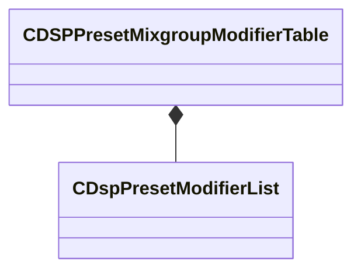

[Schemas](../../schemas.md) / [soundsystem](../soundsystem.md) / CDSPPresetMixgroupModifierTable

# CDSPPresetMixgroupModifierTable

**Kind:** class · **Size:** 24 bytes (`0x18`) · **Align:** 8 · **Module:** soundsystem

**Metadata:** `MVDataNodeType 1`, `MVDataRoot`

**Relationships:**

## Memory layout

1 fields (1 declared here, 0 inherited). Offsets are absolute from the object base.

| Offset | Field | Type | From | Annotations |
|--------|-------|------|------|-------------|
| `0x0` | `m_table` | CUtlVector< [CDspPresetModifierList](../soundsystem/CDspPresetModifierList.md) > |  | `MPropertyDescription Table of mixgroup modifiers for effect names.` `MPropertyFriendlyName Modifier Table` |

KV3 class defaults

<pre>{
	&quot;m_table&quot;:
	[
	]
}</pre>

