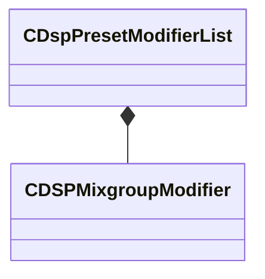

[Schemas](../../schemas.md) / [soundsystem](../soundsystem.md) / CDspPresetModifierList

# CDspPresetModifierList

> Source: **Build 25000182** · 2026-08-28 · `windows-x86_64` · schema `0.10.0`

**Kind:** class · **Size:** 32 bytes (`0x20`) · **Align:** 8 · **Module:** soundsystem

**Relationships:**

## Memory layout

2 fields (2 declared here, 0 inherited). Offsets are absolute from the object base.

| Offset | Field | Type | From | Annotations |
|--------|-------|------|------|-------------|
| `0x0` | `m_dspName` | CUtlString |  | `MPropertyDescription Name of the DSP effect / subgraph used.` `MPropertyFriendlyName DSP Effect Name` |
| `0x8` | `m_modifiers` | CUtlVector< [CDSPMixgroupModifier](../soundsystem/CDSPMixgroupModifier.md) > |  | `MPropertyDescription Set of modifiers for individual mix groups` `MPropertyFriendlyName Mixgroup Modifiers` |

KV3 class defaults

<pre>{
	&quot;m_dspName&quot;: &quot;default&quot;,
	&quot;m_modifiers&quot;:
	[
	]
}</pre>

