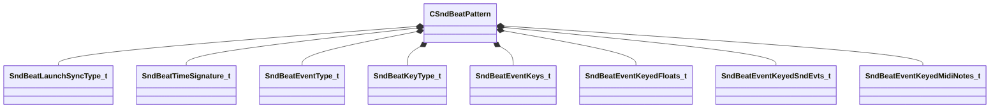

[Schemas](../../schemas.md) / [soundsystem](../soundsystem.md) / CSndBeatPattern

# CSndBeatPattern

**Kind:** class · **Size:** 152 bytes (`0x98`) · **Align:** 8 · **Module:** soundsystem

**Metadata:** `MPropertyArrayElementNameKey m_name`, `MVDataAnonymousNode`, `MVDataOutlinerNameExpr m_name`

**Relationships:**

## Memory layout

15 fields (15 declared here, 0 inherited). Offsets are absolute from the object base.

| Offset | Field | Type | From | Annotations |
|--------|-------|------|------|-------------|
| `0x0` | `m_name` | CUtlString |  | `MPropertyFriendlyName Pattern Name` |
| `0xc` | `m_launchSyncType` | [SndBeatLaunchSyncType_t](../!GlobalTypes/SndBeatLaunchSyncType_t.md) |  | `MPropertyFriendlyName Pattern Launch Type` |
| `0x10` | `m_flSyncPriority` | float32 |  | `MPropertyFriendlyName Pattern Launch Priority` |
| `0x14` | `m_timeSignature` | [SndBeatTimeSignature_t](../soundsystem/SndBeatTimeSignature_t.md) |  | `MPropertyFriendlyName Time Signature` |
| `0x1c` | `m_flLength` | float32 |  | `MPropertyFriendlyName Length (beats)` |
| `0x20` | `m_bLooping` | bool |  | `MPropertyFriendlyName Looping` |
| `0x24` | `m_launchSyncEventType` | [SndBeatEventType_t](../!GlobalTypes/SndBeatEventType_t.md) |  | `MPropertyFriendlyName Launch Track Event Type` `MPropertyGroupName Launch Track` |
| `0x28` | `m_flSyncBeatMult` | float32 |  | `MPropertyFriendlyName Launch Track Beat/Bar/Phrase/Length Multiplier` `MPropertyGroupName Launch Track` `MPropertySuppressExpr m_launchSyncEventType == eSndBeatPatternTypeKeys` |
| `0x2c` | `m_playEventType` | [SndBeatEventType_t](../!GlobalTypes/SndBeatEventType_t.md) |  | `MPropertyFriendlyName Play Track Event Type` `MPropertyGroupName Playback Track` |
| `0x30` | `m_flPlayBeatMult` | float32 |  | `MPropertyFriendlyName Play Track Beat/Bar/Phrase/Length Multiplier` `MPropertyGroupName Playback Track` |
| `0x34` | `m_keyType` | [SndBeatKeyType_t](../!GlobalTypes/SndBeatKeyType_t.md) |  | `MPropertyFriendlyName Key Type` |
| `0x38` | `m_vecPatternKeys` | CUtlVector< [SndBeatEventKeys_t](../soundsystem/SndBeatEventKeys_t.md) > |  | `MPropertySuppressExpr m_keyType != eSndBeatPatternTypeKeys` |
| `0x50` | `m_vecPatternFloats` | CUtlVector< [SndBeatEventKeyedFloats_t](../soundsystem/SndBeatEventKeyedFloats_t.md) > |  | `MPropertySuppressExpr m_keyType != eSndBeatPatternTypeKeyedFloats` |
| `0x68` | `m_vecPatternSndEvts` | CUtlVector< [SndBeatEventKeyedSndEvts_t](../soundsystem/SndBeatEventKeyedSndEvts_t.md) > |  | `MPropertySuppressExpr m_keyType != eSndBeatPatternTypeKeyedSndEvts` |
| `0x80` | `m_vecPatternMidi` | CUtlVector< [SndBeatEventKeyedMidiNotes_t](../soundsystem/SndBeatEventKeyedMidiNotes_t.md) > |  | `MPropertySuppressExpr m_keyType != eSndBeatPatternTypeKeyedMidi` |

KV3 class defaults

<pre>{
	&quot;m_name&quot;: &quot;&quot;,
	&quot;m_launchSyncType&quot;: &quot;eSndBeatLaunchSyncTypeReset&quot;,
	&quot;m_flSyncPriority&quot;: 0.000000,
	&quot;m_timeSignature&quot;:
	{
		&quot;nNumerator&quot;: 4,
		&quot;nDenominator&quot;: 4
	},
	&quot;m_flLength&quot;: 4.000000,
	&quot;m_bLooping&quot;: false,
	&quot;m_launchSyncEventType&quot;: &quot;eSndBeatEventTypeBeat&quot;,
	&quot;m_flSyncBeatMult&quot;: 1.000000,
	&quot;m_playEventType&quot;: &quot;eSndBeatEventTypeBeat&quot;,
	&quot;m_flPlayBeatMult&quot;: 1.000000,
	&quot;m_keyType&quot;: &quot;eSndBeatPatternTypeNone&quot;,
	&quot;m_vecPatternKeys&quot;:
	[
	],
	&quot;m_vecPatternFloats&quot;:
	[
	],
	&quot;m_vecPatternSndEvts&quot;:
	[
	],
	&quot;m_vecPatternMidi&quot;:
	[
	]
}</pre>

