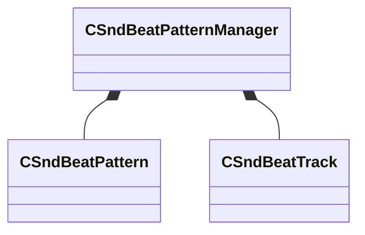

[Schemas](../../schemas.md) / [soundsystem](../soundsystem.md) / CSndBeatPatternManager

# CSndBeatPatternManager

> Source: **Build 25000182** · 2026-08-28 · `windows-x86_64` · schema `0.10.0`

**Kind:** class · **Size:** 144 bytes (`0x90`) · **Align:** 8 · **Module:** soundsystem

**Metadata:** `MPropertyFriendlyName Beat Pattern Library`, `MVDataRoot`, `MVDataSingleton`

**Relationships:**

## Memory layout

2 fields (2 declared here, 0 inherited). Offsets are absolute from the object base.

| Offset | Field | Type | From | Annotations |
|--------|-------|------|------|-------------|
| `0x38` | `m_vecPatterns` | CUtlVector< [CSndBeatPattern](../soundsystem/CSndBeatPattern.md) > |  | `MPropertyFriendlyName Patterns` `MVDataPromoteField 0` |
| `0x70` | `m_vecActiveTracks` | CUtlVector< [CSndBeatTrack](../soundsystem/CSndBeatTrack.md) > |  | `MPropertyFriendlyName Tracks` `MVDataPromoteField 0` |

KV3 class defaults

<pre>{
	&quot;m_vecPatterns&quot;:
	[
	],
	&quot;m_vecActiveTracks&quot;:
	[
	]
}</pre>

