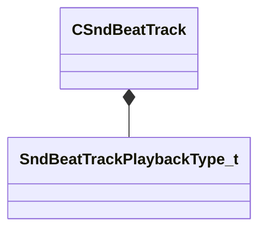

[Schemas](../../schemas.md) / [soundsystem](../soundsystem.md) / CSndBeatTrack

# CSndBeatTrack

> Source: **Build 25000182** · 2026-08-28 · `windows-x86_64` · schema `0.10.0`

**Kind:** class · **Size:** 152 bytes (`0x98`) · **Align:** 8 · **Module:** soundsystem

**Metadata:** `MPropertyArrayElementNameKey m_name`, `MVDataAnonymousNode`, `MVDataOutlinerNameExpr m_name`

**Relationships:**

## Memory layout

5 fields (5 declared here, 0 inherited). Offsets are absolute from the object base.

| Offset | Field | Type | From | Annotations |
|--------|-------|------|------|-------------|
| `0x0` | `m_name` | CUtlString |  | `MPropertyFriendlyName Track Name` |
| `0x20` | `m_playbackType` | [SndBeatTrackPlaybackType_t](../soundsystem/SndBeatTrackPlaybackType_t.md) |  | `MPropertyFriendlyName Playback Mode` |
| `0x24` | `m_nTranspose` | int32 |  | `MPropertyFriendlyName Transpose` |
| `0x28` | `m_bSyncToVoice` | bool |  | `MPropertyFriendlyName Sync To Voice` |
| `0x2c` | `m_flBPM` | float32 |  | `MPropertyFriendlyName BPM` |

KV3 class defaults

<pre>{
	&quot;m_name&quot;: &quot;&quot;,
	&quot;m_playbackType&quot;: &quot;eSndBeatTrackPlaybackTypeFwd&quot;,
	&quot;m_nTranspose&quot;: 0,
	&quot;m_bSyncToVoice&quot;: false,
	&quot;m_flBPM&quot;: 120.000000
}</pre>

